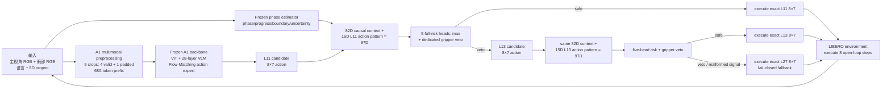

# PhaseRoute-VLA

PhaseRoute-VLA 是建立在 A1 上的阶段感知自适应计算方法。它保留冻结的 A1
视觉—语言—动作主干，在候选动作生成后用 **causal phase state、past-only history、
candidate-action pattern、five-head epistemic risk 和 gripper veto** 决定执行 L11、
L13，或 fail closed 到 L27。

当前正式研究方法是 **PhaseRoute V3**。旧 RP-PEP 仍作为经过验证的确定性 baseline
保留；M4.28 task-jackknife learned router 的 `NOT_VIABLE` 负结果也完整保留，但该结论
不适用于后来重新设计并独立验证的 V3 five-head router。

> 本项目目前只授权 LIBERO 仿真研究复现，不代表真实机器人部署、安全认证或通用
> VLA 加速。V3 默认关闭，只有显式 launcher 才会启用。

## 核心结果

冻结的 D9 active independent test 包含 LIBERO-10 的 100 个配对 episode：10 task ×
official init-state indices 40–49。每对共享 task、initial state 与预注册 seed。

| 指标 | Original A1 | PhaseRoute V3 | 变化 |
|---|---:|---:|---:|
| 成功 episode | 85 / 100 | 88 / 100 | +3 pp |
| FM calls / policy call | 10.5586 | 6.6962 | **-36.58%** |
| PhaseRoute early-exit calls | — | 512 / 3,700 | 13.84% |
| observed false-safe calls / clusters | — | 0 / 0 | CP-UCB95 = 2.951% |
| 冻结 primary gates | — | 18 / 18 PASS | — |

机器可读正式证据是
[`results/v3/v3_d9_final_result.json`](results/v3/v3_d9_final_result.json)，SHA-256：
`4df77237e84ad82b05ae67145e52000b0e3430f34b6f69fcbee743687ac11952`。

这些结果支持“安全非退化门通过且 FM 调用显著减少”，不支持“显著优于 A1”：paired
McNemar equality test 的 `p=0.5078`。12 个 PhaseRoute failure 都与某次 early exit
共现，但其中 unsafe early call 为 0，因此不能声称 early exit 因果导致失败。

### Route-first Stage 9 工程 pilot

在不改动上述 V3/D9 正式结果的前提下，后续 route-first 路径改为先用 199D
action-free context 选择 L13 或 L27，再只调用被选中的 action head。冻结的 state13
十任务配对 pilot 中，candidate-first 与 route-first 均为 `9/10` 成功；pooled policy
wall P50 从 `1591.88 ms` 降至 `911.07 ms`（比值 `0.5723`），route-first 的
`343/343` 个 policy call 均恰好一次 FM。完整机器证据见
[`route_first_stage9_state13_pilot.json`](results/route_first/route_first_stage9_state13_pilot.json)，
SHA-256 为 `0979f04e8f7c3352b2bbea8540a2562925546233d03905c6d579d077795d1d8c`；
执行协议与失败保留边界见
[`ROUTE_FIRST_STAGE9_STATE13_PILOT_ZH.md`](docs/research/route_first/ROUTE_FIRST_STAGE9_STATE13_PILOT_ZH.md)。
这仍是单 init-state 工程 pilot，不是统计功效充分的 wall-clock 加速或非劣效性结论。

### Route-first Stage 10 fresh-state confirmation

Stage 10 在 60 个新生成状态上完成 180 个三臂 active rollout。Original A1、
candidate-first V3、route-first 的成功数分别为 `56/60`、`57/60`、`58/60`；
route-first 相对 candidate 的配对 episode-P50 ratio 中位数为 `0.5622`，且
`1957/1957` 个有效 policy call 均由 runtime event 证明恰好一次 FM。相对 Original A1
的 pooled mean/P90/P95 分别降低约 `41.13%/61.16%/56.32%`，但预注册的配对
episode-P50 ratio 为 `1.0795`，未达到 `≤0.90` 门槛。因此正式状态保持
`INCOMPLETE_ROUTE_FIRST_STAGE10_FRESH_ACTIVE_CONFIRMATION`，不能写成全面优于 A1。

机器可读精简结果见
[`route_first_stage10_active_confirmation.json`](results/route_first/route_first_stage10_active_confirmation.json)，
SHA-256 为 `1818d96e4de096cb5913f8bc0ce20f656fb72cb724795362314a609d5aac915b`；完整解释见
[`ROUTE_FIRST_STAGE10_ACTIVE_RESULT_ZH.md`](docs/research/route_first/ROUTE_FIRST_STAGE10_ACTIVE_RESULT_ZH.md)。

### Route-first Stage 11A latency diagnosis

对 Stage 10 的 6,042 个 policy call 进行 SHA-bound 事后诊断后，根因定位为路径覆盖而非
单路径退化：route L13/A1 L11 的分层 P50 比值为 `0.7487`，route L27/A1 L27 为
`0.3454`；但 route 只有 `11.70%` 调用走 L13，而 A1 有 `59.56%` 调用停在 L11。
route runtime overlay 的 P50 为 `108.15 ms`，其中 affine router predict 仅 `0.20 ms`，
当前主要优化目标应是独立开发数据上的安全 L13 覆盖和深层路径，而不是单独优化 router
head。该分析不改变 Stage 10 的失败 gate，也不授权在最终测试状态上调参。详见
[`ROUTE_FIRST_STAGE11_LATENCY_DIAGNOSIS_ZH.md`](docs/research/route_first/ROUTE_FIRST_STAGE11_LATENCY_DIAGNOSIS_ZH.md)。

### Route-first Stage 11B CUDA component profile

在已打开的 LIBERO-10 state 0 开发态上，Stage 11B 对 370 个 policy call 完成独立
CUDA 分段计时：36 次选择 L13、334 次选择 L27，L13 覆盖率为 `9.73%`，相对全 L27
的 decoder block 数只减少 `4.86%`。L13/L27 decoder P50 分别为 `212.59/456.13 ms`，
说明浅层路径本身有效，但低覆盖限制了总体收益。全部调用中 decoder、vision、单次 FM
占 model CUDA 总时间约 `47.99%/10.47%/29.63%`。该结果含 profiling 开销且分组并非
随机，只用于归因，不是新的 speedup 或成功率对照结论。机器结果见
[`route_first_stage11b_profile_aggregate.json`](results/route_first/route_first_stage11b_profile_aggregate.json)，
完整解释见
[`ROUTE_FIRST_STAGE11B_PROFILE_RESULT_ZH.md`](docs/research/route_first/ROUTE_FIRST_STAGE11B_PROFILE_RESULT_ZH.md)。

### Route-first Stage 11C coverage diagnosis

对 frozen score13 做只读风险—覆盖扫描后，阈值路线被判定为
`THRESHOLD_ONLY_NOT_VIABLE_NEW_DEVELOPMENT_TARGET_REQUIRED`。历史 calibration/holdout
中 teacher-safe-L13 的 group-equal 上限仅为 `15.58%/15.22%`；把阈值从 `0.9174`
降到 `0.8`，state0 live 覆盖仅从 `9.73%` 增至 `13.78%`，holdout false-safe 则从
`6.65%` 增至 `18.05%`。因此下一轮应在新 development observations 上学习直接的
L13--L27 action-reliability target，而不是把 post-hoc 阈值写回 runtime。详见
[`ROUTE_FIRST_STAGE11C_COVERAGE_DIAGNOSIS_ZH.md`](docs/research/route_first/ROUTE_FIRST_STAGE11C_COVERAGE_DIAGNOSIS_ZH.md)。

## 从输入到输出



Router 只选择 A1 已生成的 candidate，不回归或修改 action。task ID、episode ID 和未来
轨迹不进入 97D feature；缺失、非有限值、shape drift、history 异常和 artifact hash
不一致全部回退 L27。详细张量契约见
[`docs/PHASEROUTE_ARCHITECTURE_ZH.md`](docs/PHASEROUTE_ARCHITECTURE_ZH.md)。

## 与 A1、CogVLA 和 RP-PEP 的关系

| 方法 | 复用内容 | PhaseRoute V3 的不同点 |
|---|---|---|
| A1 | 完整 VLA backbone、Flow-Matching action head、early candidate 接口 | 新增 causal phase/action-context risk router，不改主权重和候选 action |
| CogVLA | phase-aware computation allocation 的设计启发 | 不复制其 backbone、权重或 token-compression；phase 用于动作求解深度 |
| RP-PEP | RNG-preserving productive candidate schedule | RP-PEP 是固定裁剪；V3 是 state/candidate-conditioned learned routing |
| M4.28 router | 泄漏控制、sealed evaluation 的经验 | V3 改为 97D causal feature、五头不确定性、gripper veto 和 L27 fail-closed |

D9 使用原 A1 checkpoint 加上单独训练并冻结的 router/phase estimator。只借用 A1 权重
不会自动产生改进；V3 的效果来自重新训练的路由参数及其独立 calibration/validation，
而不是把 CogVLA 或 A1 的另一个权重直接拼接进来。

## 项目结构

```text
PhaseRoute-VLA/
├── a1/                              # A1 主模型 + PhaseRoute runtime/research code
├── artifacts/
│   ├── MANIFEST.json                # 全局 revision/SHA 清单
│   └── phase_route_v3/              # 22 KB router、11.3 MB phase model、V3 threshold
├── configs/research/v3/             # 泄漏受控的数据、拟合和评测协议
├── robot_experiments/libero/        # 通用 LIBERO evaluator
├── scripts/
│   ├── run_libero_phase_route_v3.sh # V3 单卡入口，仅物理 GPU 0–3
│   ├── validate_phase_route_v3_*.py  # 发布与运行结果门禁
│   └── dynamic_compute/v3/           # D0–D10 可审计研究 runner
├── tests/dynamic_compute/v3/         # V3 单元、合约和 release tests
├── results/v3/                       # 冻结机器可读 evidence
└── docs/research/v3/                 # 阶段报告与论文资产
```

`model/`（34 GB backbone）、`reports/`（raw payload）、`runs/`（rollout）和 `.cache/`
均不进入 Git。目录原则见
[`docs/REPOSITORY_LAYOUT.md`](docs/REPOSITORY_LAYOUT.md)。

## 安装

已验证环境：Python 3.10、PyTorch 2.6.0+cu124、CUDA 12.4、driver 570.133.07、
单卡约 48 GiB。

2026-08-24 另在不继承旧 `a1` site-packages 的全新 Python 3.10 venv 中，从网络重新
安装全部依赖并完成 CPU release qualification：478 tests、22 subtests、V3 release
gate、LIBERO init-state load、sdist/wheel 检查均通过。证据见
[`V3_D12_FRESH_ENVIRONMENT_QUALIFICATION_ZH.md`](docs/research/v3/V3_D12_FRESH_ENVIRONMENT_QUALIFICATION_ZH.md)。

```bash
git clone --recurse-submodules <your-phase-route-vla-repository>
cd PhaseRoute-VLA

conda create -n phase-route-vla python=3.10 -y
conda activate phase-route-vla
python -m pip install --upgrade pip setuptools wheel
python -m pip install \
  torch==2.6.0 torchvision==0.21.0 torchaudio==2.6.0 \
  --index-url https://download.pytorch.org/whl/cu124

make install
make setup-libero
make download-checkpoint
```

`make setup-libero` 不修改 pinned submodule；它会复制 LIBERO 到被 Git 忽略的
`.cache/libero-build/`，在副本上应用 PyTorch 2.6 与 setuptools editable-install
兼容补丁，再安装该副本。需要自定义配置目录时，在执行 `make setup-libero` 前设置
`LIBERO_CONFIG_PATH=/absolute/path`。

Python wheel 只发布 `a1` 代码，不包含仓库顶层的 `artifacts/`、`results/`、`configs/`
和运行脚本。完整研究复现必须使用带 submodule 的 Git release/source tree；wheel 可用于
安装代码，但不能单独视为可运行的 PhaseRoute V3 发布包。

不要安装上游不可从 PyPI 获取的 `ai2-molmo[dev,serve,train]` extra。完整说明见
[`docs/QUICKSTART_ZH.md`](docs/QUICKSTART_ZH.md)。

## 发布门禁

clean clone 不需要 34 GB 权重即可检查 V3 bundle：

```bash
make preflight-v3
make test-v3-release
```

准备主权重后可检查完整可运行状态：

```bash
PYTHON_BIN=python GPU_INDEX=0 PREFLIGHT_ONLY=1 make run-v3
```

门禁会严格验证 A1 model/config/statistics、V3 threshold、router、phase estimator、phase
state 和 D9 result 的 SHA，并检查进程只看到一张允许的物理 GPU。

## 运行 PhaseRoute V3

先确认 GPU 0–3 中的空闲卡，再运行一个普通复现单元（这不是 D9 重跑）：

```bash
nvidia-smi

GPU_INDEX=0 \
TASK_IDS=0 \
EPISODE_INDICES=0 \
SEED=20260823 \
OUTPUT_ROOT=runs/phase_route_v3 \
make run-v3
```

`TASK_IDS` 和 `EPISODE_INDICES` 支持 `0,2-4` 格式。launcher 固定 LIBERO-10、FM
steps 10、exit interval 2、L11/L13/L27 路径和三个小 artifact，不允许 GPU 4–7，
也不会覆盖已有输出。每次 run 保存：

```text
preflight.json
command.sh
stdout.log
episode_logs/task*_episode*.log
policy_telemetry.jsonl
phase_route_runtime.jsonl
evaluation_summary.json
run_attestation.json
```

`run_attestation.json` 只有在所有 policy call 都 prepared/committed、runtime error 为 0、
route count 完整时才会 PASS。禁止用 D9 states 40–49 重新调模型或阈值。

## 历史 RP-PEP baseline

RP-PEP 的 LIBERO Spatial 20-pair 结果仍有效：动作/退出/轨迹 mismatch 为 0，FM solve
减少 41.11%，weighted mean latency 减少 31.06%。运行入口保持：

```bash
GPU_INDEX=0 NUM_EPISODES=1 make run-rp-pep
```

RP-PEP 与 V3 的 suite、样本和控制器不同，41.11% 与 36.58% 不能作为同一实验直接
排序。旧结果见 [`results/rp_pep_paired.json`](results/rp_pep_paired.json)。

## 训练与后续消融

A1 backbone 训练仍使用 `train_libero.sh`。V3 router 的可审计拟合/校准代码位于
`scripts/dynamic_compute/v3/`，协议位于 `configs/research/v3/`。D10 已明确：official
LIBERO-10 states 0–49 均已被历史、development、calibration 或 D9 使用；新的消融不得
把 40–49 再称为 unseen test，必须使用事前冻结的新 confirmation 数据协议。

## 结论边界与负结果

- M4.28 router 的 `NOT_VIABLE` 是保留的负结果，不等于 V3 失败；
- D9 的 88% vs 85% 不是统计显著优越性结论；
- 0 observed false-safe 不等于真实风险为 0；
- 36.58% 是 measured FM-call reduction，不是已测 wall-clock speedup；
- 12 个失败与 early exit 共现不构成因果证明；
- 尚未在真实机器人、其他 LIBERO suite 或任意部署环境验证。

完整发布状态见 [`docs/RELEASE_STATUS_ZH.md`](docs/RELEASE_STATUS_ZH.md)，论文结果与
消融边界见
[`docs/research/v3/V3_D10_PAPER_ABLATION_MIGRATION_ZH.md`](docs/research/v3/V3_D10_PAPER_ABLATION_MIGRATION_ZH.md)。

## 上游与许可

本项目基于 [ATeam-Research/A1](https://github.com/ATeam-Research/A1)，使用固定 commit
的 [LIBERO](https://github.com/Lifelong-Robot-Learning/LIBERO) submodule，并只将
CogVLA 作为 phase-aware design reference。代码采用 MIT License；第三方组件遵循各自
许可，详见 [`NOTICE`](NOTICE)。引用信息见 [`CITATION.cff`](CITATION.cff)。
