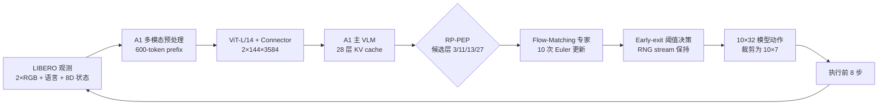

# PhaseRoute-VLA

面向 A1 + LIBERO 的可审计动态计算框架。项目完整保留 A1 多模态动作模型，并加入训练、回放、路由分析、闭环评测和经过严格配对验证的 **RP-PEP（RNG-Preserving Productive-Exit Pruning）** 运行路径。

> 当前正式方法是 RP-PEP。学习式 route-then-solve router 已通过工程检查，但没有通过冻结的安全门槛，因此不会接入正式推理路径。

## 核心结果

冻结的 LIBERO Spatial 严格配对实验包含 20 组相同 task、初始状态和随机种子的 episode：

| 指标 | 原始 A1 Early Exit | PhaseRoute-VLA RP-PEP | 变化 |
|---|---:|---:|---:|
| 成功 episode | 20 / 20 | 20 / 20 | 完全一致 |
| Flow-Matching 调用 | 2,002 | 1,179 | **-41.11%** |
| 平均策略延迟 | 10,563.73 ms | 7,282.43 ms | **-31.06%** |
| 延迟中位数 | 9,561.36 ms | 6,701.43 ms | **-29.91%** |
| 动作 / 退出序列 / 轨迹不一致 | — | 0 / 0 / 0 | 精确一致 |

机器可读证据见 [`results/rp_pep_paired.json`](results/rp_pep_paired.json)，完整边界与负结果见 [`results/README.md`](results/README.md)。这些数字描述冻结的 20-pair 实验，不应被外推为完整 LIBERO benchmark 成绩。

## 方法概览

原始 A1 early-exit 在候选层 `(1, 3, ..., 27)` 上调用 Flow-Matching 动作专家进行比较。RP-PEP 根据冻结的生产性分析，仅保留 `(3, 11, 13, 27)`，并显式补偿被裁剪候选产生的随机数消耗，使最终动作与基线保持逐项一致。



RP-PEP 默认关闭，只有显式传入 `--rp_pep_enabled True` 才会启用。关闭时保持原始 A1 行为。

## 项目结构

```text
PhaseRoute-VLA/
├── a1/                         # A1 主模型、训练代码与 dynamic_compute 模块
├── configs/                    # LIBERO 与上游预训练配置
├── robot_experiments/libero/   # LIBERO baseline、early-exit、RP-PEP 闭环评测
├── scripts/
│   ├── run_libero_rp_pep.sh    # 单卡正式入口，仅允许物理 GPU 0–3
│   └── dynamic_compute/        # 数据收集、训练、回放、审计和四卡里程碑脚本
├── tests/dynamic_compute/       # 动态计算回归与发布门测试
├── results/                    # 小型、冻结、机器可读结果
├── artifacts/MANIFEST.json     # checkpoint、LIBERO 与结果校验清单
├── patches/                    # 第三方兼容补丁
└── docs/                       # 架构、复现、发布状态和研究说明
```

更细的保留/排除规则见 [`docs/REPOSITORY_LAYOUT.md`](docs/REPOSITORY_LAYOUT.md) 和 [`docs/ARTIFACTS.md`](docs/ARTIFACTS.md)。

## 安装

已验证环境：Python 3.10、PyTorch 2.6.0、CUDA 12.4、NVIDIA Driver 570.133.07。建议新建独立环境：

```bash
git clone --recurse-submodules <your-phase-route-vla-repository>
cd PhaseRoute-VLA

conda create -n phase-route-vla python=3.10 -y
conda activate phase-route-vla

python -m pip install --upgrade pip setuptools wheel
python -m pip install \
  torch==2.6.0 torchvision==0.21.0 torchaudio==2.6.0 \
  --index-url https://download.pytorch.org/whl/cu124

make install
make setup-libero
```

`make install` 使用 [`requirements/constraints-cu124.txt`](requirements/constraints-cu124.txt) 固定已复现的关键版本。`make setup-libero` 会初始化固定 commit 的 LIBERO、幂等应用 PyTorch 2.6 兼容补丁并 editable 安装。不要使用上游 A1 中不可从 PyPI 获取的 `ai2-molmo` extra。

网络不稳定时可重复执行同一条命令；安装脚本不会覆盖已验证的本地结果。完整中文步骤见 [`docs/QUICKSTART_ZH.md`](docs/QUICKSTART_ZH.md)。

## 下载 checkpoint

权重不提交到 Git。运行：

```bash
make download-checkpoint
```

脚本从固定 Hugging Face revision 下载 checkpoint 配置、数据统计、权重和 Spatial 阈值到 `model/libero_exit/`，同时缓存固定 revision 的 Qwen2 tokenizer。核心校验值：

```text
model.pt
dcafd9ee8a3d3a4ced8840e59c90b0c4b20d41a7900adc9ff469c1a57e631b7f

exit_thresholds_libero_spatial_exp_1.0.json
5b3a0ee9f3851bf1b0c7f7e2b28bc61898ed0b4bd39f8752007719e9f26d7bd6
```

权重来源、revision、字节数与全部校验值见 [`artifacts/MANIFEST.json`](artifacts/MANIFEST.json)。

## 验证安装

```bash
make preflight
make test-release
make test
make check
```

- `preflight`：检查包版本、A1/LIBERO import、子模块和冻结 artifacts；需要已下载 checkpoint。
- `test-release`：快速检查正式运行门和四卡汇总器。
- `test`：运行全部 dynamic-compute 单元与回归测试。
- `check`：检查依赖、Python/shell 语法以及 Git whitespace。

## 运行 RP-PEP

单卡完整 LIBERO Spatial 评测，`GPU_INDEX` 只能是 `0`、`1`、`2` 或 `3`：

```bash
GPU_INDEX=0 \
NUM_EPISODES=50 \
OUTPUT_ROOT=runs/rp_pep \
make run-rp-pep
```

入口会把所选物理卡解析为 GPU UUID，确保进程只看到这一张卡，先执行带 CUDA 审计的 preflight，再运行闭环评测。日志、preflight 和 episode 结果写入 `runs/`，该目录默认不提交。

使用物理 GPU 0–3 进行 10-task、state-30 发布 smoke：

```bash
make smoke-front4
```

脚本不会访问 GPU 4–7，也拒绝覆盖已有输出目录。

## 训练

LIBERO 微调沿用 A1 的 Flow-Matching 训练主线：

```bash
# 将 RLDS 数据放在 data/libero_rlds，并准备 A1 预训练权重 model/pretrain
CUDA_VISIBLE_DEVICES=0,1,2,3 \
WANDB_ENTITY=<entity> \
WANDB_PROJECT=phase-route-vla \
bash train_libero.sh
```

训练配置位于 [`configs/experiments/libero_simulation.yaml`](configs/experiments/libero_simulation.yaml)。动态计算的 feature collection、teacher cache、router 训练、回放与审计入口见 [`scripts/dynamic_compute/README.md`](scripts/dynamic_compute/README.md)。

## 模型与模块文档

- [`docs/PHASEROUTE_ARCHITECTURE_ZH.md`](docs/PHASEROUTE_ARCHITECTURE_ZH.md)：改进后系统从输入到输出的模块、张量维度和控制流。
- [`docs/A1_PROJECT_READING_GUIDE_ZH.md`](docs/A1_PROJECT_READING_GUIDE_ZH.md)：A1 baseline 的详细视觉、VLM、Flow-Matching 和训练路径。
- [`docs/RELEASE_STATUS_ZH.md`](docs/RELEASE_STATUS_ZH.md)：已验证能力、未通过项和可声明边界。
- [`docs/cogvla_mapping.md`](docs/cogvla_mapping.md)：只读的 CogVLA 对照与设计启发。

## 研究结论边界

学习式 router 的 sealed 评测结果为 `NOT_VIABLE`：10 个科学门仅通过 5 个，出现 4 次错误浅退，分布在 3 个 episode group。因此：

- 它是有价值的负结果和研究代码；
- 不能把“3 个受影响 episode group”写成“3 次闭环失败”；
- `runtime_integration_allowed` 保持为 `false`；
- 正式发布路径仍是无需学习 router 的 RP-PEP。

详见 [`results/router_sealed.json`](results/router_sealed.json) 与 [`results/router_failure_analysis.json`](results/router_failure_analysis.json)。

## Artifact 策略

Git 只保存源码、文档、测试和小型冻结摘要。以下内容始终留在本地并被忽略：

- `model/`：大模型 checkpoint；
- `reports/`：原始实验 payload、teacher cache、hidden features；
- `runs/`：闭环 rollout、日志和视频；
- `.cache/`：Hugging Face、Python 和工具缓存。

这保证仓库本身轻量，同时通过固定 revision、SHA-256、运行脚本和冻结摘要保留可复现性。

## 上游与许可

本项目基于 [ATeam-Research/A1](https://github.com/ATeam-Research/A1)，并将 [LIBERO](https://github.com/Lifelong-Robot-Learning/LIBERO) 作为固定 submodule。RoboChallenge 与 VLABench 等不属于当前方法的资源不复制到本仓库，需要时请使用上游 A1。

代码采用 MIT License；第三方组件遵循各自许可。见 [`LICENSE`](LICENSE) 与 [`NOTICE`](NOTICE)。

## 引用

请同时引用上游 A1 论文和本项目软件。结构化引用信息见 [`CITATION.cff`](CITATION.cff)。
