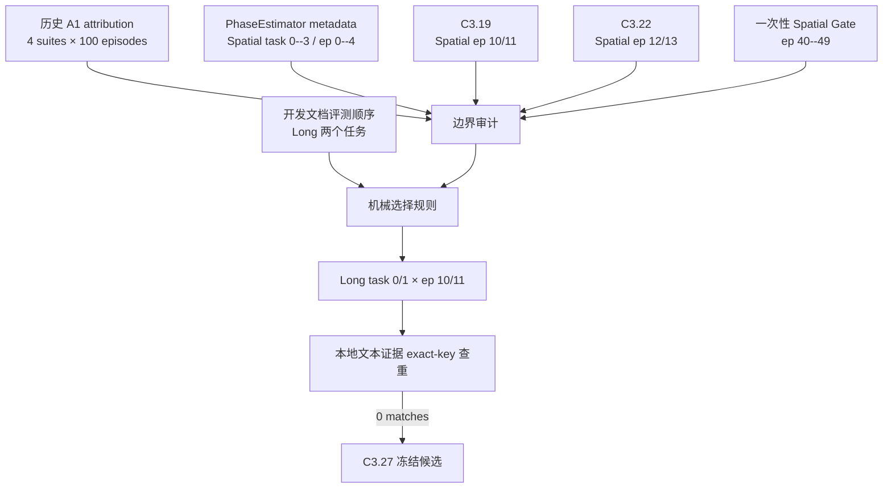

# PhaseRoute-VLA Stage C3.26：独立 closed-loop shadow 样本选择与数据谱系冻结

日期：2026-08-14  
分支：`feature/phase-route-v2`  
状态：**INDEPENDENT SELECTION AUDIT PASS**

## 1. 阶段结论

C3.26 在不加载策略、不运行仿真、不查看候选 episode 成败/退出层/certificate
结果的条件下，冻结了下一阶段 LIBERO-Long 多 episode closed-loop shadow pilot 的
4 个成对评测单元：

| suite | task | episode | seed | initial-state SHA-256 前缀 |
|---|---:|---:|---:|---|
| `libero_10` | 0 | 10 | 20260821 | `3988ee943922` |
| `libero_10` | 0 | 11 | 20260822 | `d5da74b09848` |
| `libero_10` | 1 | 10 | 20270821 | `fcb0fba58a3a` |
| `libero_10` | 1 | 11 | 20270822 | `2da19a1dc24a` |

四个 initial state 的形状均为 `[123]`、dtype 均为 `float64`。正式审计结果为：

```text
INDEPENDENT_SELECTION_AUDIT_PASS
pair_count = 4
selected_key_matches_before_freeze = 0
selection_uses_policy_output = false
selection_uses_success_outcome = false
selection_uses_exit_layer = false
selection_uses_certificate_acceptance = false
selection_uses_latency = false
```

本阶段授权 C3.27 进行 shadow-only paired rollout，但不授权 active residual、模型调参、
性能优越性声明或用 C3.27 结果反向选择参数。

## 2. 为什么选择 LIBERO-Long task 0/1、episode 10/11

选择规则在读取候选输出前由三个机械条件共同决定：

1. 开发与验证文档规定 Spatial 之后首先评测 `LIBERO-Long` 两个任务；
2. 因此选择 benchmark 顺序中的 task 0 和 task 1；
3. 历史 A1 attribution 对每个 task 使用过 trial 1--10，即 initial-state index 0--9，
   因此选择紧随其后的 index 10 和 11。

组合规则为 task `{0,1}` × episode `{10,11}`，而不是根据成功率、退出层、残差大小、
证书接受率或时延挑选。seed 由以下固定公式产生：

```text
episode_seed = 20260811 + task_id * 10000 + episode_id
```

## 3. 数据谱系审计



审计确认：

- 历史 attribution 共 400 rows；
- `libero_10` 恰好为 task 0--9 × trial 1--10 的 100 个唯一组合；
- PhaseEstimator 的 20 个训练 episode 全部来自 `libero_spatial`；
- C3.19 消费 Spatial episode 10/11；
- C3.22 消费 Spatial episode 12/13；
- Spatial fresh Gate 消费 episode 40--49；
- 冻结前，四个完整 `suite:task:episode` 键在项目 JSON、JSONL、Markdown、TXT、
  LOG、YAML 证据中均无匹配。

审计脚本最初版本仅检查历史 task/trial 的全局取值集合。新增 fail-closed 单元测试发现，
这种写法可能漏过某一 task 内的 trial 重复/缺失。正式运行前已改为验证完整的
10×10 笛卡尔组合，修复后测试通过；错误版本从未生成正式结果。

## 4. 独立性的准确边界

这四个 pair 可以称为：

> 对当前 PhaseRoute-v2 组件训练、调参与现有本地结果而言，exact initial-state key
> 独立的 LIBERO-Long shadow pilot。

不能称为：

- 全新的 benchmark task；
- 对 A1 预训练完全未见的数据；
- 与所有先前 LIBERO 架构决策完全隔离的最终测试集；
- 足以支持总体 success-rate 或优越性结论的完整评测。

A1 本身在 LIBERO 数据上训练过，历史 attribution 也运行过同一 suite 的 episode 0--9，
且 PhaseRoute 架构设计受到先前 LIBERO 结果启发。因此本阶段只冻结 exact-initial-state
层面的独立性，不夸大为全局 untouched benchmark。

## 5. C3.27 允许与禁止的操作

允许：

- 对四个 pair 分别执行冻结 A1 baseline → hierarchical online shadow；
- 使用物理 GPU 0--3，每卡一个 pair；
- 比较相同初始状态/seed 下的 success、动作、观测和 early-exit layer；
- 统计 accepted、normal reject、width-288 预注册回退及未知错误；
- 统计 shadow-only failure 和提前退出失败归因。

禁止：

- residual 控制主动作，`controls_main_action` 必须保持 `false`；
- 根据任一 C3.27 结果修改 threshold、模型或 pair；
- 用失败 pair 换取新的 episode；
- 使用物理 GPU 4--7；
- 把 shadow 结果写成 active improvement、加速或 superiority claim。

## 6. 测试与机器证据

定向测试覆盖：

- 固定四个 pair 及 seed；
- 历史 10×10 trial 边界通过；
- trial 局部缺失/重复时 fail closed；
- selected key 已存在时 fail closed；
- 输出目录已存在时拒绝覆盖。

```text
5 passed, 1 warning
709 passed, 3 skipped, 3 warnings in 69.10s
git diff --check: PASS
```

机器结果：

- `reports/phase_route_v2_stage_c326_independent_shadow_selection_audit_20260814_v1/result.json`
- result SHA-256：`1aa4b25d82b5a79f981d20df83348c0f0709e09fcf81d393ed643dbe4e9c9aab`
- audit script SHA-256：`69c207a4546bebfc25827517997f64b8c2dc22d74fd57c9cbd2e594577e8a399`
- test SHA-256：`c2c21dd54f3a5df51886390f2488c03a3300d584464117dff4d9f095775b2bea`

TensorFlow factory、Python 3.10 和 LIBERO demonstration dataset 路径只产生警告；
本阶段只读取 benchmark init states，不需要 demonstration dataset，审计退出码为 0。

## 7. 下一阶段

C3.27 将新增独立 runner 和冻结协议，不修改 C3.25 已冻结文件。四个 pair 将在 GPU 0--3
并行运行，形成多 episode shadow 可靠性统计。C3.27 的核心通过条件是两臂轨迹零干扰、
每次 policy call 事件覆盖完整、未知错误为零，而不是要求某个 certificate 接受率或成功率
达到事后设定的漂亮数字。
