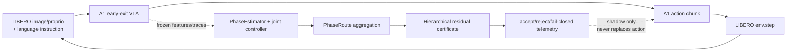

# PhaseRoute-VLA Stage C3.27：独立 LIBERO-Long 多 episode online-shadow 验证

日期：2026-08-14  
分支：`feature/phase-route-v2`  
状态：**INDEPENDENT MULTI-EPISODE SHADOW PASS**

## 1. 阶段结论

C3.27 在 C3.26 预注册的四个 `libero_10` exact initial states 上完成了冻结 A1
baseline 与 PhaseRoute-VLA hierarchical online-shadow 的成对闭环验证。四组实验分别绑定
物理 GPU 0--3 并行运行，GPU 4--7 未被本任务使用。

```text
pair results passed                 = 4 / 4
baseline successes                  = 4 / 4
shadow successes                    = 4 / 4
paired success equality             = 4 / 4
policy calls                        = 132 / 132
action/observation/exit mismatches  = 0
shadow-only failures                = 0
unexpected online errors            = 0
malformed online events             = 0
controls_main_action                = false
```

这证明 online PhaseRoute producer、joint width-depth controller、phase-conditioned
aggregator、hierarchical certificate 和 telemetry 能伴随多个独立 initial states 完整运行，
且不改变 A1 的主动作或闭环轨迹。

本阶段没有证明 active residual 有效，也没有证明 PhaseRoute-VLA 的成功率或速度优于 A1。

## 2. 冻结协议与执行顺序

C3.27 在运行前冻结：

- suite：`libero_10`；
- task/episode：`(0,10)`、`(0,11)`、`(1,10)`、`(1,11)`；
- seed：20260821、20260822、20270821、20270822；
- arm order：baseline → hierarchical online shadow；
- phase depth control：关闭；
- residual：shadow-only；
- 每进程只允许一个可见 GPU；物理卡仅限 0--3；
- 任一结果不得用于模型、阈值或 episode 的再选择。

协议 SHA-256：

```text
defb7dc0120868910e265652c870d951bde626d1612f419b73823810be2baa41
```

runner SHA-256：

```text
edf7cc1e7cbe84f718a2abb7762b0f224a7bc90851598d16b56987f520ffb7ab
```

协议同时锁定 C3.25/C3.26 结果、A1 checkpoint、PhaseEstimator、joint controller、
aggregator、hierarchical certificate 及 14 个底层调用链文件的 SHA-256。

## 3. 从输入到输出的控制边界



实线 `A1 action chunk → env.step` 是唯一主控制路径。旁路的 certificate 即使接受，也只
记录 proposal/scale；`controls_main_action=false`，不会改变送入环境的动作。

## 4. 逐 pair 结果

| task/episode | GPU | baseline/shadow success | calls | early-exit calls | accept | reject | width-288 fallback | action diff |
|---|---:|---:|---:|---:|---:|---:|---:|---:|
| 0/10 | 0 | true / true | 35 | 24 | 0 | 1 | 34 | 0.0 |
| 0/11 | 1 | true / true | 33 | 24 | 0 | 0 | 33 | 0.0 |
| 1/10 | 2 | true / true | 32 | 18 | 0 | 1 | 31 | 0.0 |
| 1/11 | 3 | true / true | 32 | 24 | 1 | 0 | 31 | 0.0 |

所有 pair 均满足：

- baseline/shadow action chunk 逐调用 bit-exact；
- observation SHA-256 序列逐调用相同；
- early-exit layer 序列逐调用相同；
- telemetry 和 online event 每次 policy call 恰好一条；
- phase runtime、producer 和 residual runtime 计数对齐；
- 未出现未知错误、malformed event 或主控动作越权。

## 5. 证书覆盖结果

132 次 policy call 的 joint width 分布为：

| predicted width | calls | 后续行为 |
|---:|---:|---|
| 256 | 3 | 进入 hierarchical certificate：1 accept、2 reject |
| 288 | 129 | 当前无 width-288 certificate，预注册 fail-closed |

因此：

```text
certificate evaluation coverage       = 3 / 132 = 2.27%
certificate accepted / policy call     = 1 / 132 = 0.76%
acceptance given certificate evaluation= 1 / 3   = 33.33%
safe width-288 fallback                = 129 / 132 = 97.73%
```

129 次回退不是程序崩溃：每次都按冻结规则 scale=0、branch=0、保留 Exact-A1 动作，
因此工程安全门通过。但覆盖率过低意味着当前 candidate 尚不适合 active canary；这成为
C3.28 的首要问题。

## 6. 成功率与提前退出失败的正确解读

四个 baseline 和四个 shadow 均成功，因此本 pilot 中：

```text
observed failed episodes = 0
shadow-only failures     = 0
early-exit calls         = 90 / 132 = 68.18%
```

但不能把“early-exit caused failure”机械写成 0。原因是 baseline 与 shadow 都运行同一个
A1 early-exit policy，没有 full-depth arm；该两臂协议只能判断 shadow 是否干扰原策略，
不能构造 full-depth 反事实。因此机器结果明确记录：

```text
early_exit_caused_failure_count = null
identifiable_from_this_two_arm_protocol = false
```

已有历史四-suite attribution 的回答仍是：400 个 full/adaptive paired episodes 中，
Full 成功而 Adaptive 失败为 13 个（3.25%）；其中 `libero_10` 为 8/100。该历史数字与
本次 4-pair shadow pilot 的目的、样本边界不同，不能合并成一个比例。

## 7. 时间与资源记录

| task/episode | baseline wall time | shadow wall time | baseline call mean | shadow call mean |
|---|---:|---:|---:|---:|
| 0/10 | 113.377 s | 115.671 s | 2876.35 ms | 2929.14 ms |
| 0/11 | 98.851 s | 100.543 s | 2638.20 ms | 2691.49 ms |
| 1/10 | 121.377 s | 121.744 s | 3421.04 ms | 3437.92 ms |
| 1/11 | 94.784 s | 95.325 s | 2594.02 ms | 2615.51 ms |

单进程峰值 CUDA allocation 最大为 36,295,177,728 bytes（约 33.80 GiB）；`nvidia-smi`
运行中约 37.9 GiB/卡。结束后 GPU 0--3 全部恢复到约 17 MiB。

arm order 固定且系统并行运行，上述时延仅用于工程记录，不是因果延迟或加速声明。

## 8. 测试与机器结果

冻结前：

```text
定向测试：23 passed
全量测试：716 passed, 3 skipped, 3 warnings in 68.65s
```

汇总器测试覆盖：四 pair 聚合、动作不一致 fail closed、禁止虚构 early-exit 因果归因。

最终全量回归：

```text
719 passed, 3 skipped, 3 warnings in 69.00s
```

汇总结果：

- `reports/phase_route_v2_stage_c327_independent_shadow_summary_20260814_v1/result.json`
- SHA-256：`02880b6841c6b1c2f1b9250eee4f5d0e2856161f05135c994f590761cc8c9a81`

逐 pair 结果 SHA-256：

| pair | SHA-256 |
|---|---|
| task0/ep10 | `780e6c7d9eb74622ef6ef67e28e2bf2f94be6ea028909a4580dd216ec23adb4c` |
| task0/ep11 | `59920ed3fa753f15319ed544c22c0b5ac50691704921c0c3a24ba8e565802f8c` |
| task1/ep10 | `2b3c1c976520e7e79c40c841bc9428a80f7085e3c2d5e97385d83a47da50de0c` |
| task1/ep11 | `c26654ed03da7dc938c1b2f16f38d59f6df9e8cf7465e101eb458d3bad0db3e2` |

launcher 目录保留 GPU preflight、四个 stdout 和一次沙箱设备访问失败记录。正式主机权限
运行的 protocol 校验、GPU 映射和四个子进程均退出码 0。

## 9. 下一阶段：C3.28

C3.28 不会用这四个独立 episode 的结果拟合参数。下一步应仅从训练/开发数据扩大
hierarchical certificate 对 width 288 的覆盖，并保持：

1. 现有 C3.22 独立安全门不回退；
2. Exact-A1 fallback bit-exact；
3. 不降低安全阈值来追求表面接受率；
4. 先做离线证书覆盖和保守性验证，再决定是否进入 C3.29 active canary；
5. 本阶段 4 个 pair 从此 sealed，不再用于调参或重复选择。
