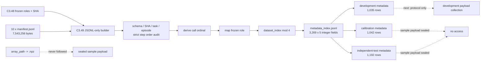

# PhaseRoute-VLA C3.49：Metadata-only 索引与四分片冻结

日期：2026-08-17（Asia/Shanghai）  
工程状态：`C349_METADATA_INDEX_FROZEN`  
阶段性质：metadata-only、prospective、CPU-only、non-deployable  
科学效果结论：无；本阶段不读取样本 tensor、不训练模型、不运行候选动作或闭环

## 1. 阶段结论

C3.49 已按 C3.48 的顺序访问协议，完成 episode 5--29 的 metadata-only 索引：

```text
source manifest rows:             3,946
historical episode 0--4 rows:       677
prospective episode 5--29 rows:   3,269
prospective task×episode cells:     250 / 250 non-empty
calls per prospective cell:          9 -- 28
```

持久化的每一行严格只有五个整数字段：

```json
{"dataset_index":0,"task_id":0,"episode_index":5,"call_ordinal":0,"shard_assignment":0}
```

索引器打开的唯一源文件是 10 个已绑定 SHA-256 的 `manifest.jsonl`。它没有 NumPy/Torch
payload loader，不跟随 manifest 中的 `array_path`，没有打开 `.npz`、checkpoint、图像、
proprio、hidden feature、动作或风险目标。metadata index 完成不代表 calibration/test
样本已经解封：三种角色的样本 payload 仍全部未打开。

## 2. 为什么正式行数与 C3.48 估计不同

C3.48 只能根据历史数据做资源估计：

```text
677 historical rows / 5 episodes × 25 prospective episodes = 3,385 rows
```

C3.49 对冻结 manifest 逐行计数后的正式结果是 3,269 行，比估计少 116 行，即
`-3.43%`。每个 episode 的实际策略调用数随轨迹长度变化，不能假定每个 episode 与历史
平均长度相同。这也是先冻结 metadata、再配置正式采集预算的原因。

## 3. 输入、处理和输出流程



### 3.1 读取的源信息

源是已存在的 M4.28 teacher-cache JSONL manifest。每行是约 2 KB 的调用描述符，包含
episode ID、task ID、step ID、checkpoint/schema lineage、数组路径和形状描述等 metadata。
C3.49 严格冻结完整 top-level key set 和 16 KiB 单行上限；若 manifest 直接嵌入
`teacher_normalized_action`、`projected_features`、`risk_targets` 等 payload key，立即拒绝。

形式化执行没有读取 task result 中的 `success_rate`，也没有统计 teacher exit、候选动作
或风险分布。manifest 的 `array_path` 仅作为冻结 schema 中的字符串存在，索引器从未打开
该路径。

### 3.2 持久化输出

| 字段 | 类型 | 含义 |
|---|---|---|
| `dataset_index` | int | prospective index 内连续的 `0..3268` |
| `task_id` | int | audit/shard key，`0..9` |
| `episode_index` | int | C3.48 已冻结的 `5..29` |
| `call_ordinal` | int | 当前 task-episode 内按 manifest 顺序从 0 计数 |
| `shard_assignment` | int | `dataset_index % 4` |

没有 role 字段，因为 role 可由 C3.48 的 episode map 唯一推导；没有 `step_id`、
`array_path` 或 identity hash，未来 runner 必须用已绑定 manifest 重新构造映射，不能把
索引悄悄扩展为 payload 清单。

## 4. 精确角色和分片结果

### 4.1 角色行数

| 角色 | Episodes | Rows | 占 prospective |
|---|---|---:|---:|
| model development | 5,8,11,14,17,20,23,26 | 1,035 | 31.66% |
| calibration | 6,9,12,15,18,21,24,27 | 1,042 | 31.88% |
| independent test | 7,10,13,16,19,22,25,28,29 | 1,192 | 36.46% |
| 合计 | 5--29 | 3,269 | 100% |

### 4.2 四分片行数

| 角色 | Shard 0 | Shard 1 | Shard 2 | Shard 3 | 合计 |
|---|---:|---:|---:|---:|---:|
| model development | 260 | 256 | 258 | 261 | 1,035 |
| calibration | 258 | 261 | 260 | 263 | 1,042 |
| independent test | 300 | 300 | 299 | 293 | 1,192 |
| 全部 metadata | 818 | 817 | 817 | 817 | 3,269 |

未来 development 候选采集若仍为 layer 11/13/27、FM10，则正式预算为：

```text
1,035 observations
3,105 candidate trajectories
31,050 FM solver calls
173,880 action scalars
```

这是预算，不是本阶段已经执行的 GPU 工作。下一阶段只允许冻结 development-only 采集
协议和 runner；正式执行前还要单独通过源码、manifest SHA、GPU UUID 与 payload-role
隔离审查。

## 5. “没有打开 payload”如何验证

C3.49 使用三层约束：

1. **依赖层**：核心模块只导入 Python 标准库和 C3.48 常量，不导入 NumPy/Torch；冻结器
   静态拒绝 `import numpy`、`import torch`、`np.load`、`torch.load`；
2. **路径层**：输入 API 只接受十个名为 `manifest.jsonl` 的文件；输出 access audit 记录
   10 个唯一打开源，`npz_or_sample_payload_files_opened=0`；
3. **测试层**：合成测试 monkeypatch `Path.open`，任何 `.npz` 打开都会立即抛错；测试还在
   manifest 中注入 action payload key，确认索引器 fail closed。

因此这里的“未打开”不是依赖操作习惯，而是源码结构、正式 result 和测试三重证据。

## 6. 完整性与授权边界

正式 result 的 10 项检查全部为 PASS：

```text
c348_parent_and_source_current
ten_source_manifest_hashes_exact
all_300_source_task_episode_cells_nonempty
all_250_prospective_task_episode_cells_nonempty
dataset_indices_contiguous
five_field_schema_exact
four_shard_assignment_deterministic
only_manifest_jsonl_opened
no_npz_checkpoint_tensor_or_sample_payload_opened
no_target_training_threshold_rollout_or_control
```

当前准确边界：

```text
episode_5_29_metadata_accessed = true
episode_5_29_sample_payload_accessed = false
candidate_actions_or_risk_targets_computed = false
model_or_calibrator_trained = false
checkpoint_or_threshold_selected = false
independent_test_sample_payload_opened = false
gpu_used = false
active_action_control = false
method_performance_claim = false
```

这里必须区分“test metadata 已纳入索引”和“test sample 已打开”：前者只暴露行键与计数，
后者仍为 false。

## 7. 测试与冻结证据

C3.49 定向测试：

```text
5 passed, 1 warning
```

C3.40--C3.49 联合回归：

```text
51 passed, 1 warning
```

依赖审计：

```text
pip check: No broken requirements found.
```

冻结 SHA-256：

```text
C3.49 result:
fe45b998efe7a45ea9620937bcfedc4bcd0e3a574ee51409087f50a938f5f868

C3.49 metadata index:
0c06574cb526e9068cce2195eacaa9f5ebae8689e527c336a50019dd6a0f5e0b

C3.49 implementation source:
06832ddca7316abd80069ac443f54d449fbea19c6f42b902bd340338eb3d59de

C3.49 freezer source:
c836eeb52c6ec5e7eac6cce0b6022b9f148d2c2bf5e663c50ef6bc813b003fa7
```

正式索引大小为 299,774 bytes、3,269 行。冻结目录拒绝覆盖；改变源 manifest、字段、
角色或分片公式必须使用新的 protocol 版本并保留旧证据。

## 8. 下一阶段

C3.50 应只设计并冻结 **model-development role** 的同噪声候选采集协议和四卡 runner：

- 只允许 metadata index 中 development episodes 的 1,035 行；
- 使用物理 GPU 0--3，并重新核对四个冻结 UUID；
- layer 11/13/27 共用同一个 cached `teacher_exit_input_x`；
- 逐 shard 验证输入 hash、行键、候选有限性和 layer-27 self delta；
- calibration 的 1,042 行和 independent-test 的 1,192 行继续禁止打开 sample payload；
- 不在采集阶段训练 motion/hurdle/tail head，不选择阈值或运行 active control。

只有 C3.50 协议和合成 runner 测试通过后，才能决定是否执行 development payload 的四卡
候选采集。
