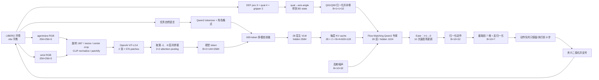
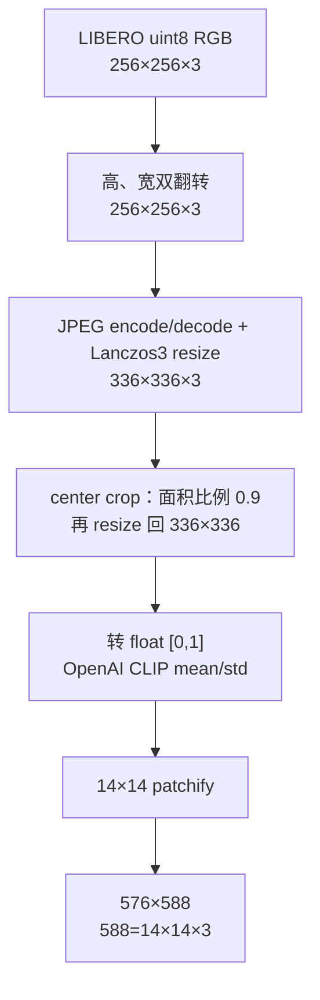
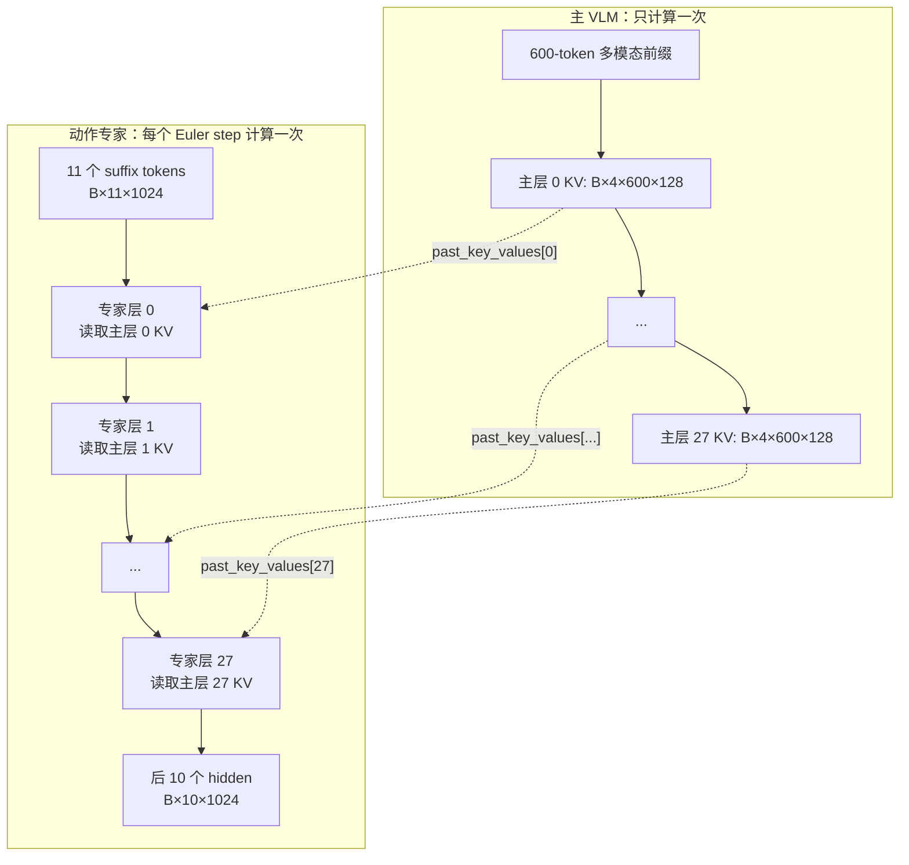
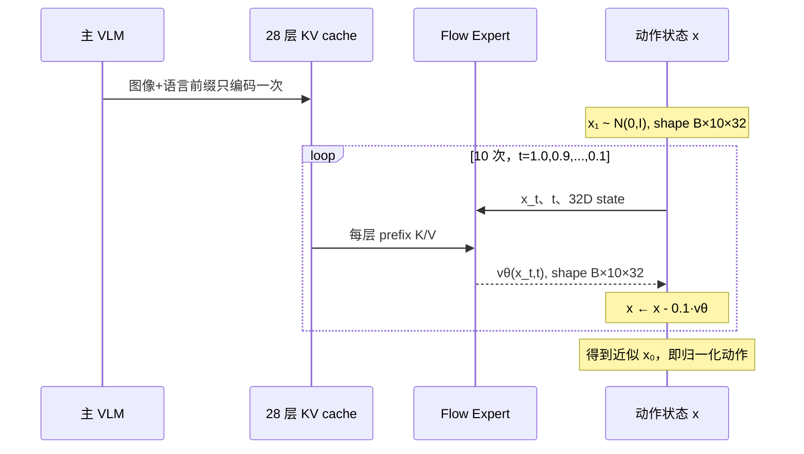
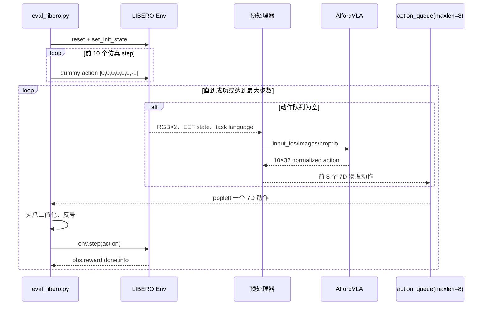
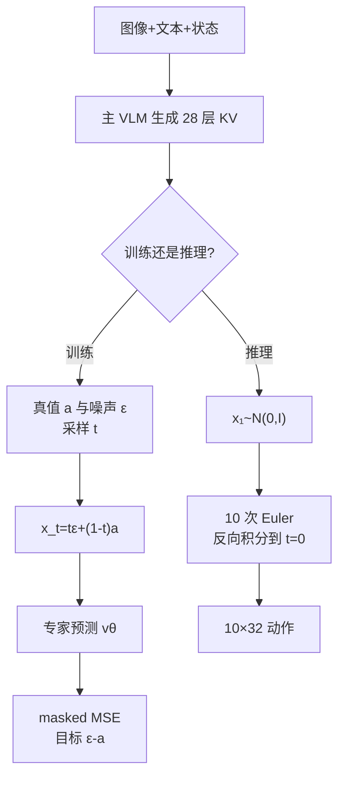
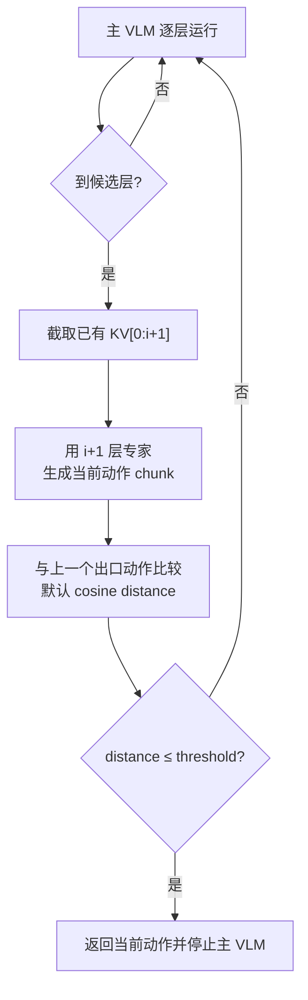

# A1 项目中文阅读指南：从 LIBERO 观测到机器人动作

> 发布说明：本文解释标准 A1 完整层主线；本分支正式的动态计算路径 RP-PEP 及其 8×7 动作契约见 [仓库映射](repo_map.md) 和 [发布状态](RELEASE_STATUS_ZH.md)。

> [!CAUTION]
> **checkpoint 维度勘误（2026-08-17）**：本文正文保留的是上游标准
> `model/libero` baseline 的 `600-token / 10×32 / resize` 契约，不是当前正式
> `model/libero_exit` checkpoint。后者的真实运行时张量为：
> `input_ids=(B,680)`、proprio `(B,1,1,8)`、动作 `(B,8,7)`、视觉
> `(B,5,144,3584)`（4 个有效 crop + 1 个 padded crop；576 个 source feature
> 映射到 288 个 unique slots）。解释 PhaseRoute/RP-PEP 时请以
> [PhaseRoute-VLA 架构文档](PHASEROUTE_ARCHITECTURE_ZH.md) 为准，不能机械套用
> 本文正文的旧维度。

> 本文解释上游 A1 的完整层 baseline。PhaseRoute-VLA 正式发布使用 `model/libero_exit` checkpoint；改进后的候选调度与张量路径见 [PhaseRoute-VLA 架构文档](PHASEROUTE_ARCHITECTURE_ZH.md)。

## 0. 阅读基准、范围与符号

本文对应的代码状态：

- 仓库：当前 checkout 的根目录
- baseline checkpoint（需另行从上游 A1 获取）：`model/libero/model.pt`
- baseline checkpoint 配置：`model/libero/config.yaml`
- baseline 数据统计：`model/libero/dataset_statistics.json`
- LIBERO 子模块 commit：`8f1084e3132a39270c3a13ebe37270a43ece2a01`
- 标准评测入口：`eval_libero.sh`
- 当前 checkpoint：`early_exit: false`，因此标准路径不会早退

为了避免把不同 checkpoint 的结构混在一起，正文聚焦这条主线：

```text
LIBERO → 两路 RGB + 语言指令 + 8D 机器人状态
       → Molmo/Qwen2-7B 多模态前缀
       → Flow Matching Qwen2 动作专家
       → 10×32 模型动作
       → 10×7 LIBERO 动作
       → 开环执行 8 步并重新观测
```

符号约定：

| 符号 | 含义 | 当前值 |
|---|---|---:|
| `B` | batch size；在线 LIBERO 推理通常为 1 | 1 |
| `P` | 主 VLM 的 padding 后序列长度 | 600 |
| `V` | 单个样本的有效前缀长度，随指令长度变化 | `≤600` |
| `T` | 动作 chunk/horizon | 10 |
| `A` | 模型内部固定动作维度 | 32 |
| `A_libero` | LIBERO 有效动作维度 | 7 |
| `D_vlm` | 主 VLM hidden size | 3584 |
| `D_exp` | Flow Matching 专家 hidden size | 1024 |
| `H_vlm/H_kv` | 主 VLM query heads / KV heads | 28 / 4 |
| `d_head` | 主 VLM 与动作专家的单头宽度 | 128 |

---

## 1. 一页看懂端到端流程



端到端最重要的形状变化是：

```text
每张 RGB 图像
  (256,256,3)
→ (336,336,3)
→ (576,588)                  # 576 个 patch，每 patch 14×14×3=588
→ (577,1024)                 # ViT：CLS + 576 patch
→ (576,2048)                 # 两个 ViT 层的特征拼接
→ (144,1024)                 # 2×2 attention pooling
→ (144,3584)                 # 视觉连接器投影到主 VLM

两张图 + 文本
→ input_ids: (B,600)
→ hidden:    (B,600,3584)
→ 28 组 KV: 每组 K/V 均为 (B,4,600,128)

状态 + 噪声动作 + KV
→ suffix:    (B,11,1024)     # 1 个状态 token + 10 个动作 token
→ velocity:  (B,10,32)
→ action:    (B,10,32)
→ LIBERO:    (B,10,7)
```

---

## 2. 项目目录和各层职责

| 目录或文件 | 职责 | 是否在本文主线中 |
|---|---|---|
| `a1/model.py` | ViT 连接器、主 Transformer、注意力与 KV cache | 是 |
| `a1/image_vit.py` | OpenAI/SigLIP/DINO 视觉 Transformer | 是，使用 OpenAI ViT |
| `a1/vla/affordvla.py` | 把主 VLM、状态输入和动作头组合成 `AffordVLA` | 是 |
| `a1/vla/action_heads.py` | L1、Diffusion、DiT、Flow Matching 等动作头 | 是，使用 Flow Matching |
| `a1/vla/projectors.py` | proprio 和 noisy action 的投影器 | 部分使用 |
| `a1/data/model_preprocessor.py` | 图像 patchify、图像占位 token、文本/图像交织 | 是 |
| `a1/data/collator.py` | padding、batch 化、动作/状态字段整理 | 是 |
| `a1/data/vla/rlds_datasets.py` | RLDS 训练样本转成 A1 输入格式 | 训练使用 |
| `a1/train.py` | FSDP 训练循环和动作损失 | 训练使用 |
| `robot_experiments/vla_utils.py` | 在线推理适配、归一化、模型调用、反归一化 | 是 |
| `robot_experiments/libero/eval_libero.py` | LIBERO task/episode/action queue 闭环 | 是 |
| `robot_experiments/libero/libero_utils.py` | 环境、相机、四元数、视频工具 | 是 |
| `a1/vla/affordvla_early_exit.py` | 可截断主 VLM | 可选分支 |
| `a1/vla/value_net.py` | 早退动作相似度、阈值和控制器 | 可选分支 |
| `deploy/` | HTTP API 服务端/客户端 | 另一种调用外壳 |
| 上游 A1 的 VLABench/RoboChallenge 路径 | 其他 benchmark | 当前聚焦仓库不包含 |

项目内部不是“VLM 直接逐 token 生成离散动作”。当前官方 LIBERO checkpoint 的实际结构是：主 VLM只编码图像和语言并产生每层 KV memory，连续动作由另一个较小的 Qwen2 Flow Matching 专家生成。

---

## 3. 输入：LIBERO 一帧观测包含什么

### 3.1 环境原始观测

`get_libero_env()` 创建离屏渲染环境，默认相机分辨率为 `256×256`。每次策略查询使用：

| 输入 | 来源 | 原始形状 | 含义 |
|---|---|---:|---|
| 主视角 RGB | `obs["agentview_image"]` | `(256,256,3)` | 第三人称场景图 |
| 腕部 RGB | `obs["robot0_eye_in_hand_image"]` | `(256,256,3)` | 末端相机图 |
| 末端位置 | `obs["robot0_eef_pos"]` | `(3,)` | `x,y,z` |
| 末端四元数 | `obs["robot0_eef_quat"]` | `(4,)` | `(x,y,z,w)` |
| 夹爪关节位置 | `obs["robot0_gripper_qpos"]` | `(2,)` | 两个夹爪关节 |
| 语言指令 | `task.language` | 字符串 | 例如“pick up ...” |

图像在送入策略前先执行 `img[::-1, ::-1]`，即同时翻转高、宽两个轴，等价于旋转 180°。这是为了匹配 LIBERO 训练数据的图像方向。

### 3.2 8 维 proprio 的组成

四元数先转为 3 维 axis-angle：

```text
state_8 = concat(
    eef_position[3],
    quaternion_to_axis_angle(eef_quat)[3],
    gripper_qpos[2]
)
```

因此：

```text
state_8.shape = (8,)
```

这里的状态不是 7 个机械臂关节角；它是末端笛卡尔位姿的 6 个量加两个夹爪位置。

### 3.3 模型输出动作的物理语义

模型内部输出 32 维，但 LIBERO 只取前 7 维：

| 动作切片 | 维度 | 语义 |
|---|---:|---|
| `a[...,0:3]` | 3 | 末端平移增量 `Δx,Δy,Δz` |
| `a[...,3:6]` | 3 | 末端旋转增量，axis-angle |
| `a[...,6]` | 1 | 夹爪开合 |
| `a[...,7:32]` | 25 | 通用固定槽位；LIBERO 中为 padding，最终丢弃 |

---

## 4. 观测预处理

### 4.1 图像预处理和 patchify



在线路径会先在 `prepare_observation()` 中 resize 到 `336×336`，随后 `prepare_images_for_vla()` 在 `center_crop=True` 时做中心裁剪并恢复到 `336×336`。多模态预处理器还会执行一次保持长宽比的 resize/pad 和 OpenAI CLIP 标准化。对于方形输入，通常没有实际 padding，`image_masks` 基本全为 1。

两张图经过 patchify 后组成：

| Tensor | 形状 | dtype/说明 |
|---|---:|---|
| 单图 patches | `(1,576,588)` | `float32` |
| 两图、未 batch | `(2,576,588)` | 主视角在前，wrist 在后 |
| `images` | `(B,2,576,588)` | collator 输出 |
| `image_masks` | `(B,2,576)` | patch 的有效像素比例 |
| `image_input_idx` | `(B,2,144)` | 视觉 feature 应写入主序列的位置 |

注意，送入 ViT 的不是常见的 `(B,C,H,W)`，而是已经展开的 patch tensor `(B,N_image,N_patch,pixels_per_patch)`。

### 4.2 状态归一化与补零

在线推理依据当前 task suite 自动选择统计键：

```text
libero_spatial → libero_spatial_no_noops
libero_object  → libero_object_no_noops
libero_goal    → libero_goal_no_noops
libero_10      → libero_10_no_noops
```

默认归一化类型为 `BOUNDS_Q99`。对状态每一维执行：

```math
s_{norm}=\operatorname{clip}\left(2\frac{s-q_{01}}{q_{99}-q_{01}+10^{-8}}-1,-1,1\right)
```

随后在最后一维补 24 个零：

```text
(8,) → (1,8) → (1,1,8) → (1,1,32)
```

collator 再增加 batch 维后的典型输入是：

```text
action_proprio.shape = (B,1,1,32)
```

### 4.3 文本格式与多模态 token 序列

在线代码将原始任务描述小写后直接作为 `question`，样本风格是 `style="action"`。当前格式器产生近似如下文本：

```text
User: <task description> Assistant: Action
```

Qwen2 tokenizer 使用 EOS 充当 BOS。图像没有在指令中显式写 `<|image|>`，因此两张图都被插入整个文本之前。

单张图在主序列中占 158 个结构 token：

```text
<im_start>
12 行 × (12 个 <im_patch> + 1 个 <im_col>)
<im_end>

长度 = 1 + 12×13 + 1 = 158
```

其中真正被视觉 feature 增强的是 144 个 `<im_patch>`；其余 14 个是 12 个列分隔 token 加首尾 token。两张图合计：

```text
结构 token = 2×158 = 316
视觉 feature 落点 = 2×144 = 288
```

有效序列可写成：

```text
[BOS / image-1 的 158 tokens / image-2 的 158 tokens / 文本 tokens]
```

最后右侧 padding 到 600：

```text
input_ids.shape = (B,600)
position_ids.shape = (B,600)
attention_valid = (input_ids != -1)
```

有效前缀长度 `V` 随任务语言长度变化，近似为 `316 + L_text`，并满足 `V≤600`。

---

## 5. 视觉编码器：从 576 patch 到 144 个视觉 token

当前视觉骨干是 OpenAI ViT-L/14，输入尺寸 336。

```mermaid
flowchart LR
    P["patch tensor<br/>B×2×576×588"] --> PE["Linear patch embedding<br/>588→1024"]
    PE --> CLS["加 CLS 和位置编码<br/>(B×2)×577×1024"]
    CLS --> VT["23 层 ViT<br/>16 heads, head_dim=64"]
    VT --> SEL["选择第 -2 和 -9 层"]
    SEL --> CAT["沿 hidden 拼接<br/>(B×2)×576×2048<br/>丢弃 CLS"]
    CAT --> POOL["每个 2×2 patch 区域<br/>mean query attention pooling"]
    POOL --> P144["B×2×144×1024"]
    P144 --> MLP["SwiGLU MLP projector<br/>1024→3584"]
    MLP --> OUT["B×2×144×3584"]
```



### 5.1 ViT patch embedding

每个 `14×14×3=588` patch 通过线性层：

```text
(B×2,576,588) → (B×2,576,1024)
```

加入 1 个 CLS token 和 577 个位置编码后：

```text
(B×2,577,1024)
```

ViT 共 23 层，每层 16 个注意力头，`head_dim=64`，MLP 中间宽度 4096，激活为 QuickGELU。

### 5.2 多层视觉特征拼接

配置 `vit_layers=[-2,-9]`。取两个层的输出，沿 hidden 维拼接：

```text
(B×2,577,1024) × 2
→ (B×2,577,2048)
→ 去掉 CLS
→ (B,2,576,2048)
```

### 5.3 2×2 attention pooling

`24×24` patch 网格被划分成 `12×12` 个区域。每个区域包含 4 个相邻 patch：

```text
(B×2×12×12,4,2048)
```

当前 pooling 类型为 `attention_meanq`：先对区域中的 4 个特征求均值作为 query，再用这个 query 对 4 个特征做一次多头注意力。因为 pooling attention 的输出宽度是 1024：

```text
(B×2×144,1,1024) → (B,2,144,1024)
```

### 5.4 视觉连接器

视觉连接器是一个 SwiGLU MLP。其核心形状是：

```text
input                               (B,2,144,1024)
w1, w3: 1024→18944                  两条门控支路
SiLU(w1(x)) × w3(x)                 (B,2,144,18944)
w2: 18944→3584
output                              (B,2,144,3584)
```

最终每张图得到 144 个主 VLM 宽度的视觉 token，两张图合计 288 个。

---

## 6. 主 VLM：多模态前缀和 KV memory

### 6.1 主干配置

| 参数 | 值 |
|---|---:|
| Transformer 层数 | 28 |
| hidden size | 3584 |
| query heads | 28 |
| KV heads | 4 |
| head dim | 128 |
| MLP 投影宽度 | 37888 |
| SwiGLU 激活后宽度 | 18944 |
| 位置编码 | RoPE，`theta=1,000,000` |
| 词表 embedding | 152064 |
| 额外 special-token embedding | 128 |
| 输入长度 | 600 |
| 数值精度 | AMP BF16 |

### 6.2 文本 embedding 与视觉 feature 融合

`input_ids=-1` 的 padding 会先映射到 embedding 第 0 行。主输入 embedding：

```text
x_text.shape = (B,600,3584)
```

视觉输出被展平为 `(B,288,3584)`，再根据 `image_input_idx` 加到对应 `<im_patch>` 的 token embedding 上：

```text
x[position_of_im_patch] += image_feature
```

因此主 VLM 序列长度仍是 600，不会额外把 288 个视觉 feature 拼到序列末尾。

### 6.3 proprio 在主 VLM 中的实际行为

代码还定义了 `ProprioProjector`：

```text
(...,32) → Linear 32→3584 → GELU → Linear 3584→3584
```

Flow Matching collator 把 `proprio_token_idx` 设为有效文本/图像序列之后的第一个位置，但没有真的向 `input_ids` 追加 `<proprioception>` token。模型会把该位置的 embedding 替换为状态投影；与此同时，attention mask 仍由 `input_ids != -1` 生成，所以这个位置还是 padding，并被主 VLM mask 掉。

结论：在当前 Flow Matching 路径中，proprio 的有效条件通路是后面动作专家的 `32→1024` 独立投影，而不是主 VLM 序列中的状态 token。主 VLM 的 `ProprioProjector` 更像是其他动作头遗留/兼容路径。

### 6.4 注意力和输出

每层使用 GQA：

```text
Q: (B,28,600,128)
K: (B, 4,600,128)
V: (B, 4,600,128)
```

计算注意力时 K/V 会按组扩展到 28 个 query heads，但 cache 中仍只保存 4 个 KV heads。

主 VLM 的输出包括：

| 输出 | 形状 | 下游用途 |
|---|---:|---|
| `last_hidden_state` | `(B,600,3584)` | 标准 FM 推理只用其 dtype，不用它直接回归动作 |
| `attn_key_values` | 长度 28 的列表 | 作为动作专家每一层的 prefix cache |
| 每层 `K` | `(B,4,600,128)` | 专家同层的 past key |
| 每层 `V` | `(B,4,600,128)` | 专家同层的 past value |
| `logits` | `None` | 当前动作训练/推理关闭了语言 logits |

这里没有额外的 `3584→1024` memory projector。主 VLM 与动作专家虽然 hidden size 不同，但它们都满足 `4 KV heads × 128 head_dim`，所以主 VLM 的 KV cache 可以直接交给专家。两套网络的 KV 语义在端到端训练中对齐。

### 6.5 `llm_causal_attention=false` 的实现事实

checkpoint 配置中写有 `llm_causal_attention: false`，但当前代码只在 `action_head_type == "l1_regression"` 时把 causal bias 清零。Flow Matching 分支仍会构造下三角 causal bias。

因此，对当前官方 Flow Matching checkpoint 应按“主 VLM 实际是 causal attention”理解，而不能只看配置字段名称。

---

## 7. Flow Matching 动作专家

### 7.1 专家配置

| 参数 | 值 |
|---|---:|
| hidden size | 1024 |
| 层数 | 28 |
| query heads | 8 |
| KV heads | 4 |
| head dim | 128 |
| FFN intermediate | 2048 |
| horizon | 10 |
| action/state dim | 32 |
| 推理积分步数 | 10 |
| 官方 attention 路径 | `2d_attn_mask` |

专家内部使用 Hugging Face `Qwen2Model`，移除了 token embedding，直接接受连续 `inputs_embeds`；语言模型输出头也不参与动作预测。

### 7.2 专家后缀 token 的构造

状态支路：

```text
state: (B,1,1,32)
→ 取出最后一维状态
→ Linear 32→1024
→ state_token: (B,1,1024)
```

动作和时间支路：

```text
x_t:                       (B,10,32)
Linear 32→1024:            (B,10,1024)
t:                         (B,)
sin/cos time embedding:    (B,1024)
expand:                    (B,10,1024)
concat(action,time):       (B,10,2048)
Linear 2048→1024 + SiLU
Linear 1024→1024:          (B,10,1024)
```

最终后缀：

```text
suffix = concat(state_token, action_time_tokens)
suffix.shape = (B,11,1024)
```

### 7.3 主 VLM cache 如何进入专家



主 cache 的物理长度始终是 600；`pos_offset=(input_ids!=-1).sum()` 给出有效长度 `V`。官方 `2d_attn_mask` 路径构造：

```text
attention_mask_2d.shape = (B,600+11) = (B,611)
前缀 [0,V) 为 1
前缀 [V,600) 为 0
后缀 11 个位置全为 1
```

Qwen2 自身仍施加 causal 语义。因此后缀动作 token 按顺序访问前缀和较早的后缀 token。代码还实现了 `4d_attn_mask` 块因果变体，但当前 checkpoint 配置不用它。

### 7.4 速度场输出头

专家最后的 hidden：

```text
(B,11,1024)
→ 只取最后 10 个动作位置
→ (B,10,1024)
```

每个动作位置通过两层残差 MLP：

```text
LayerNorm → Linear 1024→1024 → ReLU
→ 2×[LayerNorm → Linear 1024→1024 → ReLU + residual]
→ LayerNorm → Linear 1024→32
```

输出速度场：

```text
v_theta.shape = (B,10,32)
```

### 7.5 10 步 Euler 采样



代码中：

```text
dt = -1 / 10 = -0.1
x_1 ~ Normal(0,I)
x_{next} = x + dt × v_theta(x,t)
t_{next} = t + dt
```

因此一次策略查询的主要计算是“一次 28 层主 VLM + 十次 28 层动作专家”。KV cache 让十次专家调用无需重复编码图像和文本。

---

## 8. 动作后处理：32 维如何回到 LIBERO 7 维

### 8.1 截取有效维度

Flow Matching 输出：

```text
normalized_actions: (B,10,32)
```

LIBERO 适配代码硬编码取前 7 维：

```text
normalized_actions = normalized_actions[..., :7]
shape = (B,10,7)
```

### 8.2 Q01/Q99 反归一化

前 6 个连续动作维度执行：

```math
a=0.5(a_{norm}+1)(q_{99}-q_{01}+10^{-8})+q_{01}
```

统计文件中动作 mask 为：

```text
[True, True, True, True, True, True, False]
```

所以夹爪第 7 维不做 Q01/Q99 反归一化，仍保持训练数据的 `[0,1]` 语义。

### 8.3 夹爪转换

训练时 LIBERO 原始夹爪约定是 `-1=open, +1=close`，数据变换把它对齐为 `1=open, 0=close`。执行前再转换回来：

```text
模型 gripper g∈[0,1]
→ 2g-1
→ sign 二值化为 {-1,+1}
→ 再乘 -1
→ LIBERO：-1=open, +1=close
```

最终单步环境动作是 `(7,)`，通过 `env.step(action.tolist())` 执行。

---

## 9. LIBERO 闭环时序



关键时序参数：

| 参数 | 值 | 作用 |
|---|---:|---|
| `num_steps_wait` | 10 | episode 开始先让物体稳定 |
| 模型预测 chunk | 10 | 一次输出 10 个未来动作 |
| `num_open_loop_steps` | 8 | 实际只执行前 8 个，然后重新观测 |
| `action_queue.maxlen` | 8 | 队列不会保留第 9、10 个动作 |
| spatial 最大控制步 | 220 | 不含前 10 个等待步 |
| object 最大控制步 | 280 | 同上 |
| goal 最大控制步 | 300 | 同上 |
| libero_10 最大控制步 | 520 | 同上 |

输出不只是动作。评测程序还统计每个 task 和总 episode 的成功率，可选择把第三人称图像保存成 MP4，并可写入 W&B。

---

## 10. 训练路径：监督信号和维度

### 10.1 RLDS 样本形成

训练数据来自四个 mixture：

```text
libero_spatial_no_noops
libero_object_no_noops
libero_goal_no_noops
libero_10_no_noops
```

RLDS 窗口参数是：

```text
window_size = 1
future_action_window_size = 9
```

所以每个样本包含当前动作加未来 9 个动作：

```text
原始 action:   (10,7)
原始 proprio:  (1,8)
```

归一化后补零：

```text
action:             (10,32)
proprio:            (1,32)
action_pad_mask:    (10,32)
```

`action_pad_mask[...,0:7]=False`，`[...,7:32]=True`。因此 25 个通用 padding 维不会进入动作损失。

### 10.2 Flow Matching 训练目标

设归一化真值动作为 `a`、高斯噪声为 `ε`：

```text
a, ε: (B,10,32)
t ~ Beta(1.5,1)，再缩放到约 [0.001,1)
x_t = t·ε + (1-t)·a
target = ε-a
```

这是一条从数据 `a`（`t=0`）到噪声 `ε`（`t=1`）的直线路径，其真实速度 `dx_t/dt` 正好是 `ε-a`。

主 VLM 对图像和语言计算 28 层 KV；动作专家接受 `(x_t,t,state,KV)` 并预测：

```text
v_pred:   (B,10,32)
v_target: (B,10,32)
```

损失是只覆盖有效动作元素的 MSE：

```math
L_{FM}=\frac{\sum M\odot\left(v_\theta-(\epsilon-a)\right)^2}{\sum M}
```

其中 `M = ~action_pad_mask`，对 LIBERO 每个样本有 `10×7=70` 个有效标量。

### 10.3 训练/推理分叉



当前 checkpoint 配置显示：

- 优化目标只使用动作 loss，语言 CE/logits 路径被关闭；
- `ft_llm: true`：主 LLM 参与微调；
- `ft_vit: false`：视觉骨干冻结；
- `ft_connector: false`：视觉连接器冻结；
- action head 参与训练；
- 官方 `train_libero.sh` 把 `state_mask_prob` 设为 `0.0`，不会随机清空状态；
- 训练精度为 AMP BF16，主学习率为 LLM `5e-6`、action head `5e-5`。

---

## 11. 可选 Early Exit：A1 的“截断”从哪里来

本节是仓库的可选能力，不属于当前 `model/libero` checkpoint 的标准路径。对应独立 checkpoint `a1-libero-exit`、入口 `eval_libero_exit.sh`。

默认 `exit_interval=2` 时，28 层主 VLM 的候选 block index 是：

```text
[1,3,5,...,27]
```

block index 从 0 开始，所以在 index 1 退出表示已经执行 2 层。

对 Flow Matching，每到候选层 `i`：

1. 取当前已有的主 VLM cache `KV[0:i+1]`；
2. 把动作专家临时截成 `i+1` 层；
3. 用这组部分 cache 完整跑一次 Flow Matching Euler 采样；
4. 与前一候选出口动作计算距离；默认是 `1-cosine_similarity`；
5. 若距离小于离线标定阈值，则认为动作已稳定并退出；否则继续主 VLM 后续层；
6. 最后一层阈值设为极大值，保证一定退出。



阈值通过 calibration dataloader 统计各出口动作差异，再按 `exit_ratio` 和 `exp/gauss/gamma` 预算分配选择分位点。也可以用 `exit_layer_id` 强制固定层退出，跳过阈值控制器。

Early Exit 的收益来自少跑主 VLM 和专家后半层；代价是候选出口检查本身也要执行一次动作生成，因此实际延迟需要实测，不能只按“执行层数比例”估算。

---

## 12. 模块输入输出维度总表

下表覆盖官方 LIBERO Flow Matching 主线中的功能模块。`V` 表示有效 token 数，物理 cache 长度仍是 600。

| 模块 | 功能 | 输入 | 输出 |
|---|---|---|---|
| LIBERO renderer | 生成两路观测图 | 环境状态 | 两个 `(256,256,3)` uint8 RGB |
| `get_libero_image()` | 纠正图像方向 | `(256,256,3)` | `(256,256,3)` |
| `quat2axisangle()` | 旋转表示转换 | quaternion `(4,)` | axis-angle `(3,)` |
| `prepare_observation()` | 拼装在线观测 | RGB×2、pos3、quat4、gripper2 | RGB×2、state `(8,)` |
| `normalize_proprio()` | Q01/Q99 归一化 | `(8,)` | `(8,)`，范围约 `[-1,1]` |
| proprio padding | 统一通用机器人维度 | `(1,1,8)` | `(1,1,32)` |
| center crop/resize | 匹配训练图像分布 | 每图 `(336,336,3)` | 每图 `(336,336,3)` |
| CLIP normalization | 图像标准化 | `[0,1]` RGB | 标准化 float RGB |
| `pixels_to_patches()` | 展平 patch | `(336,336,3)` | `(576,588)` |
| 多模态 preprocessor | 构造占位序列和索引 | 两图、文本 | images `(2,576,588)`、idx `(2,144)`、变长 tokens |
| `MMCollatorForAction` | batch 与 padding | 单样本字段 | ids `(B,600)`、images `(B,2,576,588)`、state `(B,1,1,32)` |
| ViT patch embedding | patch→视觉 hidden | `(B×2,576,588)` | `(B×2,576,1024)` |
| CLS/position | 加视觉序列位置 | `(B×2,576,1024)` | `(B×2,577,1024)` |
| 23-layer ViT | 视觉表征 | `(B×2,577,1024)` | 23 个同形状 hidden |
| layer concat | 融合 -2/-9 层 | 2×`(B×2,577,1024)` | `(B×2,576,2048)`，去 CLS |
| 2×2 attention pooling | 降低视觉 token 数 | `(B×2×144,4,2048)` | `(B,2,144,1024)` |
| image projector | 对齐主 VLM hidden | `(B,2,144,1024)` | `(B,2,144,3584)` |
| token embedding | 文本/special token 嵌入 | `(B,600)` | `(B,600,3584)` |
| image scatter-add | 把视觉 feature 写入占位点 | `(B,288,3584)` + token hidden | `(B,600,3584)` |
| ProprioProjector | 兼容性状态投影 | `(...,32)` | `(...,3584)`；当前 FM 主序列中被 mask |
| 主 VLM ×28 | 编码多模态前缀 | `(B,600,3584)` | hidden `(B,600,3584)` + 28 层 KV |
| 单层主 KV | 给同层专家提供 memory | 主层 K/V 投影 | K、V 各 `(B,4,600,128)` |
| expert state projection | 状态→专家 token | `(B,1,1,32)` | `(B,1,1024)` |
| action projection | noisy action→专家 token | `(B,10,32)` | `(B,10,1024)` |
| time encoder | 连续时间编码 | `(B,)` | `(B,1024)` |
| action-time fusion | 融合动作与时间 | `(B,10,2048)` | `(B,10,1024)` |
| suffix concat | 构造专家输入 | state token + 10 action tokens | `(B,11,1024)` |
| Qwen2 expert ×28 | 从前缀条件预测动作 hidden | suffix + 28 层主 KV | `(B,11,1024)` |
| MLPResNet output | hidden→速度场 | `(B,10,1024)` | `(B,10,32)` |
| Euler sampler | 噪声→数据 | 10×速度场更新 | `(B,10,32)` |
| LIBERO slice | 去掉通用 padding 槽位 | `(B,10,32)` | `(B,10,7)` |
| action unnormalize | 恢复物理尺度 | `(B,10,7)` | `(B,10,7)` |
| open-loop queue | 降低查询频率 | 10 个动作 | 仅保留/执行前 8 个 |
| gripper processor | 恢复仿真约定 | `[0,1]` scalar | `{-1,+1}` scalar |
| `env.step()` | 推进仿真 | 单步 `(7,)` | 新 obs、reward、done、info |

---

## 13. 标准推理调用链与代码导航

从 shell 到环境动作的调用链：

```text
eval_libero.sh
└── robot_experiments/libero/eval_libero.py::eval_libero
    ├── initialize_and_load_model
    │   ├── 读取 model/libero/config.yaml
    │   ├── AffordVLA(model_cfg)
    │   └── 加载 model/libero/model.pt
    ├── benchmark.get_benchmark_dict()[task_suite]()
    └── run_task
        └── run_episode
            ├── prepare_observation
            │   ├── get_libero_image / get_libero_wrist_image
            │   └── quat2axisangle
            ├── robot_experiments/vla_utils.py::get_vla_action
            │   ├── normalize_proprio
            │   ├── build_mm_preprocessor
            │   ├── MMCollatorForAction
            │   └── AffordVLA.predict_actions
            │       ├── AffordVLA.forward
            │       │   ├── MolmoVisionBackbone
            │       │   └── 主 Transformer → KV cache
            │       └── FlowMatchingActionHead.predict_vector_field ×10
            ├── _unnormalize_actions
            ├── process_action
            └── env.step
```

建议按以下顺序读源码：

1. `robot_experiments/libero/eval_libero.py`：先理解 episode 和 action queue；
2. `robot_experiments/vla_utils.py`：理解在线适配和归一化；
3. `a1/data/model_preprocessor.py` 与 `a1/data/collator.py`：理解 token/patch 布局；
4. `a1/model.py::MolmoVisionBackbone`：理解视觉 token；
5. `a1/vla/affordvla.py::forward/predict_actions`：理解主 VLM 和 cache；
6. `a1/vla/action_heads.py::FlowMatchingActionHead`：理解动作专家；
7. `a1/train.py::VLATrainer.model_forward`：理解训练 loss；
8. 最后再读 `affordvla_early_exit.py` 和 `value_net.py`。

---

## 14. 容易误读或踩坑的实现细节

1. **模型不是输出 7 维，而是先输出 32 维。** LIBERO 适配层硬编码 `[..., :7]`；换机器人时不能照搬。

2. **每张图是 144 个最终视觉 token，不是 576 个。** 576 是 ViT patch 数，经过 2×2 pooling 后变成 144。

3. **每张图在文本序列中占 158 个位置。** 144 个 patch 位置之外还有 14 个结构 token。

4. **主 VLM 的动作条件输出是 KV cache，不是最后一层 hidden。** 当前 Flow Matching 专家直接复用每一层的 K/V。

5. **状态在主 VLM 的占位位置仍被 mask。** 当前有效状态路径是专家 `state_proj`；不要仅根据 `ProprioProjector` 类名推断数据流。

6. **`llm_causal_attention=false` 不等于当前 FM 主 VLM 非因果。** 实现只对 L1 分支清除 causal bias。

7. **推理 dataclass 默认写着 sequence length 1024，但加载 checkpoint 后会被覆盖为 600。** 应以 checkpoint `config.data.sequence_length` 为准。

8. **模型预测 10 步，但标准评测每次只执行 8 步。** 第 9、10 步被丢弃，不会留到下次查询。

9. **图像方向的 180° 旋转不能漏。** 它是为了对齐训练数据，而不是普通数据增强。

10. **夹爪维不参与 Q99 反归一化。** 它保留 `[0,1]`，随后再二值化和反号。

11. **训练 loss 会忽略 action 的后 25 个 padding 维。** 这些维度在推理中没有物理意义，也最终被裁掉。

12. **Early Exit 使用独立 checkpoint/入口。** `model/libero` baseline 配置为 `early_exit: false`；PhaseRoute-VLA 使用 `model/libero_exit` 并通过独立 launcher 显式开启 RP-PEP。

13. **`max_crops=2` 不代表每张图切成两个 crop。** 当前 `crop_mode=resize` 时每张图只有一个 crop；两张相机图合计两个 crop。

14. **API 部署外壳和 LIBERO 适配层并不完全等价。** 若目标是复现官方 LIBERO 成功率，应以 `eval_libero.sh → eval_libero.py → robot_experiments/vla_utils.py` 为准。

---

## 15. 最简数学总结

视觉编码：

```math
z_{img}=P_{conn}\left(\operatorname{Pool}_{2\times2}\left([ViT_{-2}(I);ViT_{-9}(I)]\right)\right)
```

主 VLM 前缀：

```math
\{K_l,V_l\}_{l=1}^{28}=VLM([z_{img}^{main},z_{img}^{wrist},z_{text}])
```

Flow Matching 训练：

```math
x_t=t\epsilon+(1-t)a,\qquad
v^*=\epsilon-a
```

```math
L=\operatorname{MaskedMSE}\left(v_\theta(x_t,t,s,\{K_l,V_l\}),v^*\right)
```

推理：

```math
x_1\sim\mathcal N(0,I),\qquad
x_{t-0.1}=x_t-0.1v_\theta(x_t,t,s,\{K_l,V_l\})
```

执行：

```text
x_0[:, :, :7]
→ Q99 反归一化
→ 夹爪恢复为 LIBERO 约定
→ 每轮执行前 8 个动作
→ 重新观测并闭环
```

这就是当前官方 A1-LIBERO checkpoint 从输入到输出的完整数据流。
