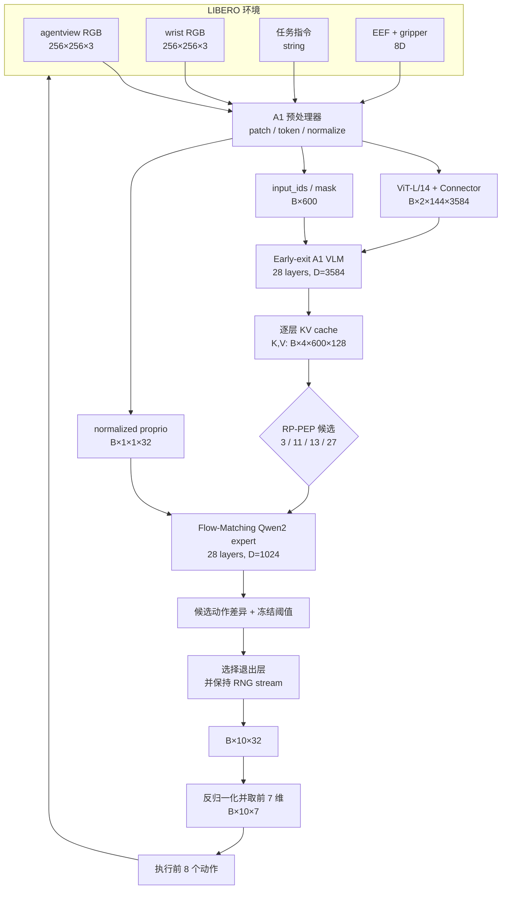
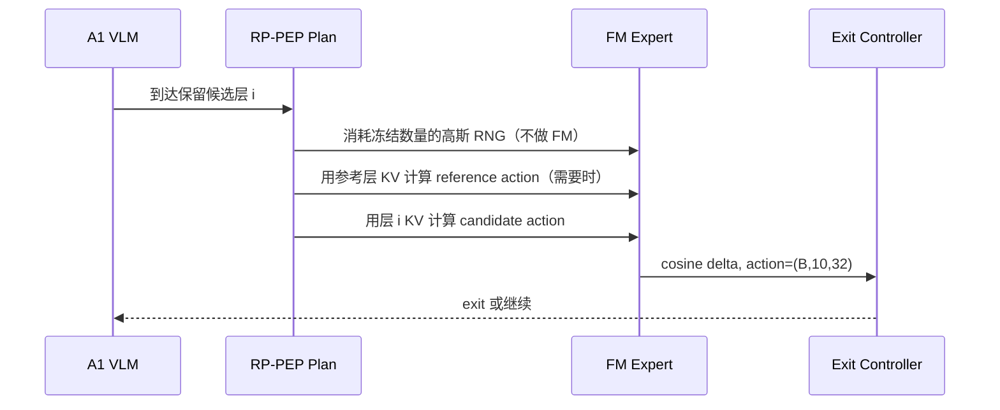

# PhaseRoute-VLA：从输入到输出的完整结构

本文描述改进后的正式运行路径，而不是只描述上游 A1。固定维度对应 A1 LIBERO early-exit checkpoint、Flow Matching 10-step 推理和 LIBERO 双相机设置。换 checkpoint 后，应以其 `config.yaml` 为准重新核对维度。

## 1. 系统总览



在线推理的控制粒度是一次策略调用产生一个动作 chunk；不是每个仿真步都重新调用模型。

## 2. 固定符号与维度

| 符号 | 含义 | 固定值或范围 |
|---|---|---:|
| `B` | 在线 batch size | 通常 1 |
| `C` | 相机数 | 2 |
| `P_img` | 每张图原始 ViT patch 数 | 576 |
| `M` | 每张图连接器输出 token 数 | 144 |
| `S` | padding 后多模态前缀长度 | 600 |
| `D_vlm` | 主 VLM hidden size | 3584 |
| `L_vlm` | 主 VLM 层数 | 28 |
| `D_fm` | 动作专家 hidden size | 1024 |
| `L_fm` | 动作专家层数 | 28 |
| `T` | 模型动作 horizon | 10 |
| `A` | 模型统一动作维度 | 32 |
| `A_libero` | LIBERO 有效动作维度 | 7 |
| `T_exec` | 每次策略调用实际执行步数 | 8 |

## 3. 输入与预处理

### 3.1 环境观测

| 输入 | 原始形状 | 处理后形状 | 功能 |
|---|---:|---:|---|
| 主视角 RGB | `(256,256,3)` | `(B,1,576,588)` patches | 场景和目标物体 |
| 腕部 RGB | `(256,256,3)` | `(B,1,576,588)` patches | 接触与末端局部状态 |
| 自然语言 | `str` | 合并进 `(B,600)` token 序列 | 指定任务目标 |
| EEF 位置 | `(3,)` | — | 末端平移状态 |
| EEF 四元数 | `(4,)` | axis-angle `(3,)` | 末端旋转状态 |
| 夹爪位置 | `(2,)` | — | 夹爪状态 |

状态拼接为：

```text
[eef_xyz(3), eef_axis_angle(3), gripper_qpos(2)] -> (8,)
```

Q01/Q99 归一化后补零到 32 维：

```text
(8,) -> (1,1,32) -> batch 后 (B,1,1,32)
```

### 3.2 图像 token

```text
单张 RGB (256,256,3)
-> resize/crop (336,336,3)
-> 14×14 patchify: (576,588)
-> ViT-L/14: (577,1024)，含 CLS
-> 取 -2/-9 层并拼接: (576,2048)
-> 2×2 attention pooling: (144,1024)
-> connector: (144,3584)
```

双相机最终得到 `(B,2,144,3584)`。288 个视觉 feature 被加到主序列中的图像占位位置，主序列仍 padding 到 `(B,600)`。

### 3.3 文字与序列布局

每张图使用 158 个结构位置，其中 144 个位置接收视觉 feature，另外 14 个是图像首尾和行分隔 token。双图共占 316 个结构位置，后接语言 token，最后右侧 padding：

```text
[image-1:158][image-2:158][instruction][padding] -> input_ids (B,600)
```

`image_input_idx` 的典型形状为 `(B,2,144)`，用于把连接器输出写入正确序列位置。

## 4. A1 主 VLM

| 项目 | 值 |
|---|---:|
| 层数 | 28 |
| hidden | 3584 |
| query heads / KV heads | 28 / 4 |
| head dim | 128 |
| 输入 | token embedding `(B,600,3584)` |
| 每层输出 KV | K/V 各 `(B,4,600,128)` |

主 VLM 的关键输出不是离散动作 token，而是 28 层的 KV memory。Flow-Matching 专家在对应深度读取这些 KV。Early-exit checkpoint 允许在中间层截断 KV 列表，从而只执行所需的主 VLM 深度。

## 5. Flow-Matching 动作专家

状态 token：

```text
(B,1,1,32) -> Linear 32→1024 -> (B,1,1024)
```

噪声动作与时间 token：

```text
x_t: (B,10,32)
action projection: (B,10,1024)
time embedding:    (B,10,1024)
fusion:            (B,10,1024)
```

二者拼接为 `(B,11,1024)`，经过 28 层 Qwen2 动作专家并读取主 VLM KV，输出速度场 `(B,10,32)`。从 `x_1 ~ N(0,I)` 开始进行 10 次 Euler 更新，得到归一化动作 `(B,10,32)`。

每次 candidate action 计算都意味着一次完整的 10-step FM solve，因此减少没有决策价值的候选层会直接降低推理成本。

## 6. 原始 A1 Early Exit

当 `exit_interval=2` 时，原始候选层为：

```text
(1, 3, 5, 7, 9, 11, 13, 15, 17, 19, 21, 23, 25, 27)
```

在某个候选层 `i`，`ActionValueNet` 使用当前层 KV 得到候选动作 `(B,10,32)`，再与参考动作计算 cosine delta。`ExitController` 将 delta 与该层冻结阈值比较；满足条件则退出，否则继续执行更深 VLM 层。

这个实现的成本不只来自 VLM 深度，还来自候选层上的多次 FM solve。

## 7. RP-PEP 改进

正式计划由 `a1/vla/dynamic_compute/productive_exit.py` 定义：

| 项目 | 冻结设置 |
|---|---|
| 原候选层 | `1,3,5,7,9,11,13,15,17,19,21,23,25,27` |
| 保留候选层 | `3,11,13,27` |
| 显式比较参考 | `3←1`, `11←9`, `27←25` |
| 延续前一候选 | `13←11` |
| RNG burn 数 | `3:1`, `11:2`, `27:5` |



RNG burn 只生成与基线相同形状的高斯噪声 `(B,10,32)`，不运行动作专家。这样既删除无生产性的 FM solve，又保持后续随机流一致。代码还强制：

- 模型必须是 `flow_matching`；
- checkpoint 必须配置 10 个 FM inference steps；
- 原候选层必须完全匹配冻结网格；
- 被删除候选的阈值必须为非正，最终层阈值必须为正；
- RP-PEP 不能与 anchor 模式同时启用。

任何条件不满足都会 fail closed，而不是静默退化为未经验证的路径。

## 8. 动作后处理与环境输出

```text
model output             (B,10,32)
取 LIBERO 有效维         (B,10,7)
Q01/Q99 反归一化         (B,10,7)
夹爪二值化与符号转换     (B,10,7)
动作队列保留前 8 步      8 × (7,)
env.step(action)         新 observation
```

7 维动作依次是平移 3 维、axis-angle 旋转 3 维和夹爪 1 维。模型输出的后 25 维是跨机器人统一动作槽位，在 LIBERO 中不执行。

## 9. 实现模块及 I/O

| 模块 | 主要输入 | 主要输出 | 作用 |
|---|---|---|---|
| `affordvla_early_exit.py` | `(B,600)` token、`(B,2,576,588)` 图像、32D state | 截断层 KV、candidate action | 可截断的 A1 主干与可观测 hook |
| `value_net.py` | 层级 KV、state、退出层 | delta、`(B,10,32)` action | 候选动作与阈值控制 |
| `productive_exit.py` | 原退出层、阈值 | 保留层、参考层、RNG burn | 冻结 RP-PEP 计划 |
| `eval_libero_early_exit.py` | CLI/config/checkpoint | controller + episode 结果 | 初始化、合法性检查和闭环调度 |
| `exit_vla_utils.py` | 当前 observation 与 controller | 最多 8 个 7D 动作 | 在线推理、后处理与 side-channel |
| `release.py` | checkpoint、阈值、paired JSON | PASS/FAIL 审计对象 | 校验 SHA 和冻结科学门 |
| `telemetry.py` | scalar/摘要事件 | 一条 JSONL policy-call record | 不影响控制流的可审计日志 |
| `phase_cache.py` | visual `(B,C,M,D)`、instruction embedding | 各 `(B,D)` summary + NPZ | 研究数据收集；默认关闭 |
| `temporal_route_features.py` | 历史 proprio/action | 对齐窗口与 mask | 只使用过去信息的路由特征 |
| `*_router.py` | 离线特征数组 | route 11/13/27 或风险分数 | 学习式研究路径；不进入正式运行时 |

所有 callback 和 cache writer 都是 opt-in，并用异常隔离保证日志失败不会改变机器人动作。

## 10. 学习式 router 的边界

研究管线尝试根据视觉摘要、指令摘要、状态和历史动作预测安全深度，经历了 causal router、risk route13、task jackknife 和 sealed evaluation。最终 sealed gate 为 `NOT_VIABLE`：出现 4 条 false-shallow record，分布于 3 个 episode group。

因此学习式 router 的输出维度和实现仍完整保留以便继续研究，但 `runtime_integration_allowed=false`，正式入口不会加载它。这个边界防止离线指标改善被误写成闭环可靠性提升。

## 11. 正式调用链

```text
scripts/run_libero_rp_pep.sh
├── scripts/validate_phase_route_release.py
│   └── a1.vla.dynamic_compute.release.validate_rp_pep_release
└── robot_experiments/libero/eval_libero_early_exit.py
    ├── initialize_and_load_model
    ├── initialize_exit_controller
    │   └── a1_fm10_rp_pep_plan
    └── run_task / run_episode
        └── exit_vla_utils.get_vla_action
            ├── AffordVLAEarlyExit.forward
            ├── ActionValueNet / ExitController
            ├── predict_actions_flow_matching
            └── LIBERO action postprocess
```

基线网络更细的图像、注意力、KV 和训练损失推导见 [A1 项目阅读指南](A1_PROJECT_READING_GUIDE_ZH.md)。
