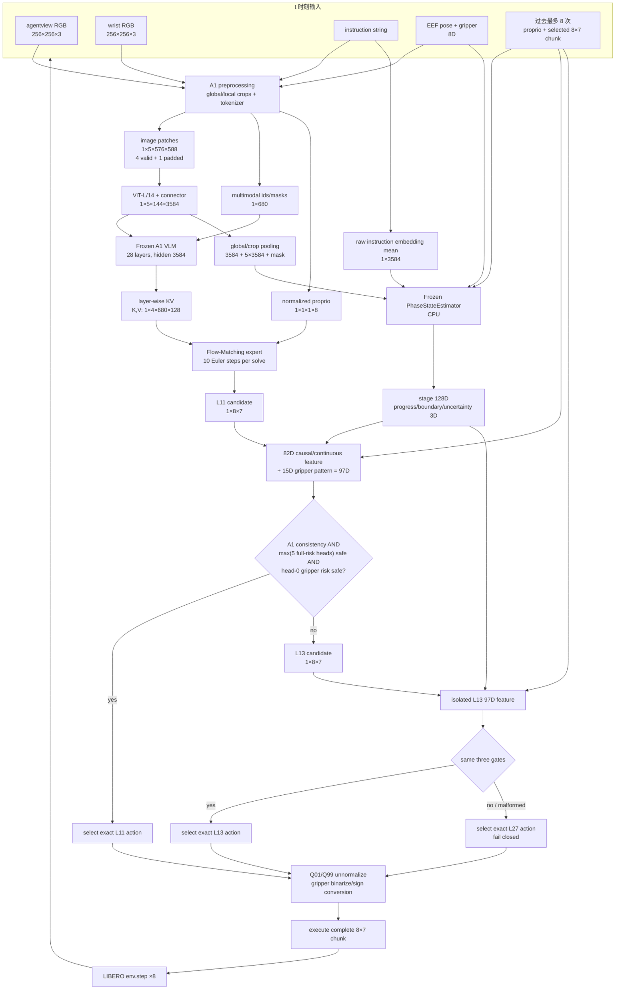
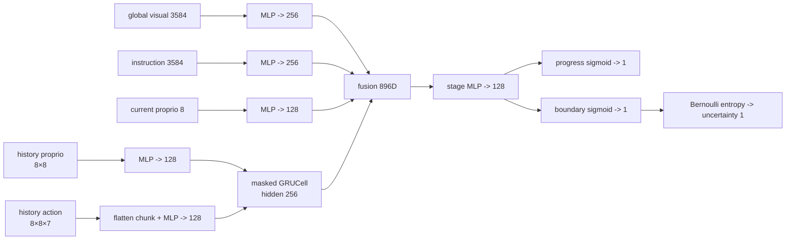

# PhaseRoute-VLA：从输入到输出的完整结构

本文描述当前正式研究方法 PhaseRoute V3 的真实在线路径。固定维度对应
`model/libero_exit` checkpoint、LIBERO-10、Flow-Matching 10-step inference 和
batch size 1；不是上游另一份 `model/libero` 的 600-token / 10×32 简化契约。

## 1. 一张图看完整模型



核心边界：PhaseRoute 不是另一个 action generator。A1 先生成 candidate，router 只选择
哪一层已经生成的 **精确 action tensor** 进入环境。

## 2. 固定符号与维度

| 符号 | 含义 | 正式值 |
|---|---|---:|
| `B` | online batch | 1 |
| `C_cam` | 原始相机 | 2 |
| `C_valid` | 每个相机 1 global + 1 local | 4 |
| `C_pad` | collator 固定 crop 轴 | 5 |
| `P_img` | 每 crop ViT source patches | 576 |
| `M` | 每 crop connector tokens | 144 |
| `S` | padding 后多模态序列 | 680 |
| `D_vlm` | A1 VLM hidden | 3584 |
| `L_vlm` | A1 VLM layers | 28（0–27） |
| `D_fm` | action expert hidden | 1024 |
| `H` | action horizon | 8 |
| `A` | checkpoint 原生 action dimension | 7 |
| `H_hist` | past-only policy-call history | 8 |
| `D_phase` | stage embedding | 128 |
| `D_base` | causal/continuous router feature | 82 |
| `D_grip` | gripper sign/transition feature | 15 |
| `D_route` | 每个 candidate 的 router feature | 97 |

## 3. 输入与 A1 预处理

### 3.1 机器人状态

```text
eef_xyz(3) + quat_to_axis_angle(3) + gripper_qpos(2) = proprio(8)
Q01/Q99 normalization
-> (B,1,1,8)
```

该 checkpoint 原生 proprio 是 8D，不补零到 32D。

### 3.2 图像 crop 与 connector

每个相机产生一个 global resize crop 和一个 local crop：

```text
RGB (256,256,3)
-> crop/resize (336,336,3)
-> patch tensor (576,588)
-> ViT-L/14, take -2/-9 features
-> concatenate (576,2048)
-> 2×2 attention pooling (144,1024)
-> connector (144,3584)
```

双相机得到 4 个有效 crop，collator 输出固定 5-crop axis：

```text
images               (B,5,576,588)
projected_features   (B,5,144,3584)
image_input_idx      (B,5,144)
valid crop counts    [144,144,144,144,0]
```

第 5 crop 全 padding。四个有效 crop 有 576 个 source projected tokens，但两对 crop
复用两个视觉位置区间，只有 288 个 unique visual slots；不能把 5 crop 误写成 5 个
有效相机视图，也不能把 576 source tokens 误写成 576 unique sequence positions。

### 3.3 多模态序列

图像结构 token、instruction/control token 和 padding 组成：

```text
input_ids / attention mask     (B,680)
token hidden                   (B,680,3584)
image_input_idx                (B,5,144)
```

`projected_features` 根据 `image_input_idx` scatter-add 到对应 token hidden；物理长度固定
680，有效长度随 instruction 变化。

## 4. Frozen A1 backbone 与候选动作

主 VLM 为 28 层，query/KV heads 为 28/4、head dim 128。每层产生：

```text
K_i, V_i: (B,4,680,128)
```

Flow-Matching expert 将 proprio 和 noisy action 投影到 hidden 1024：

```text
proprio             (B,1,1,8) -> (B,1,1024)
x_t / time           (B,8,7)   -> (B,8,1024)
expert input                      (B,9,1024)
velocity field                    (B,8,7)
10 Euler updates                  (B,8,7)
```

原 A1 在奇数层 1,3,...,27 都可做候选 FM solve。V3 复用 RP-PEP 的 RNG-preserving
productive schedule：L3 只保留计算/RNG 合同，不允许作为 V3 决策；真正 route layers
是 L11、L13，L27 是 fallback。选中 L11/L13/L27 时解析 FM-call 成本分别为 4/5/7。

## 5. 在线 causal context

一次 policy call 开始时，runtime 先安装 fail-closed placeholder，再收集：

| tensor | shape | 来源 |
|---|---:|---|
| `instruction_summary` | `(B,3584)` | raw task label token embedding mean |
| `vision_crop_summary` | `(B,5,3584)` | 每 crop 有效 projected token mean |
| `vision_crop_mask` | `(B,5)` bool | `image_input_idx>=0` |
| `phase_embedding` | `(B,128)` | phase estimator stage state |
| `phase_scalars` | `(B,3)` | progress, boundary probability, uncertainty |
| `normalized_proprio` | `(B,8)` | 当前状态 |
| `proprio_history` | `(B,8,8)` | 仅过去 policy calls，右对齐 |
| `action_history` | `(B,8,8,7)` | 过去实际选中的 normalized chunks |
| `history_mask` | `(B,8)` bool | 有效历史行 |

task ID、episode ID、call ordinal 只用于顺序校验和 telemetry，不进入 feature。episode
开始时 history 清空；当前 action 只有在 route 结束并被实际选中后才 commit，因此不会
把当前/未来 action 泄漏进“过去历史”。

## 6. Frozen phase estimator

PhaseStateEstimator 全程在 detached CPU tensor 上运行：



它输出 phase 表示，不直接作退出决策。checkpoint file SHA 和 parameter/buffer state SHA
分别校验，避免“文件容器能打开但权重语义已变”。

## 7. 97D candidate feature

每个 layer 只用该层自己的 current candidate 构造 feature；L11 feature 不能看到 L13
或 L27 action，L13 feature 不能看到 L27 action。

### 7.1 82D causal/continuous block

| 分量 | 维度 |
|---|---:|
| progress / boundary / uncertainty | 3 |
| phase embedding mean/std/RMS/max-abs | 4 |
| current proprio | 8 |
| current - previous proprio | 8 |
| previous selected chunk first action | 7 |
| current candidate first action | 7 |
| current first - previous first | 7 |
| current candidate temporal mean | 7 |
| current candidate temporal std | 7 |
| history first-action mean | 7 |
| history first-action std | 7 |
| history fill + candidate/previous RMS scalars | 6 |
| pooled visual mean/std/RMS/inter-crop RMS | 4 |
| **合计** | **82** |

这 82D 是 causal feature，但并非“完全不含 current candidate”：它显式包含 current
candidate 的连续统计。其因果含义是“不用 future、teacher、另一候选层或 outcome”。

### 7.2 15D gripper pattern

```text
sign(candidate[:, gripper])             8D
sign transition between adjacent steps  7D
                                      ------
                                        15D
```

最终：

```text
82D + 15D = feature (B,97)
```

## 8. Five-head risk 与分层路由

每个 frozen head 是带独立 normalizer 的 severity-weighted CPU GLM，对 L11/L13 输出
full-action risk 与 gripper occurrence risk。在线聚合：

```text
full_risk    = max(full_risk_head_0 ... full_risk_head_4)
gripper_risk = gripper_risk_head_0
```

candidate safe 当且仅当三个条件同时成立：

```text
A1 action-consistency gate == true
AND full_risk <= frozen runtime threshold
AND gripper_risk <= frozen gripper threshold
```

优先级固定：

```text
if L11 safe: select exact L11
else if L13 safe: select exact L13
else: select exact L27
```

五头 maximum 是保守 epistemic gate；head range 记录不同 head 的分歧。router 不用
softmax 在三层间直接分类，也不生成新动作。

## 9. Fail-closed 语义

以下任一情况都会否决 L11/L13，并保留 L27：

- router/phase/threshold SHA 不一致；
- payload schema、head 数量、phase geometry 不一致；
- visual/instruction/proprio/history 缺失；
- tensor shape、dtype、finite 检查失败；
- candidate 到达顺序不是 L11→L13→L27；
- episode/call ordinal 不连续；
- router state 在 inference 中发生 mutation；
- callback 或 context preparation 失败。

“fail closed”是计算深度安全回退，不是任务一定成功的证书。

## 10. 动作后处理与下一次调用

```text
selected normalized action        (1,8,7)
-> Q01/Q99 unnormalize            (8,7)
-> gripper normalize/binarize/sign conversion
-> queue executes all 8 actions
-> new RGB/proprio observation
-> selected normalized chunk commits to past-only history
```

7D 顺序为 translation 3、axis-angle rotation 3、gripper 1。该 checkpoint 直接生成
8×7，不存在“从 10×32 截取前 7 维”。

## 11. CPU/GPU 与精度边界

| 路径 | device / dtype |
|---|---|
| A1 ViT/VLM/FM | selected CUDA GPU，checkpoint dtype |
| projected visual capture | GPU → CPU float16 cache boundary → float32 |
| instruction/proprio/history | detached CPU float32 |
| phase estimator | CPU float32，eval，no grad |
| candidate copy for router | detached CPU float32 |
| five GLM heads | CPU float64 |
| selected action sent back | 原 A1 candidate tensor，不用 CPU score 重建 |

D9 的 36.58% 是 normalized FM calls/policy call reduction，未把 CPU router latency
纳入该指标，因此不是 wall-clock 加速结论。

## 12. 代码映射

| 模块 | 输入 | 输出 | 功能 |
|---|---|---|---|
| `affordvla_early_exit.py` | 680-token / 5-crop / 8D proprio | layer KV、visual callback | frozen A1 可截断主干 |
| `value_net.py` | KV、candidate layer、state | A1 delta、candidate 8×7 | RP-PEP candidate solve + V3 adapter hook |
| `phase_estimator.py` | visual/language/proprio/history | 128D stage + 3 scalars | causal phase representation |
| `v3/active_runtime.py` | live callbacks + history | 9-tensor runtime context | CPU context、phase、commit、fail closed |
| `v3/development_collection.py` | context + one candidate | 97D feature | runtime/offline exact feature parity |
| `v3/final_router.py` | 97D + layer | five risk heads | immutable payload loader/predictor |
| `v3/runtime_adapter.py` | candidate sequence | L11/L13/L27 decision | three-gate hierarchical router |
| `eval_libero_early_exit.py` | config/checkpoint/LIBERO | success + telemetry | closed-loop orchestration |
| `v3/release.py` | artifacts/result/backbone | PASS/FAIL JSON | SHA/payload/science-boundary gate |

## 13. 正式调用链

```text
scripts/run_libero_phase_route_v3.sh
├── scripts/validate_phase_route_v3_release.py
├── checkpoint overlay (symlinks; no 34 GB copy)
└── robot_experiments/libero/eval_libero_early_exit.py
    ├── load frozen A1 + RP-PEP-compatible candidate controller
    ├── load_frozen_phase_route_runtime
    └── run_task / run_episode / get_vla_action
        ├── begin_policy_call
        ├── capture_visual_features
        ├── prepare_policy_call
        ├── consider L11 -> consider L13 -> fallback L27
        ├── commit_selected_action
        └── write telemetry/runtime/evaluation summary
```

运行结束后 `validate_phase_route_v3_run.py` 要求 records、policy calls、prepared、
committed 和 L11/L13/L27 计数完全对齐且 error 为 0，才生成 PASS attestation。

## 14. 与历史模块的边界

- RP-PEP：固定 pruning 与 RNG preservation，仍是 V3 candidate-cost compatibility path；
- M4.28 router：保留 `NOT_VIABLE` 负结果，不进入 V3；
- CogVLA：只提供 phase-aware computation inspiration，V3 未融合其 token compression；
- visual aggregation M4/M4.7、legacy phase-depth M3：V3 active run 中明确互斥并关闭。

正式指标、数据消耗和禁止表述见 [发布状态](RELEASE_STATUS_ZH.md)；A1 标准 baseline
的更完整训练推导见 [A1 项目阅读指南](A1_PROJECT_READING_GUIDE_ZH.md)，阅读时必须注意
其开头的 checkpoint 维度勘误。
