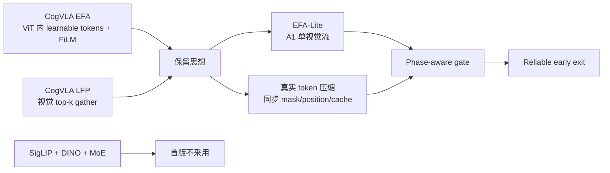

# CogVLA 到 PhaseRoute-A1 的只读参考映射

> 参考仓库：与 A1 工作目录并列的 `NeurIPS25-CogVLA` 只读 checkout  
> 参考提交：`9dc707f53ee6b19b19e06dfbddbf8e4b0aa351e5`  
> 使用规则：只读参考，不修改、不复制整段实现；其未跟踪 `paper/` 目录属于用户数据。

## 1. 代码事实

CogVLA 的视觉聚合并不是“projector 之后做一次 cross-attention”。其 `vit_wrapper_reg.py` 会在 ViT 内追加固定数量的 learnable aggregation tokens（默认 32），让 patch token 和 aggregation token 共同经过 ViT block，最后只返回 aggregation tokens。`film_vit_wrapper.py` 则用任务语言 embedding 的均值，在每个 ViT block 内通过 FiLM 调制视觉特征。

CogVLA 的视觉结构还是 SigLIP + DINOv2 双编码器，随后通过语言条件 MoE 融合；A1 当前只有 OpenAI ViT 单视觉流，因此模块不能原样搬运。

CogVLA 的 LFP 位于 LLM 层内：router 对 token 打分，强制保留 BOS、文本和动作 token，对视觉 token 做 top-k `gather`，只让缩短后的序列通过当前 block，再用 `scatter` 写回完整 hidden state。它使用预先设定的逐层稀疏率 schedule，而不是 A1 的早退阈值。

## 2. 可迁移与不可迁移边界

| CogVLA 思想 | A1 中可采用的抽象 | 不可直接照搬的部分 |
|---|---|---|
| Learnable aggregation tokens | EFA-Lite：少量可学习查询汇聚单视觉流 | SigLIP/DINO 双骨干参数与拼接格式 |
| 语言均值 + FiLM | 用任务语言全局向量调制聚合器/路由器 | monkey-patch timm ViT 的具体实现 |
| LLM 层内 token router | top-k 真正 `gather`，并保护所有非视觉 token | Llama block、HF cache、固定 router schedule 的代码 |
| gather → block → scatter | 作为训练阶段保持完整序列监督的参考 | 直接用于推理加速时仍 scatter 回完整序列的开销假设 |
| 极限压缩稳定性观察 | 阶段边界保护、ReliableExit 和置信度迟滞的研究动机 | 把 CogVLA 的经验阈值当成 A1 的最终阈值 |

## 3. A1 首版设计结论

第一版不引入第二视觉编码器，也不改变 A1 的完整层教师结构。推荐的推进顺序是：

1. 先做 M1 telemetry，获得每次策略调用、每个出口和每个阶段的可追溯记录。
2. 再做阶段估计器与阶段边界保护，但保持视觉序列不变。
3. 然后做 EFA-Lite 的等长正确性版本，验证训练和数值契约。
4. 最后才开启真正的 token 缩短，并统一修改 VLM/FM 的位置和 cache 契约。

## 4. 稳定性提示

CogVLA README 明确说明：当视觉 token 压缩到约原始数量的 1/8 时，随机种子、BF16 数值扰动和阈值附近的 router 波动会更明显。对 PhaseRoute-A1 的直接启示是：

- 阶段切换附近不能仅依赖单帧硬阈值；需要迟滞或连续多步确认。
- 早退置信度必须与 token profile、阶段状态和 FM 初始噪声一起记录。
- 比较 profile 时必须共享随机源，否则会把采样差异误判为压缩误差。
- 最终结论要报告多 seed 均值和方差，不能只报告最优 seed。
