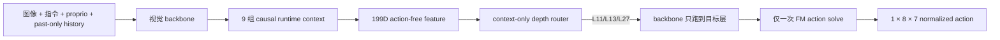

# Route-First 单次 FM：Stage 0 可行性与数据谱系审计

日期：2026-08-25

## 1. 本阶段结论

新的 route-first 路径在模型时序上可实现，但**现有冻结 D8 router 不能直接复用**。
D8 的 97D 输入包含当前候选动作及其 gripper 符号/跳变，并且在线 gate 还依赖
候选动作与比较动作之间的 action consistency。把这些字段删掉后继续使用 D8 权重，
会改变输入语义，不属于等价优化。

当前仓库保留的 release artifact 也不含足以重新训练 context-only router 的逐调用
训练矩阵。因此正确顺序是：先用冻结 V3 只读采集新的 context-only 蒸馏数据，再训练、
校准，最后接入独立的单次 FM 控制器。现阶段不声称已经得到有效的新 router。

## 2. 原 V3 与目标路径

```mermaid
flowchart LR
    O[图像 + 指令 + proprio + past-only history] --> V[视觉 backbone]
    V --> C[9 组 causal runtime context]
    C --> B11[backbone 到 L11]
    B11 --> F11[FM solve 候选动作]
    F11 --> G11[97D D8 gate]
    G11 -->|否决| B13[backbone 到 L13]
    B13 --> F13[FM solve 候选动作]
    F13 --> G13[97D D8 gate]
    G13 -->|否决| B27[backbone 到 L27]
    B27 --> F27[FM solve fallback]
```

当前 V3 还会支付 RP-PEP comparison/reference solve，所以实测不是每层一个 FM：
task 0/state 0 平均为 6.77 FM calls/policy call。

目标路径如下：

目标不只是减少 FM 计数，还要让 policy wall time 相对 original A1 和现有 V3 真正下降。

## 3. 时序审计

`AffordVLAEarlyExit.forward` 的真实顺序是：

1. token embedding 和 proprio embedding；
2. vision backbone 产生 `[B,5,144,3584]` projected features；
3. visual feature callback；
4. phase/context prepare callback；
5. decoder 从 layer 0 开始；
6. 到选定层后 FM action head 输出 `[B,8,7]`。

所以 route decision 可以在 decoder layer 0 前完成。context-only router 本身应在 CPU 上运行，
异常、缺字段、非有限值或 checkpoint 不匹配时统一 fail-closed 到 L27；即使回退到 L27，
FM action head 也只运行一次。

## 4. 现有 97D 为什么不是 action-free

冻结 97D feature 由 82D base、8 个 gripper sign 和 7 个 gripper transition 拼接而成。
82D base 内仍包括：

- 当前候选动作第一步 7D；
- 当前候选动作与上一 action chunk 的 7D 差；
- 当前候选动作 8 步均值和标准差，各 7D；
- 当前候选动作的 temporal RMS、整体 RMS、相对历史 RMS。

在线 gate 还需要由候选动作 comparison 得到的 `action_consistency`。因此冻结权重回答的是
“**已生成的这个候选动作是否足够接近 L27 teacher**”，而不是“**生成动作之前应该跑到
哪一层**”。两者是不同的学习问题。

## 5. 新 199D action-free feature

| 特征组 | 维度 | 数据时间边界 |
|---|---:|---|
| phase embedding | 128 | 当前观察 + 过去历史 |
| phase scalars | 3 | progress / boundary / uncertainty |
| normalized proprio | 8 | 当前 |
| proprio delta | 8 | 当前减最近过去 |
| previous first action | 7 | 最近已提交 action chunk |
| history first-action mean/std | 14 | 最多过去 8 次调用 |
| history scalars | 3 | fill、上一 chunk RMS、历史 temporal RMS |
| global vision stats | 4 | 当前图像，FM 之前 |
| instruction stats | 4 | 当前任务指令，FM 之前 |
| per-crop vision stats | 15 | 5 crop × 3 statistics |
| crop mask | 5 | 当前图像有效 crop |
| **总计** | **199** | 无 candidate action、无未来信息 |

task ID、episode ID、call ordinal 和 seed 仅写入数据行作为分组/审计 metadata，不进入
199D model input。

## 6. 新数据谱系

本项目不使用 D9 state 40–49 训练、选模型或调阈值。新的工程数据建议固定为：

| 用途 | LIBERO-10 initial states | 允许操作 |
|---|---|---|
| 训练 | 0–7 | 拟合参数 |
| 校准 | 8–9 | 冻结 L11/L13 安全阈值 |
| 工程留出 | 10–11 | 一次性离线选择门与闭环 smoke |
| D9 历史独立测试 | 40–49 | 禁止用于新方法训练/选择 |

每次冻结 V3 policy call 采集：`199D feature + V3 selected layer + episode/call metadata`。
采集 overlay 先调用原 adapter，再复制输入；采集异常不会参与 route decision。发布 NPZ 前要求：

- 行数等于 V3 完成的 policy calls；
- 无采集 error；
- feature 全部有限且严格为 `[N,199]`；
- teacher layer 只能是 11、13、27；
- 文件使用 exclusive-create，不覆盖旧结果。

## 7. 历史负结果如何影响新设计

M4.25–M4.28 曾探索基于 L11/L13 hidden state 的 route-then-solve。其 1,314 条 sealed
样本中有 4 次错误浅退，分布在 3 个 episode group，因此当时正确地禁止了闭环接入。
这说明仅追求分类 accuracy 或 shallow coverage 不够。新 router 至少应采用：

- 按 episode/task 分组划分，禁止同轨迹泄漏；
- ordinal safety：预测层比 teacher 浅视为主要错误；
- L11、L13 分别校准，不用一个三分类 argmax 直接控制；
- 校准集上的 one-sided false-shallow 上界和最小 support gate；
- 不确定或分布外输入回退 L27；
- 先通过离线 gate，再允许小规模闭环。

## 8. 本阶段新增但尚未声称完成的内容

- `route_first_features.py`：199D action-free feature 合同；
- `route_first_collection.py`：冻结 V3 的 observation-only teacher overlay；
- `run_phase_route_v3.py --route-first-teacher-output ...`：可选采集入口；
- 对应单元测试和 exclusive-create NPZ 审计。

下一阶段应先在一条普通 engineering episode 上做采集 smoke，确认行数、label 分布、
控制动作和原 V3 一致；通过后再并行采集 states 0–9。不要在没有训练数据时用随机权重或
手写阈值假装 route-first 已经有效。
