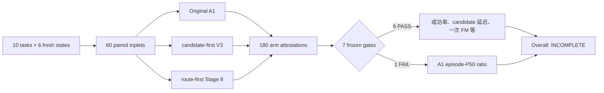

# Route-first Stage 10：fresh-state 三臂主动验证结果

## 1. 结论

Stage 10 已完成全部 `60` 个 triplet、`180` 个闭环 active rollout 和正式一次性聚合。
冻结聚合器给出的状态为：

```text
INCOMPLETE_ROUTE_FIRST_STAGE10_FRESH_ACTIVE_CONFIRMATION
```

这里的 `INCOMPLETE` **不是数据缺失**：60 个 triplet 和 180 个 arm 的证据全部完整，
SHA、配对身份和 route-first exactly-one-FM 审计也全部通过。它表示 7 个预注册 gate
中有 1 个没有达到门槛，因此不能宣称“Stage 10 全门槛确认通过”。

主要结果如下：

| 方法 | 成功数 | 成功率 | policy calls | pooled mean | pooled P50 | pooled P90 | pooled P95 |
|---|---:|---:|---:|---:|---:|---:|---:|
| Original A1 | 56 / 60 | 93.33% | 2,060 | 1,557.61 ms | **848.76 ms** | 2,686.85 ms | 2,743.59 ms |
| candidate-first V3 | 57 / 60 | 95.00% | 2,025 | 1,546.38 ms | 1,600.36 ms | 1,760.12 ms | 1,856.74 ms |
| **route-first Stage 8** | **58 / 60** | **96.67%** | 1,957 | **916.90 ms** | 903.20 ms | **1,043.67 ms** | **1,198.28 ms** |

因此本轮得到的是一个有价值但不全面的正结果：

- route-first 的 raw success 最高，比 candidate 多 1 个、比 Original A1 多 2 个；
- 相对 candidate，配对 episode-P50 比值中位数为 `0.5622`，通过 `≤0.80` 门槛；
- 相对 Original A1，route-first 的 pooled mean、P90、P95 分别降低约
  `41.13%`、`61.16%`、`56.32%`；
- route-first 的每个有效 policy call 都由原始 runtime event 证明恰好执行一次 FM；
- 但相对 Original A1 的配对 episode-P50 比值中位数为 `1.0795`，没有达到
  `≤0.90` 门槛。

不能把该结果写成“全面优于 A1”，但可以据实写成：**在 fresh-state active control 上，
route-first 保持了更高的描述性成功率，并显著改善 candidate-first 延迟和相对 A1 的
均值/尾延迟；代价是没有赢得 Original A1 的中位延迟门槛。**

## 2. 冻结实验设计



每个 triplet 的三臂严格共享：

- task 与 fresh MuJoCo state；
- state SHA-256 与 policy seed；
- 冻结 arm order；
- 同一物理 GPU UUID；
- 同一源代码提交与 A1 checkpoint。

冻结身份为：

| 项目 | 值 |
|---|---|
| source commit | `4f13573a542b278d5fd8708be41cd9096ad49be1` |
| protocol SHA-256 | `62f5be1524676cd2db045de32964ff3206a455d5fd8e8b29eb10e134521bc604` |
| schedule SHA-256 | `c2c41259c5db1b79d6f2da68ec77c200d829670fb7cd17b4abc19f63a37f43d4` |
| runner readiness SHA-256 | `a4cd7726a03be9705fe8410ca1df92657dac281cfc1180c3e3edb661552b95d7` |
| raw aggregate SHA-256 | `e436b4014b20ca10b73fa8f9a328bc101a881a4e14c376c47ac54509b8c30524` |

三种方法第一次动作后可能产生不同轨迹。因此 success、policy calls、environment steps 和
rollout wall time 都来自真实闭环分叉，不是共享 observation 的离线重放。

## 3. 成功结果

### 3.1 每个 task

下表顺序为 Original A1 / candidate-first V3 / route-first Stage 8：

| task | A1 | candidate | route-first |
|---:|---:|---:|---:|
| 0 | 6 | 6 | 6 |
| 1 | 6 | 5 | 6 |
| 2 | 6 | 6 | 6 |
| 3 | 6 | 6 | 6 |
| 4 | 6 | 6 | 6 |
| 5 | 5 | 5 | 5 |
| 6 | 6 | 6 | 6 |
| 7 | 6 | 6 | 6 |
| 8 | 5 | 5 | 6 |
| 9 | 4 | 6 | 5 |
| **合计** | **56** | **57** | **58** |

配对 discordance 为：

- route 成功、candidate 失败：2；route 失败、candidate 成功：1；
- route 成功、A1 失败：2；route 失败、A1 成功：0。

描述性 exact McNemar 双侧 p 值分别为 `1.0` 和 `0.5`。样本量和 discordant pair 太少，
这些差异**不构成统计显著优越性**；成功率只作为工程 guardrail 和描述性结果报告。

### 3.2 arm order

route-first 在 position 1/2/3 的成功数分别为 `20/20`、`19/20`、`19/20`；没有看到明显
的执行顺序崩溃。candidate 为 `20/20`、`19/20`、`18/20`，Original A1 为
`18/20`、`19/20`、`19/20`。该分层同样只作描述性报告。

## 4. 延迟结果

### 4.1 相对 candidate-first

route-first 相对 candidate-first 的 pooled 延迟变化为：

| 指标 | route-first 降幅 |
|---|---:|
| mean | 40.71% |
| P50 | 43.56% |
| P90 | 40.70% |
| P95 | 35.46% |

预注册主指标不是 pooled P50，而是先在每个 triplet 内计算 episode-P50 ratio，再取 60 个
ratio 的中位数。该值为 `0.5621576802`，明显通过 `≤0.80` 门槛。这直接支持
“先路由、后生成一次动作”优于 candidate-first 多候选动作路径的核心工程假设。

### 4.2 相对 Original A1

route-first 与 Original A1 呈现明显的分布权衡：

| 指标 | Original A1 | route-first | route-first 变化 |
|---|---:|---:|---:|
| mean | 1,557.61 ms | 916.90 ms | **降低 41.13%** |
| P50 | **848.76 ms** | 903.20 ms | **增加 6.41%** |
| P90 | 2,686.85 ms | **1,043.67 ms** | **降低 61.16%** |
| P95 | 2,743.59 ms | **1,198.28 ms** | **降低 56.32%** |
| max | 3,966.89 ms | **2,469.73 ms** | 降低 37.74% |

预注册配对 episode-P50 ratio 中位数为 `1.0795221559`，要求 `≤0.90`，因此该 gate
失败。不能用 pooled mean 和尾延迟的改善覆盖这个预先冻结的失败。

这组看似矛盾的结果来源于延迟分布：Original A1 有大量便宜的 L11 调用，也有较昂贵的
深层调用，因此中位数较低、均值和尾部很高；route-first 更频繁路由到 L27，但只生成
一次最终动作，所以分布更集中、尾部更短，却没有击败 A1 的中位点。

### 4.3 rollout wall time

三臂总 rollout wall time 为：

| 方法 | 秒 |
|---|---:|
| Original A1 | 5,552.86 |
| candidate-first V3 | 5,413.90 |
| route-first Stage 8 | 3,991.99 |

route-first 描述性减少 `26.26%`（vs candidate）和 `28.11%`（vs A1）。但三臂闭环轨迹、
环境步数和 policy calls 不完全相同，因此该总量不能单独证明纯系统级 speedup。

## 5. 路由与计算结构

| 方法 | L11 | L13 | L27 |
|---|---:|---:|---:|
| Original A1 | 1,227（59.56%） | 0 | 833（40.44%） |
| candidate-first V3 | 74（3.65%） | 224（11.06%） | 1,727（85.28%） |
| route-first Stage 8 | — | 229（11.70%） | 1,728（88.30%） |

route-first 并不是通过减少 checkpoint 参数量实现静态轻量化。它的变化发生在运行路径：

```text
199D action-free context
        ↓
calibrated router 先选 L13 / L27
        ↓
只计算被选层对应的一次最终动作
        ↓
每个有效 policy call 恰好一次 FM
```

正式证据中 route-first 有 `1,957` 个有效 policy call，原始 runtime events 审计得到
`1,957` 个 exactly-one-FM call，二者一一对应。这里不使用旧 telemetry 顶层计数替代
runtime event 审计。

当前 L13 覆盖仅为 `11.70%`，L27 占 `88.30%`。这解释了为什么 route-first 能删除
candidate-first 的多候选开销，却仍难以击败经常在 L11 结束的 Original A1 中位延迟。

## 6. 预注册 gate

| gate | 要求 | 实际 | 结果 |
|---|---:|---:|---|
| 完整 triplet | 60 | 60 | PASS |
| 完整 active rollout | 180 | 180 | PASS |
| route success vs candidate | `route ≥ candidate - 6` | 58 vs 57 | PASS |
| route success vs A1 | `route ≥ A1 - 6` | 58 vs 56 | PASS |
| route/candidate episode-P50 ratio | median ≤0.80 | 0.5622 | PASS |
| route/A1 episode-P50 ratio | median ≤0.90 | 1.0795 | **FAIL** |
| route exactly-one-FM | 全部有效调用 | 1,957 / 1,957 | PASS |

总状态由全部 gate 的逻辑与决定，因此结果必须保持 `INCOMPLETE`，不能在看过数据后把
mean、P90 或 P95 改成新的主门槛来宣布 PASS。

## 7. 基础设施事件与证据处理

共享服务器运行期间共保留 5 份 fail-closed `abort.json`：

- task 5 / replicate 3：一次 postflight 外部进程污染、一次 preflight 外部占用；
- task 7 / replicate 3：一次 postflight 外部进程污染；
- task 8 / replicate 1：一次 postflight 外部进程污染；
- task 9 / replicate 3：一次 postflight 外部进程污染。

这些都发生在模型结果之外的基础设施门禁，未进入正式 aggregate；重试保持相同 tuple、
state、seed、arm order、GPU UUID 和代码提交，没有 outcome-based retry。

另有 task 6 / replicate 1 的短时 GPU 重叠发生在 preflight 与 postflight 两个端点之间，
冻结 runner 的端点检查没有自动捕获。发现后采取了更保守的处理：

1. 原始三臂全部成功，但整个目录按原 SHA 原样移入 quarantine；
2. 记录外部进程 PID、GPU UUID、运行时间窗和原 triplet/arm SHA；
3. 在同一 GPU 0 UUID、相同 state/seed/order/commit 上干净重跑；
4. 只有干净重跑的 triplet 进入正式 aggregate。

原 triplet SHA 为
`8ffd1622a4eea1f3253354f29c5d9b506bc38f40335fdf636be1f5e174f7fed7`，干净重跑 SHA 为
`2889d6b3c345199a299fe3e4bc1b9e0b0c717b0056e008e660c9655d379fb698`。
没有删除或覆盖不利结果。

## 8. Artifact 与验证

| artifact | SHA-256 |
|---|---|
| raw aggregate | `e436b4014b20ca10b73fa8f9a328bc101a881a4e14c376c47ac54509b8c30524` |
| published compact result | `1818d96e4de096cb5913f8bc0ce20f656fb72cb724795362314a609d5aac915b` |

自动验证结果：

- aggregate sidecar：PASS；
- Stage 10 定向测试：`20 passed, 1 warning`；
- 全仓回归：`580 passed, 22 subtests passed, 3 warnings`；
- 测试失败：0。

## 9. 科学解释与下一阶段

Stage 10 足以支持“方法有效且有突出指标”的初步判断：成功率没有下降，candidate-first
延迟显著改善，相对 A1 的 mean/P90/P95 也明显更好。它还不足以支持“全面优于 A1”或
“顶会结论已经成立”，因为 A1 配对中位延迟门槛失败，成功差异也没有统计显著性。

后续不能在这 60 个 Stage 10 fresh states 上继续调 threshold 或训练 router。建议把它们
永久冻结为最终测试证据，并在独立开发数据上进入 Stage 11：

1. 分解 route context、VLM 到 L13/L27、FM 和环境交互的逐段延迟；
2. 解释 L27 占 88.30% 的原因，寻找提高**安全 L13 覆盖**而不降低成功率的方法；
3. 优化深层路径固定开销，目标是保留尾延迟优势并补上 A1 median 缺口；
4. 在新数据上训练/校准后，另行预注册新的 fresh-state confirmation；
5. 再扩展到其他 LIBERO suite 或真实机器人，避免把 LIBERO-10 结果外推。

Stage 10 的失败 gate 必须保留，它正好给出了下一轮研究最明确的优化目标。
