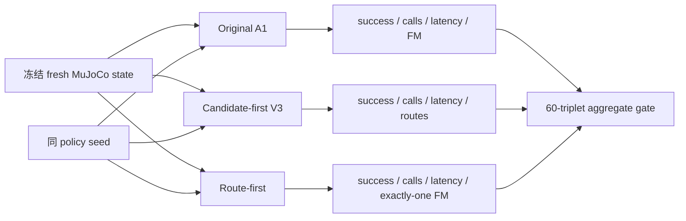
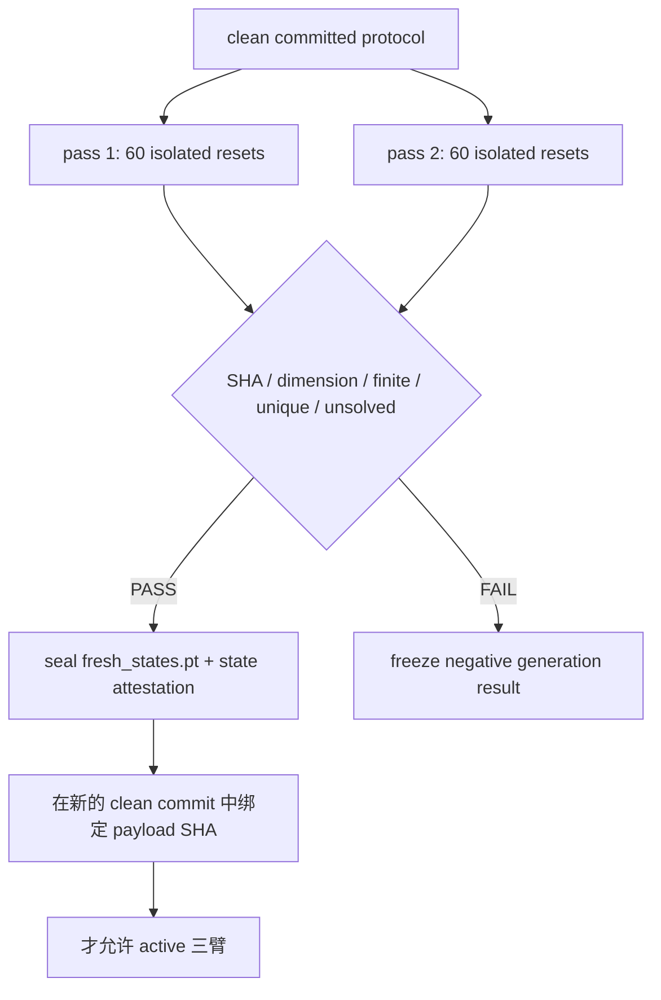

# Route-first Stage 10：fresh-state 三臂 active confirmation 预注册

## 1. 当前状态

本阶段只完成协议、schedule 与状态生成基础设施冻结，当前状态为：

```text
FROZEN_INFRASTRUCTURE_NOT_VALIDATED
FRESH_STATES_NOT_GENERATED
ACTIVE_ROLLOUTS_NOT_STARTED
```

Stage 9 state13 十任务 pilot 已通过，因而只解锁 fresh-state confirmation。这个授权不允许
重开 historical D9 states 40--49，也不允许把已分析的 V3-D8 generated states 或 V3-D10
预留 states 当作新样本。

| 冻结对象 | SHA-256 |
|---|---|
| `configs/route_first_stage10_fresh_schedule.json` | `c2c41259c5db1b79d6f2da68ec77c200d829670fb7cd17b4abc19f63a37f43d4` |
| `configs/route_first_stage10_fresh_confirmation_protocol.json` | `62f5be1524676cd2db045de32964ff3206a455d5fd8e8b29eb10e134521bc604` |
| Stage 9 正式结果 | `0979f04e8f7c3352b2bbea8540a2562925546233d03905c6d579d077795d1d8c` |

## 2. 为什么必须生成第三套状态

LIBERO-10 每个 task 只有 50 个 official fixed init states，0--49 已全部进入历史、开发、
校准或 D9 test 角色。V3-D8 的 200 个 reset-sampler states 已经完成 shadow 分析；D10
协议另行预留的 seed 只服务消融 shadow confirmation。复用任一集合都会削弱本阶段的
前瞻性。

因此 Stage 10 从独立 seed 流生成 60 个新状态：

```text
10 tasks × 6 replicates = 60 fresh triplets
3 active arms / triplet = 180 rollouts

state seed  = 71260829 + task_id × 10000 + replicate_id
policy seed = 81260829 + task_id × 10000 + replicate_id
```

这些状态来自 LIBERO reset sampler，不具有 official episode identity；结果不能外推成
“官方 50-state benchmark 的新 episode”。

## 3. 三臂与问题分解

| 方法 | 路由发生在何时 | 作用 |
|---|---|---|
| Original A1 | 生成相邻候选动作后按 action delta 提前退出 | 原始开源方法基线 |
| Candidate-first V3 | 生成 L11/L13 candidate 后做五头风险 gate | route-first 的直接 teacher |
| Route-first Stage 8 | 用 199D action-free context 先选 L13/L27，再生成一次动作 | 待确认方法 |

三臂共享 A1 checkpoint、task、fresh state、policy seed 和同一物理 GPU UUID。首次动作后，
三种 controller 可能产生不同动作，后续闭环轨迹自然分叉；这种分叉必须保留，不能再用
共享 observation 的离线重放替代 active control。



## 4. 全排列顺序平衡

每个 task 的 6 个 replicate 使用三臂全部 6 种排列：

| replicate | arm 1 | arm 2 | arm 3 |
|---:|---|---|---|
| 0 | A1 | Candidate | Route |
| 1 | A1 | Route | Candidate |
| 2 | Candidate | A1 | Route |
| 3 | Candidate | Route | A1 |
| 4 | Route | A1 | Candidate |
| 5 | Route | Candidate | A1 |

所以每种方法在每个顺序位置恰好出现两次，降低模型 warm-up 和固定执行顺序造成的偏差。

## 5. 状态生成门禁

每个 task×replicate 在独立 CPU 进程中执行：

1. 在构造环境前设置 Python、NumPy、Torch 与环境 seed；
2. 构造无 renderer 的 `ControlEnv`，只执行一次显式 reset；
3. 检查初始任务未解决；
4. 捕获一维、有限、little-endian float64 MuJoCo state；
5. 第二个独立进程按同 seed 重复，要求 state SHA byte-identical。

同 task 的 6 个 state SHA 必须唯一。任何 duplicate、nonfinite、already-solved 或两遍不一致
都会冻结为 generation negative result；不能换 seed 补位。生成阶段不加载 A1、router 或
phase estimator，不查询 GPU，也不采样策略动作。



## 6. 预注册确认门槛

所有 60 个 triplet、180 个 rollout 完整后一次性计算，所有条件必须同时通过：

| 门槛 | PASS 条件 |
|---|---|
| 证据完整性 | 60 triplets / 180 arms，全部 runtime 与 attestation 完整 |
| 对 Candidate 成功保护 | route successes `>= candidate successes - 6` |
| 对 Original A1 成功保护 | route successes `>= A1 successes - 6` |
| Candidate 配对延迟 | 60 个 triplet 内 `route P50 / candidate P50` 的中位数 `<= 0.80` |
| A1 配对延迟 | 60 个 triplet 内 `route P50 / A1 P50` 的中位数 `<= 0.90` |
| 计算完整性 | route-first 每个有效 policy call 恰好一次 FM |

延迟先在每个 episode 内计算 policy-call P50，再计算同一 triplet 的方法比值，避免长失败
episode 因 calls 更多而在主指标中被过度加权；pooled latency 仍作为 secondary endpoint 完整
报告。成功差异与 exact McNemar 结果会报告，但不作为“统计显著优越性”门槛。

6 episodes 即 10 percentage points 的 success guardrail 是工程 margin，不是经过 power analysis
的正式非劣效性界值。

## 7. 失败、缺失与重试

- 有效 rollout 失败必须保留，不得补跑替换；
- 不允许 interim gate、optional stopping 或看结果后减少/增加 replicate；
- 基础设施重试必须保持 task、replicate、state payload、policy seed、arm order、GPU UUID
  和 code commit 全部不变；
- 任一 arm 缺失时全局结果只能是 `INCOMPLETE`，不能跳过该 triplet；
- 打开 fresh states 后禁止移动 L13 threshold、重训 router 或改三臂实现。

## 8. 当前授权边界与下一动作

本文件和配置本身只授权 CPU contract tests。只有在代码测试、compile、shell 语法、D9
保护 SHA 和 clean commit 全部通过后，才授权生成 60 个 fresh states。两遍 state payload
必须先封存并把 SHA 写入新的 clean commit，之后才能启动 180 个 active rollouts。

即使最终 PASS，也只说明 route-first 在 LIBERO-10 reset-sampler fresh states 上通过了预注册
的成功保护、配对延迟和 FM 完整性门。它不授权真实机器人部署、跨 suite 泛化、统计显著
优越性或系统级形式化加速声明。
