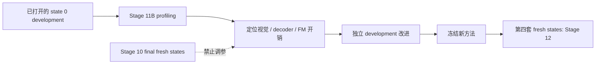

# Route-first Stage 11B：独立开发态 CUDA 分段计时协议

## 1. 目标与状态

Stage 11A 已证明 route-first 的总体中位延迟缺口主要来自 L13/L27 路径覆盖比例，但
Stage 10 的旧埋点无法把视觉骨干、VLM decoder 和 selected-action flow matching 分开。
Stage 11B 的唯一目标是补齐这个测量缺口：

```text
输入预处理
  ↓
vision backbone CUDA
  ↓
decoder block 0 ... selected layer CUDA
  ↓
exactly one selected-action FM CUDA
  ↓
action chunk
```

当前协议状态为：

```text
FROZEN_DEVELOPMENT_PROFILE_NOT_RUN
```

本阶段不是模型改进、阈值选择或加速确认实验。所有计时只写入旁路 JSONL，不会成为 router
输入，也不会改变 action、随机数、controller 或 checkpoint。

## 2. 为什么使用 official state 0

Stage 10 的 60 个 fresh states 已永久冻结为最终确认测试，禁止再用它们做诊断驱动的模型
选择。Stage 11B 使用 LIBERO-10 每个 task 的 official state 0；这些状态早已用于 Stage 1--5
teacher/development 工作，因此其角色明确是 development，而不是新的测试样本。



## 3. 冻结运行日程

先运行一个 task 0/state 0 smoke；全部计时结构和 runtime gate 通过后，再运行四个固定分片：

| shard | task IDs | state |
|---|---|---:|
| shard0 | 0, 4, 8 | 0 |
| shard1 | 1, 5, 9 | 0 |
| shard2 | 2, 6 | 0 |
| shard3 | 3, 7 | 0 |

四个分片合起来恰好覆盖 task 0--9，没有 outcome-based 补跑。seed 固定为：

```text
91260830 + task_id × 10000 + episode_index
```

smoke 的 task 0 不进入 full aggregate；full shard 中的 task 0 按正式分片重新运行。

## 4. 不修改受保护实现

下面三个历史文件继续要求 SHA 完全一致：

| 文件 | SHA-256 |
|---|---|
| `a1/vla/value_net.py` | `ec3a860427f32d5837e279eb17eeb28befaee9dd7944d46482173c85e8847dc1` |
| `robot_experiments/libero/exit_vla_utils.py` | `e5c88b72199c1354fc7b3f2fa22e056b593ee5cdadf7185cc7d1c09fe768051a` |
| `robot_experiments/libero/eval_libero_early_exit.py` | `a4e3b1b49cdaf2021b3cd370d8a1e89c927906e7cbd5f8afdccd5ceb5b1826cd` |

Stage 11B 在模型加载后只包裹 live Python object 的方法，运行结束后不写回 checkpoint。每次
policy call 必须观测到：

- 一个完整 `model.predict_actions` span；
- 一个 vision backbone span；
- `selected_layer + 1` 个连续 decoder block span；
- 一个 selected-action FM span；
- 完整 CUDA event，且分项 CUDA 和不应超过 model CUDA（允许 1 ms event 误差）。

## 5. GPU 污染门禁

runner 在初始化 CUDA 前要求目标 UUID 没有 compute process，并从模型加载前开始每秒采样
一次 `nvidia-smi`。任何外部 PID、采样错误或 runtime/measurement 缺失都会把该 shard 标成
`INVALID`，不能进入 aggregate。这样避免 Stage 10 曾出现过的“只检查 preflight/postflight
端点而漏掉中途短时重叠”。

## 6. 结果边界

Stage 11B 可以回答：当前 route-first 调用中，vision、执行到目标层的 decoder、唯一 FM
分别占多少 CUDA 时间；L13 与 L27 的深度差来自哪里。

它不能单独回答：

- 新阈值是多少；
- 成功率是否优于 A1；
- 去掉探针后的生产 wall-clock 加速是多少；
- 方法是否能泛化到其他 suite 或真实机器人。

CUDA events 与 Python wrapper 本身有 profiling overhead，因此结果用于归因和优化排序，不
作为最终部署延迟数字。任何基于诊断的修改都必须在 development 数据上完成，并由新的
fresh-state Stage 12 验证。
