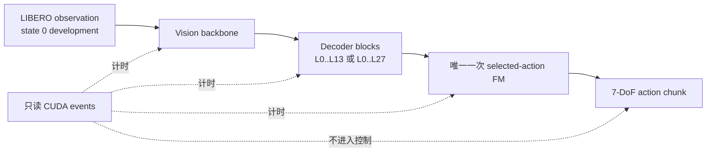

# Route-first Stage 11B：CUDA 分段计时正式结果

## 1. 结论先行

Stage 11B 已完成冻结的 LIBERO-10 task 0--9、official state 0 开发态诊断。四个
正式 shard 全部通过来源、runtime、单次 FM、CUDA 分解和 GPU 污染门禁：

- 10/10 个固定 episode 完成，描述性成功 9/10；唯一失败是 task 6；
- 370/370 个 policy call 有完整有效的 CUDA 分段记录；
- 每个 policy call 恰好执行一次 authoritative flow matching；
- 322 次 GPU 进程采样均未发现外部 PID 或查询错误；
- 36 次调用选择 L13，334 次选择 L27，L13 覆盖率只有 **9.73%**；
- 相对全部执行 28 个 decoder block，实际 block 数减少 **4.86%**；
- L13 组 decoder CUDA P50 为 212.59 ms，L27 组为 456.13 ms；
- L13 组完整 model CUDA P50 为 503.21 ms，L27 组为 883.21 ms。

最重要的诊断不是“L13 没有用”，而是：**L13 单次调用确实明显更便宜，但当前冻结路由器
很少安全选择 L13，因此总 decoder 工作量只降低约 4.86%，不足以解决 Stage 10 的 A1
中位延迟门槛。**

机器可读结果：

- [`route_first_stage11b_profile_aggregate.json`](../../../results/route_first/route_first_stage11b_profile_aggregate.json)
- [`route_first_stage11b_profile_aggregate.json.sha256`](../../../results/route_first/route_first_stage11b_profile_aggregate.json.sha256)

## 2. 数据边界与执行流程

Stage 11B 只使用 Stage 1--5 已经打开过的 official state 0，不读取 Stage 10 的 60 个
fresh test states 来选择阈值，也不训练或修改 router。

正式分片为：

| shard | task | 物理 GPU | GPU 采样数 | 污染 |
|---|---|---:|---:|---|
| shard0 | 0, 4, 8 | 0 | 97 | 无 |
| shard1 | 1, 5, 9 | 1 | 83 | 无 |
| shard2 | 2, 6 | 2 | 80 | 无 |
| shard3 | 3, 7 | 3 | 62 | 无 |

四个分片均绑定同一 profile 源提交 `4b12f3c87764ec881d257dd3cdd0cce47c4145e3`、
同一 33.84 GB checkpoint SHA-256
`dcafd9ee8a3d3a4ced8840e59c90b0c4b20d41a7900adc9ff469c1a57e631b7f`。

三个受保护 A1 文件继续保持冻结 SHA：

| 文件 | SHA-256 |
|---|---|
| `a1/vla/value_net.py` | `ec3a860427f32d5837e279eb17eeb28befaee9dd7944d46482173c85e8847dc1` |
| `robot_experiments/libero/exit_vla_utils.py` | `e5c88b72199c1354fc7b3f2fa22e056b593ee5cdadf7185cc7d1c09fe768051a` |
| `robot_experiments/libero/eval_libero_early_exit.py` | `a4e3b1b49cdaf2021b3cd370d8a1e89c927906e7cbd5f8afdccd5ceb5b1826cd` |

## 3. 每个 task 的结果

| task | 成功 | policy calls | L13 | L27 | L13 占比 |
|---:|:---:|---:|---:|---:|---:|
| 0 | 是 | 36 | 3 | 33 | 8.33% |
| 1 | 是 | 31 | 7 | 24 | 22.58% |
| 2 | 是 | 31 | 4 | 27 | 12.90% |
| 3 | 是 | 27 | 8 | 19 | 29.63% |
| 4 | 是 | 32 | 2 | 30 | 6.25% |
| 5 | 是 | 21 | 0 | 21 | 0.00% |
| 6 | 否 | 65 | 6 | 59 | 9.23% |
| 7 | 是 | 31 | 1 | 30 | 3.23% |
| 8 | 是 | 52 | 0 | 52 | 0.00% |
| 9 | 是 | 44 | 5 | 39 | 11.36% |
| **合计** | **9/10** | **370** | **36** | **334** | **9.73%** |

task 6 的失败被原样保留，没有补跑。Stage 11B 没有同 state 的 original-A1 对照臂，因而
不能把该失败归因于提前退出；9/10 也只能作为执行健康度描述，不能作为成功率提升结论。

## 4. CUDA 时间分解

### 4.1 全部 370 次调用

| 部分 | mean / ms | P50 / ms | 占 model CUDA 总和 |
|---|---:|---:|---:|
| vision backbone | 94.35 | 94.30 | 10.47% |
| executed decoder blocks | 432.48 | 453.79 | 47.99% |
| selected-action FM | 267.00 | 271.32 | 29.63% |
| model 内其他 CUDA | 107.36 | 46.93 | 11.91% |
| **完整 model predict CUDA** | **901.18** | **878.15** | **100.00%** |
| model 外 host/wrapper | 95.27 | 67.39 | 不属于 model CUDA |
| 完整 policy wall | 996.44 | 961.80 | 含 profiling 开销 |

decoder 是当前最大的可优化部分，但 vision、FM 和其他 CUDA 合计仍占约 52%。因此即使
decoder 深度降低一半，端到端延迟也不会自动降低一半。

### 4.2 按选定层分组

| 指标 P50 / ms | L13（36 calls） | L27（334 calls） | L13 / L27 |
|---|---:|---:|---:|
| vision backbone | 93.43 | 94.35 | 99.0% |
| decoder blocks | 212.59 | 456.13 | **46.6%** |
| selected-action FM | 140.23 | 272.50 | 51.5% |
| model 内其他 CUDA | 50.22 | 46.72 | 107.5% |
| **完整 model predict CUDA** | **503.21** | **883.21** | **57.0%** |
| 完整 policy wall | 595.54 | 967.38 | 61.6% |

L13 decoder P50 比 L27 低 53.4%，符合只执行 14/28 个 block 的结构预期；vision 在两组
基本不变，也说明视觉编码是固定成本。

但 L13/L27 并非随机分组：它们来自不同 observation、不同轨迹时刻，且四个 shard 并行
profiling。尤其 FM 在两组也出现较大差异，证明不能把完整 model 的全部差值都因果归于
decoder 深度。本表只能用于瓶颈排序，不能代替同输入、同噪声的配对速度实验。

## 5. 为什么 Stage 10 的中位延迟仍未超过 A1

Stage 10 已观察到 route-first 对 candidate-first 的延迟门槛通过，但 route-first/A1 中位
延迟比为 1.0795，未达到不高于 0.90 的冻结目标。Stage 11B 给出了结构性解释：

1. 当前只有 9.73% 的调用走 L13，90.27% 仍走完整 L27；
2. 按实际 block 数计算，相对全 L27 只减少 504/10360，即 4.86%；
3. decoder 虽是最大单项，也只占 model CUDA 总时间约 47.99%；
4. vision 和单次 FM 是每个调用都必须支付的固定成本；
5. route/phase/wrapper 的 host 开销仍存在，Stage 11B 中位约 67.39 ms。

所以当前问题不是“提前退出分支本身没有节省计算”，而是“安全早退覆盖不足，加上固定
成本占比不低”。这也解释了为什么直接放宽阈值很危险：它可能提高 L13 覆盖，却把更多
不可靠动作送入闭环，损害成功率。

## 6. 失败与异常记录

正式运行前保留了两次 fail-closed smoke：

1. attempt 01：Stage 10 私有 runner 的副作用把 `CUDA_VISIBLE_DEVICES` 改为 `-1`；模型、
   环境和 state 均未打开；
2. attempt 02：用户级 `~/.libero/config.yaml` 仍指向已删除的旧 `A1/source`；模型已加载，
   但环境/state 未打开，policy call 为 0；
3. 修复后 smoke 在 task 0/state 0 通过：36 calls、成功、36/36 compute records 有效。

修复分别改为在 Stage 11B runner 内本地构造冻结 controller，并强制绑定仓库内
`.cache/libero/config.yaml` 的 SHA。两次失败目录均保留在本机
`runs/route_first_stage11b_profile/`，未伪装成成功结果。

## 7. 自动验证

- Stage 11B 聚合 dry-run：PASS；
- 聚合器与相关计时测试：`14 passed`；
- 正式维护测试树：`598 passed, 22 subtests passed, 3 warnings`；
- Python compile：PASS；
- `git diff --check`：PASS；
- 受保护文件 SHA：PASS。

直接执行仓库根 `pytest` 会额外收集上游遗留可执行样例
`a1/data/vla/test_dataloader.py`：未设 `DATA_DIR` 时在 import 阶段退出；设置后又因样例
使用当前 `DataConfig` 已不接受的 `rlds_dataset_name` 报错。该文件不属于维护中的
`tests/` gate，本阶段未修改它，也未把这两次环境/遗留失败隐藏为测试通过。

## 8. 下一阶段

下一阶段应在独立开发数据上做 Stage 11C，而不是回看 Stage 10 fresh states 调参：

1. 对 task 0/4/5/8 等低 L13 覆盖任务分解 router confidence、phase、hard veto 和
   L13--L27 action disagreement；
2. 比较三类候选：更好的开发态校准、task-aware conservative margin、降低 L27 固定开销；
3. 先冻结 success/reliability guardrail，再选择方案，禁止只追求 L13 比例；
4. 用同输入/同噪声的开发态 replay 验证动作一致性和真实无探针延迟；
5. 只有实现、阈值和 gate 全部冻结后，才生成第四套 fresh states 进入 Stage 12。

Stage 11B 不授权部署，也不改变 Stage 10 已失败的 A1 中位延迟 gate。
