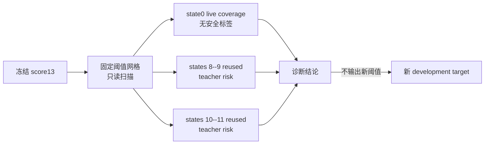

# Route-first Stage 11C：L13 覆盖上限与阈值路线诊断

## 1. 正式结论

Stage 11C 的冻结诊断状态为：

```text
THRESHOLD_ONLY_NOT_VIABLE_NEW_DEVELOPMENT_TARGET_REQUIRED
```

这不是说 route-first 方法无效，而是说：**仅把当前 affine score13 的 scalar threshold
调低，无法同时获得足够的 L13 覆盖和可靠性。** 当前 router 的训练目标是模仿一个本身
很保守的 V3 teacher layer；calibration 与 holdout 上 teacher-safe-L13 的 group-equal
比例分别只有 15.58% 和 15.22%。在这些历史分布上，即使分类器完美模仿 teacher，覆盖
上限也只有约 15%。

机器结果：

- [`route_first_stage11c_coverage_diagnosis.json`](../../../results/route_first/route_first_stage11c_coverage_diagnosis.json)
- [`route_first_stage11c_coverage_diagnosis.json.sha256`](../../../results/route_first/route_first_stage11c_coverage_diagnosis.json.sha256)

## 2. 为什么要单独做 Stage 11C

Stage 11B 已证明 L13 decoder 路径本身明显更便宜，但 370 calls 中只有 36 次走 L13，
decoder block 总数只减少 4.86%。一个直接想法是降低 `threshold13=0.917426...`。

Stage 11C 在任何 runtime 修改之前回答两个问题：

1. 降阈值能把 live 开发态覆盖提高多少？
2. 在已有 teacher label 的历史 calibration/holdout 上，风险会增加多少？



本阶段未读取 Stage 10 fresh policy score，未打开新 environment state，未训练 router，
也没有输出可部署阈值。

## 3. 访问披露与声明边界

协议是在 Stage 11B 之后设计的。冻结前人工初查已经看到：state 0 覆盖约 9.7%、阈值
0.8 时覆盖约 13.8%、历史 holdout 风险明显增加。因此 Stage 11C 被明确标记为
post-hoc development diagnosis，而不是新的无偏 confirmation。

历史 states 8--9 与 10--11 都是复用数据，只能解释原因，不能再次充当校准/留出证明。

## 4. Live score 分布

state 0 的 370 个 score13 高度两极化：

| 分位数 | score13 |
|---|---:|
| P25 | 0.000000084 |
| P50 | 0.000402 |
| P75 | 0.164039 |
| P90 | 0.915013 |
| P95 | 0.986776 |
| P99 | 0.999077 |

冻结阈值附近的样本并不多。十个 task 合计只有 6 个 L27 调用位于阈值下方 0.02 范围，
task 4 和 9 的最高未选分数甚至只有 0.6674 和 0.4810。多数 L27 不是“稍微差一点”，
而是 score 接近 0；小幅调阈值不可能把它们变为 L13。

## 5. 固定阈值扫描

下表全部是描述性 counterfactual；没有一个阈值被选为新配置。

| score13 阈值 | state0 live L13 覆盖 | holdout teacher false-safe | holdout 90% upper |
|---:|---:|---:|---:|
| 0.5000 | 18.65% | 33.49% | 38.94% |
| 0.7000 | 16.76% | 25.03% | 30.73% |
| 0.8000 | 13.78% | 18.05% | 23.67% |
| 0.8500 | 12.43% | 12.73% | 18.19% |
| 0.9000 | 11.35% | 8.24% | 13.50% |
| **0.917426（冻结值）** | **9.73%** | **6.65%** | **11.79%** |
| 0.9500 | 8.38% | 5.28% | 10.56% |
| 0.9700 | 6.49% | 4.15% | 9.58% |
| 0.9900 | 4.86% | 4.94% | 11.31% |

阈值从 0.917 降到 0.8，只增加约 4.05 个百分点 live 覆盖；holdout 经验 false-safe
却从 6.65% 增至 18.05%。阈值降到 0.5 也只有 18.65% live 覆盖，而 false-safe 已达
33.49%。

更高阈值也不能彻底解决重叠：holdout unsafe 样本的最大 score13 为 `0.999499`，
calibration unsafe 最大为 `0.999943`。这表示存在少量“高置信误安全”，单一 scalar
threshold 无法把 safe/unsafe 完全分开。

## 6. Teacher-imitation 的结构性上限

| 数据 | rows | teacher-safe-L13 raw | group-equal ceiling |
|---|---:|---:|---:|
| calibration states 8--9 | 666 | 14.26% | 15.58% |
| holdout states 10--11 | 681 | 14.39% | 15.22% |

当前 route-first 标签是 `teacher_layer <= 13`。这保证了方法忠实模仿经过审计的 V3
teacher，但也把 teacher 的保守性原样继承到新 router。增加模型容量可以改善排序，却
不能突破标签中只有约 15% positive 的基本事实；盲目降低阈值则是在主动接受更多
teacher-L27 样本，而不是发现新的可靠 L13。

这同时解释了和 original A1 的覆盖差异：Stage 10 中 A1 有 59.56% 调用停在 L11，
route-first 只有 11.70% 调用走 L13。两者使用的退出依据和可靠性目标不同，不能指望
仅靠移动当前 teacher-imitation 阈值追平 A1 覆盖。

## 7. 下一轮真正值得验证的假设

### 7.1 主路线：直接动作可靠性 teacher

在新的 development observations 上，用相同输入和受控噪声分别产生 L13 与 L27 action，
直接构造：

- 整段 `[8,7]` action discrepancy；
- translation、rotation 和 gripper 分量的不可补偿风险；
- trajectory phase/boundary 条件下的可靠性；
- 多噪声或多头 disagreement 上界。

训练时可以使用这些 action-aware counterfactual label，但 runtime router 仍只接收
action-free causal context，在进入 FM 前选择深度，最后仍只执行一次 FM。这样既保持
route-first 的真实计算优势，又不再把旧 V3 teacher 的低早退率当成不可突破的标签上限。

### 7.2 次路线：降低固定深层开销

Stage 11B 显示 L27 的 decoder 和 selected-action FM 都是大项。可独立研究 kernel、缓存、
精度和 batch/shape 固定等实现优化，但必须证明动作 parity；不能把 profiling 数字直接
写成无探针 speedup。

### 7.3 明确拒绝的路线

不能把本次阈值曲线中看起来较快的某一点直接写回 runtime，更不能直接进入 Stage 12。
下一步必须先冻结新 development 数据、counterfactual label、模型选择与 safety gate。

## 8. 验证结果

- Stage 11C 定向测试：`12 passed`；
- 完整维护测试树：`602 passed, 22 subtests passed, 3 warnings`；
- 输入 SHA、固定 task 网格与 370 runtime records：PASS；
- 六项诊断规则：6/6 true；
- 输出新阈值：`null`；
- runtime change authorized：`false`。

Stage 11C 不改变 Stage 10 和 Stage 11B 的任何结论，也不授权部署。
