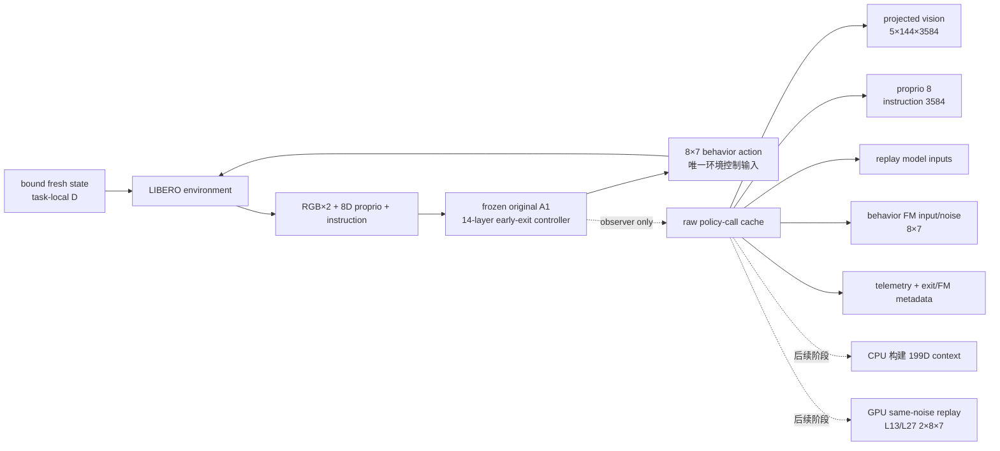

# Route-first Stage 11D：Original-A1 observation-only 采集入口

## 1. 本阶段结论

本阶段完成了 original-A1 development collection 的代码和静态 readiness，但没有启动
GPU、没有加载 A1 模型、没有打开 LIBERO 环境，也没有生成任何 rollout。

```text
PASS_ROUTE_FIRST_STAGE11D_COLLECTION_RUNNER_READINESS
```

这不是模型效果结果，只证明下一阶段的采集入口、数据边界和失败策略已经固定。

## 2. 为什么只采集 development 120 states

Stage 11D 共封存 200 个 generated-state clusters，但当前只允许：

| split | replicate/task | clusters | 当前状态 |
|---|---:|---:|---|
| development train | 0--11 | 120 | collector 已实现，尚未执行 |
| calibration | 12--15 | 40 | 禁止 rollout |
| shadow confirmation | 16--19 | 40 | 禁止 rollout |

loader 虽然先认证完整 frozen payload，但只向 evaluator 返回每个 task 恰好 12 个 development
state；suite 若收到 13 个或 20 个会直接拒绝。这样 `run_task()` 的 episode index 只能落在
0--11，不能因参数错误越界到 calibration/shadow。

## 3. 从状态到 raw observation cache



raw cache 中出现 original A1 自己生成的 behavior action 和 trace 是正常的：它们用于保持
past-only history、验证 observer 对齐并为离线重放提供同一 noise。它们不会作为当前 199D
router 输入。L13/L27 counterfactual action 本阶段也不会计算。

## 4. 关键不变量

- 行为策略只有 frozen original A1，候选层为 `1,3,...,27`；
- `phase_route_v3_enabled=false`、`phase_depth_runtime=None`；
- 静态/学习式视觉压缩都关闭，避免改变 A1 行为分布；
- 120 个 cluster 的 policy seed 固定为
  `94260830 + task_id × 10000 + replicate_id`；
- telemetry key 与 observation-cache key 必须逐 call 相同；
- checkpoint、threshold、dataset statistics 和 action-delta 均绑定 SHA；
- behavior success 只作描述，不参与重跑、状态替换或模型标签；
- task worker 失败后保留 `.incomplete`，launcher 不自动 retry。

## 5. 三层运行门禁

```text
CPU preflight
  -> 验证 protocol/state binding/120-state schedule/输出为空
GPU preflight
  -> 验证单卡 UUID、实时空闲显存，仍不加载模型或环境
model-load smoke
  -> 验证 33.8 GB A1 与 14 层 controller，仍不 rollout
formal launch
  -> 10 tasks × 12 development states
```

launcher 不固定使用某几张卡，而是实时检查物理 GPU 0--7，只选择显存占用不超过 500 MiB、
利用率不超过 5%、空闲显存至少 40,000 MiB 的卡。每个 worker 再次核对 UUID 和空闲显存，
降低检查后 GPU 被其他任务抢占的风险。

worker 优先继承 launcher 进程的 `HF_HOME`；若调用者未设置，则使用仓库同级的
`hf_cache`，代码中不绑定任何用户或服务器的绝对路径。

## 6. 静态验证结果

- development schedule：120/120，task-local replicate 为 0--11；
- A1 `model.pt`：33,841,175,207 bytes；
- A1 SHA-256：
  `dcafd9ee8a3d3a4ced8840e59c90b0c4b20d41a7900adc9ff469c1a57e631b7f`；
- state payload SHA-256：
  `2de72279a8dc60f7853ad698b2d710e6a73c83a625b26ed70e74e0d7d76856db`；
- state binding SHA-256：
  `0f1ffcf23310dbb782986cdf93cac8439054f249f36b8dc8118919f479f0434d`；
- readiness SHA-256：
  `5bf998318b72b84664ee5de437b1e6d4d4154dd02add6cd714043a61d16a798c`；
- 五个受保护的 A1/observer 源文件均未修改；
- 当前 collection output 与 launch log 均不存在。

机器可读 readiness：
[`route_first_stage11d_collection_runner_readiness.json`](../../../results/route_first/route_first_stage11d_collection_runner_readiness.json)。

## 7. 当前授权边界

readiness 只允许在本实现形成 clean commit 后运行 CPU/live-GPU preflight，并在下一阶段由
original A1 采集 120 个 development trajectories。它不授权 L13/L27 replay、199D 模型
训练、calibration、shadow confirmation 或新方法 active control。
