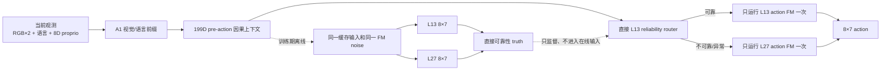

# Route-first Stage 11D：action-free 直接可靠性学习协议

## 1. 本阶段先解决什么问题

Stage 11C 已排除“继续降低旧 score13 阈值”这条路线。旧 route-first 学的是 V3 最终
选择层，而 V3 teacher 在历史 calibration/holdout 上本来只有约 15% 的 safe-L13
标签；继续调阈值只会迅速增加 false-safe，无法从根本上提高覆盖。

Stage 11D 改变的是**监督目标**，不是先改阈值：



核心假设是：**动作生成前的视觉、语言、phase、proprio 与历史动作上下文，能够判断当前
状态是否只需 L13 即可得到与 L27 一致的动作。** 这和旧方法模仿 V3 的保守选择层不同。

## 2. 哪些是创新，哪些不是

本阶段真正新增的研究点是：

1. 在 flow matching 之前，用 action-free 199D causal context 预测直接的 L13 动作
   可靠性；
2. 训练时可使用 counterfactual action label，在线却不生成候选动作再判断；
3. 路由后只执行一个深度、一次 FM，保留 route-first 的真实计算收益；
4. 用 L27 fail closed，且把 gripper 符号不一致作为不可补偿风险单独约束。

以下内容不作为新创新宣称：

- L13/L27 same-noise replay 已在 V3 D7--D9 成熟使用；
- L27 只是 consistency reference，不是 expert；
- 199D feature builder 已由旧 route-first 路径建立；
- frozen A1 backbone、phase estimator 和 LIBERO evaluator 均为既有基础设施。

因此更准确的方法描述是：**在既有 A1 与 same-noise 基础设施上，提出 pre-FM
action-free direct reliability routing。**

## 3. 输入、标签和输出

### 3.1 在线输入

在线 feature 固定为 `[B,199]`，由以下 past/current-only 信息组成：

| 特征组 | 维度 |
|---|---:|
| phase embedding | 128 |
| progress / boundary / uncertainty | 3 |
| 当前 normalized proprio | 8 |
| proprio delta | 8 |
| 上一 chunk 首动作 | 7 |
| 历史首动作均值 / 标准差 | 7 + 7 |
| 历史长度、动作 RMS、时间变化 | 3 |
| 全局视觉统计 | 4 |
| instruction 统计 | 4 |
| 5 crops 的统计 | 15 |
| crop mask | 5 |
| **合计** | **199** |

明确禁止当前 L13/L27 action、teacher layer、task/replicate ID、success 和未来信息进入
feature。

### 3.2 离线标签

每个真实 policy call 使用同一个缓存 FM 输入分别重放 L13、L27，得到
`[N,2,8,7]`。定义：

```text
d_full = mean_t(1 - cosine(a13[t,0:7], a27[t,0:7]))
full_unsafe = d_full > 0.00390625
gripper_unsafe = any_t((a13[t,6] >= 0) XOR (a27[t,6] >= 0))
safe13 = NOT(full_unsafe OR gripper_unsafe)
```

这些 action 只构造监督标签，不进入 199D 在线输入。

### 3.3 在线输出

router 输出 L13 reliability score，经独立 calibration 后只产生两个合法决定：

- `L13`：运行 L13 action head 一次并执行 `[8,7]` action chunk；
- `L27`：运行 L27 action head 一次并执行 `[8,7]` action chunk。

当前不开发 L11。任何 shape、非有限值、artifact hash、上下文或 uncertainty 异常都回退
L27。

## 4. 为什么不直接开始大规模实验

历史 D8 的汇总结果显示 L13 的 direct joint-safe 比例约为：

```text
(7140 - 2876) / 7140 = 59.72%
```

这只说明正标签支持显著高于旧 teacher-selected L13 的约 15%，**并不说明 199D 能预测
它**。此外 primary truth 使用每个 call 的单个缓存 noise，而在线 router 看不到 noise，
因此存在不可约随机性风险。

所以 Stage 11D 先设 feasibility gate：在新的 development clusters 上进行 grouped OOF，
至少满足 ROC-AUC 0.65、AP lift 1.1，并且 30% coverage 的 false-safe 不超过 10%。失败
就记录负结果并停止，不打开 calibration，更不做 active rollout。只有可预测性成立，才继续
校准和 shadow confirmation。

## 5. 新数据划分

本阶段生成全新的 reset-sampler states，行为策略固定为 original A1，router 不控制环境。

| split | replicate/task | clusters |
|---|---:|---:|
| development train | 12 | 120 |
| calibration | 4 | 40 |
| shadow confirmation | 4 | 40 |
| **合计** | **20** | **200** |

三部分按 generated-state cluster 隔离。状态 seed base 为 `93260830`，policy seed base 为
`94260830`。official states 0--49、V3-D8 states、Stage 10 的 60 个 fresh states 均禁止
复用。

另外提前保留但当前禁止打开：

- development active pilot：10 task × 2 states；
- Stage 12 independent confirmation：10 task × 6 states。

## 6. 严格停止规则

以下任意一项发生，都不能用“多跑几次”掩盖：

1. protocol/artifact hash 漂移：中止；
2. state、identity、split 重叠：整个阶段中止；
3. shape 或非有限值：对应 partition 中止；
4. grouped OOF feasibility gate 失败：冻结负结果，不开 calibration；
5. calibration 找不到同时满足覆盖和风险约束的阈值：不打开 shadow；
6. shadow gate 失败：不进入 active pilot；
7. 不允许根据 success 替换 state、seed 或重跑有效失败。

## 7. 当前授权边界

当前提交只允许：协议验证、CPU synthetic target test，以及编写但不执行后续 runner。
它不授权生成新状态、GPU 采集、训练或 active control。下一阶段将在完整测试和 readiness
通过后，先实现并审计 state generation / original-A1 collection / same-noise replay runner，
之后才单独决定是否启动 200-state 正式采集。

## 8. 本阶段验证结果

- protocol SHA-256：
  `16a5b8a4adb268c99fec38741484cdde4ccfeab1e3079f11b79f1f4334b00e00`；
- 200 个 cluster key、state seed、policy seed 均唯一，state/policy seed 交集为 0；
- 新增定向测试：11/11 PASS；
- protocol 阶段测试口径：`613 passed, 22 subtests passed`；
- protected A1 文件未修改；
- CUDA、LIBERO simulator、training、active control 均未启动。

机器可读 readiness：
[`route_first_stage11d_protocol_readiness.json`](../../../results/route_first/route_first_stage11d_protocol_readiness.json)，
其 SHA-256 见同目录 sidecar。

## 9. State runner 执行与封存边界

Stage 11D 的第一个执行层已在 source commit
`4e0b83bf38790abecb45c630b6b800db0960886a` 上执行并一次通过：

```text
200 scheduled records
  × 2 isolated CPU processes
  × exactly one env.reset()
  -> canonical little-endian FP64 state bytes
  -> pass-1/pass-2 SHA exact match
  -> task-local 20/20 unique-state check
  -> frozen fresh_states.pt + state_attestation.json
```

runner 由三个相互分离的入口组成：单状态 worker、400-process orchestration、two-pass
aggregation。worker 不调用 official `get_task_init_states()`，不加载 `model.pt`，并强制
`CUDA_VISIBLE_DEVICES=-1` 与 OSMesa。有效失败、initially-solved state、重复 state、
非有限值、pass mismatch 或 output 已存在都会 fail closed；不允许替换 seed。

两遍共 400 个隔离进程全部完成，200/200 state bytes 完全一致，每个 task 的 20 个状态
全部唯一，initially-solved 为 0。全过程未加载 checkpoint、未采样 policy action、未读取
official states 0--49 或历史 generated-state payload，也没有查询或初始化 GPU。

原始 `fresh_states.pt`、逐进程记录与本地 attestation 保存在 Git 忽略的 `runs/`；tracked
result 与 immutable binding 固定其路径、SHA、字节数、记录数、source commit、protocol
和 runner readiness。下游必须同时验证 tracked binding、local attestation 与 payload，
任何一处漂移都 fail closed。这里仍刻意没有同时实现 original-A1 collection；binding 只
授权其 observation-only runner 实现和 CPU contract tests，不授权 collection 执行、
same-noise replay、训练或 active control。

State runner 新增 11 项定向测试；加入这些测试后的完整维护测试树为
`624 passed, 22 subtests passed`。静态 readiness 同时要求：400 个隔离进程的 schedule
可完整展开、runner 中只有一个显式 reset、state 输出尚不存在、三个 runner 均禁用
CUDA，且 protected A1 文件不属于 runner 输入。

机器可读 state-runner readiness：
[`route_first_stage11d_state_runner_readiness.json`](../../../results/route_first/route_first_stage11d_state_runner_readiness.json)，
SHA-256 为
`c4b5f421179706dfdaea4d68eaf10bf8813eb99f116f4b73d452c95281c995f0`。

正式生成与封存结果见
[`ROUTE_FIRST_STAGE11D_FRESH_STATE_RESULT_ZH.md`](ROUTE_FIRST_STAGE11D_FRESH_STATE_RESULT_ZH.md)。

## 10. Original-A1 observation-only collector

下一执行层已实现但尚未启动。它只向 LIBERO suite 暴露每个 task 的 replicate 0--11，
合计 120 个 development states；replicate 12--15 calibration 与 16--19 shadow 不会进入
rollout schedule。环境动作仍由冻结 original A1 的 14 个候选层 controller 产生，新 router、
phase routing 和视觉压缩均不加载。

每个 policy call 的 observer 保存 replay 所需的 projected visual prefix、instruction、
proprio、past behavior action、model-input tensors 和原 behavior FM input/noise。observer
异常不能改变 action，但 postflight 要求 observation cache、telemetry 和 exit/FM metadata
逐 call 对齐且 error 为 0，否则整个 task 保留为 `.incomplete`。

readiness 已完整哈希 33.8 GB A1 checkpoint，并绑定五个保护源文件、关键 sidecar、runner、
120-cluster schedule 与 state payload。它只授权在 clean commit 和 live GPU preflight 后执行
original-A1 development collection；same-noise replay、训练、calibration、shadow 和 active
control 仍为 false。实现与门禁见
[`ROUTE_FIRST_STAGE11D_COLLECTION_RUNNER_ZH.md`](ROUTE_FIRST_STAGE11D_COLLECTION_RUNNER_ZH.md)。
