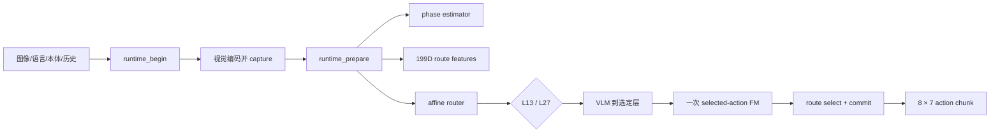

# Route-first Stage 11A：Stage 10 延迟根因诊断

## 1. 结论

Stage 11A 已对 Stage 10 的全部原始计时证据完成只读、事后诊断：

```text
60 triplets
180 active arms
6,042 policy calls
600 SHA-bound evidence files
```

诊断状态为：

```text
COMPLETE_POSTHOC_DIAGNOSTIC_NOT_A_CONFIRMATION
```

Stage 10 相对 Original A1 的中位延迟门槛失败，主要原因不是 route-first 的 L13 或 L27
单路径比 A1 的对应浅/深路径更慢，而是两种方法的**路径混合比例不同**：

| 方法 | 浅路径 | 深路径 |
|---|---:|---:|
| Original A1 | L11：1,227 / 2,060（59.56%） | L27：833 / 2,060（40.44%） |
| route-first | L13：229 / 1,957（11.70%） | L27：1,728 / 1,957（88.30%） |

按实际选层分组后，route-first 的两条路径都更快：

| 路径 | policy wall P50 | 对照路径 | policy wall P50 | 描述性比值 |
|---|---:|---|---:|---:|
| route L13 | **573.70 ms** | A1 L11 | 766.29 ms | **0.7487** |
| route L27 | **907.02 ms** | A1 L27 | 2,626.05 ms | **0.3454** |

因此 Stage 10 的总体 P50 出现如下现象：A1 的多数调用落在便宜的 L11，整体中位数为
848.76 ms；route-first 虽然删除了重复 candidate FM，但 88.30% 调用走 L27，整体中位数为
903.20 ms。route-first 仍显著改善 A1 的均值和尾延迟，因为它的 L27 路径只生成一次最终
动作，而 A1 深层路径会逐层生成候选动作。

这个结果把下一阶段问题从“系统是不是没有跑通”缩小为：**如何在独立开发数据上提高安全
L13 覆盖，或降低深层路径固定成本，同时保持 Stage 10 已观察到的成功率和尾延迟优势。**

## 2. 证据与审计

分析器逐项验证了：

1. Stage 10 aggregate 绑定的 60 个 `triplet_record.json` SHA；
2. 每个 triplet 绑定的三臂 attestation SHA；
3. attestation inventory 中的 `result.json`、`policy_telemetry.jsonl` 和
   `stage1_measurement.jsonl` SHA；
4. measurement 与 telemetry 的 episode、step、task 和 policy-call 顺序；
5. measurement 没有进入控制输入、没有修改 D9 保护源、动作有限且无记录错误；
6. route-first 每条有效调用都有恰好一个 `route_first_selected_action` 权威 FM event。

| 绑定对象 | SHA-256 |
|---|---|
| Stage 10 raw aggregate | `e436b4014b20ca10b73fa8f9a328bc101a881a4e14c376c47ac54509b8c30524` |
| Stage 11 evidence manifest | `9d2715d4fa6729674aca37ed2641d0f322f408f2207a8ac18eeb5e4f0e778952` |
| Stage 11 machine result | `3b5cca452ac06ddfe3c71d23e85c47e54b427ff3e0e8cfe4d979faacea7b1ff1` |

特别需要区分两种 FM 口径。route-first 顶层 telemetry 的 `fm_calls=3` 是同一次 FM 在
`route_first_selected_action`、`phase_route_decision` 和 `exit_candidate` 三个事件中的重复
引用，不能解释为执行三次。权威 runtime event 审计仍是 `1,957 / 1,957` 次调用恰好一次
FM。Stage 11 分别保存“telemetry event field sum”和“authoritative FM execution count”，
避免混淆。

## 3. 从输入到动作的计时层级



现有外部埋点的层级不是互相独立的：`runtime_prepare` **包含** phase estimator、route
feature 构造和 router，因此不能把 `runtime_prepare + phase_estimator + router` 相加。
Stage 11 只把下面五项不重叠的顶层调用相加：

```text
runtime_begin
+ visual_capture
+ runtime_prepare
+ selected_action_route
+ runtime_commit
= instrumented route overlay
```

route-first 全部 1,957 个调用的 P50 分解如下：

| 项目 | P50 |
|---|---:|
| instrumented route overlay | 108.15 ms |
| overlay / policy wall 比例 | 12.06% |
| visual capture | 86.99 ms |
| runtime prepare（包含下列项） | 18.53 ms |
| └ phase estimator | 6.86 ms |
| └ affine router predict | **0.20 ms** |
| └ pooling / feature / validation 等其余 prepare | 10.92 ms |
| runtime begin | 0.45 ms |
| selected-action route | 0.21 ms |
| runtime commit | 0.17 ms |
| 未进一步拆开的 policy residual | 791.76 ms |

这个 residual 包含图像预处理和视觉骨干、VLM 到选定层、一次 selected-action FM、动作转换
及未埋点 wrapper。Stage 10 没有 VLM 与 FM 各自的独立 CUDA event，因此不能从这些数据
中伪造二者的单独延迟结论。Stage 11B 若需要继续拆分，必须增加仅测量、不参与控制的新
埋点，并在独立开发运行中采集。

## 4. 三种方法按选层分组

| 方法/层 | calls | wall mean | wall P50 | 权威 FM/call |
|---|---:|---:|---:|---:|
| Original A1 L11 | 1,227 | 814.46 ms | 766.29 ms | 7.0 |
| Original A1 L27 | 833 | 2,652.26 ms | 2,626.05 ms | 15.0 |
| candidate-first L11 | 74 | 855.02 ms | 702.52 ms | 4.0 |
| candidate-first L13 | 224 | 1,004.09 ms | 860.78 ms | 5.0 |
| candidate-first L27 | 1,727 | 1,646.34 ms | 1,611.82 ms | 7.0 |
| **route-first L13** | **229** | **715.66 ms** | **573.70 ms** | **1.0** |
| **route-first L27** | **1,728** | **943.57 ms** | **907.02 ms** | **1.0** |

这些分层是描述性结果，并非随机分配到层的因果实验。不同 controller 的第一次动作后轨迹
会分叉；“L13 比 L11 快”不能被解释成同一 observation 上的严格因果处理效应。不过该结果
足以否定一个简单猜测：Stage 10 的中位数失败并不是因为 route-first 的每条执行路径都慢。

## 5. 路由覆盖的任务差异

| task | route calls | L13 calls | L13 share |
|---:|---:|---:|---:|
| 0 | 218 | 10 | 4.59% |
| 1 | 187 | 39 | 20.86% |
| 2 | 189 | 28 | 14.81% |
| 3 | 160 | 52 | **32.50%** |
| 4 | 175 | 7 | **4.00%** |
| 5 | 177 | 12 | 6.78% |
| 6 | 161 | 12 | 7.45% |
| 7 | 186 | 20 | 10.75% |
| 8 | 285 | 19 | 6.67% |
| 9 | 219 | 30 | 13.70% |

L13 覆盖在 task 间从 4.00% 到 32.50% 波动，说明统一阈值/旧校准分布可能对部分任务过于
保守。但这里不能直接在 Stage 10 上移动阈值：这些 60 个 fresh states 已经是最终测试
证据，基于它们选择新 threshold 会产生测试集泄漏。

## 6. 冷启动与执行顺序

每个 episode 首个 policy call 的 P50：A1 1,743.95 ms、candidate 1,591.12 ms、route
1,197.00 ms。去掉首个调用后，三者 steady-call P50 分别为 837.90、1,600.36、902.61 ms。
冷启动不是 route 相对 A1 中位数缺口的唯一原因。

三种方法按 arm position 的 P50 如下：

| 方法 | position 1 | position 2 | position 3 |
|---|---:|---:|---:|
| Original A1 | 842.53 | 830.03 | 868.92 |
| candidate-first | 1,592.93 | 1,608.63 | 1,598.04 |
| route-first | 907.41 | 910.91 | 893.55 |

全排列平衡后没有出现足以解释主结果的单一 arm-position 崩溃；这些仍是描述性分层，不是
新的 gate。

## 7. 下一阶段

Stage 11A 不修改模型，也不授权任何 Stage 10 事后调参。下一步应使用**独立开发数据**：

1. 增加 VLM prefill/decoder 与 selected-action FM 的独立 CUDA event，完成 Stage 11B；
2. 在历史训练/校准 shard 或新生成 development states 上分析 task 4/0/5 等低 L13 覆盖；
3. 比较三条不泄漏的改进路线：更好的校准、task-aware conservative margin、降低 L27 固定
   开销；
4. 用 development success guardrail 选择方案，不查看或重跑 Stage 10 threshold counterfactual；
5. 冻结新实现和 gate 后，再生成第四套 fresh states 做 Stage 12 confirmation。

机器结果由
[`analyze_route_first_stage11_latency.py`](../../../scripts/analyze_route_first_stage11_latency.py)
生成，完整 JSON 位于
[`route_first_stage11_latency_diagnosis.json`](../../../results/route_first/route_first_stage11_latency_diagnosis.json)。
