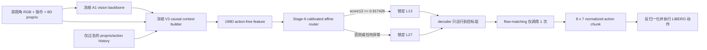
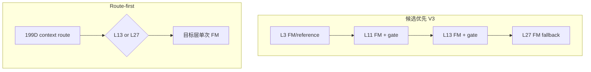

# Route-first Stage 8：旁路式 active runtime 集成结果

## 1. 本阶段结论

Stage 8 已完成 route-first 的**工程实现与离线验证**，状态为：

`PASS_ROUTE_FIRST_RUNTIME_INTEGRATION_OFFLINE_ONLY`

已经实现的运行契约是：

- 在任何候选动作和 flow-matching 之前，用 199 维 action-free context 锁定深度；
- L11 永久关闭，只允许 L13 或 L27；
- 正常 policy call 只在锁定层调用一次 flow-matching；
- 缺失上下文、非有限特征、路由器状态变化、证据不匹配均 fail-closed 到 L27；
- Stage-6 calibrated router 与 Stage-7 holdout result 通过文件 SHA-256 和语义字段双重绑定；
- 历史 A1/V3 的三份 D9 保护文件保持原字节不变。

本阶段**没有运行 active rollout**，因此不声称闭环成功率提升、真实 wall-clock 加速或形式化安全保证。

## 2. 最终结构

与旧 V3 的关键区别如下：

## 3. 为什么采用旁路式实现

第一版实现曾直接在以下文件中加入 route-first 分支：

- `a1/vla/value_net.py`
- `robot_experiments/libero/exit_vla_utils.py`
- `robot_experiments/libero/eval_libero_early_exit.py`

功能定向测试通过，但动态计算全套测试出现：

- `517 passed`
- `1 failed`
- 失败项：`test_d9b_protected_code_is_still_exact`

失败原因不是数值或功能错误，而是这三个文件已被历史 D9 readiness attestation
按 SHA-256 封存。直接修改会破坏历史实验的可复现证据链。因此该方案被否决，并完整恢复三份文件原字节。

最终实现新增两个独立模块：

- `route_first_runtime.py`：证据加载、199D 路由、L27 fail-closed、运行记录；
- `route_first_controller.py`：继承旧控制器但覆盖新分支，只在 route-first 专用入口显式安装。

新控制器复用旧 observation callback 对 `phase_route_runtime_adapter` 的身份检查，但不改变
callback 或旧控制器代码。这样既复用了冻结输入管线，也保住了 D9 证据链。

## 4. 输入输出契约

### 4.1 路由输入

路由器输入为 `[B, 199]`，分组保持冻结：

| 特征组 | 维度 | 来源 |
|---|---:|---|
| phase embedding | 128 | 冻结 phase estimator |
| phase scalars | 3 | progress、boundary、uncertainty |
| normalized proprio | 8 | 当前状态 |
| proprio delta | 8 | 当前状态减最近历史状态 |
| previous first action | 7 | 最近过去动作块首动作 |
| history action mean/std | 14 | 仅过去动作历史 |
| history scalars | 3 | 有效率、动作 RMS、时间差 RMS |
| global vision stats | 4 | 5 个 crop 的汇总统计 |
| instruction stats | 4 | 指令 embedding 统计 |
| per-crop vision stats | 15 | 每 crop 3 个统计量 |
| crop mask | 5 | 有效 crop 标记 |
| 合计 | 199 | 不含候选动作、task ID、episode ID |

### 4.2 路由输出

冻结 affine router 输出 `[B, 2]`：`score11` 和 `score13`。运行时规则固定为：

1. 忽略已关闭的 `score11`；
2. `score13 >= 0.9174261218080999` 时选择 L13；
3. 否则选择 L27；
4. 任意异常选择 L27。

### 4.3 动作输出

在锁定深度收集 decoder KV cache，然后执行一次 10-step flow-matching，输出
`[1, 8, 7]` normalized action chunk。后续反归一化和 LIBERO 执行逻辑沿用冻结 A1 路径。

## 5. Stage-7 离线重放

在 states 10--11 的 681 个 observation-only policy calls 上重新执行新 runtime 的公共路由函数：

| 指标 | 结果 |
|---|---:|
| policy calls | 681 |
| 与 Stage-7 选择完全一致 | 681 / 681 |
| score 最大绝对差 | `2.9694e-08` |
| L11 / L13 / L27 | 0 / 67 / 614 |
| 阈值变化 | 否 |

差值来自 Stage-7 分数文件保存为 float32；层选择完全一致。

## 6. 静态计算审计

依据 Stage-7 teacher 层选择和冻结 RP-PEP 调用图：

| 指标 | Candidate-first V3 | Route-first |
|---|---:|---:|
| FM invocations | 4545 | 681 |
| FM invocation reduction | — | 85.02% |
| decoder blocks | 17644 | 18130 |
| 相对 full L27 decoder reduction | — | 4.92% |

这里出现一个重要权衡：关闭风险较高的 L11 后，route-first 的 decoder block 数比 teacher V3
略高，但昂贵的 flow-matching 调用数显著下降。该表只证明静态调用关系，最终是否更快必须由
下一阶段真实 GPU paired timing 验证。

## 7. 测试结果

最终定向测试：

- route-first runtime/controller 与 D9 protected-code gate：`5 passed`；
- 动态计算全套：`518 passed, 22 subtests passed, 3 warnings`；
- 三份 D9 保护文件 SHA-256 均与 readiness attestation 完全一致。

覆盖的异常包括：

- malformed 199D context；
- 内存中的 router weight 被修改；
- 非法 target layer；
- 非有限或错误形状的动作；
- 单次 FM 计数不等于 1；
- Stage-6/7 文件 SHA 或授权字段不一致。

## 8. 当前边界与下一阶段

Stage 8 只授权：

- 保留 runtime/controller 代码；
- CPU 单测；
- states 10--11 离线重放；
- 设计下一阶段 active paired protocol。

仍禁止：

- 复用 states 10--11 做 active rollout；
- 打开历史 D9 states 40--49；
- 在看见新 active 结果后移动阈值；
- 把离线调用数等同于真实加速；
- 宣称闭环性能优于 A1/V3。

下一阶段必须先冻结并提交新的 generated-state paired protocol，再增加专用 active runner，
最后才可打开全新的 init-state indices。
