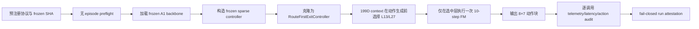

# Route-first Stage 9 主动实验执行链

## 当前结论

Stage 9 的独立执行链与预注册 state-12 配对工程 smoke 均已完成。candidate-first 和 route-first 两臂在同一物理 GPU、同一 task/state/seed 上都成功，专用 attestation 与配对汇总均为 PASS。route-first 保持相同成功结果和相同 L13/L27 分布，同时描述性平均 policy wall latency 降低 42.22%。state 13 尚未打开；当前证据只解锁其受控 pilot，不支持最终闭环提升、统计显著性或正式 wall-clock 加速结论。

## 为什么新增独立执行链

Stage 8 已证明 route-first 能在动作生成前根据 199D action-free context 选择 L13/L27，但离线重放不能证明真实闭环可执行，也不能提供可信的 wall-clock 证据。Stage 9 因而新增独立入口，并继续保持历史 D9 evaluator、A1 `ExitController` 和 V3 runtime/controller 的精确字节不变。

执行路径如下：

## 新增边界

- `route_first_active_protocol.py` 在导入 LIBERO 前验证协议 SHA、frozen artifact SHA、state 访问范围、seed 和 paired arm 顺序。
- `run_libero_route_first_active.sh` 当前硬限制为 task 0/state 12/第二臂；任何 state 13 请求立即退出。
- `validate_route_first_active_preflight.py` 不创建环境、不 reset 模拟器、不读取 init state，只检查代码、依赖、backbone、GPU UUID、外部 GPU 进程和 BF16 CUDA smoke。
- `run_route_first_active.py` 通过 `RouteFirstExitController.from_frozen_sparse_controller` 建立旁路控制器，不修改三份 D9 保护文件。
- `validate_route_first_active_run.py` 不信任 runner 的聚合计数，而是逐条重读 runtime event：每个有效调用必须只有一个 `evaluated=True` 的退出事件、`fm_calls == 1`、动作有限、L11 次数为 0。

## 测量修正

旧的 Stage-1 probe 只认识 candidate-first adapter 的 `consider_candidate`。如果直接用于 route-first，会在安装测量钩子时失败并导致重复包装。现在 probe 会根据 `adapter.route_first` 选择接口：

- candidate-first：继续测量 `consider_candidate` / `select_fallback`；
- route-first：测量 `probabilities` / `select_action`；
- 两条路径的测量结果都不进入控制输入。

## 测试结果

- 针对性合约测试：15 passed，1 warning。
- 正式 `tests/` 门禁：524 passed，22 subtests passed，3 warnings，73.62 秒。
- Python 编译、Shell 语法和 `git diff --check`：全部通过。
- 三份 D9 保护文件与两份 Stage-8 frozen 文件 SHA：全部保持不变。

根目录直接执行 `pytest` 会在收集既有示例 `a1/data/vla/test_dataloader.py` 时失败，因为它仍传入当前 `DataConfig` 不接受的旧参数 `rlds_dataset_name`。该文件不属于维护中的 `tests/` 门禁，本阶段没有修改它，也不会把这项既有问题误报为 Stage-9 通过。

## 预注册执行顺序

1. 提交并推送执行链，使 preflight 要求 clean worktree 并绑定 Git commit；
2. 只选择无外部计算进程且空闲显存不少于 40 GiB 的物理卡；
3. 运行 no-episode preflight；
4. 先运行 candidate-first V3 的 task 0/state 12；
5. 第一臂完整封存后，再运行 route-first 的同一 task/state/seed；
6. 两臂 runtime、动作与测量门禁通过后，生成确定性 paired smoke 汇总；
7. 只有配对汇总 PASS 才解锁 state-13 pilot。

前六项已于 2026-08-29 严格按顺序完成。第七项只表示协议门禁已解锁，并不表示 state 13 已经执行。

## Candidate-first 第一臂补充封装

在正式打开 state 12 前，进一步新增了 `run_libero_route_first_stage9_candidate.sh` 和 `validate_route_first_stage9_candidate_arm.py`。原因是通用 V3 runner 只保证“可运行的非 D9 state”，不会单独证明它属于 Stage-9 预注册 smoke。

新的第一臂封装同时要求：

- Stage-9 no-episode preflight 与通用 V3 preflight 均为 PASS；
- 两份 preflight 绑定同一物理 GPU UUID；
- task/state/seed 精确为 0/12/20260826；
- candidate-first 是第一臂；
- runtime prepared/committed/policy calls 完全一致且无错误；
- Stage-1 动作与延迟测量逐调用完整。

对应新增测试后，正式门禁更新为 527 passed、22 subtests passed、3 warnings。测试完成时 8 张 GPU 仍均有外部计算进程，因此没有运行 preflight，也没有打开 state 12。

## Stage-9 首次 GPU preflight 结果

在提交 `eb9335f` 的 clean worktree 上进行了三次 no-episode 尝试：

1. GPU 6：初始只读检查为空闲，但外部调度器在 preflight 窗口内加载约 10 GB，Stage-9 门禁 FAIL；
2. GPU 5：Stage-9 preflight 与 V3 preflight 均 PASS，协议、权重、UUID、CUDA、空闲显存和 D9 字节全部正确；
3. GPU 7：外部调度器在 preflight 前加载约 22 GB，Stage-9 门禁 FAIL。

GPU 5 的两套 preflight 通过后、主动启动前，该卡又被外部进程占用约 25 GB，因此没有复用已经失去“当前空闲”条件的结果。三次尝试均未创建 LIBERO 环境、未读取 state 12，也没有生成 `evaluation_summary.json` 或主动臂 attestation。state 12 与 state 13 继续保持未打开。

该结果同时验证了竞争条件下的 fail-closed 行为：资源门禁失败不会退化成共享 GPU 上的低可信延迟实验，也不会用失败目录替换正式结果。

## Stage-9 后续 GPU 竞争复核

在提交 `614ea12` 的 clean worktree 上又执行了两次严格相同的 candidate-first 第一臂启动：

1. GPU 6 在只读审计时无计算 PID、仅占用 563 MiB；进入 Stage-9 preflight 前，外部 PID `2698411` 加载约 10 GiB，门禁 FAIL；
2. GPU 4 随后恢复到 18 MiB、0% 利用率且无计算 PID；进入 preflight 前，外部 PID `2811685` 同样加载约 10 GiB，门禁 FAIL。

两次失败均满足 `simulator_episode_opened=false`，没有运行 V3 preflight、没有生成主动臂 attestation，也没有读取 state 12。累计 6 次 Stage-9 preflight 中，1 次曾同时通过 Stage-9 与 V3 no-episode preflight，5 次因共享 GPU 竞争被拒绝；candidate-first 与 route-first 主动臂执行次数仍均为 0。

这进一步定位出当前阻塞是“初始 GPU 审计到 preflight 采样之间被外部调度器抢占”的资源竞争，而不是协议、backbone、CUDA smoke、保护文件或 frozen artifact 验证失败。在没有独占卡或能够与外部调度器协调的资源租约前，不通过降低 40 GiB 门槛、允许共享 PID 或修改预注册实验来绕过该问题。

## State-12 主动配对结果

2026-08-29，GPU 4 保持空闲，Stage-9 与 V3 no-episode preflight 均通过。首次主动加载暴露了两个环境问题：

1. `Qwen/Qwen2-7B` 与 `physical-intelligence/fast` tokenizer 尚未进入离线缓存；
2. 受保护 A1 evaluator 将 `HF_HOME` 本身作为 Qwen 的 `cache_dir`，而 Hugging Face 默认使用 `HF_HOME/hub`。

两次失败都发生在 backbone tokenizer 加载阶段、LIBERO 环境创建之前，没有产生失败 rollout。修复仅补齐外部缓存：Qwen 同时按照 evaluator 的既有 `cache_dir` 契约缓存，FAST 保持标准 HF cache 布局；没有修改 checkpoint、路由器、阈值或三份 D9 保护文件。

随后两臂均在物理 GPU 4、task 0、state 12、base seed `20260826` 上完成：

| 指标 | Candidate-first V3 | Route-first | 描述性变化 |
|---|---:|---:|---:|
| 成功 | 1/1 | 1/1 | 相同 |
| policy calls | 33 | 33 | 相同 |
| L11 / L13 / L27 | 0 / 1 / 32 | 0 / 1 / 32 | 相同 |
| mean policy wall | 1623.84 ms | 938.22 ms | -42.22%，1.73× |
| P50 policy wall | 1575.72 ms | 879.58 ms | -44.18% |
| P95 policy wall | 1746.59 ms | 1271.50 ms | -27.20% |
| episode wall | 92.57 s | 73.74 s | -20.34% |
| runtime errors | 0 | 0 | 相同 |
| 每次恰好一次 FM | candidate-first 不作该语义声明 | 33/33 | PASS |

Route-first 的 33 个有效调用均满足：L11 永久关闭、动作生成前选择 L13/L27、只执行一个被选中的 10-step flow-matching head、动作有限、telemetry 与 measurement 各一条。机器可读结果位于 `results/route_first/route_first_stage9_state12_pair.json`，并由 `scripts/summarize_route_first_stage9_pair.py` 从两份 sealed run 确定性重建。

新增配对汇总器、负向身份漂移与失败 episode 门禁测试后，维护范围内的完整门禁为 533 passed、22 subtests passed、3 warnings，耗时 73.08 秒；三份 D9 保护文件 SHA 保持不变。

## 结果边界与下一门禁

这个结果第一次证明了 route-first 从输入观测到闭环动作输出的真实工程可执行性，也在完全相同的层选择和成功结果下观察到明显延迟下降。但样本量只有一个 episode，因此：

- 可以声称 state-12 paired engineering smoke PASS；
- 可以报告同卡、同口径的描述性延迟变化；
- 不可以声称最终成功率提升、统计显著性、全 LIBERO 加速或部署可用；
- state 13 仍未打开，历史 D9 states 40–49 仍未重新访问。

下一阶段应先为 state-13 pilot 增加独立 launcher 门禁、配对身份检查和结果封存，再在 clean commit 与空闲 GPU 上运行；不得直接解除当前 state-12 launcher 的硬限制。
