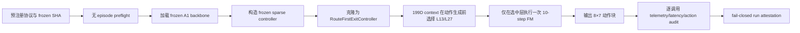

# Route-first Stage 9 主动实验执行链

## 当前结论

Stage 9 的独立执行链已经完成并通过正式 `tests/` 门禁，但截至本记录生成时，state 12 和 state 13 均未打开，也没有执行主动控制。当前授权边界只推进到“可以在提交并绑定代码后运行无 episode preflight”。

## 为什么新增独立执行链

Stage 8 已证明 route-first 能在动作生成前根据 199D action-free context 选择 L13/L27，但离线重放不能证明真实闭环可执行，也不能提供可信的 wall-clock 证据。Stage 9 因而新增独立入口，并继续保持历史 D9 evaluator、A1 `ExitController` 和 V3 runtime/controller 的精确字节不变。

执行路径如下：

## 新增边界

- `route_first_active_protocol.py` 在导入 LIBERO 前验证协议 SHA、frozen artifact SHA、state 访问范围、seed 和 paired arm 顺序。
- `run_libero_route_first_active.sh` 当前硬限制为 task 0/state 12/第二臂；任何 state 13 请求立即退出。
- `validate_route_first_active_preflight.py` 不创建环境、不 reset 模拟器、不读取 init state，只检查代码、依赖、backbone、GPU UUID、外部 GPU 进程和 BF16 CUDA smoke。
- `run_route_first_active.py` 通过 `RouteFirstExitController.from_frozen_sparse_controller` 建立旁路控制器，不修改三份 D9 保护文件。
- `validate_route_first_active_run.py` 不信任 runner 的聚合计数，而是逐条重读 runtime event：每个有效调用必须只有一个 `evaluated=True` 的退出事件、`fm_calls == 1`、动作有限、L11 次数为 0。

## 测量修正

旧的 Stage-1 probe 只认识 candidate-first adapter 的 `consider_candidate`。如果直接用于 route-first，会在安装测量钩子时失败并导致重复包装。现在 probe 会根据 `adapter.route_first` 选择接口：

- candidate-first：继续测量 `consider_candidate` / `select_fallback`；
- route-first：测量 `probabilities` / `select_action`；
- 两条路径的测量结果都不进入控制输入。

## 测试结果

- 针对性合约测试：15 passed，1 warning。
- 正式 `tests/` 门禁：524 passed，22 subtests passed，3 warnings，73.62 秒。
- Python 编译、Shell 语法和 `git diff --check`：全部通过。
- 三份 D9 保护文件与两份 Stage-8 frozen 文件 SHA：全部保持不变。

根目录直接执行 `pytest` 会在收集既有示例 `a1/data/vla/test_dataloader.py` 时失败，因为它仍传入当前 `DataConfig` 不接受的旧参数 `rlds_dataset_name`。该文件不属于维护中的 `tests/` 门禁，本阶段没有修改它，也不会把这项既有问题误报为 Stage-9 通过。

## 下一步的严格顺序

1. 提交并推送本执行链，使 preflight 可以要求 clean worktree 并绑定 Git commit。
2. 重新检查 8 张 GPU，仅选择无外部计算进程且利用率低的物理卡。
3. 运行 `PREFLIGHT_ONLY=1`，确认不打开任何 simulator episode。
4. preflight 通过后，才按预注册顺序运行 candidate-first V3 的 task 0/state 12。
5. V3 臂完整封存后，运行 route-first 的 task 0/state 12。
6. 两臂 runtime、动作与测量门禁都通过后，另行生成 paired smoke 汇总；在此之前 state 13 保持关闭。

这些结果只支持工程可执行性判断，不构成最终闭环提升、wall-clock 加速或部署结论。
