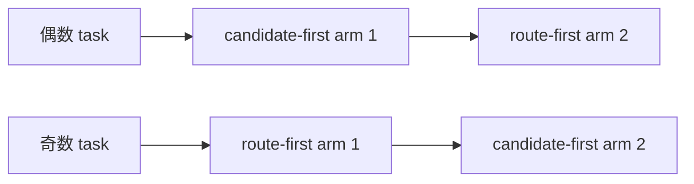
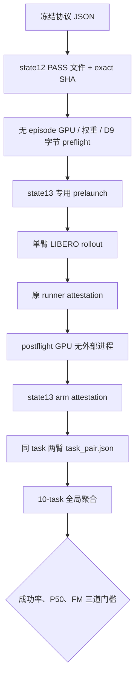

# Route-first Stage 9：state13 十任务配对 pilot 协议与执行记录

## 1. 当前结论

本文件记录 Stage 9 第二道门禁，即冻结的 **state13、10-task、两臂配对工程 pilot**。
在首次打开 state13 之前，执行基础设施已经完成 CPU 合约验证；state12 解锁结果已按
SHA-256 精确绑定，历史 D9 states 40--49 没有被读取或复用。

本实验只回答两个工程问题：

1. route-first 在完整 LIBERO 10-task 闭环上，成功数是否没有相对 candidate-first V3
   出现不可接受的下降；
2. 在同 GPU、同 task、同 init state、同 seed 的配对条件下，route-first 是否明显降低
   policy wall-clock P50，同时保持每个有效 policy call 恰好一次 flow matching。

它不是统计功效充分的非劣效性试验，也不授权真实机器人部署。

## 2. 冻结输入与不可变边界

| 项目 | 冻结值 |
|---|---|
| suite | `libero_10` |
| tasks | `0..9` |
| init state | `13` |
| base seed | `20260826` |
| episode seed | `20260826 + task_id * 10000 + 13` |
| candidate arm | `candidate_first_v3` |
| route arm | `route_first_stage8` |
| 协议 SHA-256 | `fcb1c2a1fdf7ea3f79343f72d25240449500a5eac3fad1372f0808023888db4d` |
| state12 解锁结果 SHA-256 | `b636e1b1b650afbf50fb7bdda7c3ab18da366c4a5b33801b3af36a57e4055bbe` |
| 历史 D9 states | `40..49`，本阶段禁止访问 |

双臂顺序按 task 奇偶交替，以降低固定的 warm-up / 顺序偏差：



失败 rollout 必须原样保留，不允许更换 init state、补跑替代样本、移动阈值或重训路由器。

## 3. 从授权到全局结论的证据链



每一层都会复核上一层的 schema、语义字段、文件大小和 SHA-256。全局聚合不是只读取
task-pair 中的汇总数字，而是再次验证 arm attestation 以及原始
`stage1_measurement.jsonl`，再从所有 policy calls 重新计算 pooled P50。

## 4. 两臂具体执行内容

### 4.1 Candidate-first V3

- 运行冻结的 V3 candidate-first 路径；
- 候选层仍为 L11/L13/L27，候选动作在判断前生成；
- 使用原 `validate_phase_route_v3_run.py` 生成既有 attestation；
- 再由 state13 专用 arm validator 绑定 task/state/seed/GPU 和原始测量。

### 4.2 Route-first Stage 8

- 动作生成前根据 199D action-free context 选择 L13 或 L27；
- L11 永久关闭；
- 被选中的动作头只允许调用一次 flow matching；
- 使用原 `validate_route_first_active_run.py` 生成既有 attestation；
- state13 专用 validator 再检查 `fm_invocations == policy_calls`。

两臂的最终动作张量均为 `[1, 8, 7]` normalized action chunk，LIBERO 每次执行其中的动作，
直到成功或达到冻结 horizon。

## 5. 全局预注册门槛

10 个 task pair 全部完成后，按以下规则一次性判定：

| 门槛 | PASS 条件 |
|---|---|
| 完整性 | task grid 恰好为 0--9，所有 pair attestation PASS |
| 成功保护 | `route_successes >= candidate_successes - 2` |
| 延迟 | `pooled route P50 / pooled candidate P50 <= 0.90` |
| 计算路径 | route-first 全部有效调用恰好一次 FM |

单个 episode 失败本身不会让 arm attestation 失败；attestation PASS 表示实验身份与记录完整，
不是表示任务成功。最终成功保护门槛只在 10 个失败/成功结果全部保留后计算。

## 6. CPU 基础设施验证

在打开 state13 前执行：

```bash
PYTHONNOUSERSITE=1 /home/haozheng/.conda/envs/a1/bin/python -m pytest -q \
  tests/dynamic_compute/test_route_first_stage9_pilot_protocol.py \
  tests/dynamic_compute/test_route_first_stage9_pilot_evidence.py \
  tests/dynamic_compute/test_route_first_stage9_pilot_aggregate.py
```

当前定向结果：`27 passed, 1 warning`。覆盖：

- state12 exact-SHA 解锁和 state13-only 选择；
- 奇偶 task 双臂顺序；
- seed/state/order/GPU 漂移 fail-closed；
- 原 runner attestation 后原始文件被修改时拒绝封存；
- route-first FM 次数异常时拒绝；
- 10-task 成功保护与 pooled-P50 门槛的正负用例；
- 聚合前原始 measurement 漂移检测；
- launcher 文件名和原 attestor 兼容性。

正式 GPU 执行前还必须通过全仓 pytest、Python compile、`bash -n`、`git diff --check`
以及三份 D9 保护文件 SHA 复核，并提交形成 clean worktree。

## 7. 单 task 正式命令模板

只能选择没有外部计算 PID、空闲显存不少于 40 GiB 的物理 GPU。每张卡同一时刻只运行
一个 task pair：

```bash
cd /data3/haozheng/A1/PhaseRoute-VLA

GPU_INDEX=4 \
TASK_ID=0 \
PYTHON_BIN=/home/haozheng/.conda/envs/a1/bin/python \
HF_HOME=/data3/haozheng/A1/hf_cache \
LIBERO_CONFIG_PATH=/data3/haozheng/A1/PhaseRoute-VLA/.cache/libero \
bash scripts/run_libero_route_first_stage9_pilot_task.sh
```

launcher 会按 task 奇偶自动运行正确顺序的两臂，并在同一个 pair 目录生成：

```text
taskN_state13_gpuX_TIMESTAMP/
├── arm1_.../
│   ├── evaluation_summary.json
│   ├── stage1_measurement.jsonl
│   ├── run_attestation.json
│   └── stage9_pilot_arm_attestation.json
├── arm2_.../
│   └── ...
├── command.sh
└── task_pair.json
```

## 8. 十任务聚合命令模板

所有 task pair 完成并检查无 `.incomplete` 文件后运行：

```bash
/home/haozheng/.conda/envs/a1/bin/python \
  scripts/aggregate_route_first_stage9_pilot.py \
  --task-pair /absolute/path/task0/task_pair.json \
  --task-pair /absolute/path/task1/task_pair.json \
  --task-pair /absolute/path/task2/task_pair.json \
  --task-pair /absolute/path/task3/task_pair.json \
  --task-pair /absolute/path/task4/task_pair.json \
  --task-pair /absolute/path/task5/task_pair.json \
  --task-pair /absolute/path/task6/task_pair.json \
  --task-pair /absolute/path/task7/task_pair.json \
  --task-pair /absolute/path/task8/task_pair.json \
  --task-pair /absolute/path/task9/task_pair.json \
  --output results/route_first/route_first_stage9_state13_pilot.json
```

## 9. 结果记录（实验完成后填写）

| 指标 | Candidate-first V3 | Route-first |
|---|---:|---:|
| successes / 10 | 待运行 | 待运行 |
| pooled policy calls | 待运行 | 待运行 |
| policy wall mean | 待运行 | 待运行 |
| policy wall P50 | 待运行 | 待运行 |
| FM invocations | 不作为单次路径门槛 | 待运行 |

当前 access ledger：state12 已打开并通过；state13 在基础设施提交前未打开；历史 D9
states 40--49 未访问。最终结果、失败 task 分析、GPU UUID、run directories、聚合文件
SHA-256 和后续授权状态将在本节追加，不能用人工选择性摘要替代机器可读 JSON。
