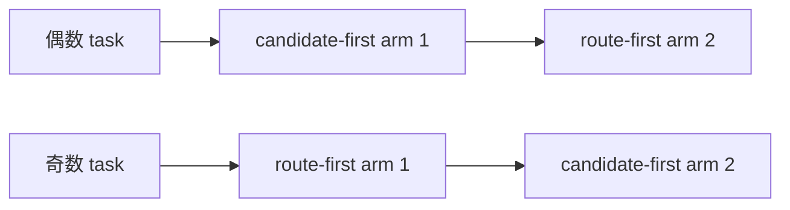
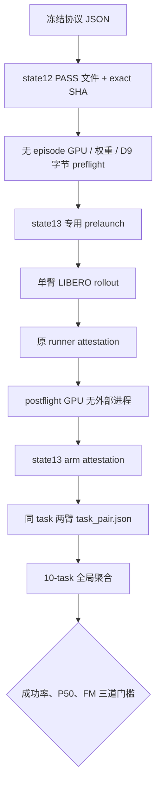

# Route-first Stage 9：state13 十任务配对 pilot 协议与执行记录

## 1. 当前结论

本文件记录 Stage 9 第二道门禁，即冻结的 **state13、10-task、两臂配对工程 pilot**。
该 pilot 已完成并判定为 **PASS**：candidate-first 与 route-first 均为 `9/10` 成功；
route-first 的 pooled policy wall P50 从 `1591.875241 ms` 降至 `911.072599 ms`，
比值为 `0.572327`（描述性降低 `42.77%`）。route-first 的 `343/343` 个有效
policy call 均恰好调用一次 flow matching。state12 解锁结果按 SHA-256 精确绑定，
历史 D9 states 40--49 没有被读取或复用。

本实验只回答两个工程问题：

1. route-first 在完整 LIBERO 10-task 闭环上，成功数是否没有相对 candidate-first V3
   出现不可接受的下降；
2. 在同 GPU、同 task、同 init state、同 seed 的配对条件下，route-first 是否明显降低
   policy wall-clock P50，同时保持每个有效 policy call 恰好一次 flow matching。

它不是统计功效充分的非劣效性试验，也不授权真实机器人部署。

## 2. 冻结输入与不可变边界

| 项目 | 冻结值 |
|---|---|
| suite | `libero_10` |
| tasks | `0..9` |
| init state | `13` |
| base seed | `20260826` |
| episode seed | `20260826 + task_id * 10000 + 13` |
| candidate arm | `candidate_first_v3` |
| route arm | `route_first_stage8` |
| 协议 SHA-256 | `fcb1c2a1fdf7ea3f79343f72d25240449500a5eac3fad1372f0808023888db4d` |
| state12 解锁结果 SHA-256 | `b636e1b1b650afbf50fb7bdda7c3ab18da366c4a5b33801b3af36a57e4055bbe` |
| 历史 D9 states | `40..49`，本阶段禁止访问 |

双臂顺序按 task 奇偶交替，以降低固定的 warm-up / 顺序偏差：



失败 rollout 必须原样保留，不允许更换 init state、补跑替代样本、移动阈值或重训路由器。

## 3. 从授权到全局结论的证据链



每一层都会复核上一层的 schema、语义字段、文件大小和 SHA-256。全局聚合不是只读取
task-pair 中的汇总数字，而是再次验证 arm attestation 以及原始
`stage1_measurement.jsonl`，再从所有 policy calls 重新计算 pooled P50。

## 4. 两臂具体执行内容

### 4.1 Candidate-first V3

- 运行冻结的 V3 candidate-first 路径；
- 候选层仍为 L11/L13/L27，候选动作在判断前生成；
- 使用原 `validate_phase_route_v3_run.py` 生成既有 attestation；
- 再由 state13 专用 arm validator 绑定 task/state/seed/GPU 和原始测量。

### 4.2 Route-first Stage 8

- 动作生成前根据 199D action-free context 选择 L13 或 L27；
- L11 永久关闭；
- 被选中的动作头只允许调用一次 flow matching；
- 使用原 `validate_route_first_active_run.py` 生成既有 attestation；
- state13 专用 validator 再检查 `fm_invocations == policy_calls`。

两臂的最终动作张量均为 `[1, 8, 7]` normalized action chunk，LIBERO 每次执行其中的动作，
直到成功或达到冻结 horizon。

## 5. 全局预注册门槛

10 个 task pair 全部完成后，按以下规则一次性判定：

| 门槛 | PASS 条件 |
|---|---|
| 完整性 | task grid 恰好为 0--9，所有 pair attestation PASS |
| 成功保护 | `route_successes >= candidate_successes - 2` |
| 延迟 | `pooled route P50 / pooled candidate P50 <= 0.90` |
| 计算路径 | route-first 全部有效调用恰好一次 FM |

单个 episode 失败本身不会让 arm attestation 失败；attestation PASS 表示实验身份与记录完整，
不是表示任务成功。最终成功保护门槛只在 10 个失败/成功结果全部保留后计算。

## 6. CPU 基础设施验证

在打开 state13 前执行：

```bash
PYTHONNOUSERSITE=1 /home/haozheng/.conda/envs/a1/bin/python -m pytest -q \
  tests/dynamic_compute/test_route_first_stage9_pilot_protocol.py \
  tests/dynamic_compute/test_route_first_stage9_pilot_evidence.py \
  tests/dynamic_compute/test_route_first_stage9_pilot_aggregate.py
```

打开 state13 前的新增基础设施定向结果为 `27 passed, 1 warning`。覆盖：

- state12 exact-SHA 解锁和 state13-only 选择；
- 奇偶 task 双臂顺序；
- seed/state/order/GPU 漂移 fail-closed；
- 原 runner attestation 后原始文件被修改时拒绝封存；
- route-first FM 次数异常时拒绝；
- 10-task 成功保护与 pooled-P50 门槛的正负用例；
- 聚合前原始 measurement 漂移检测；
- launcher 文件名和原 attestor 兼容性。

正式 GPU 执行前还必须通过全仓 pytest、Python compile、`bash -n`、`git diff --check`
以及三份 D9 保护文件 SHA 复核，并提交形成 clean worktree。

实验完成后的扩展定向回归（同时覆盖既有 Stage 9 active runner、candidate arm、state12
pair 和 pilot 链）为 `41 passed, 1 warning`。维护中的完整 `tests/` 套件为
`560 passed, 22 subtests passed, 3 warnings`。直接从仓库根执行 pytest 会额外收集历史
可执行样例 `a1/data/vla/test_dataloader.py`；该样例使用旧版 `DataConfig` 参数且不属于
维护中的 `tests/` 测试边界，因此没有为了得到绿色结果而修改它。

## 7. 单 task 正式命令模板

只能选择没有外部计算 PID、空闲显存不少于 40 GiB 的物理 GPU。每张卡同一时刻只运行
一个 task pair：

```bash
cd /data3/haozheng/A1/PhaseRoute-VLA

GPU_INDEX=4 \
TASK_ID=0 \
PYTHON_BIN=/home/haozheng/.conda/envs/a1/bin/python \
HF_HOME=/data3/haozheng/A1/hf_cache \
LIBERO_CONFIG_PATH=/data3/haozheng/A1/PhaseRoute-VLA/.cache/libero \
bash scripts/run_libero_route_first_stage9_pilot_task.sh
```

launcher 会按 task 奇偶自动运行正确顺序的两臂，并在同一个 pair 目录生成：

```text
taskN_state13_gpuX_TIMESTAMP/
├── arm1_.../
│   ├── evaluation_summary.json
│   ├── stage1_measurement.jsonl
│   ├── run_attestation.json
│   └── stage9_pilot_arm_attestation.json
├── arm2_.../
│   └── ...
├── command.sh
└── task_pair.json
```

## 8. 十任务聚合命令模板

所有 task pair 完成并检查无 `.incomplete` 文件后运行：

```bash
/home/haozheng/.conda/envs/a1/bin/python \
  scripts/aggregate_route_first_stage9_pilot.py \
  --task-pair /absolute/path/task0/task_pair.json \
  --task-pair /absolute/path/task1/task_pair.json \
  --task-pair /absolute/path/task2/task_pair.json \
  --task-pair /absolute/path/task3/task_pair.json \
  --task-pair /absolute/path/task4/task_pair.json \
  --task-pair /absolute/path/task5/task_pair.json \
  --task-pair /absolute/path/task6/task_pair.json \
  --task-pair /absolute/path/task7/task_pair.json \
  --task-pair /absolute/path/task8/task_pair.json \
  --task-pair /absolute/path/task9/task_pair.json \
  --output results/route_first/route_first_stage9_state13_pilot.json
```

## 9. 正式聚合结果

| 指标 | Candidate-first V3 | Route-first |
|---|---:|---:|
| successes / 10 | 9 / 10 | 9 / 10 |
| pooled policy calls | 358 | 343 |
| policy wall mean | 1536.246802 ms | 927.155580 ms |
| policy wall P50 | 1591.875241 ms | 911.072599 ms |
| policy wall P90 | 1745.400325 ms | 1095.934495 ms |
| FM invocations | 不作为单次路径门槛 | 343 |

全局 P50 比值为 `0.5723266344`，平均延迟比值为 `0.6035199417`。这里的延迟改善是
冻结 10-task 工程 pilot 上的描述性结果；本实验没有足够统计功效支撑正式加速或非劣效性声明。

### 9.1 Task 级完整结果

| Task | Candidate | Route-first | 配对结果 | Candidate P50 | Route P50 | Route/Candidate |
|---:|---:|---:|---|---:|---:|---:|
| 0 | 成功 | 成功 | both success | 1620.071273 | 896.725970 | 0.553510 |
| 1 | 成功 | 成功 | both success | 1519.511021 | 885.507783 | 0.582758 |
| 2 | 成功 | 成功 | both success | 1610.651929 | 900.193285 | 0.558900 |
| 3 | 成功 | 成功 | both success | 1603.577263 | 909.632036 | 0.567252 |
| 4 | 成功 | 成功 | both success | 1603.489319 | 945.359861 | 0.589564 |
| 5 | 失败 | 成功 | route only success | 1594.571418 | 896.689969 | 0.562339 |
| 6 | 成功 | 成功 | both success | 1615.808560 | 935.638205 | 0.579053 |
| 7 | 成功 | 成功 | both success | 1564.434566 | 892.203884 | 0.570304 |
| 8 | 成功 | 成功 | both success | 1578.982374 | 925.835062 | 0.586349 |
| 9 | 成功 | 失败 | candidate only success | 1612.448300 | 906.050277 | 0.561910 |

task 5 的 candidate-first 在 65 calls 后形成有效闭环失败；task 9 的 route-first 在
65 calls 后形成有效闭环失败。两例都原样保留，没有补跑或替换，且成功差异恰好相互抵消。

### 9.2 预注册门槛判定

| 门槛 | 观测值 | 判定 |
|---|---|---|
| 完整 task grid | 0--9，10 个 pair attestation 全部 PASS | PASS |
| 成功保护 | route 9，candidate 9，差值 0 | PASS |
| pooled P50 | 比值 0.572327，要求不大于 0.90 | PASS |
| 计算路径 | 343 次 FM / 343 policy calls | PASS |

### 9.3 执行异常与处理边界

task 1 的 candidate-first 首次尝试在模型迁移到 GPU 时遇到外部显存争用并 OOM；没有
创建 `evaluation_summary.json`，也没有打开 simulator episode。随后一次重试被 preflight
检测到外部 PID 和不足 40 GiB 空闲显存后正确拒绝，同样没有打开 episode。GPU 5 完全
释放后，保持同 task/state/seed/GPU UUID 和 arm position 完成了原臂。两次 pre-episode
事件及证据 SHA 记录在机器可读的
`results/route_first/route_first_stage9_state13_execution_incidents.json`，它们不是模型失败，
也没有替换任何有效失败 rollout。

### 9.4 证据、访问账本与下一门禁

- 正式结果：`results/route_first/route_first_stage9_state13_pilot.json`
- 正式结果 SHA-256：`0979f04e8f7c3352b2bbea8540a2562925546233d03905c6d579d077795d1d8c`
- 执行异常记录 SHA-256：`6f174919366d40380316c54f850b67ae555521fadcef982ffcd5622cb51f83c1`
- 协议 SHA-256：`fcb1c2a1fdf7ea3f79343f72d25240449500a5eac3fad1372f0808023888db4d`
- state12 解锁 SHA-256：`b636e1b1b650afbf50fb7bdda7c3ab18da366c4a5b33801b3af36a57e4055bbe`
- state13 已按冻结协议打开并完成；历史 D9 states 40--49 未访问。
- 三份 D9 保护文件 SHA 保持为 `ec3a8604...`、`e5c88b72...`、`a4e3b1b4...`。
- `fresh_state_confirmation_authorized = true`；`deployment_authorized = false`。

因此，本阶段只解锁下一道 fresh-state confirmation。它不授权真实机器人部署，也不把
单个 state13 pilot 提升为统计显著性、正式 wall-clock 加速或最终闭环改进结论。
