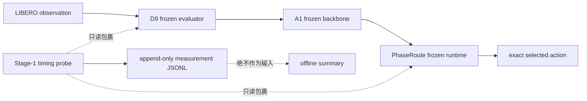

# 阶段一：可信测量与固定深度基线协议

## 1. 目标

阶段一不重新训练、不调整 D8 router 阈值，也不接触已经消费的 D9 state 40–49。目标是建立后续实验都能复用的可信测量基础：

1. 验证固定 `L11 / L13 / L27` 确实传入 A1 backbone；
2. 分开记录端到端 policy wall time、CUDA event time 和 PhaseRoute 小模块耗时；
3. 保持 D9 正式控制代码及历史证据的 SHA-256 完全不变；
4. 在普通工程 state 上比较成功率、计算量和延迟，不把解析 FM-call reduction 写成 wall-clock speedup。

## 2. 为什么采用外部 overlay

D9 readiness 已将 `active_runtime.py`、`runtime_adapter.py`、正式 evaluator 和对应测试绑定到固定 SHA-256。直接在这些文件中加入计时器虽然不一定改变 action，却会破坏历史正式实验的可审计性。

因此阶段一使用独立 overlay：

overlay 只在函数进入和退出时读取高精度时钟。计时值不会传入 phase estimator、97D feature、five-head router、阈值判断或 action postprocess。记录失败也不得改变已经生成的 action。

## 3. 实验臂

| 实验臂 | 深度规则 | 用途 |
|---|---|---|
| fixed L11 | 专用控制器仅在 L11 调用一次 frozen FM action head | 测最浅候选的质量与延迟下界 |
| fixed L13 | 专用控制器仅在 L13 调用一次 frozen FM action head | 测中间候选的质量/计算折中 |
| fixed L27 | 专用控制器仅在 L27 调用一次 frozen FM action head | 固定全深度参考 |
| original A1 | 原 A1 相邻层动作一致性退出 | 既有方法基线 |
| PhaseRoute V3 | `L11 → L13 → L27` fail-closed | 改进方法 |

固定层实验必须满足以下机器检查：

- 使用专用 `FixedLayerFlowMatchingController`，不使用原 A1 的相邻层一致性控制器；
- 控制器只在目标层生成一次 action，`fm_calls=1`，不生成 comparison action，也不做阈值判断；
- telemetry 的 `candidate_exit_layers` 只有目标层；
- 每个 measurement record 的 `selected_layer` 都等于目标层；
- action 为有限的 `8 × 7` chunk。

## 4. 测量字段

每个 policy call 生成一条 `phase-route-vla.stage1.measurement.v1` JSONL：

| 字段 | 含义 |
|---|---|
| `policy_wall_latency_ms` | host 可见的完整 `get_vla_action` 调用耗时 |
| `policy_cuda_event_latency_ms` | 同一调用在 CUDA event 时间轴上的耗时；CPU 路径为 null |
| `action_sha256 / action_finite / action_shape` | 只读动作审计：证明动作记录可配对、全部有限且维度正确 |
| `runtime_begin` | causal identity/history 初始化 |
| `visual_capture` | projected visual crop 捕获 |
| `phase_estimator` | frozen phase estimator forward |
| `runtime_prepare` | visual pooling、phase、context 校验及 adapter 安装的总和 |
| `adapter_begin` | fail-closed placeholder 或有效 9-tensor context 安装 |
| `router_predict` | five-head router 的 `predict` |
| `candidate_route` | L11/L13 候选完整门控 |
| `fallback_route` | L27 fail-closed 选择 |
| `runtime_commit` | past-only history commit |

所有聚合同时报告 `count / sum / mean / p50 / p95 / max`。`p50/p95` 使用 nearest-rank 定义。CUDA event 与 wall time 是不同口径，不能混合求 speedup。

## 5. 数据与顺序

阶段一只使用 ordinary engineering states，第一轮为 `LIBERO-10 task 0 / state 0` smoke，之后扩展到 `10 tasks × state 0`。禁止使用 D9 state 40–49 做模型选择或新的独立性声明。

同一比较单元使用：

- 相同 A1 checkpoint 与 sidecar；
- 相同 task、initial state 和 episode seed；
- 相同 `FM10`、图像预处理和 open-loop horizon；
- 同一张物理 GPU；
- 逐臂独立进程，保存命令、stdout、原始 JSONL 和 summary；
- 可使用物理 GPU 0–7；每次启动前检查显存、利用率和计算进程，优先选择没有其他计算进程的空闲卡。

## 6. 通过标准

阶段一工程门禁为：

1. D9 protected SHA 审计通过；
2. 全量 CPU 回归、依赖检查、shell/Python syntax 全通过；
3. 固定层 plumbing 和 action identity 测试通过；
4. GPU smoke 无非有限 action、无 runtime/telemetry error，measurement 数量与 policy calls 完全一致；
5. 结果必须区分成功率、FM-call reduction、policy latency 和 episode wall time。

本阶段不是新的独立测试，也不授权部署。任何性能结论至少要等同一 ordinary-state 配对矩阵完成后再给出。
