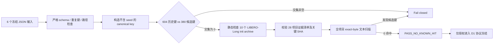

# PhaseRoute-V3 D0 数据谱系审计报告

完成时间：2026-08-20

正式状态：`PASS_NO_KNOWN_HIT`

运行边界：CPU-only、metadata-only、标准库进程

## 1. 结论

V3-D0 已通过。冻结的 604 个保守历史键与新规划的 380 个 LIBERO-Long 候选键没有交集；在当前项目根目录可审计的文本证据中，也没有发现这 380 个候选键的精确文本命中。因此，D1 可以使用这套冻结选择继续做 **Gripper-v2 协议设计**。

这里的结论必须严格表述为“**无已知历史命中**”，不能表述为“这些 episode 在全球范围内从未使用”。本审计无法覆盖项目目录之外的未知副本、未留痕人工操作或外部系统日志。

本结果不授权 active control，也不授权接触 independent-test-v2 进行调参。正式 JSON 中 `runtime_control_authorized=false`，只有 `candidate_split_authorized=true`。

## 2. 为什么先做 D0

旧 C3.61 已经完成一次正式独立评价，不能再把其行级结果用于新方法调参。V3 在开始改 Gripper 结构前，必须先回答三个问题：

1. 新的 development、calibration、independent-test 三个角色是否彼此严格隔离；
2. 新候选 episode 是否与已知历史 episode 重叠；
3. 审计过程是否在不反序列化模型、数组或行级评价载荷的条件下完成。

D0 为后续 D1--D7 建立了可复核的数据边界，但它本身不训练模型，也不评价成功率。

## 3. 数据键和冻结划分

保守身份键固定为：

```text
{suite}:task{task_id}:episode{episode_index}
```

例如 `libero_10:task3:episode12`。seed 不属于身份键；换 seed 不能把一个历史 episode 伪装成新 episode。

| 类别 | suite | episode 范围 | 数量 | 用途 |
|---|---|---:|---:|---|
| 历史 Long | `libero_10` | 所有 task 的 0--9，加 task 0/1 的 10--11 | 104 | 已知历史使用 |
| 历史 Spatial | `libero_spatial` | 所有 task 的 0--49 | 500 | 保守历史登记 |
| development-v2 | `libero_10` | 所有 task 的 12--29 | 180 | D2 嵌套 OOF 开发 |
| calibration-v2 | `libero_10` | 所有 task 的 30--39 | 100 | D3 阈值校准 |
| independent-test-v2 | `libero_10` | 所有 task 的 40--49 | 100 | D7 一次性独立评价 |

历史总数为 604，候选总数为 380。三个候选角色的交集为 0；候选与历史交集也为 0。

## 4. 审计流程



静态 availability 检查只解析 ZIP 目录和 Pickle opcode；它要求固定 opcode 序列、固定 `GLOBAL` 白名单、`float64-le`、10 个 task 均为第一维 50。实现中没有调用 `pickle.load`、`pickle.loads`、`torch.load` 或 `numpy.load`。

## 5. 正式结果

| 检查项 | 正式结果 |
|---|---:|
| 状态 | `PASS_NO_KNOWN_HIT` |
| 历史记录 / 唯一键 | 604 / 604 |
| 历史角色冲突 | 0 |
| 候选记录 | 380 |
| development / calibration / independent | 180 / 100 / 100 |
| 候选与历史交集 | 0 |
| 全项目文本候选键命中 | 0 |
| 扫描文本文件 | 4,577 |
| 扫描字节 | 288,834,372 |
| LIBERO-Long 静态 availability | 10/10 task，每个 50 states |
| 旧证据验证 | 28/28，共 1,737,937 bytes |
| 固定 C3.61 行级 payload 跳过 | 恰好 7 |
| 固定 symlink 跳过 | 恰好 2 |
| 未注册或未分类跳过 | 0 |
| CUDA 可见值 | 空字符串 |
| `torch/numpy/tensorflow/jax` 已加载 | `[]` |

扫描根固定为 `/data3/haozheng/A1`，并强制等于 legacy source 根的父目录。当前 V3 worktree、HF 缓存、候选输入和当前输出会作为非历史/自引用内容排除；用户不能任意扩大 exclusion，也不能排除整个 corpus。

## 6. 明确未读取的 7 个 C3.61 行级文件

以下路径只验证“路径存在、是安全普通文件且与预注册集合完全一致”，不打开其内容：

1. `source/reports/phase_route_v2_stage_c361_independent_aggregate_20260819_v1/records.jsonl`
2. `source/reports/phase_route_v2_stage_c361_independent_candidate_shard00of04_gpu0_20260819_v1/records.jsonl`
3. `source/reports/phase_route_v2_stage_c361_independent_candidate_shard01of04_gpu1_20260819_v1/records.jsonl`
4. `source/reports/phase_route_v2_stage_c361_independent_candidate_shard02of04_gpu2_20260819_v1/records.jsonl`
5. `source/reports/phase_route_v2_stage_c361_independent_candidate_shard03of04_gpu3_20260819_v1/records.jsonl`
6. `source/reports/phase_route_v2_stage_c361_independent_context_20260819_v1/records.jsonl`
7. `source/reports/phase_route_v2_stage_c361_independent_evaluation_20260819_v1/records.jsonl`

C3.61 的协议、consumed marker、汇总结果和普通 metadata 没有被宽泛跳过，它们参与了文本扫描和/或证据哈希验证。

## 7. 两个 symlink 的处理

以下两个 VLABench 路径是指向项目外部的符号链接：

- `source/robot_experiments/vlabench/VLABench/add_condiment.py`
- `A1_source_backup_20260801/source/robot_experiments/vlabench/VLABench/add_condiment.py`

扫描器没有跟随或读取链接目标，只调用 `readlink` 读取链接本身保存的目标字符串。两条目标字符串的 SHA-256 都是：

```text
bd7a9521adf822dcd95e819f3201080a5e90b0c40e3726f9cda88b4fc2890905
```

这个值是 **link-target 字符串哈希**，不是目标文件内容哈希。若路径不再是 symlink、链接字符串变化、缺少任一条或出现额外未登记跳过，正式门禁都会失败。

## 8. 完整性哈希

| 对象 | SHA-256 |
|---|---|
| 正式结果 JSON | `64d1159b3941fe1e7b806da981a0f47297758dcc2cad87d4e283d03db3a71c4b` |
| 审计 request | `93084251ca0d3bf0ef322666ac1c7e35dfc6733c78c7f48c3d7623246f7f81df` |
| 输入选择 bundle | `9e89175b1ee2c8c82494c95d38f861e907b262c6cd072361db0a2e1df28204bd` |
| legacy evidence manifest | `4ae5b617525a1f575f62700ab46434a1c9e8b20b9d13863b7ae8787f74c0ea6a` |
| `data_lineage.py` | `9fff4e54e40bef4b43928c7e15e1e3250834418d667e2278f0b2d717405d2cf0` |
| `audit_v3_data_lineage.py` | `94de25378ba0956afccf509010ba3c19bbec7f6542a4f5f7959b08ef9a353740` |
| C3.61 consumed marker | `cc5d4872e0d6ee929ccf9398bad3d6b7f63520c9ad1f248bac1be5824e2c967a` |

输入选择 bundle 的定义是：对 request SHA 和按 request 顺序排列的各 source SHA 构造 canonical JSON，再计算 SHA-256。

六个输入文件的独立 SHA-256：

```text
93084251ca0d3bf0ef322666ac1c7e35dfc6733c78c7f48c3d7623246f7f81df  audit_request.json
6f2b2817985740298a06c4412b2f857624ac16c98d174d3ad03f1acca238f79e  calibration_v2.json
59af8441d4207b23e4ade2dff5b987d70490e9f6ab7aff50b97255e0292436eb  development_v2.json
e2c1b2a11f84af9b71d588bf638d794c5a29870ace87b46b65960749e0f9bdf4  independent_test_v2.json
3e78ee0c4613efa6575901352a23fd857fd788f71a447355d953db5d6f6b6018  used_libero_long.json
b889352c64d7aaecf04399881c5936f2adaba65fbe35c48ee326cd85dd6ea030  used_libero_spatial_conservative.json
```

## 9. 复现命令

工作目录：

```bash
cd /data3/haozheng/A1/worktrees/phaseroute-v3
```

运行测试：

```bash
CUDA_VISIBLE_DEVICES= PYTHONNOUSERSITE=1 \
/home/haozheng/.conda/envs/a1/bin/python -m pytest -q \
  tests/dynamic_compute/v3/test_evidence_manifest.py \
  tests/dynamic_compute/v3/test_data_lineage.py
```

当前结果为 `33 passed, 22 subtests passed`。测试包含候选交集、历史缺失/额外键、跨角色重复、二进制后缀、路径穿越、中间 symlink、恶意 Pickle `GLOBAL`、伪 C3.61 路径、未注册 C3.61 payload、普通 `records.jsonl` 命中、错误 corpus root、排除整个 corpus、regular-file 替换固定 symlink，以及不可覆盖输出等负例。

正式审计命令：

```bash
CUDA_VISIBLE_DEVICES= PYTHONNOUSERSITE=1 \
/home/haozheng/.conda/envs/a1/bin/python \
  scripts/dynamic_compute/v3/audit_v3_data_lineage.py \
  --metadata-root configs/research/v3/data_lineage \
  --request audit_request.json \
  --task-map /data3/haozheng/A1/source/robot_experiments/libero/LIBERO/libero/libero/benchmark/libero_suite_task_map.py \
  --init-root /data3/haozheng/A1/source/robot_experiments/libero/LIBERO/libero/libero/init_files/libero_10 \
  --text-corpus-root /data3/haozheng/A1 \
  --legacy-evidence-manifest docs/research/v3/legacy_evidence_manifest.json \
  --legacy-source-root /data3/haozheng/A1/source \
  --output results/v3/v3_d0_data_lineage_audit.json
```

输出采用 exclusive-create 语义；同名正式结果已存在时命令必须失败，不能静默覆盖。

## 10. 产物位置

- 正式结果：`results/v3/v3_d0_data_lineage_audit.json`
- 结果校验：`results/v3/v3_d0_data_lineage_audit.sha256`
- 冻结输入：`configs/research/v3/data_lineage/`
- 旧证据清单：`docs/research/v3/legacy_evidence_manifest.json`
- 审计实现：`a1/vla/dynamic_compute/v3/data_lineage.py`
- 命令入口：`scripts/dynamic_compute/v3/audit_v3_data_lineage.py`
- 测试：`tests/dynamic_compute/v3/test_data_lineage.py`、`tests/dynamic_compute/v3/test_evidence_manifest.py`

冻结的 `/data3/haozheng/A1/source` 未被修改、未重跑，C3.61 consumed marker 哈希保持不变。

## 11. 下一阶段授权与禁止项

D0 只授权进入 **D1：Gripper-v2 协议冻结**。建议在 D1 预注册以下结构，再接触 development-v2 标签：

1. occurrence Bernoulli head：判断一个 horizon 内是否发生 gripper transition；
2. zero-truncated count head：在 occurrence 为真时估计正计数，baseline 使用 zero-truncated binomial，challenger 比较 ordinal cumulative-link 或 beta-binomial；
3. 独立 Tail UCB veto：尾部风险过高时禁止提前退出；
4. 预先冻结 occurrence、count、tail、效率和任务级公平性指标，以及 go/no-go 门槛；
5. development-v2 只用于嵌套 OOF 开发，calibration-v2 只用于一次阈值冻结，independent-test-v2 在 D7 前保持封存。

D1 仍不得 active control。只有后续 fresh development、fresh calibration、runtime replay 和 shadow-only 依次通过后，才可考虑 bounded active canary。
