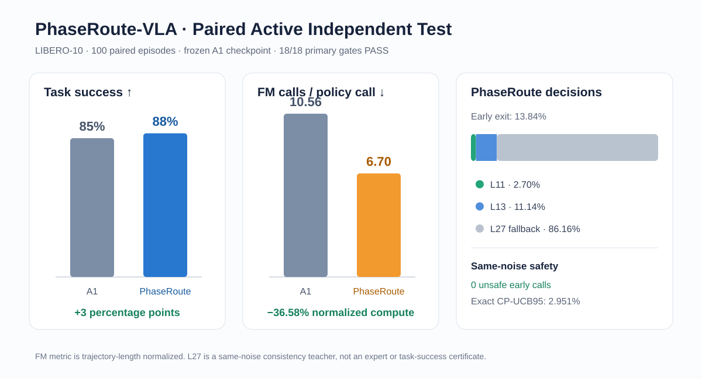
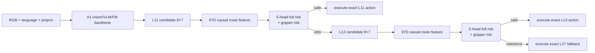
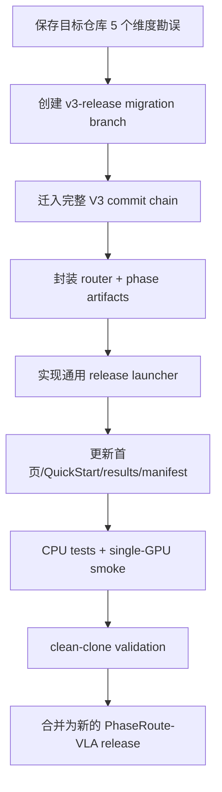

# V3-D10：论文结果、消融设计与发布迁移审计

## 1. 当前阶段结论

D10 已完成三项不产生新实验结论的工作：

1. 从冻结 D9 formal result 确定性导出论文主表、per-task 表、paired outcome 表、
   primary gate 表和矢量结果图；
2. 冻结 post-D9 消融协议，明确哪些数据还能用于拟合、哪些数据已经消耗；
3. 审计 `/data3/haozheng/A1/PhaseRoute-VLA`，确定从旧 RP-PEP release 迁移到
   V3 five-head PhaseRoute release 仍缺哪些代码、权重与文档工作。

本阶段没有重新拟合模型、搜索阈值、打开 raw D9 rollout/truth、运行环境或初始化 GPU。

## 2. 论文主结果



| 指标 | original A1 | PhaseRoute V3 | 差异 |
|---|---:|---:|---:|
| LIBERO-10 success | 85/100 | 88/100 | `+3 pp` |
| FM calls / policy call | 10.5586 | 6.6962 | `-36.58%` |
| early-exit calls | — | 512/3700 = 13.84% | 10/10 task 有 early exit |
| false-safe clusters | — | 0/100 | exact CP-UCB95 = 2.951% |

bootstrap one-sided 95% lower bound 是 `-0.02`，通过冻结的 `>=-0.10` gate；18/18
个 primary checks 全部通过。完整统计解释见
[D9E 最终结果](V3_D9E_FINAL_RESULT_ZH.md)。

导出的机器可读论文资产：

```text
docs/research/v3/paper_assets/d9_main_results.csv
docs/research/v3/paper_assets/d9_per_task_results.csv
docs/research/v3/paper_assets/d9_paired_outcomes.csv
docs/research/v3/paper_assets/d9_primary_gates.csv
docs/research/v3/paper_assets/d9_result_overview.svg
```

导出器只打开 SHA 固定的 `v3_d9_final_result.json`，不读取 raw D9C/D9D。正式
attestation 是 `results/v3/v3_d10_paper_analysis.json`。

## 3. 论文应该如何描述创新

### 3.1 相比原始 A1

原始 A1 的动态计算是 action-consistency early exit：在多个奇数层反复调用
Flow-Matching expert，用相邻/参考动作差异与每层阈值决定是否退出。它没有显式建模
任务阶段、时序上下文、gripper transition 风险或 epistemic uncertainty。

PhaseRoute V3 的改变发生在候选动作生成后、环境 action 发送前：



关键增量是：

- **阶段感知**：从视觉、语言、当前 proprio 和过去轨迹估计 progress、boundary、
  uncertainty 与 phase embedding；
- **因果时序特征**：82D context 只使用当前时刻可见信息和 past-only history，不使用
  future、task/episode identity 或 candidate identity；
- **动作上下文风险**：再拼接 15D 当前 candidate pattern，形成 97D route feature；
- **epistemic safety**：五个独立 head 的 full-action risk 取最大值，而不是只信任单点
  预测；
- **gripper 专门门**：head-0 occurrence probability 单独否决夹爪风险；
- **分层决策**：L11 safe 就退出，否则检查 L13，再否则 L27；缺失、NaN、Inf、shape
  drift 和 history 异常全部 fail closed；
- **动作不篡改**：router 只选 candidate，环境获得的是对应层已经产生的精确 action；
- **可审计验证**：同噪声 L27 consistency truth、100-pair active independent test 和
  一次性盲法 aggregate 共同限制结果选择偏差。

### 3.2 相比旧 RP-PEP

旧 PhaseRoute-VLA release 中的 RP-PEP 是确定性 candidate-pruning：固定保留
`(3,11,13,27)`，用 RNG burn 保持 A1 随机流。它在 LIBERO Spatial 20-pair 网格上
证明了动作/轨迹精确等价，并减少 41.11% FM solves。

V3 不是把这个结果重命名：

| 方面 | RP-PEP | PhaseRoute V3 |
|---|---|---|
| 路由性质 | 固定裁剪计划 | state/candidate-conditioned learned safety routing |
| 上下文 | 不估计任务阶段 | phase + temporal history + current candidate |
| 决策层 | 3/11/13/27 的冻结生产性计划 | L11/L13，L27 fail-closed fallback |
| 安全证据 | RNG-preserving exact equivalence | same-noise risk audit + active paired success |
| 正式结果 | Spatial，20 pairs | LIBERO-10，100 pairs |

两组实验的 suite、样本与控制器不同，不能把 41.11% 和 36.58% 放在同一列直接排名。
迁移后的仓库应保留 RP-PEP 为历史 baseline/工程分支，但正式 V3 方法与结果必须单独
命名。

### 3.3 相比 CogVLA

CogVLA 对本项目的启发是“计算与表示分配应随任务阶段变化”。但 V3 不是 CogVLA 的
复刻：

- 没有复制 CogVLA backbone 或权重；
- 没有把视觉 token 压缩作为 D9 active controller 的正式改动；
- phase signal 用于决定动作求解深度，而不是重排/压缩视觉 token；
- 保留同一个 A1 checkpoint，使 paired difference 尽可能只来自 controller；
- 对 learned routing 增加 five-head uncertainty、gripper veto 和 L27 fail-closed 审计。

因此论文可以写“受 phase-aware computation allocation 启发”，不能写“把 CogVLA
模块直接接入 A1”或声称已有 token-compression 消融结果。

## 4. 建议的论文贡献表述

可以使用以下三条贡献：

1. 提出 PhaseRoute，一个在冻结 VLA backbone 上结合 causal phase state、past-only
   temporal context 与 candidate-action pattern 的分层动态计算控制器；
2. 提出 maximum-over-ensemble full-action risk、独立 gripper veto 和 fail-closed L27
   fallback，在不改变候选 action 的条件下控制浅层退出风险；
3. 建立从 grouped OOF、独立 calibration、fresh generated-state confirmation 到
   paired active independent test 和 same-noise audit 的泄漏受控验证链。

不应使用的表述：

- “显著优于 A1”：McNemar equality `p=0.5078`，D9 设计目标主要是安全非退化与效率；
- “提前退出没有风险”：0 个 observed false-safe 仍对应 CP-UCB95 2.951%；
- “12 个失败由提前退出导致”：12 是共现，unsafe early call 是 0；
- “已在真实机器人/所有 LIBERO suite 验证”：D9 仅为 LIBERO-10；
- “CogVLA token routing 已融合”：正式 V3 没有做该操作。

## 5. D10 消融协议

冻结协议位于：

```text
configs/research/v3/post_d9/d10_ablation_protocol.json
```

### 5.1 六个核心 contrast

| ablation | 改动 | 回答问题 |
|---|---|---|
| no phase | 移除 phase embedding/scalars 后重新训练 | phase 是否必要 |
| no history | 移除过去 proprio/action/history mask 后重新训练 | temporal context 是否必要 |
| single head | 五头改一头并重新校准 | epistemic ensemble 是否必要 |
| mean five heads | max 改 mean 并重新校准 | 保守聚合是否必要 |
| no gripper gate | 去掉独立 gripper veto，仅 shadow | gripper head 是否必要 |
| L13 only | 禁止 L11，只在 L13/L27 路由 | L11 的边际贡献 |

所有 trainable ablation 都必须重新训练自己的模型与 normalizer；不能只在 D9 test
时把 feature 置零，因为这会把 distribution shift 与 component contribution 混在一起。

### 5.2 数据边界

LIBERO-10 的 50 个 official init states/task 已全部进入明确角色：

```text
0–11   historical use
12–29  development-v2
30–39  calibration-v2
40–49  consumed D9 independent-test-v2
```

所以不存在还能诚实称为 unseen 的 official Long episode。D10 预注册了 200 个新的
generated-state shadow confirmation 单元：10 task × 20 replicates，state seed 从
`50260901` 开始，policy seed 从 `60260901` 开始。generator、acceptance rule 和代码
必须在生成前另行冻结；不能因为 state 重复、初始已 solved 或结果不利而替换。

这些 generated states 只能回答 same-noise safety/efficiency，不是 official LIBERO
task success。任何新的 active ablation 或 early-exit causal test 都需要新的独立数据与
单独 preregistration，不能重跑 D9 40–49。

### 5.3 多重比较

六个 predefined contrast 使用 task-stratified paired cluster bootstrap，`100000`
resamples、seed `70260901`，并使用 Holm 控制 family-wise error。无论显著与否都报告
effect size 和 confidence interval，不从 confirmation 结果中挑“最好 arm”作为新正式
方法。

## 6. Early exit 因果问题的下一步

D9 只能给出关联：12 个 PhaseRoute failure 都发生过 early exit，但 0 个 failure 包含
same-noise unsafe early call。严格因果协议应在全新数据上配对：

```text
arm A: frozen full PhaseRoute
arm B: 只把事前选定的第一个 eligible early call 强制替换为 same-noise L27
```

两臂共享 initial state、policy seed 与 noise，并保留 intervention 后所有轨迹分歧。
primary endpoint 是 paired task-success difference。调用位置必须 outcome-blind 地事前
冻结，不能只挑 D9 中 A1-win/PhaseRoute-loss 的 3 个 pair 做 confirmatory claim。

D10 只记录这个设计草案，不授权执行。

## 7. 干净 PhaseRoute-VLA 迁移审计

### 7.1 当前目标仓库状态

目标目录：

```text
/data3/haozheng/A1/PhaseRoute-VLA
branch: main
base commit: a22b3ff5180a17c6352c916e9f950186e82be146
```

它与 V3 branch 有相同 base，因此最安全的迁移方式是保留 commit history，而不是手工
复制覆盖。目标仓库目前有 5 个未提交的 checkpoint 维度勘误：

```text
configs/README.md
docs/A1_PROJECT_READING_GUIDE_ZH.md
docs/PHASEROUTE_ARCHITECTURE_ZH.md
docs/QUICKSTART_ZH.md
docs/repo_map.md
```

这些改动是有效的 `680-token / 8×7 / 5-crop` 勘误，迁移时必须先单独保存为 commit，
不能丢弃或被旧文档覆盖。

### 7.2 旧 release 与 V3 的冲突

旧 README/RELEASE_STATUS 仍写着：正式方法是 RP-PEP、learned router
`NOT_VIABLE`。该结论对应 M4.28 旧 router，不对应新 V3 five-head router。迁移后必须
清晰保留历史负结果，同时把 V3/D9 标为新的正式方法；不能删除负结果，也不能继续让
首页误称所有 learned router 都失败。

### 7.3 不能立刻声称“迁移后可独立运行”的原因

V3 runtime code 已完整，但公开发布还缺两个小模型 artifact 和通用 launcher：

| artifact | size | SHA-256 |
|---|---:|---|
| five-head final router | 22,290 bytes | `9f7360188e30e5831b18d460bf338638fb960db9374dd9cc74412f169914b830` |
| phase estimator | 11,344,688 bytes | `b601f8221d47136818d7a008eaf7cee06e1201bf514f371ae33f42cfb39515a1` |

D9C runner 是一次性 research runner，硬绑定 D9 readiness 和 episode 40–49，不能直接
包装成用户 QuickStart。下一阶段必须：

1. 将两个 frozen artifact 放入明确的 release 下载/manifest 流程；
2. 实现普通单卡 `run_phase_route_v3` launcher，不绑定 independent-test schedule；
3. 保留 SHA、GPU allowlist、fail-closed 和 non-overwrite gate；
4. 做 CPU artifact load、synthetic branch、单 GPU smoke 和 baseline-disabled parity；
5. 更新 README、架构图、QuickStart、results index、CITATION 和 artifact manifest；
6. 最后再把 V3 commit chain 迁入目标仓库并执行 clean-clone release tests。

### 7.4 推荐迁移顺序



`reports/`、A1 34GB model、teacher caches、rollout logs、videos 和临时文件不迁入 Git；
formal results、contracts、code、tests、small router artifact 和可下载 phase artifact 的
SHA 必须迁移。

## 8. 下一阶段定义

下一阶段应是 **D11 release packaging and migration implementation**，不是继续挖 D9
test：

- 构建 artifact bundle/download contract；
- 实现与测试通用 V3 runtime launcher；
- 对目标仓库的 5 个已有修改先做保护性 commit；
- 将 V3 代码和证据迁移到 `PhaseRoute-VLA` 的新分支；
- 完成 clean repository 验收后，再切换 README 的正式方法声明。
