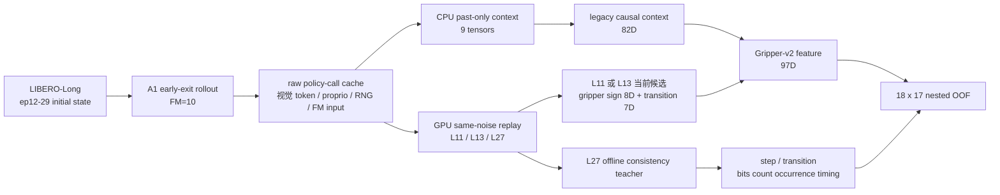

# V3-D2 fresh development 采集与训练协议

## 结论

V3-D2 在读取任何 fresh development label 之前，已经固定了数据边界、A1 权重、phase 权重、同噪声重放层、97D 特征、离散 gripper target、模型家族和 nested OOF 选择规则。当前协议状态为：

```text
PASS_V3_D2_COLLECTION_CONTRACT
```

本阶段只允许访问 `libero_10` 的 `development_v2`：10 个任务 × episode 12–29，共 180 个 task-episode group。episode 30–39（calibration）、40–49（independent test）以及旧 C3.61 row payload 仍然封存。

## 为什么必须重新采集

旧 M4.28 cache 的 canonical key 是：

```text
libero_spatial:taskN:episodeM
```

V3-D2 的 key 是：

```text
libero_10:taskN:episode12..29
```

二者不是同一个 suite。即使 episode 数字相同，也不能把 Spatial 数据冒充 LIBERO-Long fresh development 数据。

## 从 rollout 到 97D/target 的流程



关键隔离约束：

- 每个 runtime feature call 只能看到一个当前候选动作；另一个候选不可见。
- L27 只用于离线 same-noise consistency label，不是 expert，也不是 success label。
- feature 中不包含 task id、episode id、seed、success、reward、behavior exit 或 L27 action。
- 历史窗口先读取、后 commit，当前动作不能出现在自己的 context 中。

## 固定输入

| 输入 | SHA-256 |
|---|---|
| D1 protocol | `3a5f5ebe49ddee093dc352ab4d46f7bbfea66486bc94d12d925d4eb40d2eaad2` |
| development selection | `59af8441d4207b23e4ade2dff5b987d70490e9f6ab7aff50b97255e0292436eb` |
| A1 `model.pt` | `dcafd9ee8a3d3a4ced8840e59c90b0c4b20d41a7900adc9ff469c1a57e631b7f` |
| A1 config | `9365d0a6ca6379a77877aaf46e170a7945f084c359560463edc14726965b04ca` |
| LIBERO-Long action-delta sidecar | `a0d0399b630953a9e0ef3b4ca09fe8a0fbde4b1ce6539ad5d911ad23fb6c812d` |
| LIBERO-Long threshold sidecar | `a98d9e2c79d83846f5a778b52fc32b4803bdaf2a49aab5e3d961d2e624139796` |
| PhaseStateEstimator | `b601f8221d47136818d7a008eaf7cee06e1201bf514f371ae33f42cfb39515a1` |

运行时在 worktree 的 ignored `model/v3_d2/libero_exit/` 中放置 `model.pt` hard link 和 sidecar 副本。这样 33.8GB 权重不重复占空间，同时 threshold writer 不会触碰只读 `source/model/libero_exit/`。

## 97D 特征

```text
[0:82]   冻结的 causal action/phase/vision context
[82:90]  当前候选 8-step gripper sign，编码为 -1 / +1
[90:97]  当前候选 7 个相邻 gripper transition bit
```

82D 部分包含 phase scalar/statistics、当前与历史 proprio、当前候选与历史 action chunk 的统计量、history temporal RMS 和 masked vision crop statistics。它不包含原 C3.40 最后的 4D exit-layer one-hot，因此总维度保持 82。

## 离散 target

对 L11、L13 分别与同噪声 L27 比较：

- `step_mismatch_bits`：8 个二值位；count 支持 0–8。
- `transition_mismatch_bits`：7 个二值位；count 支持 0–7。
- `occurrence`：`count > 0`。
- `first_transition_mismatch`：0 表示无 mismatch，1–7 表示首个 mismatch 位置。

旧的 continuous positive magnitude target 被明确禁用。其根本原因是 gripper 是符号/状态序列问题，连续幅值 MAE 会把错误的统计结构强加给离散切换事件。

## 固定模型

- occurrence：anchored Bernoulli logistic GLM；两目标、共享 layer-independent 97D residual head，layer-specific fold-train prevalence anchor。
- baseline count：zero-truncated binomial GLM。
- primary count：ordinal cumulative-link GLM；严格递增、可训练的 layer-specific cutpoints。
- 所有 97D linear head 均无自由 bias，residual weight 从精确 0 初始化。
- 特征 normalization 只用当前 fit partition。
- 优化器固定为 CPU FP64、full-batch LBFGS strong-Wolfe；L2 网格为 `1e-3, 1e-2, 1e-1`。

## nested OOF 与门槛

外层按 episode index 做 18-fold LOEO：每折同时 hold out 10 个任务的同一个 episode。每个 outer train 再做 17-fold inner LOEO，candidate pair 和同 episode 全部 policy calls 不得拆分。

通过条件沿用 D1 冻结门槛：

- occurrence 的 Brier skill > 0、AUROC > 0.5，overall/L11/L13 全部通过；
- expected-fraction SSE ratio < 1，两个 target 的 overall/L11/L13 全部通过；
- ordinal 相对 ZT-binomial 的 conditional NLL：两个 overall target 均改善；4 个 layer×target 至少 3 个改善；最差 ratio ≤ 1.01；
- 至少 13/18 outer episode 的 ordinal conditional NLL 优于 ZT-binomial。

未通过时状态必须冻结为 negative result，不得访问 calibration 数据去补救，也不得事后切换模型家族。

## GPU 边界

所有 GPU runner 都要求：

```text
physical_gpu_index ∈ {0,1,2,3}
CUDA_VISIBLE_DEVICES 与 physical index 完全一致
进程内 torch.cuda.device_count() == 1
host UUID 与 visible UUID 一致
```

GPU 4–7 在代码中直接拒绝。LIBERO/MuJoCo EGL 需要在沙箱外运行，并设置 `MUJOCO_GL=egl`、`PYOPENGL_PLATFORM=egl` 和 `MUJOCO_EGL_DEVICE_ID=0`（每个单卡进程内部可见设备编号均为 0）。

## 当前验证

```text
63 passed, 22 subtests passed   # D0/D1/D2 collection contract 联合测试
8 passed                        # 三类 GLM 数值与 fail-closed 测试
PASS_V3_D2_RAW_TASK_PREFLIGHT   # task0 / physical GPU0，只读预检
```

预检确认 task0 的 ep12–29 seed、18 个 initial-state SHA、A1 hard-link inode/device/size、全部 sidecar hash 和 GPU0 UUID 均一致；预检没有加载模型、没有 rollout、没有打开 calibration/test payload。

