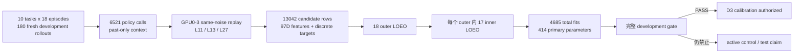

# V3-D2 正式 development 结果

## 1. 结论

2026-08-20 的 fresh `libero_10/development_v2` 正式运行得到：

```text
PASS_V3_D2_FULL_DEVELOPMENT_GATE
```

这意味着 Gripper-v2 的 97D 因果特征与 ordinal count head 在完全嵌套、按 episode 留一的 OOF 条件下通过了预先冻结的完整 development gate。它授权进入 D3 calibration，但不等于部署通过，也不构成 independent-test superiority claim。

机器可读冻结记录位于：

```text
results/v3/v3_d2_formal_development_result.json
```

## 2. 端到端证据链



数据边界始终为 task 0--9、episode 12--29。episode 30--39 calibration、40--49 independent test 和旧 C3.61 row payload 均未打开。

## 3. Rollout 与数据完整性

| 项目 | 正式结果 |
|---|---:|
| task-episode groups | 180/180 |
| 成功 rollout | 161/180（89.44%） |
| policy calls | 6521 |
| L11/L13 candidate rows | 13042 |
| 97D feature rows | 13042 |
| source worktree | clean |
| candidate GPU | 物理 GPU0--3 |
| GPU4--7 | 未使用 |

每个 layer × target 的 180/180 task-episode cells 都同时包含零样本和正样本；最差 cell 仍至少有 4 个正样本、5 个零样本，所以 conditional-count loss 没有通过删除空 cell 获得虚假改善。

原始采集时 task4/5/7 因 MuJoCo 在仓库根写入 `MUJOCO_LOG.TXT` 被完整隔离，随后在 `.gitignore` 修复后按相同 seed clean 重采。三项任务的 success、policy call 数和 exit layer 全部一致。去除时间戳/延迟后，task5/7 完全一致；task4 只有连续 4/525 个调用存在 GPU/MuJoCo 浮点差异，退出层变化为 0。正式数据只使用 clean 重采结果。

## 4. Nested OOF 审计

| 项目 | 数值 |
|---|---:|
| outer folds | 18 |
| inner folds / outer | 17 |
| task-episode cells / lambda / outer | 170 |
| inner fits | 4590 |
| outer refits | 90 |
| final refits | 5 |
| 总 fits | 4685 |
| primary 参数量 | 414（上限 512） |

18 个 outer fold 的 lambda 选择完全一致：occurrence 为 `0.01`，其余 ZT/ordinal step/transition 均为 `0.1`。这比不同折频繁跳动更有利于说明正则化选择稳定。

## 5. 核心结果

### 5.1 mismatch occurrence

| Target | Overall Brier skill | Overall AUROC | L11 AUROC | L13 AUROC |
|---|---:|---:|---:|---:|
| step | 0.6281 | 0.9453 | 0.9561 | 0.9345 |
| transition | 0.6271 | 0.9452 | 0.9558 | 0.9346 |

Brier skill 相对 fold-train layer prevalence baseline 均为正，AUROC 明显高于 0.5。当前最强的 development 证据是：模型能准确识别“是否会出现 gripper mismatch”。

### 5.2 expected mismatch fraction

SSE ratio 越低越好，`1.0` 表示仅使用 fold-train layer mean：

| Target | Overall | L11 | L13 |
|---|---:|---:|---:|
| step | 0.5311 | 0.5119 | 0.5606 |
| transition | 0.4315 | 0.3976 | 0.4707 |

六个 scope 全部严格优于 baseline。

### 5.3 positive conditional count：ordinal vs ZT-binomial

NLL ratio 越低越好，`1.0` 表示与冻结的 ZT-binomial comparator 持平：

| Target | Overall | L11 | L13 |
|---|---:|---:|---:|
| step | 0.9767 | 0.9676 | 0.9888 |
| transition | 0.9914 | 0.9952 | 0.9869 |

4/4 layer × target scope 均严格改善。改善幅度小于 occurrence 任务，但方向跨全部 scope 一致。

### 5.4 group robustness

18/18 个 outer episode 上，ordinal 的 task/layer/target 等权 conditional NLL 都优于 ZT-binomial：

```text
exact one-sided sign-test p = 3.814697265625e-06
```

这比协议要求的至少 13/18 更强，说明整体 NLL 改善并非由少数 episode 主导。

## 6. 科学解释

当前结果支持三个有限结论：

1. past-only phase/action/vision context 加当前候选 gripper sign/transition，能够可靠预测 L11/L13 相对同噪声 L27 的离散 gripper 不一致风险；
2. 把 positive count 作为有序离散变量建模，比强加 binomial 形状更合适，而且 18 个 outer episode 方向一致；
3. 这为“先预测风险，再校准是否允许早退”的运行时设计提供了可信 development 依据。

当前结果不支持以下扩张性表述：

- L27 是正确动作或 expert；它只是 frozen A1 的同噪声 consistency teacher；
- OOF 风险预测已经提升了 LIBERO 成功率；尚未运行 active control；
- development 结果等同于独立测试；episode 40--49 尚未打开；
- 已经优于 A1/CogVLA 的最终系统性能；尚未完成校准、shadow 与独立测试。

## 7. D3 的唯一合法下一步

D3 只能在 episode 30--39 calibration 上完成预先冻结的阈值选择和安全性检查：

- 固定使用 D2 final-refit 模型与 97D 特征；
- 不再修改模型家族、特征或 lambda；
- calibration 用于阈值/决策规则，不用于重新训练 414 个参数；
- 先做离线或 shadow 决策，不直接 active control；
- episode 40--49 继续封存，直到 D3 合同明确授权。

只有 D3 calibration gate 通过，才能讨论后续 shadow rollout；只有 shadow gate 通过，才可能授权 independent test。
