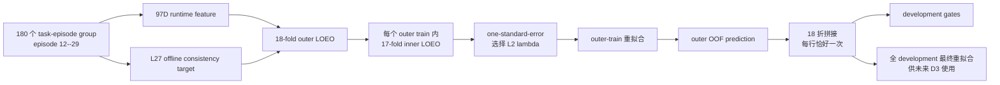

# V3-D2 Gripper-v2 Nested OOF 实现说明

## 1. 本阶段回答什么问题

V3-D2 只使用 fresh `libero_10/development_v2`，检验 97D 因果特征是否能预测 L11/L13 相对同噪声 L27 的离散 gripper 不一致风险。它不是最终部署实验，也不选择运行时阈值。



## 2. 严格数据边界

- 允许：`libero_10` task 0--9、episode 12--29。
- 禁止：episode 30--39 calibration、40--49 independent test、旧 C3.61 row payload。
- group key 是 `libero_10:task{task}:episode{episode}`。
- 一个 group 内的全部 policy calls 与 L11/L13 candidate pair 永不拆分。
- task id、episode id、seed、success、reward、behavior exit 和 L27 action 都不是 97D runtime input。
- L27 只是离线同噪声 consistency teacher，不是 expert action 或 success label。

## 3. 18 × 17 nested OOF

外层按 episode index 留一：第 `e` 折同时留出十个任务的 episode `e`。外层训练集的 17 个 episode 再逐个作为 inner validation，其余 16 个 episode 用于拟合。

每个 outer fold、每个 lambda 的 inner validation 被压成 170 个等权 cell：

```text
17 个 inner episode × 10 个 task = 170 cells
```

cell 内同时包含 L11/L13 与该 task-episode 的全部 calls。occurrence cell loss 是两个 target 的平均 BCE；conditional-count cell loss 是该 target 正样本的平均 NLL。若任何 conditional-count cell 没有正样本，流程 fail closed，而不是删 cell 或改用 row weighting。

## 4. 五个独立的 lambda 选择单元

固定网格为：

```text
{1e-3, 1e-2, 1e-1}
```

五个选择单元是：

1. `occurrence`：一个联合 GLM，同时输出 step-any 与 transition-any；
2. `zt_step`：step positive count 的 ZT-binomial comparator；
3. `zt_transition`：transition positive count 的 ZT-binomial comparator；
4. `ordinal_step`：step positive count 的 ordinal primary；
5. `ordinal_transition`：transition positive count 的 ordinal primary。

每个单元先找 inner 170-cell mean loss 最小的 lambda，再取“最小 mean + 1 SE”范围内最大的 lambda。outer validation 完全不参与选择。

## 5. 拟合次数审计

每个 outer fold：

```text
inner: 17 × 3 lambdas × 5 heads = 255 fits
outer refit:                           5 fits
合计:                               260 fits
```

全 D2：

```text
18 × 260 outer/nested fits = 4680
full-development final refit =       5
总计 =                            4685 fits
```

所有拟合都是 CPU FP64、full-batch LBFGS strong-Wolfe；normalizer、layer prevalence anchor、ZT anchor 和 ordinal cutpoint 只能从当前 fit partition 计算。

## 6. OOF 输出与 baseline

每个 flattened candidate row 输出：

- occurrence probability `[N,2]`；
- ZT-binomial conditional distributions：step `[N,8]`、transition `[N,7]`；
- ordinal conditional distributions：step `[N,8]`、transition `[N,7]`；
- ordinal hurdle expected fraction `[N,2]`；
- fold-train layer occurrence prevalence baseline `[N,2]`；
- fold-train layer mean expected-fraction baseline `[N,2]`。

OOF 聚合要求每行 assignment count 精确为 1，所有 count 分布为严格正、归一化的概率单纯形。

## 7. Development gates

### Occurrence

step/transition 的 overall、L11、L13 均要求：

- Brier skill 相对 fold-train layer prevalence 严格大于 0；
- tie-aware AUROC 严格大于 0.5。

### Expected fraction

step/transition 的 overall、L11、L13 raw SSE ratio 均严格小于 1。

### Conditional count

- step/transition overall ordinal NLL ratio 均严格小于 1；
- full gate 要求四个 layer × target ratio 全部严格小于 1；
- focused non-deployable gate 允许四项中至少三项改善，但最差项不得超过 1.01。

### Group robustness

每个 outer episode 对 10 task × 2 layer × 2 target 的 40 个 positive-only cell NLL 等权平均。18 个 episode 至少 13 个 ordinal 优于 ZT-binomial，并满足单侧 exact sign test：

```text
k = 13 / 18 -> p_upper = 0.048126220703125
```

任一 40-cell 缺少正样本时，该 outer episode 记为 inconclusive，不能算 improvement。

## 8. 最终 refit 与声明边界

每个 head 的最终 lambda 是 18 个 outer-selected lambda 的众数；众数并列时选择更大的 lambda。最终 primary occurrence + ordinal 可训练参数为 414，低于冻结上限 512。ZT-binomial 只作为 comparator 一并保存。

即使 development gate 通过，本阶段仍然：

- 不选择 runtime threshold；
- 不运行 shadow/active control；
- 不打开 calibration/test；
- 不作 independent-test superiority claim；
- 不授权部署。

## 9. 正式命令顺序

```bash
env CUDA_VISIBLE_DEVICES=-1 \
  /home/haozheng/.conda/envs/a1/bin/python \
  scripts/dynamic_compute/v3/prepare_v3_d2_context.py \
  --raw-root reports/v3_d2_development_raw \
  --phase-checkpoint /data3/haozheng/A1/source/reports/m2_phase_estimator_v1_seed20260803/phase_estimator.pt \
  --output-dir reports/v3_d2_development_context

bash scripts/dynamic_compute/v3/run_v3_d2_replay_front4.sh

env CUDA_VISIBLE_DEVICES=-1 \
  /home/haozheng/.conda/envs/a1/bin/python \
  scripts/dynamic_compute/v3/aggregate_v3_d2_dataset.py \
  --context-result reports/v3_d2_development_context/result.json \
  --candidate-root reports/v3_d2_development_candidates \
  --output-dir reports/v3_d2_development_dataset

bash scripts/dynamic_compute/v3/run_v3_d2_oof_cpu.sh

env CUDA_VISIBLE_DEVICES=-1 \
  /home/haozheng/.conda/envs/a1/bin/python \
  scripts/dynamic_compute/v3/aggregate_v3_d2_oof.py \
  --dataset-result reports/v3_d2_development_dataset/result.json \
  --fold-root reports/v3_d2_development_oof_folds \
  --output-dir reports/v3_d2_development_oof
```
