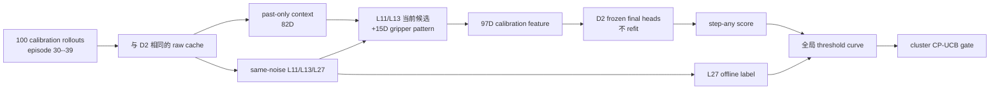

# V3-D3 Gripper-v2 校准协议

## 1. 阶段目标

D2 已在 fresh development 上通过完整 gate。D3 的唯一任务是用 `calibration_v2` 选择一个运行时 gripper risk 阈值，并用 task-episode cluster 级别的 exact upper confidence bound 判断它是否足够安全。

```text
calibration_v2 = libero_10 task 0--9 x episode 30--39 = 100 clusters
```

D3 不重新训练 414 个模型参数，不切换特征、模型家族或 score，不访问 episode 40--49 independent test，也不运行 active control。

## 2. 为什么只使用一个 score

D2 final occurrence head 输出：

```text
[P(any step mismatch), P(any transition mismatch)]
```

D3 在打开 calibration label 前固定：

```text
gripper_score = P(any step mismatch)
safe_call = gripper_score <= threshold
```

step mismatch 直接对应“候选 8-step gripper 状态是否在任一位置不同于同噪声 L27”。任一 transition mismatch 必然伴随某个 step mismatch；若正式 target 违反这个包含关系，整个 calibration fail closed。

不在 calibration 上比较 `step probability`、`transition probability`、ordinal expected fraction 再挑最好的一项，因为那会把一次阈值校准变成未校正的多重模型选择。ordinal 输出仍作为 mismatch 严重度的次要报告指标保留。

## 3. 单一全局阈值

一个阈值同时用于：

- L11 与 L13；
- task 0--9；
- episode 内所有 policy call；
- 所有阶段和时间点。

不允许 per-layer、per-task 或事后 phase-specific 阈值。候选阈值为 calibration 上全部有限 score 的升序唯一值，安全判定使用 `<=`；不把 `-inf` 或“全部 defer”塞入候选网格。

## 4. Cluster false-safe

每个 task-episode 是一个 cluster。对给定阈值：

```text
safe cluster
  = cluster 中至少有一个 predicted-safe candidate call

false-safe cluster
  = safe cluster 中至少有一个 predicted-safe call 真实存在 step mismatch
```

false-safe rate 的分母只包括 safe clusters。一个 episode 内即使只出现一次错误放行，整个 cluster 也记为 false-safe；这比把数千个高度相关的 policy call 当独立样本更保守。

## 5. Exact UCB gate

对 `k` 个 false-safe clusters / `n` 个 safe clusters，使用单侧 95% exact Clopper--Pearson 上界：

```text
UCB95 = BetaPPF(0.95; k+1, n-k)
```

边界审计：

| 观测 | UCB95 | 是否小于等于 0.05 |
|---|---:|---:|
| 0/58 | 0.05034 | 否 |
| 0/59 | 0.04951 | 是 |
| 1/100 | 0.04656 | 是 |
| 2/100 | 0.06162 | 否 |

这说明 100-cluster 校准并不会因为观测到 `0` 次错误就自动通过；若只放行少量 clusters，置信上界仍然过宽。

完整通过条件：

```text
100/100 clusters 完整
safe cluster coverage >= 0.10
false-safe cluster UCB95 <= 0.05
```

阈值选择规则是：在满足上述条件的候选中最大化 safe-cluster coverage；coverage 相同时取更小、更保守的 threshold。

## 6. 输入输出结构



正式输出至少包括：selected threshold、safe/false-safe cluster 数、coverage、empirical rate、UCB95、每层/每任务支持，以及 threshold curve 的可审计记录。

## 7. 通过之后仍然不能做什么

`PASS_V3_D3_CALIBRATION_GATE` 只授权 D4 shadow decision：在 rollout 中记录“如果启用新 gate 会如何选择”，但仍由原 A1 行为控制环境。

它不授权：

- active early-exit control；
- episode 40--49 independent test；
- 部署；
- 成功率提升或优于 A1/CogVLA 的结论。

若 D3 不通过，必须冻结 negative result；不能放松 5% UCB、改 score、改成 per-layer threshold 或用 test 数据补救。
