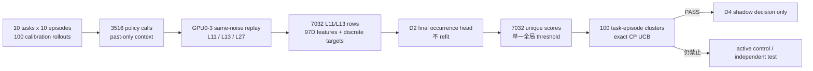

# V3-D3 正式 calibration 结果

## 1. 结论

2026-08-20 的 fresh `libero_10/calibration_v2` 正式运行得到：

```text
PASS_V3_D3_CALIBRATION_GATE
```

固定的 D2 Gripper-v2 occurrence head、固定的 97D 因果特征和固定的全局阈值规则，在 100 个 task-episode calibration clusters 上通过了预先冻结的安全校准门。

核心结果为：

- 全局阈值：`0.043773197319646726`；
- safe clusters：100/100；
- false-safe clusters：0/100；
- 单侧 95% exact Clopper--Pearson UCB：`0.02951304960703993 < 0.05`；
- predicted-safe candidate rows：671/7032（9.54%）；
- 671 行中的 step/transition mismatch 均为 0。

机器可读冻结记录位于：

```text
results/v3/v3_d3_formal_calibration_result.json
```

这个 PASS 只授权进入 D4 shadow decision。它不授权 active control、independent test、部署或成功率优越性声明。

## 2. 端到端证据链



数据边界始终为 task 0--9、episode 30--39。episode 40--49 independent test 没有打开。

## 3. Raw rollout 与数据完整性

| Task | 成功 rollout | Policy calls | Mean exit ratio |
|---:|---:|---:|---:|
| 0 | 10/10 | 334 | 0.5816 |
| 1 | 10/10 | 329 | 0.6653 |
| 2 | 10/10 | 314 | 0.6829 |
| 3 | 9/10 | 309 | 0.6288 |
| 4 | 9/10 | 328 | 0.6830 |
| 5 | 8/10 | 301 | 0.6033 |
| 6 | 10/10 | 291 | 0.6206 |
| 7 | 10/10 | 312 | 0.6804 |
| 8 | 7/10 | 552 | 0.6140 |
| 9 | 7/10 | 446 | 0.7250 |
| **合计** | **90/100** | **3516** | — |

所有 10 个 raw task 均通过 `PASS_V3_D3_RAW_TASK`，3516 条 policy telemetry 与 3516 条 teacher cache manifest 完全对应。四个 replay shard 各 879 行，物理 GPU 严格为 GPU0--3；GPU4--7 未使用。工作树在 raw、context、candidate、dataset 和 calibration 各阶段均为 clean。

这里的 90% rollout 成功率是 frozen A1 behavior collection 的描述性统计，不是 PhaseRoute 控制效果。D3 没有让新路由器接管动作，因此不能把 90% 解释为本方法提升后的成功率。

## 4. 冻结阈值规则

每个 L11/L13 candidate row 的唯一主分数为：

```text
score = P(any step mismatch | frozen D2 occurrence head)
safe_call = score <= global_threshold
```

禁止在 calibration 标签上切换到 transition score、ordinal severity、per-layer threshold 或 per-task threshold。D2 的 414 个主参数没有在 calibration 上 refit。

cluster 定义为一个 task-episode。只要 cluster 内至少有一个 predicted-safe row，就计为 safe cluster；只要其中任意 predicted-safe row 实际发生 step mismatch，就计为 false-safe cluster。门槛是：

```text
safe cluster coverage >= 0.10
one-sided exact CP UCB95(false-safe rate) <= 0.05
```

always-defer 不算有效 PASS。

## 5. 阈值选择审计

| 项目 | 正式结果 |
|---|---:|
| 唯一候选阈值 | 7032 |
| 可行阈值 | 2647 |
| 选中 curve index（0-based） | 670 |
| 选中 threshold | 0.0437731973 |
| safe clusters | 100/100 |
| false-safe clusters | 0/100 |
| safe cluster coverage | 100% |
| false-safe cluster UCB95 | 2.9513% |

阈值曲线严格递增。选中项的前一项阈值为 `0.043747432245880916`，只能覆盖 99 个 clusters；选中项首次达到 100 个 clusters。所有达到最大可行覆盖率的阈值中，当前阈值是最小者，因此严格满足冻结的 tie-break 规则。

0/100 不是“真实风险为零”。exact UCB 给出的有限样本保守上界仍为 2.9513%，这也是报告 UCB 而不只报告经验错误率的原因。

## 6. Candidate-row 结果

| Scope | Candidate rows | Predicted-safe rows | Safe fraction | Safe step mismatch |
|---|---:|---:|---:|---:|
| L11 | 3516 | 145 | 4.12% | 0 |
| L13 | 3516 | 526 | 14.96% | 0 |
| **Overall** | **7032** | **671** | **9.54%** | **0** |

完整 candidate 集中有 2730/7032（38.82%）step-mismatch rows；选中阈值把 671 个低风险 rows 分离出来，经验 step/transition mismatch 都为 0。L13 的安全支持显著高于 L11，符合“更深层通常更接近 L27 teacher”的预期。

必须区分两种 coverage：

- `safe_cluster_coverage=100%`：每个 episode 至少有一个安全候选；
- `safe_candidate_fraction=9.54%`：所有 layer-candidate rows 中实际被阈值接受的比例。

因此不能把 100% cluster coverage 表述成“所有调用都可以提前退出”。

## 7. 当前支持的科学结论

当前结果支持：

1. D2 development 上训练并冻结的 step-occurrence 风险分数能够迁移到未用于训练的 calibration episodes；
2. 单一全局阈值在全部 10 个任务和 100 个 calibration episodes 上取得非平凡安全支持；
3. predicted-safe 子集没有观察到 gripper step mismatch，且 cluster-level exact UCB 低于预设 5% 上限；
4. 因为每个 cluster 都至少有一个安全候选，下一阶段有足够覆盖率进行 shadow decision 审计。

当前结果不支持：

- L27 是 expert 或正确动作；它只是 frozen A1 的同噪声 consistency teacher；
- gripper consistency 等价于完整 7D action 正确性；平移和旋转风险尚未由此 gate 覆盖；
- calibration PASS 已提升 LIBERO 成功率或效率；尚未运行 PhaseRoute active control；
- 可以查看 episode 40--49 independent test；D3 明确不授权；
- 已经优于 A1、CogVLA 或其他系统的最终性能。

## 8. D4 的唯一合法下一步

D4 只能做 shadow decision：让冻结阈值在不改变环境动作的情况下给出“若部署将选择 L11、L13 或 defer”的决策，并审计：

- 每个实际决策只能使用当时可见的 past-only context 和当前 candidate；
- selected threshold、D2 heads、97D feature 和决策优先级全部固定；
- 报告 shadow L11/L13/defer 比例、预计计算节省和 false-safe 事件；
- shadow decision 不得影响 action、环境状态或成功率；
- independent test 与 active control 继续禁止，直到 D4 协议预先冻结且 shadow gate 通过。

D4 前仍需先冻结 shadow 决策优先级。例如，L11 与 L13 都安全时是否优先 L11，必须在查看 shadow 结果之前明确，不能事后为了更高节省率调整。
