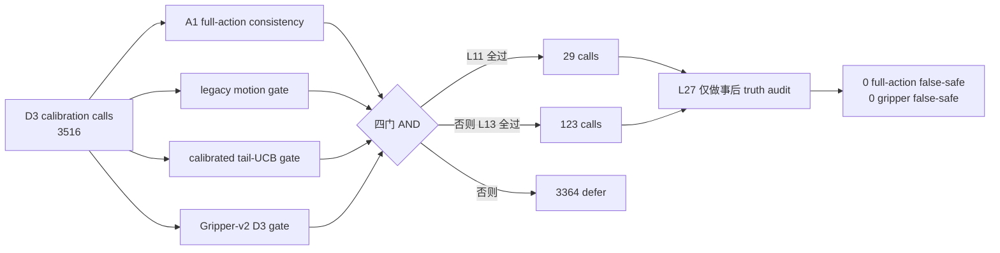

# PhaseRoute-VLA v3 D4B：正式 shadow 结果

## 1. 正式结论

```text
NEGATIVE_V3_D4B_FORMAL_SHADOW_GATE
```

这次判负不是因为观察到了错误早退，而是因为零错误 cluster 支持量比 exact-UCB 门槛少 1 个：

```text
0 / 58 false-safe clusters
UCB95 = 0.0503393383 > 0.05
```

在相同门槛下，`0/59` 才会低于 5%。预注册规则不能在看完结果后改成 `<=5.1%`，也不能临时放宽任一 gate 来多覆盖一个 cluster。

## 2. 从输入到 shadow 决策



## 3. 核心结果

| 指标 | 数值 |
|---|---:|
| policy calls | 3,516 |
| shadow L11 | 29（0.825%） |
| shadow L13 | 123（3.498%） |
| defer L27 | 3,364（95.677%） |
| 总 early-exit fraction | 4.323% |
| safe clusters | 58/100 |
| false-safe calls | 0/152 |
| false-safe clusters | 0/58 |
| exact UCB95 | 5.0339% |
| 预注册上限 | 5.0000% |

解析 RP-PEP solve 口径从行为 A1 的 35,956 次降到 24,279 次，估算减少 32.48%。这没有计入 risk heads/adapter 的运行时开销，也不是端到端实测 latency，因此只能作为继续研究的效率信号。

## 4. 任务覆盖问题

Task 0、1、4 的 shadow early exit 为 0；Task 7 也只有 2 次。大部分 L13 选择集中在 Task 2、3、5、8、9。说明当前方法不是单纯“再放宽一点即可部署”，而是 legacy motion/tail anchors 与新 Gripper-v2 gate 的组合存在明显任务不均衡。

## 5. 对方法的反思

当前四门 AND 的科学方向是正确的：它把 A1 的完整动作一致性、连续动作风险、tail 上界和夹爪离散风险分开，避免了只凭 Gripper-v2 分数退出。但工程实现仍有两点局限：

1. motion/tail 来自旧 82D legacy heads，虽然 feature prefix 已精确对齐，但并非在 v3 新 development split 上联合训练；
2. 四个独立 veto 会叠加保守性，不能利用它们之间的相关结构，最终只有 58 个 cluster 获得支持。

更合理的后续方向是在全新的 development 数据协议上训练一个联合 full-action reliability head，直接预测“完整动作一致且夹爪一致”的 cluster-aware 风险；同时保留四个可解释分量作为不可补偿的诊断或 hard veto。不能用本次 episode 30--39 重新选阈值、模型或 loss。

### 5.1 冻结后的 leave-one-gate-out 归因

| 只读消融 | early calls | safe clusters | false-safe calls/clusters | UCB95 | 解释 |
|---|---:|---:|---:|---:|---|
| 四门冻结方法 | 152 | 58 | 0 / 0 | 5.034% | 正式判负 |
| 去掉 motion | 515 | 100 | 1 / 1 | 4.656% | 事后会过门，但禁止部署 |
| 去掉 tail | 152 | 58 | 0 / 0 | 5.034% | 当前交集上完全不变 |
| 去掉 action consistency | 152 | 58 | 1 / 1 | 7.920% | A1 consistency 拦住了真实错误 |
| 去掉 gripper | 1,357 | 100 | 553 / 100 | 100% | Gripper-v2 不可删除 |

Motion 是主要覆盖瓶颈：455 个 candidate 只因 motion 一项被 veto；Tail 在最终交集内没有唯一 veto。去掉 motion 的消融只是诊断，说明新 development 版本应改进 motion/joint reliability 表达，不能据此修改当前冻结策略。

## 6. 结论边界

- 本阶段没有 active control，原 D3 的 90/100 行为成功结果没有被改变；
- 无法统计“真实闭环因提前退出导致失败”的次数，因为没有执行 shadow action；
- episode 40--49 independent test 继续封存；
- 当前不授权部署、成功率提升、实测加速或优于 A1/CogVLA 的声明；
- 下一步只授权 negative-result analysis 和新的 development-only 协议设计。
