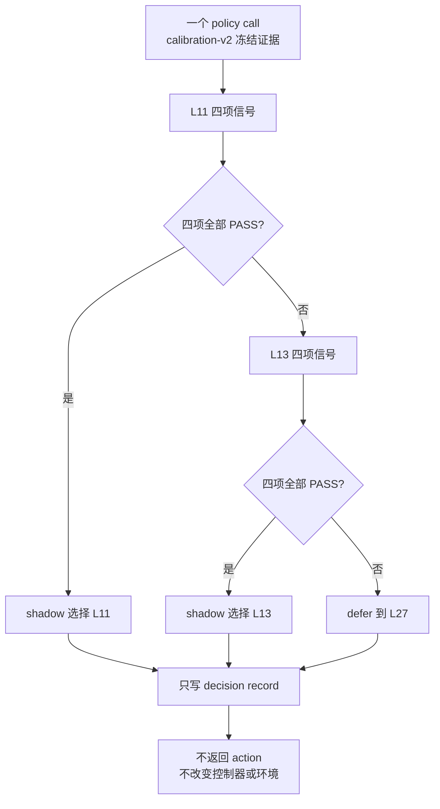

# PhaseRoute-VLA v3 D4.0：四重安全门 shadow 协议

## 1. 阶段结论

D4.0 先冻结决策语义和失败边界，不直接运行正式 shadow，更不改变环境动作。最终候选必须满足：

```text
route_safe = original_action_consistency
             AND motion_safe
             AND tail_ucb_safe
             AND gripper_safe
```

四项不可互相补偿。缺失、非有限或未校准的信号只会否决当前候选并继续更深计算。

这一步修正了一个重要的科学歧义：D3 的 Gripper-v2 阈值只证明夹爪二值序列相对 L27 的一致性，不能证明平移、旋转或完整 7D 动作安全，也不能替代 A1 的动作一致性条件。

## 2. 决策流程



当 L11、L13 同时满足时固定优先 L11；不允许在查看分布后为了提高节省率改变优先级。

## 3. 四项门控的边界

| 门控 | 输入 | 判定 | 当前状态 |
|---|---|---|---|
| A1 完整动作一致性 | `[8,7]` 动作块或冻结 telemetry 标量 | horizon 平均的 7D cosine distance `<=0.00390625` | 公式冻结 |
| Motion | 只使用因果 82D context 的平移/旋转风险 | 必须有独立冻结阈值 | 阈值尚未在 v3 冻结 |
| Tail-UCB | 候选相对 L27 的 full-action `L∞` 校准上界 | 必须有独立冻结阈值 | 阈值尚未在 v3 冻结 |
| Gripper-v2 | 97D 当前候选特征的 step occurrence score | `score<=0.043773197319646726` | D3 已冻结 |

L13 不是原 A1 已校准出口。D4 对 L13 只定义研究候选：它必须满足 L11→L13 同噪声完整动作一致性，并通过其余三个门；不能因为 L13 的 Gripper-v2 覆盖率更高就直接放行。

## 4. 为什么本阶段不直接运行正式 shadow

旧 PhaseRoute-v2 的 C3.55/C3.58 证据中存在 82D motion/tail predictor 和 tail conformal correction，但当前 v3 尚未完成三项必要绑定：

1. 证明旧 82D context 与 v3 97D feature 的 `[0:82]` 逐元素语义一致；
2. 绑定 predictor、calibration artifact 与实现源码 SHA；
3. 在查看 v3 shadow 选择分布前冻结 motion/tail 的 runtime 阈值。

因此 D4.0 只授权 `V3-D4A_SIGNAL_ADAPTER_IMPLEMENTATION_AND_ATTESTATION_ONLY`。如果任意一项不能证明，正式策略必须 fail closed，而不是把该门默认为 true。

## 5. 统计和效率口径

正式 shadow 至少报告 L11/L13/L27 数量、比例、每项 veto 原因、task×episode cluster false-safe 和 exact Clopper--Pearson 95% UCB。always-defer 不算通过；early-exit call fraction 至少 1%，false-safe cluster UCB95 不高于 5%。

RP-PEP 的估算 FM solve 口径冻结为 L11/L13/L27 对应 4/5/7 次。它只是解析成本，不等于实测 latency；正式结果必须把估算量和实测量分开。

## 6. 仍然禁止

- episode 40--49 independent test；
- active control 或改变环境 action；
- 重训 D2 Gripper-v2 heads 或修改 D3 全局阈值；
- 把 L27 称作 expert、碰撞安全或任务成功证书；
- 声称已经提高 LIBERO 成功率、优于 A1/CogVLA 或可部署。
