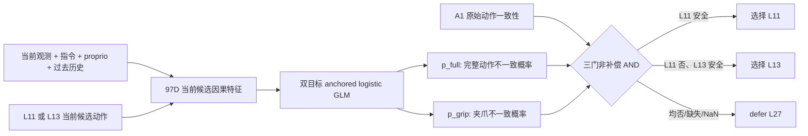
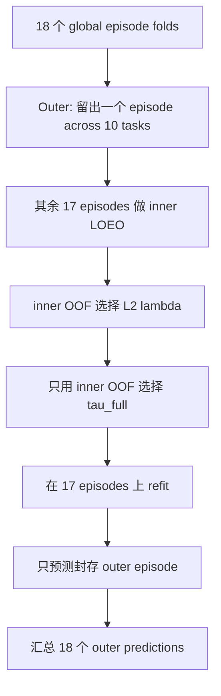

# V3-D5 联合可靠性开发协议

## 1. 为什么进入 D5

D4B 的正式 shadow 结果不是“模型跑坏了”，而是一个边界明确的统计失败：152 / 3516 次调用会早退，覆盖 58 个 cluster，观察到 0 个 false-safe cluster，但 one-sided exact Clopper–Pearson UCB95 为 `0.0503393`，略高于冻结上限 `0.05`。合同不能事后放宽为 5.1%。

冻结消融进一步说明：

- Gripper-v2 不能删除；删除后 100 / 100 个 cluster 都出现 false-safe。
- A1 原始动作一致性门不能删除；它确实拦住了一个完整动作错误。
- legacy tail 在最终交集中没有唯一 veto。
- legacy motion 是覆盖率主要瓶颈：单独 veto 455 个候选，把 safe cluster 从 100 压到 58，但仅额外拦住一个完整动作错误。

因此，D5 不在已经查看过的 calibration_v2 上删除 motion“补考”，而是回到 development_v2，用预注册的 nested OOF 研究一个直接对应完整 7D 动作风险的低容量模型。

## 2. 数据边界

只允许使用：

```text
LIBERO-10
task 0--9
global episode 12--29
180 task×episode clusters
6521 policy calls
13042 L11/L13 candidate rows
```

明确封存：

```text
episode 30--39: 已用于 D3/D4，不允许用于 D5 修复、选模型或选阈值
episode 40--49: independent_test_v2，继续禁止访问
```

D5 合同冻结与 metadata-only 验证期间只读取 JSON 和 SHA-256，不反序列化 `.pt`，也不查看新联合目标的分布。

## 3. 从输入到输出



最终候选门为：

```text
route_safe =
    A1_original_action_consistency
    AND p_grip <= 0.043773197319646726
    AND p_full <= tau_full
```

`p_grip` 的概率阈值沿用 D3 在 D5 之前已经冻结的全局阈值。为避免 cross-fold 标签泄漏，Gripper-v2 的同族低容量 head 必须在每个 D5 inner/outer 训练分区内重训；不能直接拿会间接包含 outer 标签信息的跨折分数参加 inner 阈值选择。

旧 motion/tail 只允许作为诊断输出，不能继续作为 D5 hard veto，也不能在正式结果出来后临时加回或删除。

## 4. 离线监督目标

L27 只作为同噪声 consistency teacher，不是 expert、成功标签、无碰撞证书或任务完成证书。

对候选层 `l ∈ {11,13}`：

```text
d_full(l) = mean_t [1 - cosine(a_l[t, 0:7], a_27[t, 0:7])]
full_action_unsafe(l) = d_full(l) > 0.00390625

state(x) = 1 if x >= 0 else 0
gripper_step_unsafe(l) = any_t state(a_l[t,6]) XOR state(a_27[t,6])

false_safe(l) = full_action_unsafe(l) OR gripper_step_unsafe(l)
```

输入动作张量为 `[6521, 3, 8, 7]`：三层是 L11/L13/L27，动作 horizon 为 8，单步动作为 7D。模型运行时只看到当前候选对应的 97D 特征，不看到 L27、另一候选、task/episode identity、未来观测或 rollout success。

## 5. 为什么采用双目标低容量模型

模型输出两个不互相补偿的风险，而不是把 translation、rotation、tail、gripper 混成一个可抵消总分：

- `p_full` 直接学习完整 7D 候选到 L27 的一致性风险，替代与当前目标错配的 legacy motion/tail hard veto。
- `p_grip` 保留 D4 消融已经证明必需的专门夹爪保护。

模型是 two-target layer-anchored logistic GLM：

- 每个目标 97 个线性 residual 权重，共 194 个特征参数，硬上限 256。
- 没有自由 bias；L11/L13 只选择训练分区内的经验概率 anchor。
- 标准化均值、方差、anchor 和模型权重全部只能从当前 fit partition 估计。
- L2 网格固定为 `{0.001, 0.01, 0.1}`。
- 禁止事后切换 MLP、树模型、task-specific head 或 per-task/per-layer 阈值。

这不是为了假设线性模型一定最优，而是首先回答一个可证伪的问题：当前 97D 因果特征是否已经包含足够的完整动作可靠性信息。低容量模型能降低 180 个 cluster 条件下的过拟合风险。

## 6. 严格 nested OOF



每个 outer fold 中：

1. 留出同一个 global episode index 在全部 10 个 task 上的样本。
2. 对剩余 17 个 episode 再做 17-fold inner LOEO。
3. 用 170 个 inner task-cell NLL 和 one-standard-error rule 选最大可接受 L2。
4. 只用 inner OOF 预测和标签选 `tau_full`。
5. 在 outer training 的 17 个 episode 上 refit，再预测从未进入 normalizer、anchor、模型和阈值选择的 outer episode。

候选对和 task×episode cluster 在任何 fit 中都不可拆分。最终每个 development row 恰好获得一次 outer-OOF 预测。

## 7. 阈值与正式门槛

`tau_full` 的候选集合固定为：通过 A1 和冻结 gripper 门的 inner-OOF 候选中，所有有限 `p_full` 的排序唯一值。

每个可接受 inner 阈值必须同时满足：

- safe cluster 至少 60；
- early-exit call fraction 至少 5%；
- 10 个 task 均有非零 early-exit；
- false-safe cluster 的 one-sided exact CP-UCB95 不超过 5%。

选择目标固定为：最大 early-exit calls，其次最大 safe clusters，再其次更小阈值。如果没有可行阈值，该 outer fold 必须 always defer 并标记 infeasible，不能临时放宽门槛。

最终 development gate 需要：

```text
6521 calls / 13042 rows / 180 clusters 完整
18 个 outer fold 全部可行
safe clusters >= 60
early-exit call fraction >= 5%
10 个 task 均有支持
false-safe cluster exact CP-UCB95 <= 5%
```

## 8. 声明边界与后续动作

即使 D5 development gate 通过，也只能说明该联合可靠性设计在严格 development nested OOF 下值得继续。它不等于闭环成功率、独立测试、实测加速或部署安全。

D5 通过后的正确下一步是设计并采集一组新的 fresh calibration 数据，而不是回看或重新利用 episode 30--39 修补阈值。episode 40--49 继续作为 independent test 封存，直到模型、阈值协议和新校准流程全部冻结并通过。
