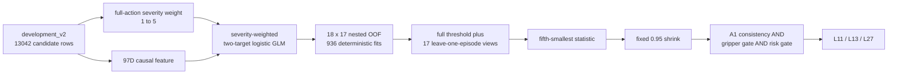

# V3-D6 严重度稳健路由正式开发结果

## 1. 结论

V3-D6 的冻结状态是：

```text
NEGATIVE_V3_D6_DEVELOPMENT_SELECTION
```

它提高了提前退出覆盖和解析计算收益，但没有减少 D5 的四个 false-safe cluster，因此仍未越过冻结的 exact cluster 风险门：

| 指标 | D5 | D6 | D6 - D5 |
|---|---:|---:|---:|
| L11 / L13 / L27 calls | 199 / 760 / 5562 | 208 / 844 / 5469 | +9 / +84 / -93 |
| early-exit calls | 959 | 1052 | +93 |
| early-exit fraction | 14.7063% | 16.1325% | +1.4262 pp |
| safe clusters | 179 | 179 | 0 |
| false-safe clusters | 4 | 4 | 0 |
| false full-action calls | 4 | 4 | 0 |
| false gripper calls | 0 | 0 | 0 |
| exact CP-UCB95 | 0.0504043 | 0.0504043 | 0 |
| estimated FM reduction | 35.7197% | 36.0076% | +0.2880 pp |

冻结上限是 `CP-UCB95 <= 0.05`。D6 的 `0.0504043022` 仍超出 `0.0004043022`，因此不能写成 promising/pass selection，更不能进入 independent test。

## 2. 本次到底验证了什么

D6 复用了已经分析过的 development_v2（task 0--9、episode 12--29）。它是一次方法选择实验，不是 fresh confirmation，也不是与 D5 的无偏比较。



每个 outer episode 在 normalizer、layer anchor、模型参数、lambda 和阈值选择中均被完整隔离。18 个 outer fold 各执行 52 次拟合，总计 936 次；每个候选行恰好获得一次 outer-OOF score。18/18 个稳健阈值均可行。

calibration_v2、episode 40--49 independent_test_v2、rollout 和 active control 均未使用。训练与聚合强制 CPU-only，没有占用 GPU0--7。

## 3. D6 相对 D5 的修改

### 3.1 严重度加权

full-action truth threshold 为 `0.00390625`。D6 对 full-action BCE 使用：

```text
ratio  = full_action_distance / 0.00390625
weight = 1 + clamp(log2(max(ratio, 1)), 0, 4)
```

权重范围为 1--5；gripper loss 保持不加权。实际 13042 行的权重分布为：

| 区间 | 行数 |
|---|---:|
| weight = 1 | 10452 |
| 1 < weight <= 2 | 1082 |
| 2 < weight <= 3 | 617 |
| 3 < weight <= 4 | 243 |
| 4 < weight <= 5 | 648 |

平均权重为 1.3434，p95 为 3.9337，最大值为 5。

### 3.2 稳健阈值

每个 outer fold 都只从 inner-OOF score 中计算：

1. 一个全量 inner threshold；
2. 17 个 leave-one-inner-episode threshold；
3. 取 17 个阈值的第五小值；
4. 以“全量阈值”和“第五小值”的较小者作为 base；
5. 固定乘 `0.95` 得到 runtime threshold，禁止再次优化。

该机制的目的是限制单个 episode 对阈值的影响，但它没有为每个样本产生 uncertainty upper bound。

## 4. 预测信号与路由结果

| 输出 | OOF AUROC | OOF log loss | OOF Brier |
|---|---:|---:|---:|
| full-action severity risk score | 0.92362 | 0.41818 | 0.13256 |
| gripper-step probability | 0.94495 | 0.29729 | 0.08931 |

full-action 输出经过严重度加权后不再解释为严格校准概率，所以 log loss 和 Brier 只作为诊断。AUROC 从 D5 的 0.92868 略降到 0.92362；gripper AUROC 基本不变，并继续保持 0 个正式选择错误。

D6 的 1052 次提前退出覆盖全部 10 个 task：

```text
per-task early calls:
63, 143, 132, 183, 56, 53, 72, 92, 118, 140
```

## 5. 四个错误为什么仍然存在

| task | episode | layer | distance / truth threshold | weight | risk / runtime threshold | risk / pre-shrink base |
|---:|---:|---:|---:|---:|---:|---:|
| 0 | 14 | 13 | 17.03x | 5.000 | 0.9553 | 0.9075 |
| 3 | 16 | 11 | 1.02x | 1.029 | 0.6431 | 0.6109 |
| 3 | 22 | 11 | 2.28x | 2.189 | 0.4326 | 0.4110 |
| 9 | 29 | 13 | 1.34x | 1.424 | 0.8907 | 0.8462 |

四个错误与 D5 是同四个 task×episode cluster，并且仍全部是 full-action-only。

严重度加权不是完全无效：最严重的 task0/episode14 从 D5 中明显偏低的相对 score 被推到了 D6 runtime threshold 的 95.5%。但是，inner 数据上以覆盖最大化为目标选出的风险阈值也随着 score 尺度上移，抵消了加权带来的相对分离收益。固定 `0.95` 只把该样本推到边界附近，没有否决它。

更关键的是 task3/episode22 的 score 仅为 runtime threshold 的 43.3%。这不是把 `0.95` 微调成 `0.94` 就能根治的问题，而是当前 97D point-score 模型对该 tail 样本仍存在明显 misranking。

## 6. 对失败的科学解释

D6 暴露了三个结构性问题：

1. **训练权重和选择阈值存在尺度补偿。** 提高严重正例 loss 会提高风险 score，但如果随后仍在同一 score 分布上最大化可行覆盖，阈值可能同步提高。
2. **jackknife threshold 不是 per-sample uncertainty。** 17 个 threshold view 衡量的是全局阈值稳定性，无法识别“这个具体候选特征位于训练分布稀疏区”。
3. **cluster 风险门样本量非常离散。** 179 个 safe cluster 下，4 个错误不能通过，而 3 个错误可以通过。不能因此删除一个错误后就宣称模型总体安全；下一次必须使用新的确认数据。

因此后续重点不应是继续事后微调统一 multiplier，而应把“平均风险 score”升级为“样本级风险上界或拒绝机制”，例如 inner-model disagreement、conformal residual/UCB 或 feature-space out-of-distribution veto。任何新方案都必须先预注册，并在新的 calibration/confirmation 数据上验证。

## 7. 声明边界与下一步授权

当前只授权：

```text
D6_NEGATIVE_RESULT_ANALYSIS_ONLY
```

不授权：

- 复用 episode 30--39 修 D6 或选新阈值；
- 打开 episode 40--49 independent test；
- active control、deployment 或 superiority claim；
- 把 D6 写成 fresh confirmation、闭环成功或真实端到端加速。

若负结果分析支持新的 D7 假设，下一步应先冻结 D7 protocol，再实现和测试；不能直接在这份 D6 outer truth 上反复试到通过。

## 8. 可核验证据

```text
D6 contract SHA:
28185ce5431cf438d20cb7cfdfd0e20d5859b6a99f1bdafa81d18faef59fd7a1

D6 contract validation SHA:
1e14491bfe256377762d47d007bc943677e990b474321913e6e912e98ec4e422

D6 formal OOF report SHA:
7f82486c38ea3b01fd64332db04cf5f56ee81bb34ae4965e29fd632cc5a83ec2

D6 OOF payload SHA:
f4230860e6c45fd1a60db66330775eaf791a130e4ab0eb9dc282a2941cfed296

D6 formal attestation SHA:
c8bda5b40afb93c5fe815e71224da1e0f99570e4b73970e4cf8489b78fd62fc6
```
