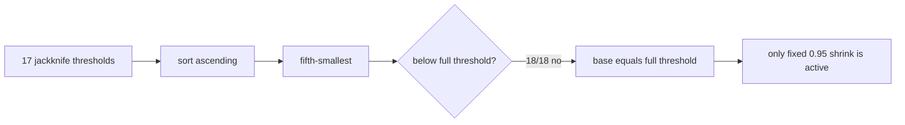

# V3-D6 负结果机理分析

## 1. 分析边界

本阶段只分析已经冻结的 D5/D6 development_v2 OOF 证据，没有重新拟合模型、选择运行阈值或打开新数据：

```text
model refit:                 0
calibration episode 30--39:  未打开
independent episode 40--49:  未打开
rollout / active control:    未执行
GPU initialization/query:    0
```

正式分析状态为：

```text
PASS_V3_D6_NEGATIVE_RESULT_ANALYSIS
```

这表示负结果被完整复现且原因得到量化，不表示 D6 通过，也不授权 independent test。

## 2. 最重要的三个发现

### 2.1 D6 保留了 D5 的同四个失败

D5 和 D6 的 false-safe source row 完全一致：

```text
90, 2090, 2261, 6514
```

四个错误仍位于 task0/episode14、task3/episode16、task3/episode22、task9/episode29，全部是 full-action-only；没有 gripper 错误。

| task/episode | 真实 distance 比例 | D5 score/threshold | D6 score/runtime threshold | D6 score/base |
|---|---:|---:|---:|---:|
| 0/14 | 17.03x | 0.712 | 0.955 | 0.908 |
| 3/16 | 1.02x | 0.557 | 0.643 | 0.611 |
| 3/22 | 2.28x | 0.356 | 0.433 | 0.411 |
| 9/29 | 1.34x | 0.967 | 0.891 | 0.846 |

严重度加权确实把最严重的 17.03x 错误推到了阈值附近，但没有改变最终决策。task3/episode22 仍远低于阈值，说明 point-score tail misranking 没有解决。

### 2.2 jackknife 分支实际没有激活

```text
outer folds:                                      18
至少一个 jackknife view 低于 full threshold:      15
第五小阈值真正降低 pre-shrink base 的 folds:        0
jackknife activation fraction:                    0 / 18
```



原因不是所有 view 都完全相同，而是低阈值通常只出现在一至少数几个 leave-one-episode view 中；第五小统计量过于靠后，因此无法响应这种稀疏不稳定性。

### 2.3 覆盖增加来自 102 个新提前退出，但不构成新验证

D5→D6 有 136 个调用改变了路由：

```text
newly early:       102
withdrawn early:     9
net early change:   +93
```

在这份复用的 development 数据上，102 个新增提前退出没有新增错误，9 个撤回调用原本也没有错误。因此 D6 的覆盖提升是真实可复现的开发现象，但由于数据已经用于 D6 设计，它不是无偏比较或 fresh confirmation。

主要路由转换为：

| D5→D6 | calls |
|---|---:|
| L27→L13 | 95 |
| L27→L11 | 7 |
| L13→L27 | 8 |
| L11→L27 | 1 |
| L11↔L13 | 25 |

## 3. 为什么继续调统一 multiplier 不是根治

以下是明确标记为 post-hoc、runtime 未授权的诊断：

| base multiplier | early calls | false clusters | CP-UCB95 | runtime authorized |
|---:|---:|---:|---:|---|
| 0.95（正式 D6） | 1052 | 4 | 0.05040 | 是，但正式失败 |
| 0.90 | 1051 | 3 | 0.04274 | 否 |
| 0.80 | 1046 | 2 | 0.03475 | 否 |
| 0.60 | 1025 | 1 | 0.02637 | 否 |
| 0.40 | 941 | 0 | 0.01669 | 否 |

数值上，0.90 就能少一个错误并越过当前开发门；但要拒绝全部四个，multiplier 必须严格低于约 0.411。这两个事实同时说明：

1. 4→3 的 exact gate 跳变很离散，不能把事后 0.90 冒充稳健成功；
2. 为了用统一阈值覆盖最深的 misranking，需要极强全局收缩，会错误惩罚大量正常样本；
3. 应对“特定样本是否可信”建模，而不是继续搜索一个全局常数。

## 4. D7 必须解决的问题

D7 protocol design 应满足以下硬约束：

- 目标必须是样本级 epistemic uncertainty 或 feature OOD 风险；
- 不能只是另一个看完 D6 后选择的统一 multiplier；
- 保留已经验证为 0 错误的专用 gripper gate；
- runtime 参数量和延迟必须有上限；
- 在任何新拟合前冻结模型、阈值、数据角色和门槛；
- episode 12--29 只能支持设计，不能再声称确认；
- episode 30--39 不得用于修复或选择；
- episode 40--49 继续封存。

优先考虑的结构不是大模型堆叠，而是小型 uncertainty companion：例如多个 inner GLM 的样本级分歧、低秩特征距离/OOD veto，或对 full-action residual 构造的保守上界。D7 设计阶段需要先比较这些方案的可实现性和防泄漏方式，再冻结唯一协议。

## 5. 下一步授权

```text
D7_PROTOCOL_DESIGN_ONLY_USING_D5_D6_AS_REUSED_DEVELOPMENT_EVIDENCE
```

这里只授权 D7 协议设计，不授权训练、独立测试、active control 或 superiority claim。

## 6. 证据哈希

```text
D6 formal result:
c8bda5b40afb93c5fe815e71224da1e0f99570e4b73970e4cf8489b78fd62fc6

D6 raw negative analysis:
f9d36526615aff7c12e591076f5885c950b2bc4db5fde01595a1b579fe9f4726

D6 negative-analysis attestation:
e3005e3dd51b5f712c034607d1130180a7d79e7f8354f7298b7840751f2b9fd7
```
