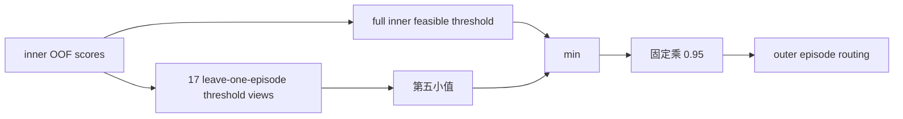

# V3-D6 严重度感知与稳健阈值协议

## 1. 阶段定位

D6 是看过 D5 development 负结果后的方法修复，不是新的独立验证。它允许复用 episode 12--29 来选择下一版方法，但任何 D6 数值都必须写成 development selection：

```text
D6 result != fresh confirmation
D6 result != independent test
D6 result != closed-loop success
```

episode 30--39 不允许用于修复或选阈值，episode 40--49 independent test 继续封存。

## 2. D5 暴露的两个不同问题

D5 的四个 full-action false-safe 中：

- 一个真实距离达到阈值的 17.03 倍，但风险分数只有运行阈值的 71.2%；
- 一个达到 2.28 倍，分数只有阈值的 35.6%；
- 一个仅为 1.02 倍，属于 truth 边界样本；
- 一个分数达到运行阈值的 96.7%，可由轻微安全余量拦住。

因此需要同时处理：

1. binary loss 不区分严重和轻微违规；
2. 18 个 outer threshold 最大/最小相差 2.275 倍。

## 3. 严重度加权风险学习

full-action target 本身保持不变：

```text
unsafe = mean_t[1-cosine(a_candidate[t], a_L27[t])] > 0.00390625
```

只修改训练损失权重。令：

```text
ratio = full_action_distance / 0.00390625
weight = 1 + clamp(log2(max(ratio, 1)), 0, 4)
```

对应关系为：

| distance ratio | weight |
|---:|---:|
| ≤1× | 1× |
| 2× | 2× |
| 4× | 3× |
| 8× | 4× |
| ≥16× | 5× |

Gripper target、loss 和冻结阈值保持不变。严重度与 L27 action 只在离线训练目标侧使用，运行时仍只有 97D 当前候选因果特征。

模型仍为 194 参数的双目标 anchored logistic GLM，避免在 180 clusters 上引入高容量 MLP。full-action anchor 使用训练分区内的严重度加权正例率，gripper anchor 使用普通正例率。

## 4. 稳健阈值

每个 outer fold 中，完成 17-fold inner OOF 后：

1. 在全部 inner OOF 上按 D5 exact CP 规则选择一个可行阈值；
2. 再构造 17 个 threshold jackknife views，每次丢掉一个 inner global episode；
3. 17 个 view 必须全部可行；
4. 取 17 个阈值的第五小值；
5. `base = min(full_inner_threshold, fifth_smallest_jackknife_threshold)`；
6. 最终 `runtime_threshold = 0.95 × base`，乘完后禁止重新优化。



第五小值用于降低单个 episode 对阈值的影响；0.95 来自 D5 后的开发假设，所以必须明确记录为 post-D5 method selection，不能把 D6 当成未见数据验证。

## 5. 路由结构

```text
route_safe =
    A1 original action consistency
    AND gripper_score <= 0.043773197319646726
    AND severity_risk_score <= robust_runtime_threshold
```

候选优先级仍为 L11→L13→L27。任何缺失、NaN 或不可行 jackknife threshold 都 fail closed。

## 6. Development-selection 标准

只有同时满足以下条件才标记为 `PROMISING_V3_D6_DEVELOPMENT_SELECTION`：

- 6521 calls、13042 candidate rows、180 clusters 完整；
- 18 个 outer fold 全部完成，所有 robust thresholds 可行；
- safe clusters ≥60；
- early-exit call fraction ≥5%；
- 10 个 task 均有 early-exit；
- false-safe cluster exact CP-UCB95 ≤5%；
- gripper false-safe 仍为 0；
- full-action false clusters 不超过冻结 D5 的 4 个。

即使满足，也只授权设计 fresh calibration 协议，不授权 independent test、active control 或部署。
