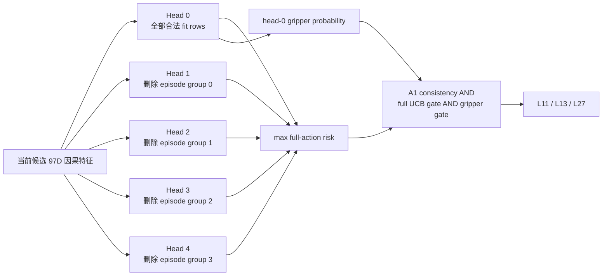

# V3-D7 样本级不确定性 ensemble 协议

## 1. 设计目标

D7 不再继续搜索统一阈值 multiplier，而是让每个候选动作拥有自己的保守风险上界。它只解决 D6 已明确暴露的问题：point score 在少量 tail 样本上过度自信。

D7 仍是复用 development_v2 的方法选择，不是 fresh confirmation。

## 2. 模型结构



五个 head 都沿用 D6 的 97D、layer anchor、严重度加权 logistic GLM。区别仅在训练数据：

- head 0 使用当前防泄漏 fit partition 的全部行；
- head 1--4 分别额外删除一个固定的 global-episode modulo-4 group；
- full-action runtime score 取五个 head 的最大值；
- gripper 继续只使用 head 0 的未加权概率，避免破坏已经观察到 0 错误的专用 gate。

episode identity 只用于构造训练删除组，不进入 runtime feature。

## 3. 为什么使用 delete-group max

它同时满足三个要求：

1. **样本级。** 只有对训练 episode 组成敏感的候选才会出现较大的 head range 或最大风险。
2. **防泄漏。** 每个 inner/outer 验证 episode 都从所有五个 head 的训练数据中排除。
3. **轻量。** 五个 head 合计 970 个 feature weights；相比 VLA 主干可以忽略，但仍必须单独测量 runtime latency。

最大值不解释为校准概率，而是 delete-group epistemic upper score。

## 4. nested OOF

每个 outer fold：

```text
17 inner episodes × 3 lambdas × 5 heads = 255 fits
outer ensemble                              =   5 fits
fits per outer                             = 260
18 outer folds total                       = 4680 fits
```

inner prediction 使用五头 full-action maximum 和 head-0 gripper score。lambda 仍按 170 个 task cell 的 one-standard-error rule 选择。

阈值使用 inner OOF 上的 exact feasible threshold，再固定乘 D6 已预注册的 `0.95`；乘法后不得重新优化，且收缩后的 inner route 必须仍可行。D6 中未激活的第五小 jackknife 分支被删除。

## 5. 冻结开发门

D7 只有同时满足以下条件才可写成 `PROMISING_V3_D7_REUSED_DEVELOPMENT_SELECTION`：

- 6521 calls、13042 rows、180 clusters 完整；
- 18 个 outer 预测恰好赋值一次且全部有限；
- 所有收缩阈值可行；
- safe clusters 至少 60；
- early-exit fraction 至少 10%；
- 10 个 task 均有提前退出；
- exact CP-UCB95 不超过 0.05；
- full-action false clusters 不超过 3；
- gripper false calls 为 0；
- 至少 1% 的行具有大于 `1e-6` 的 full-action head range，防止 ensemble 退化成重复 head。

即使全部通过，也只授权设计新的 confirmation 数据协议，不授权打开 independent test。

## 6. 数据与声明边界

```text
episode 12--29:  reused development，只能做 D7 selection
episode 30--39:  不得用于 D7 修复或选择
episode 40--49:  independent test 继续封存
GPU:              D7 GLM nested OOF 禁止使用
active control:   禁止
```

D7 结果不能写成 D5/D6 的无偏 superiority、fresh confirmation、闭环成功或真实端到端加速。

## 7. 后续执行顺序

1. 校验并冻结本合同 SHA；
2. 实现五头 fit/predict、delete-group mask 与 nested OOF；
3. 合成测试检查所有验证 episode 从五头训练集排除；
4. 全量回归并提交 clean commit；
5. CPU 并行运行 18 outer folds；
6. 聚合、分析和冻结结果。
