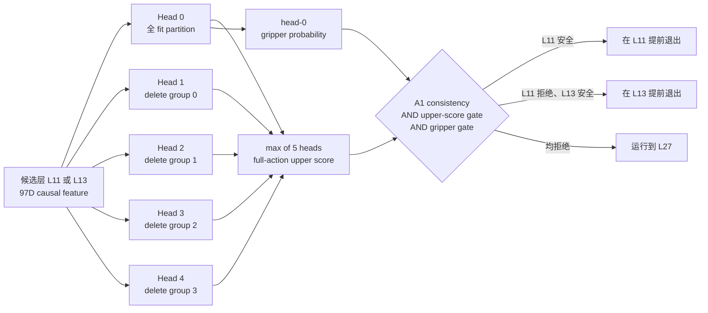

# V3-D7 五头认知不确定性路由正式开发结果

## 1. 冻结结论

D7 的正式冻结状态是：

```text
PROMISING_V3_D7_REUSED_DEVELOPMENT_SELECTION
```

这表示五头 delete-group epistemic upper score 在**复用的 development_v2** 上通过了预注册开发门，可以作为后续全新确认实验的候选方法。它不表示 fresh confirmation、D7 对 D5/D6 的无偏 superiority、闭环任务成功或已经测得真实端到端加速。

| 指标 | D5 | D6 | D7 |
|---|---:|---:|---:|
| L11 / L13 / L27 calls | 199 / 760 / 5562 | 208 / 844 / 5469 | 200 / 706 / 5615 |
| early-exit calls | 959 | 1052 | 906 |
| early-exit fraction | 14.7063% | 16.1325% | 13.8936% |
| safe clusters | 179 | 179 | 179 |
| false-safe clusters | 4 | 4 | 2 |
| false full-action calls | 4 | 4 | 2 |
| false gripper calls | 0 | 0 | 0 |
| exact CP-UCB95 | 0.0504043 | 0.0504043 | 0.0347524 |
| estimated FM reduction | 35.7197% | 36.0076% | 35.5646% |

D7 用约 0.81 个百分点的 early-exit coverage 换掉了 D5/D6 四个 false-safe cluster 中的两个，并首次使冻结的 `CP-UCB95 <= 0.05` 门通过。由于 episode 12--29 已用于 D5、D6 的诊断和 D7 方法设计，这个变化只能是有希望的开发集观察，不能当作独立泛化证据。

## 2. D7 从输入到路由输出

每个候选层首先产生 97 维因果特征。五个轻量逻辑回归 head 使用相同结构和严重度加权 full-action 目标，但训练 episode 子集不同：head 0 使用合法 fit partition 的全部 episode，head 1--4 分别额外删除一个固定的 episode group。



full-action 输出是五头最大值，用来对训练 episode 组成敏感的候选提高风险；它不应解释为严格校准概率。gripper 继续使用 head 0 的未加权概率，因为 D5/D6 的专用 gripper gate 已观察到 0 次错误。

## 3. 防泄漏训练审计

数据范围为 LIBERO-10 的 task 0--9、episode 12--29，共 180 个 task×episode cluster、6521 次 policy call 和 13042 个候选行。

```text
每个 outer fold:
17 inner episodes × 3 lambdas × 5 heads = 255 fits
outer ensemble                              =   5 fits
                                               --------
                                               260 fits

18 outer folds × 260 fits = 4680 fits
```

- 18/18 outer fold 成功，每行恰好获得一次 outer-OOF 预测；
- outer episode 不参与 normalizer、layer anchor、模型参数、lambda 或 threshold 选择；
- 18/18 fold 的固定 `0.95` 收缩阈值仍可行；
- 18 个 fold 均选择 `lambda=0.01`；
- calibration_v2、episode 40--49 independent test、fresh rollout 和 active control 均未打开；
- 全过程为 CPU-only，GPU query/initialization 计数为 0。

## 4. 不确定性信号是否真实非退化

13042/13042 行的五头 full-action range 均大于 `1e-6`，远高于预注册的至少 1% 非退化门。

| head range 统计 | 数值 |
|---|---:|
| mean | 0.0471323 |
| min / p50 | 0.0008604 / 0.0382964 |
| p90 / p95 | 0.0951216 / 0.1189939 |
| p99 / max | 0.1741644 / 0.2712352 |

这证明五个 head 没有退化成重复预测，但不能单凭 range 非零证明它已经在新分布上校准。

| OOF 输出 | AUROC | log loss | Brier |
|---|---:|---:|---:|
| full-action epistemic upper score | 0.92353 | 0.44609 | 0.14346 |
| head-0 gripper probability | 0.94532 | 0.29669 | 0.08907 |

full-action upper score 的 log loss/Brier 只作为诊断，因为 max 聚合后的分数不是概率校准目标。路由是否安全仍由预注册的 cluster-level exact gate 判定。

## 5. 正式路由结果

D7 的 906 次提前退出覆盖全部 10 个 task：

```text
per-task early calls:
40, 136, 122, 170, 37, 46, 51, 84, 89, 131
```

全部预注册 gate 均通过：

- 906/6521 = 13.8936%，高于 10% 最低 coverage；
- 179 个 safe cluster，高于 60 个最低要求；
- 2/179 个 false-safe cluster，exact CP-UCB95 为 0.0347524；
- 2 个 full-action false cluster，不超过冻结上限 3；
- 0 个 gripper false call；
- 所有 task 均有非零提前退出；
- ensemble 非退化门、数据完整性门和 threshold feasibility 门均通过。

估计的 RP/PEP forward-module 调用为 43635，相对已观察 A1 behavior 的 67719 次为 35.5646% 减少。但该估计没有包含五头路由器的实际时延，也没有测量端到端 wall-clock latency，所以不能称为实测加速。

## 6. 四个 D6 错误发生了什么

D7 不再把 D6 中最严重的 task 0 / episode 14（约 17× action threshold）和 task 9 / episode 29 提前退出；二者均回退到 L27。剩余两项仍全部属于 full-action-only，gripper 保持 0 错误：

| task | episode | layer | 5-head upper score | head range | outer runtime threshold |
|---:|---:|---:|---:|---:|---:|
| 3 | 16 | L11 | 0.35648 | 0.09040 | 0.49143 |
| 3 | 22 | L11 | 0.20952 | 0.04121 | 0.48195 |

task 3 / episode 16 的最大 head 比 head 0 的分数更保守，但仍未达到阈值；task 3 / episode 22 的五个 head 一致偏低，说明 delete-group disagreement 不能识别所有共同模型偏差。后者仍是下一次 fresh confirmation 中最重要的风险类型，但禁止继续针对这两个开发错误事后修 D7。

## 7. 科学解释

D7 支持的最窄结论是：在相同的已复用开发记录上，将 D6 的单点严重度风险换为 delete-group 最大风险，与 false cluster 从 4 降到 2 同时出现，并保留了 13.89% 的提前退出覆盖和 0 个 gripper 错误。

它尚未回答三个问题：

1. 该改进能否在从未用于方案设计的全新 episode 上复现；
2. 五头计算开销加入后，实际 wall-clock latency 是否仍显著下降；
3. shadow replay 中的 action consistency 是否能转化为 closed-loop task success。

因此当前不能汇报“D7 已经优于 A1/CogVLA”或“安全提前退出问题已经解决”。正确表述是“D7 已成为通过开发门、值得进行 fresh confirmation 的候选路由器”。

## 8. 后续唯一授权

当前只授权：

```text
FRESH_CONFIRMATION_DATA_PROTOCOL_DESIGN_ONLY
```

下一阶段可以设计一份不可更改的全新确认数据合同，包括数据来源、样本量、cluster unit、成功/失败判据、停止规则和后续解封顺序。当前不授权：

- 打开 episode 40--49 independent test；
- 复用 episode 30--39 修复 D7 或充当新确认；
- 针对两个残余错误继续调 threshold、feature 或 ensemble；
- active control、deployment、闭环成功、真实加速或 superiority claim。

## 9. 可核验证据

```text
D7 contract SHA:
7e1f8934e33ae33493b950eabc1142c1f6cd7103ef7b4ad735d6c8b13a5afdea

D7 contract validation SHA:
31dc77519a1ae7b03210a23301f553ca632a90df33eedb3dfcfc17b76386b829

D7 aggregate report SHA:
600370bf978450afc8756cfe7929b36b33ed9d7da716a463902e13c2d0ab3ea9

D7 aggregate payload SHA:
ada55c17e7bbf7c6a5833c2a832c77f13249a9fd3c7aff6d6e0c842dd242a35d

D7 formal attestation SHA:
4c6d267bb40d2a2b01b92ffa662d0ffb487fb09e1640ca37fa2a10ad8b1a1a07

D7 implementation commit:
ffc141297a8e5ee10a74688203c1643e158de36b

D7 freezer commit:
26515cf2828e033b952d1e197a728609b30217fe
```
