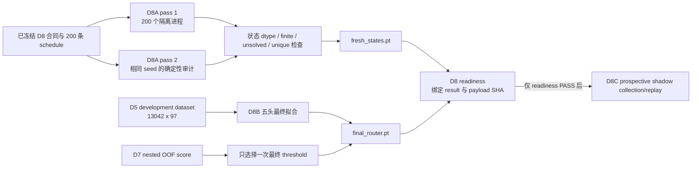

# V3-D8A / D8B 实现与 readiness 说明

## 本阶段目标

本阶段只完成 prospective confirmation 之前的两项准备工作：

1. D8A：按预注册 seed 生成 200 个全新 MuJoCo 初始状态，并用第二遍独立进程生成做逐字节确定性审计；
2. D8B：只用 development_v2 数据拟合一个最终五头 D7 router，并冻结模型与唯一 runtime threshold；
3. readiness：把 D8A 与 D8B 的结果、payload 和 SHA-256 绑定后，才允许后续 D8C shadow collection/replay。

本阶段没有加载 A1 checkpoint，没有采样策略动作，没有访问 episode 40–49，也没有运行 active control。



## D8A 输入、处理和输出

输入是冻结的 `fresh_confirmation_v1_schedule.json`。它展开为 10 个 task × 20 个 replicate，共 200 个 cluster。每条记录使用：

```text
state_seed  = 30260821 + task_id * 10000 + replicate_id
policy_seed = 40260821 + task_id * 10000 + replicate_id
```

每个 task × replicate 在一个独立 Python 进程中生成。进程在构造环境前设置 Python、NumPy 和 Torch RNG，环境构造后再把 LIBERO/NumPy RNG 固定到同一个 `state_seed`，随后直接执行一次底层 `env.reset()`。这里不调用 LIBERO wrapper 中带 `RandomizationError` 重试循环的 `reset()`，因此 invalid state 会 fail closed，不会悄悄换样本。

每条状态的形状是 `[D_task]`，dtype 被认证为 little-endian float64；不同 task 的 `D_task` 可以不同，同一 task 内必须恒定。聚合器要求：

- 两遍共 400 个隔离进程全部完成；
- 同一 cluster 两遍的 state bytes 与 SHA-256 完全相同；
- 全部元素 finite，rank 为 1，初始 success predicate 为 false；
- 每个 task 的 20 个 state SHA 全部唯一；
- 不允许 invalid、duplicate 或 solved 后更换 seed。

正式输出位于 `reports/v3_d8_fresh_states/`，其中 `fresh_states.pt` 保存 200 个变长一维状态、cluster identity、state seed、尚未使用的 policy seed 和逐状态 SHA。

## D8B 输入、处理和输出

D8B 的特征输入为 `features: [13042, 97]`，对应 6521 次 policy call 的成对候选 `L11/L13`。监督信号为：

- `unsafe_target: [13042, 2]`：full-action unsafe 与 gripper unsafe；
- `full_action_distance: [13042]`：用于 1–5 倍 severity weighting；
- `action_consistency: [13042]`：原 A1 consistency veto；
- `candidate_layer/task_id/episode_index: [13042]`。

五个 head 的结构相同，均为 CPU FP64 logistic model：

```text
97-D feature -> head-specific normalization -> 2 logits
             -> full-action unsafe probability
             -> gripper unsafe probability
```

head 0 使用全部 development rows；head 1–4 分别删除一个固定的 `(episode_index - 12) mod 4` group。每个 head 独立拟合 normalizer、anchor 和 `weight: [2, 97]`，L2 lambda 固定为 0.01。

运行时 full-action score 是五个 head 的最大 full-action probability；gripper score 只取 head 0 的 gripper probability。最终 full threshold 只从冻结的 D7 outer-OOF score 与 development truth 选择一次，runtime threshold 固定为 `0.95 × full threshold`，不在 fresh 数据上重新优化。

正式输出位于 `reports/v3_d8_final_router/`，`final_router.pt` 包含 5 个 head state、两个 threshold、固定 gripper threshold `0.043773197319646726` 与 A1 consistency threshold `0.00390625`。

## 结果边界

readiness PASS 只说明状态 payload 与 router 已按预注册规则冻结，允许开始 D8C 的原 A1 控制环境下 shadow collection/replay。它不说明 D7 已获得闭环成功，不说明生成状态是官方固定 benchmark test state，也不支持 superiority、真实 wall-clock 加速或 deployment 声明。

## 2026-08-21 正式执行结果

D8A 在 clean commit `8544d33c23143142d83ddce817cfde7f7549f948` 上完成。两遍共运行 400 个隔离进程，最大并发数为 8，总生成用时 663.25 秒。聚合结果为：

```text
records                         200
byte-identical across passes    200 / 200
initially solved                  0 / 200
unique states per task           20 / 20（全部 10 个 task）
state dimensions by task         123, 123, 47, 51, 84,
                                  45, 71, 84, 47, 47
```

D8B 的最终拟合结果为：

```text
heads                            5
lambda                           0.01
fit rows                         13042, 9596, 9146, 10106, 10278
full threshold                   0.5172957158188132
runtime threshold                0.49143093002787247
development early exits          911 / 6521 = 13.97025%
development safe clusters        179
development false-safe clusters  3
development CP-UCB95              0.04274434632269861
```

绑定 SHA-256：

```text
D8A result     ff45ff5cc5e4e9f9f61b9ee8d80cbe54b896760e066f11710a063c4b0914d622
D8A payload    203e34b0049148b9954c42b6d44ceeb9408edaf0fd073080b95e4d2958c6d56f
D8B result     76d209ef3e92dcf2a4edb329337a0481d8976ee2382d634de172904724cda70d
D8B payload    9f7360188e30e5831b18d460bf338638fb960db9374dd9cc74412f169914b830
readiness      cb13d48898c189814cc3bf02b2cb3171f7df307c3261a2fb7378c8c7a8b34829
```

第一次 D8A 调度曾因 LIBERO `sys.path` 设置错误，在环境模块导入前失败。200 个进程均未构造环境、未 reset、未生成状态；该事件已在 `results/v3/v3_d8a_pre_generation_import_incident.json` 留痕，修复没有改变合同、schedule 或 seed。它属于可审计的 pre-generation infrastructure incident，而不是状态生成或模型方法的负面结果。
