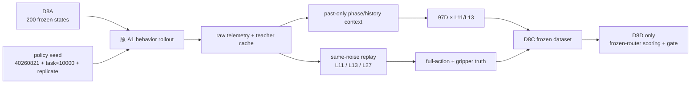

# V3-D8C 实现与正式执行说明

## 阶段目标

D8C 只完成前瞻生成状态上的数据采集和同噪声候选重放。环境始终由冻结的原 A1 early-exit policy 控制；D7 最终五头 router 在本阶段不加载、不打分，也不把动作发送给环境。只有 D8C 全部证据冻结后，D8D 才能一次性加载 router 并计算预注册确认门。



## 身份与状态边界

每个 task 使用 D8A payload 中固定的 20 个 MuJoCo FP64 state，保持 schedule 顺序。rollout 的 observer identity 是：

```text
libero_10:task{task_id}:fresh_confirm_v1:replicate{replicate_id}
```

它不会被写成 `episode0..49`，尤其不能复用仍封存的 episode 40--49。原有 rollout API 新增了可选 `episode_id_override`；不传时仍逐字保持旧格式 `suite:taskN:episodeM`，因此历史 D2/D3 和普通评测不变。

## 输入输出和维度

### 1. 原 A1 rollout

输入：一个冻结 state `[D_task]`、task instruction、双视角 RGB observation 和 8-D proprio。每次 policy query 的 behavior policy 仍是原 A1 controller。

raw cache 每行保留：

```text
projected_features       [5, 144, 3584]
image_input_idx          [5, 144]
instruction_summary      [3584]
normalized_proprio       [8]
teacher_normalized_action[8, 7]
teacher_exit_input_x     [8, 7]
FM traces                [K, 8, 7]
```

其中 `teacher` 表示本次原 A1 behavior exit，不代表专家动作。

### 2. Past-only context

CPU 阶段按同一 fresh cluster 的 call 顺序维护最长 8 步历史。当前 behavior action 只在当前行特征生成完后才提交到历史，防止未来泄漏。

```text
instruction_summary [N, 3584]
vision_crop_summary [N, 5, 3584]
vision_crop_mask    [N, 5]
phase_embedding     [N, 128]
phase_scalars       [N, 3]
normalized_proprio  [N, 8]
proprio_history     [N, 8, 8]
action_history      [N, 8, 8, 7]
history_mask        [N, 8]
```

task、replicate、policy seed 和 cluster key 只用于证据对齐，不进入 router feature。

### 3. Same-noise replay

每个 raw call 使用同一个 `teacher_exit_input_x [8,7]`，在冻结 A1 上分别重放 L11、L13、L27：

```text
candidate_actions [N, 3, 8, 7]
layer order       [11, 13, 27]
shared_fm_input_x [N, 8, 7]
```

L27 只用于离线 consistency truth，永远不进入运行时 97-D feature。

### 4. D8C dataset

每个 policy call 展开成 L11/L13 两行：

```text
features             [2N, 97]
candidate_layer      [2N]
source_row           [2N]
task_id              [2N]
replicate_id         [2N]
policy_seed          [2N]
action_consistency   [2N]
unsafe_target        [2N, 2]
full_action_distance [2N]
```

`unsafe_target[:,0]` 是候选对 same-noise L27 的 7-D 动作余弦距离是否超过 `0.00390625`；`unsafe_target[:,1]` 是 8 步 horizon 内是否存在 gripper state XOR。

## 正式命令顺序

正式运行前代码必须已提交且 worktree clean：

```bash
cd /data3/haozheng/A1/worktrees/phaseroute-v3

bash scripts/dynamic_compute/v3/run_v3_d8c_raw_front4.sh

CUDA_VISIBLE_DEVICES=-1 /home/haozheng/.conda/envs/a1/bin/python \
  scripts/dynamic_compute/v3/prepare_v3_d8c_context.py \
  --raw-root reports/v3_d8_fresh_raw \
  --phase-checkpoint /data3/haozheng/A1/source/reports/m2_phase_estimator_v1_seed20260803/phase_estimator.pt \
  --output-dir reports/v3_d8_fresh_context

bash scripts/dynamic_compute/v3/run_v3_d8c_replay_front4.sh

CUDA_VISIBLE_DEVICES=-1 /home/haozheng/.conda/envs/a1/bin/python \
  scripts/dynamic_compute/v3/aggregate_v3_d8c_dataset.py \
  --context-result reports/v3_d8_fresh_context/result.json \
  --candidate-root reports/v3_d8_fresh_candidates \
  --raw-root reports/v3_d8_fresh_raw \
  --output-dir reports/v3_d8_fresh_dataset

CUDA_VISIBLE_DEVICES=-1 /home/haozheng/.conda/envs/a1/bin/python \
  scripts/dynamic_compute/v3/freeze_v3_d8c_collection_result.py
```

两段 GPU 脚本都会验证物理 GPU 0--3 的 UUID、空闲状态以及每进程只有一张可见卡；代码级 allowlist 会再次拒绝 GPU 4--7。

## 失败与恢复规则

- 必须完成 10 task × 20 replicate，不能根据中间 outcome 停止；
- 基础设施失败只能在同 commit 上，以同 task、replicate、state 和 policy seed 重试；
- 不能更换 seed、删除失败 cluster 或补采“更好”的状态；
- 所有正式输出目录不可覆盖；若出现 `.incomplete`，先审计 `abort.json` 和 console log，再决定是否按原身份完整重跑；
- D8C 不查看最终 gate，因此本阶段的 PASS 只表示 collection/replay 完整，不表示方法确认通过。

## D8C 完成后的授权

正式冻结结果只有在全部 200 clusters 与全部 policy calls 均可对齐时才写入：

```text
PASS_V3_D8C_PROSPECTIVE_COLLECTION_AND_REPLAY
```

它只授权：

```text
D8D_APPLY_FROZEN_ROUTER_AND_AGGREGATE_CONFIRMATION_GATE
```

仍不授权 episode 40--49、active control、deployment 或 superiority claim。
