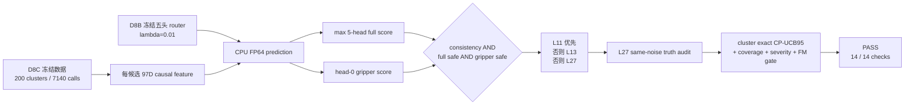

# V3-D8D 前瞻性 Shadow 确认正式结果

## 1. 结论

D8D 已在冻结的 D8C 全新生成状态数据上完成唯一一次 CPU-only 正式评分，结果为：

```text
PASS_V3_D8_PROSPECTIVE_SHADOW_CONFIRMATION
```

全部 14 项预注册 gate 同时通过。执行期间没有重新拟合模型、修改 feature、选择阈值、访问 official episode 40--49、使用 GPU 或进行 active control。

本结果证明的是：冻结的五头 PhaseRoute 路由器在 200 个协议后生成的 LIBERO reset-sampler 状态上，作为 shadow router 获得了非平凡提前退出覆盖、通过了预注册的一致性风险门，并保持了估计计算收益。它不等同于 D8 router 的闭环成功率、官方 independent test、wall-clock 加速或部署安全证明。

## 2. 从输入到正式 gate



冻结参数没有变化：

| 参数 | 正式值 |
|---|---:|
| router heads | 5 |
| L2 lambda | 0.01 |
| full threshold | 0.5172957158188132 |
| runtime full threshold | 0.49143093002787247 |
| fixed shrink | 0.95 |
| head-0 gripper threshold | 0.043773197319646726 |
| A1 action-consistency threshold | 0.00390625 |

每个候选必须同时通过三个条件；L11 safe 时优先选择 L11，否则检查 L13，两者都不 safe 才回退 L27。full-action 风险使用五头最大值，gripper 风险只使用 head 0，和 D8 合同完全一致。

## 3. 正式结果总表

| 指标 | 结果 |
|---|---:|
| fresh generated-state clusters | 200 / 200 |
| clusters per task | 20 / 20 |
| policy calls | 7140 |
| candidate rows | 14280 |
| safe clusters | 200 / 200 |
| early-exit calls | 1009 / 7140 |
| early-exit fraction | 14.1317% |
| L11 | 234（3.2773%） |
| L13 | 775（10.8543%） |
| L27 | 6131（85.8683%） |
| false-safe calls / clusters | 1 / 1 |
| empirical false-safe cluster rate | 0.5% |
| one-sided exact CP-UCB95 | 2.34985% |
| false full-action calls / clusters | 1 / 1 |
| false gripper calls | 0 |
| severe false-full calls / clusters | 0 / 0 |
| head-range `>1e-6` rows | 14280 / 14280 |
| estimated shadow FM calls | 47728 |
| observed A1 behavior FM calls | 73716 |
| estimated FM reduction | 35.2542% |

`safe clusters=200` 只表示每个 cluster 至少有一次 shadow early exit，不表示 cluster 内所有 calls 都提前退出或都安全。估计 FM reduction 使用冻结的 L11/L13/L27 `4/5/7` 次 RP/PEP FM accounting，未包含五头 router latency，也不是端到端计时结果。

## 4. 预注册 gate 逐项核对

| Gate | 冻结要求 | 观察值 | 结果 |
|---|---:|---:|---|
| 完整 clusters | 200，且每 task 20 | 200，且每 task 20 | PASS |
| rows/calls 完整 | 全部 | 14280 / 7140 | PASS |
| prediction finite | 全部 | 全部有限 | PASS |
| safe clusters | `>=120` | 200 | PASS |
| 每 task safe clusters | `>=5` | 全部 20 | PASS |
| early-exit fraction | `>=10%` | 14.1317% | PASS |
| 每 task early calls | `>0` | 最少 37 | PASS |
| false-safe CP-UCB95 | `<=5%` | 2.34985% | PASS |
| false full clusters | `<=3` | 1 | PASS |
| false gripper calls | 0 | 0 | PASS |
| severe false-full clusters | 0 | 0 | PASS |
| nondegenerate rows | `>=1%` | 100% | PASS |
| estimated FM reduction | `>=30%` | 35.2542% | PASS |
| always-defer rejection | early calls `>0` | 1009 | PASS |

这里的 CP-UCB 分母是 200 个具有至少一次 early exit 的 safe clusters，而不是把 7140 个时间相关的 policy calls 当作独立样本。

## 5. 每任务结果

| task | calls | L11 | L13 | L27 | early | safe clusters | false clusters |
|---:|---:|---:|---:|---:|---:|---:|---:|
| 0 | 750 | 1 | 45 | 704 | 46 | 20 | 0 |
| 1 | 631 | 46 | 111 | 474 | 157 | 20 | 0 |
| 2 | 639 | 37 | 108 | 494 | 145 | 20 | 0 |
| 3 | 632 | 80 | 109 | 443 | 189 | 20 | 0 |
| 4 | 618 | 2 | 35 | 581 | 37 | 20 | 1 |
| 5 | 685 | 1 | 51 | 633 | 52 | 20 | 0 |
| 6 | 669 | 5 | 62 | 602 | 67 | 20 | 0 |
| 7 | 649 | 26 | 72 | 551 | 98 | 20 | 0 |
| 8 | 1109 | 3 | 70 | 1036 | 73 | 20 | 0 |
| 9 | 758 | 33 | 112 | 613 | 145 | 20 | 0 |

所有 task 均有 early exit，所有 task 的 20 个 cluster 均至少覆盖一次 early exit。覆盖强度仍有明显 task 差异，例如 task 4 只有 37 次、task 3 有 189 次；这说明下一阶段仍需要保留 per-task 分层报告，不能只看总体平均。

## 6. 唯一 false-safe 的完整解释

唯一错误发生在：

```text
cluster:       libero_10:task4:fresh_confirm_v1:replicate18
source row:    3209
call ordinal:  0
step id:       10
selected:      L11
```

| 字段 | 值 |
|---|---:|
| full-action distance | 0.004060406173915065 |
| truth threshold | 0.00390625 |
| distance / threshold | 1.03946× |
| max five-head full score | 0.31262423723029376 |
| head-0 gripper score | 0.043394218952698 |
| gripper threshold | 0.043773197319646726 |
| full head range | 0.0469855246698514 |
| gripper mismatch | false |
| severe `>4×` | false |

该样本是轻微越过 full-action truth threshold 的边界错误，约为 1.039×，不是 gripper 错误，也不属于 `>4×` 的严重错误。它不能被删除或在当前确认数据上调参修复；D8 数据现在已经是已分析证据。

## 7. Ensemble 非退化审计

| score | mean | min | p50 | p95 | max |
|---|---:|---:|---:|---:|---:|
| max five-head full | 0.411639 | 0.008866 | 0.351758 | 0.924266 | 0.992115 |
| head-0 gripper | 0.436560 | 0.021327 | 0.396889 | 0.977436 | 0.999226 |
| full head range | 0.048400 | 0.001333 | 0.038143 | 0.125369 | 0.277083 |

14280 / 14280 行的 full-head range 均大于 `1e-6`。因此五头输出不是复制同一预测产生的退化 ensemble。

## 8. 与开发阶段的关系

D8B 在 development_v2 上冻结最终 router 时，runtime diagnostic 为 911 / 6521 calls 提前退出（13.9702%），3 / 179 false-safe clusters，CP-UCB95 为 4.2744%。D8D 在之后生成的新状态上观察到 14.1317% early calls、1 / 200 false-safe clusters 和 2.34985% UCB95。

这个对比只能说明前瞻性 shadow 结果没有复现 D5/D6 的统计失败，并通过了事先冻结的确认门。两边不是同一采样分布，D8B development diagnostic 也不是 outer-OOF 无偏估计，因此不能把差值写成显著优于 A1、CogVLA 或其他方法。

D8C 中原 A1 behavior policy 的 178 / 200（89%）成功率仍只是采集轨迹的描述性信息。D8 router 没有控制环境，所以不能用这 89% 声称 PhaseRoute 的闭环成功率。

## 9. 执行与可复现证据

正式 scoring commit：

```text
013530b2b5c3e0435369a83db7353ec5f56593c4
```

正式命令：

```bash
cd /data3/haozheng/A1/worktrees/phaseroute-v3
PYTHONNOUSERSITE=1 /home/haozheng/.conda/envs/a1/bin/python \
  scripts/dynamic_compute/v3/apply_v3_d8d_confirmation_gate.py
```

执行器在 import torch 前设置 `CUDA_VISIBLE_DEVICES=-1`。日志中的 TensorFlow cuDNN/cuFFT/cuBLAS factory 注册提示来自 CPU 进程导入依赖，不代表实际初始化或使用了 GPU；正式 access ledger 记录的 GPU query/initialization 为 0。

| 证据 | SHA-256 |
|---|---|
| `reports/v3_d8_confirmation/result.json` | `5c43ce8f77ada57737bbebc4abcbaa0274f0924e5a87ff62735d9b2ed8122c53` |
| `reports/v3_d8_confirmation/confirmation_scoring.pt` | `b225ebec9bfd55044a5b856dd09ad9b5b14278164172d93d525d10309472ffba` |
| `reports/v3_d8_confirmation/false_safe_records.jsonl` | `c58a0122621b4a90f4502076eeea014fc3dec94d7e18667dbf737a18d4abd947` |
| `results/v3/v3_d8_formal_confirmation_result.json` | `4e6114fc5523bea0c0e156ec7095d8820c650e28250db7f9f7282e08121333fc` |

`confirmation_scoring.pt` 保存了全部 14280 行的五头双目标概率、max-full/head0-gripper 合并分数、head range、候选 safe mask，以及 7140 calls 的选择层和 selected truth。JSONL 单独保存所有 false-safe 的人类可读记录。

## 10. 当前授权边界

D8 PASS 只授权：

```text
INDEPENDENT_TEST_V2_PROTOCOL_DESIGN_ONLY
```

它仍不授权：

- 打开 official episode 40--49；
- 让 D8 router active control；
- 用 D8 confirmation labels 重新拟合或调阈值；
- 声称 wall-clock、闭环成功率、部署安全或全面优于基线。

下一阶段应先冻结 independent-test_v2 的执行合同、主指标、失败策略和 active-control 边界。在该合同及其代码审计完成之前，episode 40--49 必须继续封存。

## 11. 回归验证记录

正式结果固化后执行：

```bash
PYTHONNOUSERSITE=1 DATA_DIR=/data3/haozheng/A1/source \
  /home/haozheng/.conda/envs/a1/bin/python -m pytest -q tests

/home/haozheng/.conda/envs/a1/bin/python -m pip check
```

结果：

```text
415 passed + 22 subtests
No broken requirements found.
```

另一次无筛选的仓库根目录 `pytest -q` 会把原 A1 的 `a1/data/vla/test_dataloader.py` 也作为测试收集，并在未设置 `DATA_DIR` 时于 import 阶段抛出 `ValueError: DATA_DIR is not set`。这不是 D8D 测试断言失败；设置数据变量后，正式 `tests/` 目录回归完整通过。
