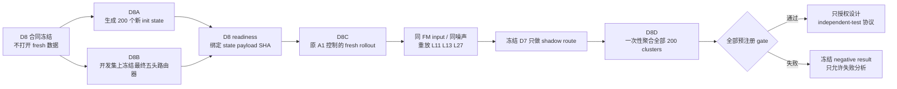
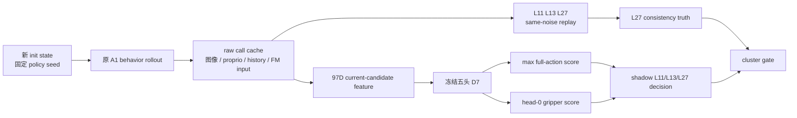

# V3-D8 全新生成状态前瞻确认协议

## 1. 本阶段解决什么问题

D7 在复用的 development_v2 上把 false-safe cluster 从 4 个降到 2 个，并通过了预注册开发门，但这些 episode 已反复参与 D5--D7 方法选择。D8 的目标不是继续修 D7，而是用在 D8 合同冻结后才生成的状态和轨迹，前瞻性确认同一个冻结路由器。

当前状态是：

```text
D8_FRESH_CONFIRMATION_CONTRACT_FROZEN
```

合同验证通过本身仍不授权 fresh policy rollout，只授权两个不接触 fresh policy label 的准备阶段：D8A 新状态生成与 D8B 最终路由器冻结。

## 2. 为什么不能直接使用 episode 50--69

LIBERO-Long 每个 task 的官方 benchmark init-state 文件固定只有 50 行：

| 范围 | 当前角色 |
|---|---|
| task 0/1 的 0--11，其他 task 的 0--9 | 已知历史使用 |
| 12--29 | D5--D7 反复分析的 development_v2 |
| 30--39 | 已打开的 calibration_v2 |
| 40--49 | 继续封存的 independent_test_v2 |

所以不存在官方 episode 50--69。把数组越界编号写进合同，或者把旧 init state 换一个 seed 后称为“新 episode”，都会夸大独立性。

D8 改为由 LIBERO 环境 reset sampler 生成 200 个新状态。它们不占用官方 episode identity，也不能声称代表官方固定 50-state benchmark；它们确认的是同一任务生成机制下的新状态和新随机轨迹。

## 3. 冻结的数据计划

```text
10 tasks × 20 replicate = 200 task-state clusters

cluster key:
libero_10:task{task_id}:fresh_confirm_v1:replicate{replicate_id}

state seed:
30260821 + task_id × 10000 + replicate_id

policy seed:
40260821 + task_id × 10000 + replicate_id
```

state seed 与 policy seed 是两个不相交的固定流。禁止人工挑状态、根据 outcome 换 seed、用 episode 12--49 identity，或在看到阶段性结果后增加样本。

冻结 schedule：

```text
configs/research/v3/data_lineage/fresh_confirmation_v1_schedule.json
SHA-256: 6a532130ec9ddad5d235cc342e44148a9324f9e0592a1554e3dac9f51956b920
```

## 4. 执行顺序



D8A 与 D8B 可以并行，但 D8 readiness attestation 冻结前禁止 D8C。

## 5. D8A：新状态生成

每个 task×replicate 在独立进程中执行：

1. 设置 schedule 中唯一的 state seed；
2. 构造 LIBERO 环境；
3. 执行一次 reset；
4. 立即捕获 flatten 后的 MuJoCo `float64-le` state；
5. 在第二个独立进程中完全重放，要求 SHA byte-identical。

正式 state payload 还必须满足：

- 全部有限、一维、同 task 内维度固定；
- 每个 task 的 20 个 state SHA 均唯一；
- reset 时任务 success predicate 为 false；
- 第二次生成只做 determinism audit；
- 任一 invalid、duplicate、already-solved 或非确定性 state 都使 D8A fail closed；不得换下一个 seed 补位；
- 状态生成时不加载 A1/D7，不采样策略动作，不读取 route label。

这个规则避免“看模型表现后挑容易状态”，同时把生成器不稳定显式变成可审计失败。

## 6. D8B：冻结一个真正可部署的 D7 路由器

D7 正式结果是 18-fold outer-OOF 选择证据：每个 outer fold 有自己的模型和 threshold。它不能直接当作一个新数据 runtime checkpoint。D8B 在 fresh rollout 之前补齐这个必要步骤：

- 只读取已分析的 development_v2 和冻结 D7 OOF payload；
- `lambda=0.01`，因为 18/18 outer fold 均选中该值；
- head 0 用全部 development 行拟合；
- head 1--4 分别删除固定 episode modulo-4 group；
- 每个 head 独立拟合 normalizer、layer anchor 和 194 个权重；
- 总计 5 次 CPU FP64 LBFGS fit；
- full-action runtime score 仍是五头最大值；
- gripper 仍只用 head 0，阈值锁定为 `0.043773197319646726`；
- A1 action-consistency 阈值锁定为 `0.00390625`。

单一 full-action threshold 只允许按冻结规则产生一次：在 D7 的 outer-OOF score 与 development truth 上执行 exact feasible threshold selection，然后固定乘 `0.95`。乘法后不得重新优化，而且收缩后的 development route 必须仍可行。

最终五头权重、五个 normalizer/anchor、单一 threshold 和 SHA 必须在任何 fresh policy rollout 之前冻结。D8 confirmation label 永远不能用于 refit、改 feature 或改 threshold。

## 7. D8C：为什么仍然是 shadow

D8C 的环境行为仍由冻结的原 A1 early-exit controller 控制。每个 policy call 记录 raw telemetry 和 replay 所需的 FM input；之后用完全相同的 FM input 与噪声离线重放 L11、L13、L27。



D7 shadow decision 不发送给机器人，所以 D8 能确认新分布上的 route consistency 风险，却不能证明 D7 active control 的闭环成功率。

## 8. 一次性确认门

全部 200 clusters 完整后才能计算 gate，所有条件必须同时满足：

| 条件 | 冻结值 |
|---|---:|
| 完整 clusters | 200，且每 task 20 |
| safe clusters | 至少 120 |
| 每 task safe clusters | 至少 5 |
| early-exit calls | 至少 10% |
| task coverage | 10/10 task 有 early exit |
| joint false-safe CP-UCB95 | 不超过 0.05 |
| false full-action clusters | 不超过 3 |
| false gripper calls | 0 |
| `distance > 4× truth threshold` 的严重 false cluster | 0 |
| 非退化 ensemble rows | 至少 1% 的 head range > `1e-6` |
| 估计 FM call reduction | 至少 30% |

joint false-safe cluster 定义为：该 task-state cluster 至少有一个 shadow early-exit call，且至少一个被选择的 L11/L13 call 对 L27 的 full-action 或 gripper truth 不安全。

严重错误 veto 是为了避免少量大幅动作偏差被平均 cluster rate 掩盖。D7 开发集的两个残余错误约为 1.02× 和 2.28×；D8 在看到新数据前固定要求 `>4×` 的错误为零。

### Exact UCB 边界

| false / safe clusters | 单侧 exact CP-UCB95 | 是否通过 5% |
|---:|---:|---:|
| 1 / 120 | 0.03892 | 是 |
| 2 / 120 | 0.05153 | 否 |
| 4 / 200 | 0.04518 | 仅 UCB 通过，但会被 `false full <=3` 拒绝 |
| 5 / 200 | 0.05184 | 否 |

## 9. 停止、重试和 missingness

- 禁止 interim gate、optional stopping 和“遇到首个失败就停”；
- 必须收齐 200 clusters 后一次性聚合；
- 基础设施错误只能使用完全相同的 task、replicate、state payload、policy seed 和 commit 重试；
- 禁止因为失败、异常或 outlier 替换 seed、删除 episode；
- 若无法收齐，状态是 incomplete，不得写成 pass 或 negative gate。

## 10. GPU 与产物边界

- D8A 状态生成和 D8B 最终 router fit 不需要 GPU；
- D8C raw rollout 与 candidate replay 只允许物理 GPU 0--3；
- 每进程只可见一张卡，GPU 4--7 明确拒绝；
- 所有正式输入输出都要求 clean worktree、不可覆盖目录和 SHA-256 sidecar。

估计 FM reduction 仍不包含五头 router latency；D8 必须报告它，但不能写成 wall-clock 加速。A1 behavior success 只作为描述性采集信息，不是 D7 闭环成功。

## 11. 结果与声明边界

若全部 gate 通过：

```text
PASS_V3_D8_PROSPECTIVE_SHADOW_CONFIRMATION
```

也只授权：

```text
INDEPENDENT_TEST_V2_PROTOCOL_DESIGN_ONLY
```

仍不直接打开 episode 40--49、不启用 active control、不授权 deployment 或 superiority claim。若失败，必须冻结：

```text
NEGATIVE_V3_D8_PROSPECTIVE_SHADOW_CONFIRMATION
```

并且 confirmation 数据从此只能作为已分析证据，不能调好后再冒充 fresh confirmation。

## 12. 冻结证据

```text
D7 formal attestation SHA:
4c6d267bb40d2a2b01b92ffa662d0ffb487fb09e1640ca37fa2a10ad8b1a1a07

D8 fresh schedule SHA:
6a532130ec9ddad5d235cc342e44148a9324f9e0592a1554e3dac9f51956b920

D8 contract SHA:
148a6e7208582958198b8f1265bb715c75e31bc0c282c7f588412ba9c6ba2c17
```
