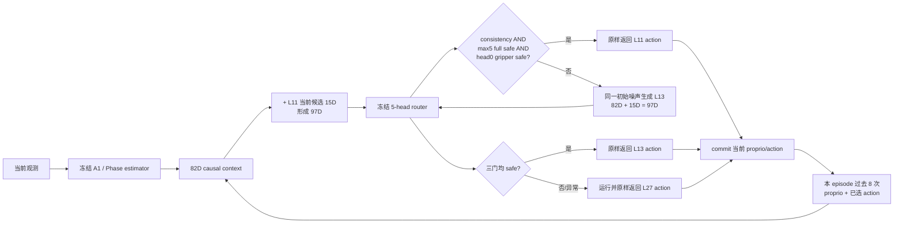

# PhaseRoute-VLA V3-D9A：在线适配器与 D8 精确一致性

## 1. 本阶段结论

D9A 的目标不是运行 independent test，而是把 D8 的冻结 shadow rule 变成可接入 A1 推理循环的在线、fail-closed 路由器，并先证明它没有改变冻结模型语义。

正式结果只有在实现提交后、干净工作树上运行验证脚本才能产生。在该结果通过之前，episode 40--49 的状态和 init archive 继续封存，active rollout 仍不允许执行。

## 2. 在线数据流



路由优先级严格为 `L11 -> L13 -> L27`。任何缺失值、NaN/Inf、shape/dtype 漂移、候选乱序、历史异常或 router 完整性变化，都会锁存 fail-closed 状态；之后 L11/L13 均不得退出，只能得到真实 L27 action。

## 3. 关键实现修正：同噪声候选与 RNG 保持

D8 的 L11/L13/L27 counterfactual action 使用同一个 flow-matching 初始 `input_x`。原 A1 在线路径在不同候选层会重新随机采样，如果只把 classifier 接进去，97D 特征和 D8 学到的含义会发生漂移。

D9A 因此只在 PhaseRoute adapter 启用时执行：

1. L11 正常采样并捕获其初始 `input_x`；
2. L13/L27 用 L11 的 `input_x` 生成同噪声候选；
3. 每次复用前仍执行一次等形状随机数 burn；
4. 因而相对原 RP-PEP，后续全局 PyTorch RNG state 逐候选保持完全一致；
5. 未安装 PhaseRoute adapter 的 original A1 路径完全不变。

这一步不是重新训练，也没有改变 A1 权重、D8 五头权重、normalizer 或三个阈值。

## 4. 97D 输入与泄漏边界

```text
97D = 冻结 legacy causal 82D + 当前候选夹爪 15D
15D = 8 个 gripper sign + 7 个相邻时刻 transition bit
```

每个候选独立构造特征。另一个候选、L27 teacher action、task id、episode id、call ordinal、seed、success/reward 和未来状态都不能进入 97D。task/episode identity 只用于审计和历史分区。

历史采用 `window -> route -> commit`：当前调用只读取过去，最终选中的 action 在决策完成后才进入下一调用的 history；episode identity 改变时历史清零。

## 5. 冻结门与精确动作

每个候选需要同时满足：

```text
A1 action consistency <= 0.00390625
max(5 个 head 的 full-action risk) <= 0.49143093002787247
head0 gripper risk <= 0.043773197319646726
```

router 的 layer-specific anchor 仍接收 L11/L13 identity，但 identity 不被拼入 97D 特征。在线适配器返回 action head 提供的原 Tensor 对象，不做 clone、cast、归一化或数值重建；这保证 active action 与所选候选精确相同。

## 6. D9A 验证项目

Synthetic smoke 必须同时覆盖：

- L11 selected；
- L11 veto 后 L13 selected；
- L11/L13 均 veto 后 L27 fallback；
- nonfinite fail-closed；
- episode history reset；
- selected action object/exactness；
- L11/L13/L27 同噪声以及各候选后 RNG state 与原 RP-PEP 完全相同。

D8 cache parity 必须达到：

| 项目 | 冻结要求 |
|---|---:|
| policy calls | 7140 |
| candidate rows | 14280 |
| 97D feature | 逐元素完全相等 |
| selected layer | 7140 / 7140 exact |
| candidate safe | 14280 / 14280 exact |
| five-head prediction max abs error | `<=1e-12` |

正式命令：

```bash
CUDA_VISIBLE_DEVICES=-1 \
  /home/haozheng/.conda/envs/a1/bin/python \
  scripts/dynamic_compute/v3/validate_v3_d9a_runtime_adapter.py
```

验证脚本拒绝脏工作树和覆盖已有证据，并将源 commit、全部相关代码 SHA-256、四个 D8 输入 SHA-256、router state SHA-256、synthetic 分支结果与逐项 parity 一并写入：

```text
results/v3/v3_d9a_runtime_adapter_validation.json
results/v3/v3_d9a_runtime_adapter_validation.sha256
```

## 7. 声明边界与下一阶段

D9A PASS 只说明“在线决策核心与 D8 shadow rule 工程一致，fail-closed 行为和候选动作选择已实现”。它不代表 LIBERO active control 已跑通，更不代表成功率或效率结论。

下一阶段 D9B 仍须完成：真实观测到 9 项 runtime context 的接线、episode lifecycle/commit 接线、冻结 checkpoint/router/config/代码/干净 commit 的 readiness 绑定，以及一次不打开 40--49 的模型级 dry-run。只有 D9B readiness PASS 后，才可以按冻结 schedule 一次性打开 independent test。
