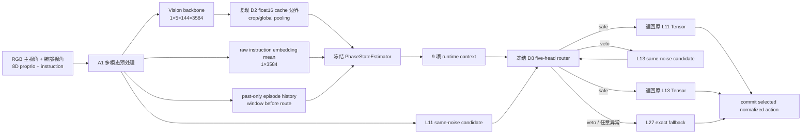

# V3-D9B：真实在线接线与独立测试 readiness

## 1. 结论

V3-D9B 已完成，正式状态为：

```text
PASS_V3_D9B_READINESS_FOR_ONE_SHOT_PAIRED_ACTIVE_TEST
```

本阶段证明的是：冻结 A1、PhaseStateEstimator 和 D8 router 已经能够在真实
A1 前向中组成一条完整、因果、fail-closed 的在线链路。D9B 不是闭环成功率
结果；本阶段没有创建或推进 LIBERO 环境，也没有读取 episode 40--49 的初始
状态。readiness 通过后只授权按冻结合同执行一次 D9C 200-rollout 配对测试。

## 2. 在线数据流



九项 context 及维度：

| 名称 | 维度 | 来源 |
|---|---:|---|
| `instruction_summary` | `[1,3584]` | 原始任务文本 token embedding 均值 |
| `vision_crop_summary` | `[1,5,3584]` | 五个 crop 的有效 patch 均值 |
| `vision_crop_mask` | `[1,5]` | crop 是否至少含一个有效 patch |
| `phase_embedding` | `[1,128]` | 冻结 phase estimator stage embedding |
| `phase_scalars` | `[1,3]` | progress、boundary probability、uncertainty |
| `normalized_proprio` | `[1,8]` | 当前归一化本体状态 |
| `proprio_history` | `[1,8,8]` | 仅包含过去调用的本体状态 |
| `action_history` | `[1,8,8,7]` | 仅包含过去被选中的 normalized action chunk |
| `history_mask` | `[1,8]` | 右对齐历史有效位 |

`episode_id/task_id/call_ordinal/step_id` 仅进入 telemetry，不进入 97D router
feature。每个调用严格执行 `window → route → commit`，episode reset 会清空历史。

## 3. 本阶段修复的真实运行问题

### 3.1 bfloat16 候选动作

D9A synthetic 测试使用 float32，但真实 A1 flow-matching action 可能是
bfloat16。适配器现将 detached 候选副本转换为 CPU float32 做 97D 特征与 router
评分，同时将原候选 Tensor 原样返回给模型，不 clone、不 cast、不改变环境动作。

### 3.2 视觉数值协议

D2/D3/D8c 的 projected feature 先写入 float16 cache，再在 context 构造时恢复
为 float32。在线路径严格复现该量化边界，避免只满足维度、却让冻结 router
承受训练时未见的系统性数值偏移。

### 3.3 libero_10 配置隔离

旧 `rp_pep_enabled` 继续只允许 `libero_spatial`。只有显式启用
`phase_route_v3_enabled` 时才允许冻结的 `libero_10 + FM10 + (3,11,13,27)`
路径，并强制：

- `exit_interval=2`、`steps_per_stage=1`；
- cosine consistency、`exp/1.0` 冻结阈值；
- 不与 legacy phase-depth、static EFA 或 learned EFA 混用；
- 单卡、非 FSDP；
- router 和 phase checkpoint 必须存在并通过冻结 SHA 校验。

## 4. 真实 checkpoint dry-run

使用物理 GPU 0：

```text
GPU UUID       GPU-f52eda42-a640-8244-bcdb-e6201acae766
GPU            NVIDIA RTX 6000 Ada Generation, 49140 MiB
driver         570.133.07
torch          2.6.0+cu124
CUDA runtime   12.4
```

加载的 A1 checkpoint：

```text
size     33841175207 bytes
SHA-256  dcafd9ee8a3d3a4ced8840e59c90b0c4b20d41a7900adc9ff469c1a57e631b7f
```

对两个 deterministic synthetic RGB observation 执行真实 A1 policy call，返回
action 不发送给任何环境：

| call | 输出 | history rows | selected layer | latency |
|---:|---:|---:|---:|---:|
| 0 | `[8,7]` finite | 0 | L27 | 1.739 s |
| 1 | `[8,7]` finite | 1 | L27 | 1.879 s |

两次 synthetic call 都在 L11/L13 被 consistency、full score 和 gripper score
共同否决，因此回退 L27。这不是失败：synthetic 图像不属于 LIBERO 训练分布，
readiness 的正确行为是保守回退，而不是为了展示 early exit 挑输入或修改阈值。
关键工程检查为 context `2/2`、commit `2/2`、runtime error `0`。

## 5. readiness 冻结结果

当前代码重新运行已分析 D8 cache：

```text
policy calls                  7140
candidate rows                14280
selected-layer exact          7140 / 7140
candidate-safe exact          14280 / 14280
five-head max abs error       0.0
route counts                  L11=234 / L13=775 / L27=6131
```

回归与依赖：

```text
pytest                         192 passed + 22 subtests
pip check                      PASS
readiness CUDA initialized     false
```

绑定的主要证据：

| 证据 | SHA-256 |
|---|---|
| D9A runtime parity | `fbf450a2beaab07e558e8e6d961bf7799b080e4afe98626d7ff477343d434acf` |
| D9B real-model dry-run | `89a1173023149ae910bb84ade602860eca205450a34a5f5dc0b898c4e0b270c3` |
| D9B readiness | `a768d7ee3f123d6858fc850467deb7883afec2e3af2cf40921f9b4e7cfcb03f1` |
| D8 router payload | `9f7360188e30e5831b18d460bf338638fb960db9374dd9cc74412f169914b830` |
| phase checkpoint | `b601f8221d47136818d7a008eaf7cee06e1201bf514f371ae33f42cfb39515a1` |
| implementation commit | `3fe0c8155efdb13c24d351eaa3487d57e8ff5ea8` |

正式 readiness 文件：

```text
results/v3/v3_d9b_readiness_attestation.json
```

完整 dry-run telemetry（ignored raw evidence）：

```text
reports/v3_d9b_model_dry_run/result.json
```

## 6. 下一阶段边界

D9B 只授权：

```text
D9C_ONE_SHOT_PAIRED_ACTIVE_INDEPENDENT_TEST
```

D9C 必须继续满足冻结合同：100 个 pair、200 个 rollout；相同官方初始状态和
seed；arm order 固定；物理 GPU=`task_id mod 4` 且只用 0--3；完整采集 raw
policy-call telemetry 和 PhaseRoute same-noise replay 输入；禁止 interim aggregate、
optional stopping、换 episode、按结果重试或第二次独立测试。D9C 全部收齐前只能
报告 `INCOMPLETE`，不能声称成功、非劣或优于 A1。
