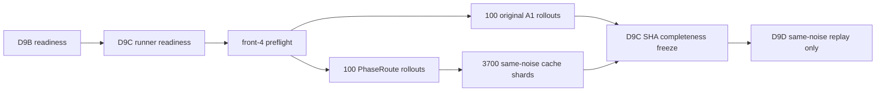

# PhaseRoute-VLA V3-D9C：paired active 原始采集完成记录

## 1. 正式状态

```text
COMPLETE_V3_D9C_PAIRED_ACTIVE_COLLECTION
```

D9C 已按冻结协议完成全部 `100` 个 pair、`200` 个闭环 rollout。这个状态只表示原始采集完整，不是 D9 的 PASS 或 NEGATIVE；本阶段没有计算总体或分任务成功率、安全率、效率、McNemar、bootstrap 或 primary gate。

## 2. 执行边界



两臂都使用同一个 33.8 GB A1 checkpoint、同一个 official init state、同一个 seed、同一 FM10 配置和冻结 evaluator。original A1 保留原始 14 个 early-exit 候选层；PhaseRoute 使用冻结 RP-PEP 计算路径，并只在 `L11/L13/L27` 之间作 active route。计划内唯一差异是 controller。

## 3. 精确调度

- suite：`libero_10`
- task：`0..9`
- episode：每个 task 的 `40..49`
- canonical identity：`libero_10:task{task_id}:episode{episode_index}`
- seed：`20260851 + task_id * 10000 + (episode_index - 40)`
- arm order：按 `(task_id + episode_index) % 2` 交替，50 个 pair 先 A1、50 个先 PhaseRoute
- 原 A1：100 rollout
- PhaseRoute：100 rollout
- infrastructure abort / retry：`0 / 0`

物理卡严格绑定如下：

| 物理 GPU | UUID | tasks |
|---:|---|---|
| 0 | `GPU-f52eda42-a640-8244-bcdb-e6201acae766` | 0、4、8 |
| 1 | `GPU-f4f497b3-86d0-e107-936f-493739d7b5ea` | 1、5、9 |
| 2 | `GPU-eb395571-9c61-f945-f90c-85a352e52161` | 2、6 |
| 3 | `GPU-c4560cc9-8c2a-15a9-4872-25b92de7e270` | 3、7 |

物理 GPU 4–7 没有用于 preflight、模型加载、rollout 或冻结。

## 4. 保存的原始证据

每个 pair 位于：

```text
reports/v3_d9c_paired_active/
  task{0..9}/
    pair_episode{40..49}/
      frozen_original_A1/
      frozen_PhaseRoute_D8/
      pair_record.json
```

每个 arm 保存 success 原始布尔值、environment steps、policy calls、FM calls/steps、exit-layer counts、policy latency、wall time、seed、init-state SHA、commit、GPU UUID 和逐调用 telemetry。PhaseRoute arm 还保存逐调用 runtime record，以及用于 D9D 的 projected features、tokenized inputs、normalized proprio/action、CPU/CUDA RNG state、实际 selected candidate `input_x` 和已经在线计算的 FM traces。

完整性冻结统计：

| 项目 | 数量 |
|---|---:|
| task results | 10 |
| paired records | 100 |
| arm rollouts | 200 |
| raw policy-call telemetry | 7488 |
| PhaseRoute same-noise cache shards | 3700 |
| PhaseRoute cache bytes | 19,231,628,328 |
| infrastructure abort attempts | 0 |

这些是 payload 完整性计数，不是性能指标。`3700` 表示 PhaseRoute arm 的全部真实 policy state 均有 D9D replay 输入；它不能直接解释为提前退出次数。

## 5. 命令记录

Runner readiness：

```bash
CUDA_VISIBLE_DEVICES=-1 \
PYTHONNOUSERSITE=1 \
/home/haozheng/.conda/envs/a1/bin/python \
scripts/dynamic_compute/v3/validate_v3_d9c_runner_contract.py
```

正式 preflight：

```bash
bash scripts/dynamic_compute/v3/run_v3_d9c_front4.sh preflight
```

正式一次性采集：

```bash
bash scripts/dynamic_compute/v3/run_v3_d9c_front4.sh execute
```

完整性冻结：

```bash
CUDA_VISIBLE_DEVICES=-1 \
PYTHONNOUSERSITE=1 \
/home/haozheng/.conda/envs/a1/bin/python \
scripts/dynamic_compute/v3/freeze_v3_d9c_collection.py
```

所有 task 的实际命令和环境另存于 task/arm `command.txt`，控制台输出位于 `reports/v3_d9c_launch_logs/`。

## 6. SHA 与 commit

| 证据 | SHA-256 / commit |
|---|---|
| D9B readiness | `a768d7ee3f123d6858fc850467deb7883afec2e3af2cf40921f9b4e7cfcb03f1` |
| D9C runner implementation commit | `d2365349133fccee5f5c0bb569a97e5273f44c18` |
| D9C runner readiness | `b493c999f7a17b9a5d449503ee294557b9e29d41541c1fdddb753d6dafd33ebe` |
| formal rollout source commit | `1a0598d67994755b9f8abd88563ea2d03b7ff47c` |
| D9C collection attestation | `e4994368622590ec0cce0beb02b870f9a28e4c2f04fd9f1f93f424cb98d9292d` |

D9C collection attestation 位于：

```text
results/v3/v3_d9c_collection_attestation.json
```

它绑定 10 个 task result、100 个 pair record、200 个 arm result、全部 telemetry/runtime manifest，并通过每个 cache inventory 重新核验所有 NPZ shard 的大小与 SHA。

## 7. 下一阶段

D9C 只授权：

```text
D9D_SAME_NOISE_REPLAY_ONLY
```

D9D 必须对 PhaseRoute 的真实调用用缓存的同一 `input_x` 离线重放 `L11/L13/L27`，生成 action-consistency truth；重放不得改变已经执行过的环境 action。只有 D9D 收齐全部 truth 后，D9E 才能做一次总体聚合并给出最终 PASS 或 NEGATIVE。
