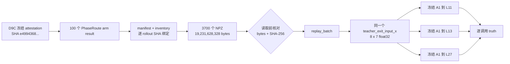

# V3-D9D：独立测试 same-noise 离线重放

## 1. 阶段目标

D9C 已完成 100 对、200 条闭环轨迹，并为 PhaseRoute arm 的每个真实
policy call 保存了 flow-matching 初始噪声与模型输入。D9D 的唯一任务是：

```text
3700 个 PhaseRoute policy state
  × 同一个 teacher_exit_input_x
  × 冻结 A1 的 L11 / L13 / L27
  -> 逐调用 same-noise truth
```

D9D 不创建 LIBERO 环境、不执行 action、不加载 router、不改变 D9C 已发送给
环境的 action，也不统计最终 success、安全率、效率或 D9 gate。最终一次性聚合
只允许在 D9E 进行。

## 2. 数据血缘



冻结输入：

| 项目 | 值 |
|---|---|
| D9C collection SHA-256 | `e4994368622590ec0cce0beb02b870f9a28e4c2f04fd9f1f93f424cb98d9292d` |
| D9C raw source commit | `1a0598d67994755b9f8abd88563ea2d03b7ff47c` |
| A1 model SHA-256 | `dcafd9ee8a3d3a4ced8840e59c90b0c4b20d41a7900adc9ff469c1a57e631b7f` |
| policy states | `3700` |
| replay layers | `L11 / L13 / L27` |
| physical GPU | `0 / 1 / 2 / 3`，每进程只可见一张 |

全局 `dataset_index` 由冻结的 task 0--9、episode 40--49 和每条轨迹的
`call_ordinal` 顺序确定；`dataset_index % 4` 决定 shard，因此每张卡严格为
925 行。GPU 4--7 不允许参与。

## 3. 单个调用的输入与输出

模型 replay 输入来自同一 NPZ，主要几何如下：

| 张量 | 维度 | dtype | 功能 |
|---|---:|---|---|
| `projected_features` | `[5,144,3584]` | fp16 | 五个视觉 crop 的投影 token |
| `image_input_idx` | `[5,144]` | int32 | 视觉 token 在语言序列中的位置 |
| `instruction_summary` | `[3584]` | fp16 | 指令语义摘要 |
| `normalized_proprio` | `[8]` | fp32 | 归一化机器人本体状态 |
| `input_ids` | `[L]`，实测 `L=680` | int64 | 多模态语言序列 |
| `action_proprio` | `[1,1,8]` | fp32 | action head 的 proprio 条件 |
| `teacher_exit_input_x` | `[8,7]` | fp32 | 三层共享的 FM 初始噪声 |
| `teacher_normalized_action` | `[8,7]` | fp32 | D9C 在线实际选择并执行的动作块 |

输出：

```text
candidate_actions: [3, 8, 7] float32
                    ^  ^  ^
                    |  |  +-- 7D action
                    |  +----- 8-step horizon
                    +-------- L11, L13, L27
```

每行同时保存：身份字段、source NPZ SHA、共享噪声 SHA、在线 selected action
SHA、三层 candidate SHA、selected-layer replay 最大绝对误差以及以下真值：

```text
full_action_distance = mean_horizon(
    1 - cosine(online_selected_action_7D, replayed_L27_action_7D)
)

full_action_unsafe = distance > 0.00390625

gripper_unsafe = any_horizon(
    (selected_gripper >= 0) XOR (L27_gripper >= 0)
)

severe_full_action = distance > 4 * 0.00390625
```

L27 只是同噪声一致性 teacher，不是 expert action，也不能证明 task success。

## 4. Fail-closed 边界

- D9C attestation、arm result、manifest、inventory、runtime 与 policy telemetry
  必须逐级 SHA 绑定；
- NPZ 必须先核验文件大小和 SHA-256，再调用 `np.load`；
- 三层 replay 共享同一份 `teacher_exit_input_x`，replay 后重新计算 hash；
- `teacher_normalized_action` 必须与在线保存的 selected trace 完全相同；它是
  full-action 与 gripper 真值中的实际 selected action；
- D9C 为控制缓存体积将 projected visual features 保存为 fp16，因此离线
  selected-layer replay 与在线未量化 action 的误差只作为量化诊断报告，不能
  替代实际 selected action，也不能作为 D9 safety gate；
- replay 使用与 D9C 在线模型相同的 FP32 前向，不额外启用 BF16 autocast；
- 模型参数必须全部 `requires_grad=False`；
- 输出目录不可覆盖，异常写入 `.incomplete/abort.json`；
- shard payload 只保存逐调用 truth，禁止读取或运行 router；
- D9D 冻结器只证明 3700 行真值完整，不汇总最终 D9 gate。

## 5. 实现文件

```text
a1/vla/dynamic_compute/v3/same_noise_replay.py
scripts/dynamic_compute/v3/replay_v3_d9d_shard.py
scripts/dynamic_compute/v3/run_v3_d9d_front4.sh
scripts/dynamic_compute/v3/validate_v3_d9d_runner_contract.py
scripts/dynamic_compute/v3/freeze_v3_d9d_collection.py
tests/dynamic_compute/v3/test_same_noise_replay.py
```

Raw evidence 写入 ignored 的：

```text
reports/v3_d9d_same_noise_replay/
reports/v3_d9d_same_noise_logs/
```

精炼 attestation 写入 tracked 的：

```text
results/v3/v3_d9d_runner_readiness_v2.json
results/v3/v3_d9d_collection_attestation.json
```

## 6. 正式执行记录

### 6.1 实现与回归

```text
implementation commit: 8528137cb70c442908926cd3a9a4a9cf9e952ad3
corrected truth commit: e1ca7a08723e5ca4a64d20eb779a770e1f853fa6
full V3 CPU regression: 182 passed + 22 subtests passed
D9D call index:         3700 rows
modulo-four shards:     925 / 925 / 925 / 925
pip check:              No broken requirements found
```

### 6.2 FP32/缓存量化 incident

初版 runner 在四个 shard 的第一行均 fail-closed，接受真值 `0/3700`。只读单行
诊断确认：D9C 在线模型使用 FP32，初版 runner 错用了 BF16；同时 D9C 缓存把
projected visual features 保存为 fp16，因此离线 selected-layer replay 不可能与
在线未量化 action bit-exact。

```text
FP32 replay max error: 1.9535422325134277e-05
BF16 replay max error: 8.451581001281738e-03
```

修正后，replay 使用 FP32；安全真值使用与在线 selected trace 完全绑定的实际
`teacher_normalized_action` 对比 replayed L27。旧 readiness、四个 abort 和日志
均保留，不覆盖、不删除。

```text
incident:
results/v3/v3_d9d_precision_incident.json
SHA-256: a4cdab4ad69b96d4b9b03f885ea10a2c6ae2ce9cc53ccf3baa07d4b077297d71

raw archive:
reports/v3_d9d_failed_attempt_20260823_1107/
```

### 6.3 Corrected runner readiness

```text
implementation commit: e1ca7a08723e5ca4a64d20eb779a770e1f853fa6
readiness commit:      fdd608db8b70328743ec8b6c50e9758303605e3e
status:                PASS_V3_D9D_FROZEN_RUNNER_READINESS
artifact:              results/v3/v3_d9d_runner_readiness_v2.json
SHA-256:               d060bad4c7dd6693fd80eba2a35a133183e31f6697f8c068b0e69cf61ff8acf7
NPZ opened:            0
CUDA initialized:      false
```

### 6.4 四卡正式 replay

命令：

```bash
bash scripts/dynamic_compute/v3/run_v3_d9d_front4.sh
```

结果：

| shard | physical GPU | GPU UUID | rows | elapsed seconds | peak allocated bytes |
|---:|---:|---|---:|---:|---:|
| 0 | 0 | `f52eda42-a640-8244-bcdb-e6201acae766` | 925 | 2031.919 | 36,082,236,416 |
| 1 | 1 | `f4f497b3-86d0-e107-936f-493739d7b5ea` | 925 | 1935.603 | 36,082,236,416 |
| 2 | 2 | `eb395571-9c61-f945-f90c-85a352e52161` | 925 | 2033.506 | 36,082,236,416 |
| 3 | 3 | `c4560cc9-8c2a-15a9-4872-25b92de7e270` | 925 | 2008.208 | 36,082,236,416 |

GPU 4--7 未参与。四个 shard 全部返回：

```text
PASS_V3_D9D_SAME_NOISE_TRUTH_SHARD
PASS_V3_D9D_FRONT4_SAME_NOISE_REPLAY
```

### 6.5 D9D truth freeze

```text
status:          COMPLETE_V3_D9D_SAME_NOISE_TRUTH
states:          3700/3700
candidate replay: 11100
source NPZ SHA:  3700/3700 checked before open
LIBERO env:      0
executed action: 0
router load:     0
D9 gate calls:   0

artifact:
results/v3/v3_d9d_collection_attestation.json
SHA-256: f8b3421948ca6c8ccfda6837afde9cfec0a7dbd6cee61987eb03e2dee2f6ea65
```

D9D 只证明逐调用 truth 完整，尚未报告 success、安全率、效率或 PASS/NEGATIVE。
冻结 attestation 只授权下一阶段 D9E 做一次性最终聚合。
