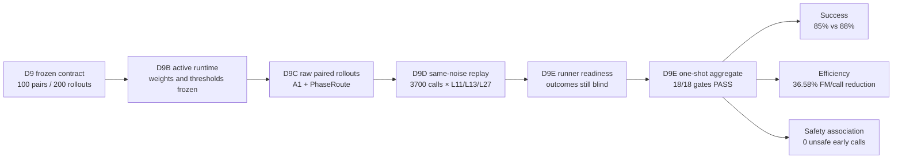

# V3-D9E 配对闭环独立测试最终结果

## 1. 最终结论

PhaseRoute-VLA V3 已完成预注册的 D9 paired active independent test。D9E 在冻结
runner 后唯一一次读取 100 对闭环 rollout 和 3700 条 same-noise truth，正式结果为：

```text
PASS_V3_D9_PAIRED_ACTIVE_INDEPENDENT_TEST
```

18/18 个 primary gate 全部通过。最重要的三个结果是：

| 维度 | frozen original A1 | frozen PhaseRoute D8 | 结果 |
|---|---:|---:|---:|
| LIBERO-10 成功率 | 85/100 = 85% | 88/100 = 88% | PhaseRoute `+3 pp` |
| FM calls / policy call | 10.5586 | 6.6962 | PhaseRoute 减少 `36.58%` |
| same-noise false-safe cluster | — | 0/100，CP-UCB95 = 2.951% | 通过 `<=5%` gate |

这个 PASS 支持的准确表述是：在冻结的 LIBERO-10 episode 40--49 配对闭环测试上，
PhaseRoute 在保持成功率 gate 和 same-noise consistency safety gate 的同时，显著降低了
每次 policy call 的 FM 调用量。它不等同于真实机器人安全证明、通用任务结论或部署许可。

## 2. 从冻结到最终结果的证据链



D9E 的盲法顺序是：

1. 先在 synthetic data 上写完统计模块、fail-closed loader 和所有 gate；
2. 33 项 D9 相关回归测试通过；
3. 在 implementation commit `9941c81078605700a8c2fec6ede78f896bcd2dc9`
   上生成 readiness；
4. readiness 明确记录 success values opened = false、truth payloads opened = 0、
   aggregate calls = 0；
5. 将 readiness 提交为 commit
   `384ac92` 后，执行唯一一次正式 aggregate；
6. 没有根据结果调模型、router、threshold、feature、episode 或 seed，也没有第二次
   independent test。

## 3. 成功率结果

### 3.1 总体 paired outcome

| paired outcome | 数量 |
|---|---:|
| A1 成功、PhaseRoute 成功 | 82 |
| A1 成功、PhaseRoute 失败 | 3 |
| A1 失败、PhaseRoute 成功 | 6 |
| A1 失败、PhaseRoute 失败 | 9 |

因此：

```text
A1 success:                  85/100 = 0.85
PhaseRoute success:          88/100 = 0.88
PhaseRoute - A1:              3/100 = +0.03
```

task-stratified paired bootstrap 严格使用冻结定义：每个 task 内对 10 个 pair 有放回
重采样，合并 10 个 task，`100000` 次，seed `60260821`，NumPy linear 5th
percentile。结果为：

```text
bootstrap one-sided 95% lower bound: -0.02
frozen gate:                         >= -0.10
```

exact two-sided McNemar equality p-value 是 `0.5078125`。它只检验 equality，
不是 non-inferiority test；本项目没有把该 p-value 冒充非劣结论。

### 3.2 每个 task 的成功数

| task | A1 | PhaseRoute | PhaseRoute − A1 |
|---:|---:|---:|---:|
| 0 | 8 | 7 | -1 |
| 1 | 9 | 10 | +1 |
| 2 | 10 | 10 | 0 |
| 3 | 9 | 10 | +1 |
| 4 | 8 | 7 | -1 |
| 5 | 7 | 8 | +1 |
| 6 | 10 | 10 | 0 |
| 7 | 9 | 9 | 0 |
| 8 | 9 | 9 | 0 |
| 9 | 6 | 8 | +2 |

最差的 per-task difference 是 task 0 和 task 4 的 `-1/10`，仍高于冻结门槛
`-2/10`。结果不是“所有 task 都胜过 A1”，但总体成功率更高，且没有 task 发生超过
预注册容忍范围的退化。

## 4. 提前退出和计算效率

### 4.1 路由分布

PhaseRoute 共执行 3700 次 policy call：

| selected layer | calls | fraction |
|---|---:|---:|
| L11 | 100 | 2.70% |
| L13 | 412 | 11.14% |
| L27 | 3188 | 86.16% |
| L11 或 L13 early exit | 512 | 13.84% |

所有 10 个 task 都出现了 early exit，每个 task 的 10 个 episode 也都至少出现过一次
early exit，因此不是 always-defer router。

### 4.2 主效率指标

主指标按预注册定义进行轨迹长度归一化：

```text
1 - PhaseRoute(FM calls / policy call)
    / A1(FM calls / policy call)
```

实际计数为：

```text
A1:         39996 FM calls / 3788 policy calls = 10.558606
PhaseRoute: 24776 FM calls / 3700 policy calls =  6.696216
reduction:                                      36.5805%
frozen gate:                                    >=25%
```

各 task 的 reduction 从 25.95% 到 43.09%，全部为正；task 8 最接近 25% 门槛，
但 primary gate 只预注册了 overall reduction，不能在看过结果后增加 per-task gate。

### 4.3 wall-clock 仅作描述

| 指标 | A1 | PhaseRoute |
|---|---:|---:|
| policy-call latency mean | 3236.09 ms | 2651.34 ms |
| rollout wall time mean | 136.29 s | 112.44 s |
| PhaseRoute context prepare CPU latency mean | — | 24.34 ms |

这些 wall-clock 数值受轨迹长度、成功时刻、模拟器和共享服务器负载影响，不属于 primary
gate，不能写成严格的系统加速因果结论。采集时没有单独 instrument five-head router
`predict()` 的在线 CPU latency；正式结果将该字段如实保存为 `null`，没有用 context
prepare latency 代替它。

## 5. Same-noise safety 结果

D9D 对 PhaseRoute 的全部 3700 个真实 policy state 使用同一 FM input/noise 重放
L11、L13、L27。安全统计只检查实际发送给环境的 early-exit action 与 L27
consistency teacher 的差异。

```text
PhaseRoute calls with complete truth:       3700/3700
early-exit calls:                            512
clusters with at least one early exit:       100/100
false-safe calls:                              0
false-safe clusters:                           0
false full-action clusters:                    0
false gripper calls:                           0
severe false full-action clusters:             0
exact CP-UCB95 for false-safe clusters:  0.029513
```

`0/100` 不是把风险宣称为数学上的零，所以 gate 使用 exact one-sided
Clopper–Pearson upper bound；2.951% 小于冻结门槛 5%。

运行时实际产生 7300 个 L11/L13 candidate rows；7300/7300 的 five-head full-action
head range 大于 `1e-6`，证明 ensemble 不是数值退化成五个完全相同的 head。

L27 在这里仍只是 same-noise consistency teacher，不是 expert action，也不保证任务
成功。

## 6. “多少失败是提前退出导致的”应该怎样回答

正式统计如下：

| 问题 | 数量 |
|---|---:|
| PhaseRoute 最终失败 | 12 |
| PhaseRoute 失败且 rollout 中发生 early exit | 12 |
| PhaseRoute 失败且存在 same-noise unsafe early call | 0 |
| A1 成功 / PhaseRoute 失败 | 3 |
| A1 成功 / PhaseRoute 失败且发生 early exit | 3 |
| A1 成功 / PhaseRoute 失败且存在 unsafe early call | 0 |

因此不能回答“有 12 个实验被提前退出导致失败”。100 个 PhaseRoute rollout 全都出现过
early exit，所以“失败且发生 early exit”在这里没有反事实区分能力。更强的诊断是：12 个
失败 rollout 中没有一个包含根据冻结 L27 same-noise consistency 定义判定为 unsafe 的
early call；3 个 A1 成功而 PhaseRoute 失败的 pair 也同样是 0 个 unsafe early call。

这说明目前没有证据把这些失败归因于“明显偏离 L27 的错误提前退出”。仍不能排除：

- L27 本身也可能在该 state 产生错误动作；
- 很小、低于 consistency threshold 的动作差异经过闭环积累后可能改变轨迹；
- 模拟器、随机过程或不同控制轨迹可能造成 paired outcome 不一致；
- consistency teacher 不是 task-success counterfactual。

要识别严格因果，需要另行预注册 intervention/counterfactual 协议，例如只在目标 call
把 early action 替换为同噪声 L27 action并控制后续随机性。当前 D9 不授权依据结果追加
第二次 independent test。

## 7. 18 个 primary gate

正式结果中 18/18 均为 true，覆盖：

- 完整性：100 pairs、每 task 10 pairs、200 rollouts；
- 成功：PhaseRoute absolute success、overall difference、per-task difference、
  bootstrap lower bound；
- 路由：early-exit fraction、10/10 task coverage、reject always-defer；
- 安全：safe clusters、per-task safe clusters、CP-UCB、full/gripper/severe false；
- ensemble：nondegenerate head range；
- 效率：measured FM calls per policy call reduction。

所有条件是 conjunction；没有在看到结果后删掉困难 task、失败 rollout 或 outlier。

## 8. 正式证据与哈希

| evidence | SHA-256 |
|---|---|
| D9 contract | `eea74662357d39737a3ac84b2d59059150ac4f098c6bddbfe695ba1ed64e59d3` |
| D9C collection | `e4994368622590ec0cce0beb02b870f9a28e4c2f04fd9f1f93f424cb98d9292d` |
| D9D truth collection | `f8b3421948ca6c8ccfda6837afde9cfec0a7dbd6cee61987eb03e2dee2f6ea65` |
| D9E readiness | `de17111576c6ab7d0284405546a5a9766c732a9b1df623d64545a12b15caad00` |
| D9 final formal result | `4df77237e84ad82b05ae67145e52000b0e3430f34b6f69fcbee743687ac11952` |
| D9E report | `36df503b1d3bad1b699a4cb6afce2a49a2f7df191a15052c111ed42e70055b67` |
| pair-level records | `ad53b883c59b7f5ee59753a1195b87b751a046473f8caa55303dbb8b3e86e5bc` |
| false-safe records | `e3b0c44298fc1c149afbf4c8996fb92427ae41e4649b934ca495991b7852b855`（空文件，因为 0 条） |
| tensor payload | `8e59ea14d0b08875d8779887afa41916806f64c38870d683e216ae852e0eb68d` |

正式入口：

```text
results/v3/v3_d9_final_result.json
reports/v3_d9e_final/result.json
reports/v3_d9e_final/pair_records.jsonl
reports/v3_d9e_final/false_safe_records.jsonl
reports/v3_d9e_final/result_payload.pt
```

## 9. 下一步边界

D9 PASS 后只授权 final paper analysis 和新 ablation protocol 的事前设计。合理的下一步是：

1. 冻结论文主表和统计描述，明确区分 primary 与 report-only metric；
2. 设计但不立即读取/执行新的 ablation schedule；
3. 对 3 个 A1-win / PhaseRoute-loss pair 做 outcome-aware 描述性 failure analysis，明确其
   post-hoc 属性；
4. 若要检验 early exit 的严格因果效应，先定义新的 intervention contract、独立数据和
   multiplicity/claim boundary；
5. 在迁移到干净 PhaseRoute-VLA 项目时保留全部 source commit、contract 和 artifact
   SHA，不能只复制最终漂亮数字。
