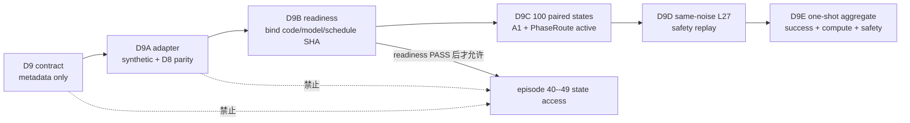

# V3-D9 配对 Active Independent Test 协议

## 1. 当前结论

D9 协议已经在不打开 official episode 40--49 状态、不加载 router/model payload、不运行 GPU 或 active control 的前提下冻结并验证：

```text
PASS_V3_D9_INDEPENDENT_TEST_CONTRACT_FROZEN
```

当前授权仅为：

```text
D9A_RUNTIME_ADAPTER_IMPLEMENTATION_AND_D8_PARITY_ONLY
```

这不是 independent-test 结果，也不授权立刻运行 200 个测试 rollout。D9A 必须先实现 active runtime adapter，并在 synthetic input 和已经分析过的 D8 cache 上证明与 D8D shadow selection 逐调用一致；之后还要有 D9B readiness attestation，才能一次性打开固定的 test schedule。

## 2. 为什么 D8 PASS 后不能直接跑测试集

D8 证明的是 frozen five-head router 在 200 个新生成状态上的 shadow consistency gate 通过。它没有把 L11/L13/L27 选择真正接入环境 action。直接打开 independent-test 会留下一个无法回答的问题：测试失败来自方法本身，还是 active adapter 的候选顺序、history reset、feature 拼接或 action 返回实现错误。

D9 因而把执行拆成五个不可倒序的阶段：



## 3. 冻结 test schedule

测试角色沿用 D0 已登记、至今保持封存的 `independent_test_v2`：

```text
suite:             libero_10
tasks:             0..9
episodes/task:     40..49
pairs:             100
arms/pair:         2
required rollouts: 200
```

每个 pair 的 canonical identity 是：

```text
libero_10:task{task_id}:episode{episode_index}
```

seed 固定为：

```text
20260851 + task_id * 10000 + (episode_index - 40)
```

seed 不是 episode identity。失败后换 seed、换 episode 或把相同状态换一个编号重新测试都被禁止。

## 4. 两个闭环 arm

| arm | 模型权重 | controller | 环境 action |
|---|---|---|---|
| frozen original A1 | 同一 A1 checkpoint | 原 A1 early-exit controller | 原 A1 选择的 action |
| frozen PhaseRoute D8 | 同一 A1 checkpoint | 冻结五头 D8 router | L11/L13/L27 route 选中的 action |

两臂共享同一个 official init state、policy seed、A1 权重、diffusion 配置和 evaluator。唯一计划内差异是 controller，这样成功率和计算量差异才可以归因于 routing 方法，而不是换了 backbone 权重。

为降低执行顺序偏差，arm order 预先交替：

```text
(task_id + episode_index) % 2 == 0: A1 first
otherwise:                            PhaseRoute first
```

恰好 50 个 pair 先运行 A1，另 50 个先运行 PhaseRoute。

## 5. 冻结 PhaseRoute runtime

| 项目 | 值 |
|---|---:|
| feature | 82D past-only context + 15D current candidate = 97D |
| candidate layers | L11、L13 |
| fallback | L27 |
| heads | 5 |
| max-five-head full threshold | 0.49143093002787247 |
| head-0 gripper threshold | 0.043773197319646726 |
| A1 consistency threshold | 0.00390625 |

路由规则固定为：

```text
L11 consistency/full/gripper 都 safe -> L11
否则 L13 三项都 safe                -> L13
否则                                -> L27
```

缺失、NaN、Inf、shape drift 或 history 异常必须 fail closed 到 L27，不能用另一个 score 补偿。task/episode identity 只用于分组和审计，不能进入 97D runtime feature。

## 6. D9A 和 D9B readiness

D9A 不接触 test state，只允许：

- synthetic input 单测 L11、L13、L27 三条分支；
- 测试 nonfinite fail-closed、episode history reset 和 selected action exactness；
- 使用已经分析过的 D8 cache 做工程 parity；
- 读取 frozen D8 router，不拟合、不调阈值。

D8 parity 必须满足：

| 项目 | 要求 |
|---|---:|
| policy calls | 7140 |
| candidate rows | 14280 |
| selected-layer exact matches | 7140 / 7140 |
| candidate-safe exact matches | 14280 / 14280 |
| five-head prediction max absolute error | `<=1e-12` |

D9B 必须把 adapter code、router/model/config、test metadata、clean git commit 及全部 SHA 绑定为不可覆盖的 readiness。只有 readiness PASS 才能授权精确的 40--49 schedule；contract validation 本身不授权。

## 7. Primary success gate

100 个 pair 同时进入成功率分析，全部条件 conjunctive：

| 指标 | 冻结门槛 |
|---|---:|
| PhaseRoute absolute success | `>=75/100` |
| PhaseRoute − A1 overall success | `>=−5/100` |
| 每 task 的 PhaseRoute − A1 success | `>=−2/10` |
| task-stratified paired bootstrap 95% lower bound | `>=−0.10` |

bootstrap 固定在每个 task 内有放回重采样 10 个 pair，再合并 10 个 task；固定 `100000` 次、seed `60260821`，统计量为 PhaseRoute success rate 减 A1 success rate，取 5th percentile 作为 one-sided 95% lower bound。

经验差值 `>=−5%` 与 bootstrap 下界 `>=−10%` 回答两个不同问题：前者限制实际观察到的成功损失，后者要求在 100 个配对样本的不确定性下仍不能出现过大的潜在退化。二者都必须报告，不能把 McNemar equality test 冒充 non-inferiority test。

## 8. Primary efficiency gate

冻结效率指标不是 rollout 总 FM calls，因为两臂可能成功时提前结束、轨迹长度不同。主指标为：

```text
1 - PhaseRoute(FM calls / policy calls)
    / A1(FM calls / policy calls)
```

要求：

| 指标 | 门槛 |
|---|---:|
| measured FM calls/policy call reduction | `>=25%` |
| PhaseRoute early-exit fraction | `>=10%` |
| task coverage | 10/10 task 均有 early exit |
| always defer | 明确不能 PASS |

router CPU latency、policy latency 和总 rollout wall clock 必须报告，但不进入 FM-call 主 gate。这样不会把模拟器渲染、GPU 争用或 episode 长短误写成模型计算节省。

## 9. Same-noise safety gate

PhaseRoute active arm 的每个真实 policy state 都缓存 FM input 与噪声，离线重放 L11/L13/L27。replay 只审计已经执行的 route，不改变发送给环境的 action。

| 指标 | 门槛 |
|---|---:|
| safe clusters | `>=60/100` |
| 每 task safe clusters | `>=2/10` |
| false-safe exact CP-UCB95 | `<=5%` |
| false full-action clusters | `<=2` |
| false gripper calls | 0 |
| selected distance `>4× threshold` clusters | 0 |
| nondegenerate head-range rows | `>=1%` |

L27 仍只是同噪声 consistency teacher，不是 expert action，也不是 task-success certificate。闭环 success predicate 只来自冻结的 LIBERO evaluator。

## 10. 缺失、重试与一次性分析

- 禁止 interim success/safety/efficiency aggregate；
- 禁止 optional stopping 和“首个失败就停”；
- 必须收齐 100 个 pair、200 个 rollout 才能正式聚合；
- 基础设施失败只能使用相同 arm/task/episode/seed/state/commit 重试；
- timeout、失败或 outlier 不能从分母删除；
- 不能替换 episode 或 seed；
- 未收齐只能写 `INCOMPLETE`，不能写 PASS 或 NEGATIVE；
- 完整结果若 gate 失败，冻结 NEGATIVE，不能用 test labels 修复后重跑。

## 11. GPU 边界

未来正式执行只允许物理 GPU 0--3：

```text
physical GPU = task_id % 4
```

| GPU | future test pairs |
|---:|---:|
| 0 | 30 |
| 1 | 30 |
| 2 | 20 |
| 3 | 20 |

每进程只能看见一张卡，GPU 4--7 明确禁止。当前合同验证是 CPU/metadata-only，GPU query/initialization 为 0。

## 12. Secondary report-only 指标

以下指标完整报告，但不能在看到结果后升级为新的 primary gate：

- 两臂 per-task success；
- paired outcome 2×2 table；
- exact two-sided McNemar equality p-value；
- episode steps、policy calls；
- L11/L13/L27 counts；
- 每 task FM/call；
- policy latency、router CPU latency 和 rollout wall time；
- 所有 same-noise false-safe records 与 score distribution。

## 13. 合同验证证据

冻结合同：

```text
configs/research/v3/independent_test/d9_paired_active_test_contract.json
SHA-256: eea74662357d39737a3ac84b2d59059150ac4f098c6bddbfe695ba1ed64e59d3
```

验证结果：

```text
results/v3/v3_d9_independent_test_contract_validation.json
SHA-256: eb3cc249c4588197e05edae9c70d57d426999ee87cae83358357afe7bd4ce48c
```

验证 commit：

```text
7ec913fe41f03888526f73226e365aba2d54823b
```

验证 access ledger：

```text
selection metadata opened:  true
test sample states opened:   false
LIBERO init archive opened:  false
D8 router payload opened:    false
model checkpoint opened:     false
test rollouts:                0
active control:               false
GPU query/initialization:     0
fit/threshold search:         0
```

## 14. 当前声明和下一步

目前只能说“D9 paired active independent-test protocol 已预注册并通过 metadata-only 验证”。不能说 independent test 已完成、PhaseRoute 闭环成功、显著优于 A1、获得真实 wall-clock 加速或可以部署。

下一阶段是 D9A：在不接触 episode 40--49 状态的前提下实现 runtime adapter，完成 synthetic branch test 和 7140-call D8 parity。D9A/D9B 通过之前，测试集继续封存。
