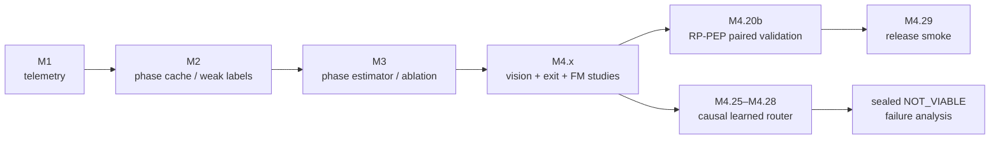

# Dynamic-compute research pipeline

本目录保存 PhaseRoute-VLA 从零影响 telemetry 到 RP-PEP 发布、再到学习式 router 负结果的完整研究代码。编号 `M*` 是实验里程碑，不代表正式 API 版本。

## 使用约定

在仓库根目录执行：

```bash
export PYTHON_BIN=python
export DATA_DIR="$PWD"
export HF_HOME="$PWD/.cache/huggingface"
export LIBERO_CONFIG_PATH="$PWD/.cache/libero"
export VLA_CONFIG_YAML=libero_simulation.yaml
export MUJOCO_GL=egl
export PYOPENGL_PLATFORM=egl
```

所有 `*_front4.sh` 和 `*_4gpu.sh` 只使用物理 GPU 0–3。输出目录必须显式给出或位于 ignored 的 `reports/` 下；脚本通常拒绝覆盖已有结果。

## 管线地图



## 入口分类

### 收集与 smoke

| 脚本 | 功能 |
|---|---|
| `smoke_m1_telemetry.py` | 无模型的小型 telemetry schema smoke |
| `collect_m1_task.py` | 按 task 收集 policy-call telemetry |
| `collect_m2_phase_cache.py` | visual/instruction/state/action cache |
| `collect_m2_phase_observer.py` | phase observer 在线 side-channel |
| `collect_m417_full_depth_task.py` | full-depth 正控制 |
| `collect_m418_persistent_tasks.py` | 跨 task 持久进程与闭环 episode |
| `collect_m425_causal_route_features.py` | 只使用因果信息的 router feature |

### 数据构建与训练

| 脚本 | 功能 |
|---|---|
| `build_phase_signal_cache.py` | 校验并组合 phase signal cache |
| `build_m2_phase_dataset.py` | 构建 phase-estimator 数据集 |
| `train_phase_estimator.py` | 训练 phase estimator |
| `train_m46_frozen_a1_distillation.py` | 冻结 A1 teacher 的视觉聚合蒸馏 |
| `train_m425_causal_router.py` | causal router |
| `train_m425b_temporal_router.py` | past-only temporal router |
| `train_m426_risk_route13_router.py` | route13 风险模型 |
| `train_m427_task_jackknife_router.py` | task-jackknife ensemble |
| `train_m428_task_jackknife_router.py` | sealed 协议最终 router |

### 回放、评估和审计

| 脚本 | 功能 |
|---|---|
| `replay_m2_phase_observer.py` | phase observer 离线回放 |
| `replay_m420_depth_hysteresis.py` | 深度迟滞回放 |
| `replay_m420b_rp_pep.py` | RP-PEP counterfactual replay |
| `audit_m420b_action_history.py` | 动作、退出层和随机流审计 |
| `profile_m423_fixed_observations.py` | 固定观测的深度/FM profile |
| `profile_m424_oracle_route_then_solve.py` | oracle route-then-solve 上界 |
| `evaluate_m425*_router.py` | 各代 causal router 离线评估 |
| `analyze_m429_router_failure.py` | sealed false-shallow 诊断 |

### 汇总

所有 `summarize_*.py` 都把 worker 级原始结果转为严格 JSON，并检查 task/episode/seed/checkpoint 网格。正式 release 汇总器是 `summarize_release_smoke.py`。

## 关键可重复命令

20-pair 基线/RP-PEP 收集：

```bash
bash scripts/dynamic_compute/run_m420b_paired_4gpu.sh \
  reports/m420b_paired
```

交叉 GPU 验证：

```bash
bash scripts/dynamic_compute/run_m421_crossgpu_paired_4gpu.sh \
  reports/m421_crossgpu
```

发布 smoke：

```bash
bash scripts/dynamic_compute/run_release_smoke_front4.sh \
  reports/release_smoke
```

命令中的具体 seed、episode index、task shard 和 checkpoint SHA 固定在 launcher 内，以防调用者无意中改变实验协议。

## 数据泄漏防护

学习式 router 管线遵循以下约束：

1. 特征只能来自当前或过去 policy call；
2. episode split 不允许同一轨迹跨 train/calibration/test；
3. task-jackknife learner 在对应 task 上排除训练；
4. 阈值只在 calibration 上冻结；
5. sealed set 只运行一次，不得重新用于超参数选择；
6. route27 teacher 被浅路由视为主要安全错误；
7. gate 失败时禁止 runtime integration。

M4.28 已经消费 sealed set，后续模型必须建立新的独立测试集，不能把现有 `router_sealed.json` 当作 unseen test 重用。

## 正式与研究代码的边界

- `productive_exit.py` + `release.py` + 正式 launcher：发布路径；
- phase estimator、视觉聚合、hysteresis：受测试的实验组件，默认关闭；
- learned routers：离线研究组件，sealed gate 未通过；
- raw teacher cache、hidden 和 rollout：不提交 Git。

对应冻结结果与可声明范围见 `../../results/README.md`。
